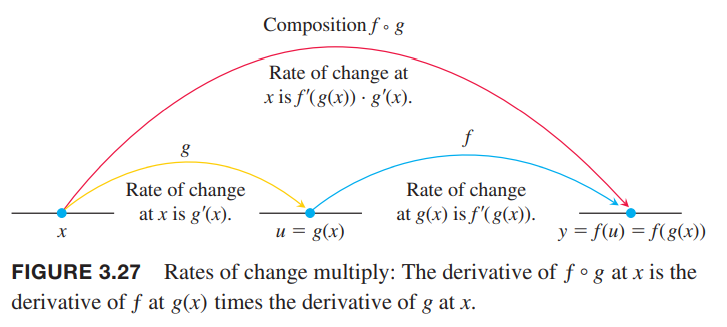
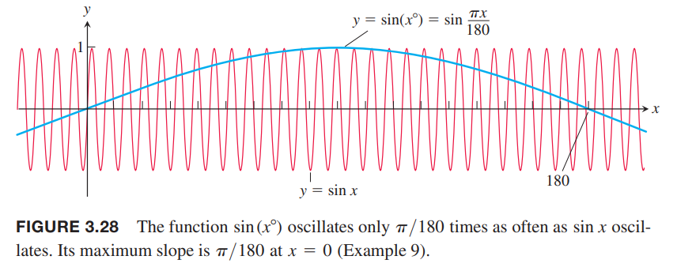

### 复合函数的导数
函数$y=\frac{3}{2}x=\frac{1}{2}(3x)$可以看作是函数$y=\frac{1}{2}u,u=3x$的复合函数。我们有
$$\frac{dy}{dx}=\frac{3}{2},\frac{dy}{du}=\frac{1}{2},\frac{du}{dx}=3$$
由于$\frac{3}{2}=\frac{1}{2}\times 3$，我们可以得到
$$\frac{dy}{dx}=\frac{dy}{du}\times\frac{du}{dx}$$
如果把导数看作是变化率，那么这个关系是非常直观的。如果$y=f(u)$变化是$u$的一半，$u=g(x)$的变化是$x$变化的三倍，那么$y$的变化是$x$变化的二分之三倍。这就像多级齿轮传动一样。如下图所示：  

例1 函数
$$y=(3x^2+1)^2$$
可以看作是$y=f(u)=u^2,u=g(x)=3x^2+1$的复合函数。模仿上面的规则计算导数得到
$$\begin{aligned}
\frac{dy}{du}\cdot\frac{du}{dx}&=2u\cdot 6x\\
&=2(3x^2+1)\cdot 6x\\
&=36x^3+12x
\end{aligned}$$
通过展开$(3x^2+1)^2=9x^4+6x^2+1$也可以得到导数
$$\frac{dy}{dx}=\frac{d}{dx}(9x^4+6x^2+1)=36x^3+12x$$
结果是一致的。

复合函数$f(g(x))$的导数等于$f$在$g(x)$处的导数乘以$g$在$x$处的导数。如下图所示：  

**定理2 链式法则** 如果$f(u)$在点$u=g(x)$处可导且$g(x)$在$x$处可导，那么复合函数$f\circ g=f(g(x))$在$x$处可导，且有
$$(f\circ g)'(x)=f'(g(x))\cdot g'(x)$$
使用莱布尼茨表示法是
$$\frac{dy}{dx}=\frac{dy}{du}\cdot\frac{du}{dx}$$
链式法则的一种情况的证明。  
令$\Delta u$是对应$x$变化$\Delta x$时$u$的变化
$$\Delta u=g(x+\Delta x)-g(x)$$
相应的
$$\Delta y=f(u+\Delta u)-f(u)$$
如果$\Delta u\neq 0$，我们可以把$\Delta y/\Delta x$写作
$$\frac{\Delta y}{\Delta x}=\frac{\Delta y}{\Delta u}\cdot\frac{\Delta u}{\Delta x}$$
取$\Delta x\to 0$的极限
$$\begin{aligned}
\frac{dy}{dx}&=\lim_{\Delta x\to 0}\frac{\Delta y}{\Delta x}\\
&=\lim_{\Delta x\to 0}\frac{\Delta y}{\Delta u}\cdot\frac{\Delta u}{\Delta x}\\
&=\lim_{\Delta x\to 0}\frac{\Delta y}{\Delta u}\cdot \lim_{\Delta x\to 0}\frac{\Delta u}{\Delta x}\\
&=\lim_{\Delta u\to 0}\frac{\Delta y}{\Delta u}\cdot \lim_{\Delta x\to 0}\frac{\Delta u}{\Delta x}\\
&=\frac{dy}{du}\cdot\frac{du}{dx}
\end{aligned}$$
如果$g(x)$在$x$附近振荡，那么当$\Delta x\neq 0$时，$\Delta u$可能为零，那么之前说$\Delta u\neq 0$就不成立。3.11小节会给出另外一种证明方式来规避这个问题。

例2 一个物体沿着$x$轴运动，任意$t\geq 0$时刻的位置是$x(t)=\cos(t^2+1)$，求速度。  
解：位置函数可以看作是$x=\cos u,u=t^2+1$两个函数的组合。我们有
$$\frac{dx}{du}=-\sin u$$
$$\frac{du}{dt}=2t$$
所以
$$\begin{aligned}
\frac{dx}{dt}&=\frac{dx}{du}\cdot\frac{du}{dt}\\
&=-\sin u\cdot 2t\\
&=-2t\sin(t^2+1)
\end{aligned}$$

例3 求$\sin(x^2+e^x)$的导数。  
解：应用链式法则
$$\frac{d}{dx}\sin(x^2+e^x)=\cos(x^2+e^x)\frac{d}{dx}(x^2+e^x)=\cos(x^2+e^x)(2x+e^x)$$

例4 求$y=e^{\cos x}$的导数。  
解：
$$\frac{dy}{dx}=\frac{d}{dx}e^{\cos x}=e^{\cos x}\frac{d}{dx}\cos x=-e^{\cos x}\sin x$$
一般地，有
$$\frac{d}{dx}e^u=e^u\frac{du}{dx}$$
比如,
$$\frac{d}{dx}e^{kx}=e^{kx}\frac{d}{dx}kx=ke^{kx}$$
或者
$$\frac{d}{dx}e^{x^2}=e^{x^2}\frac{d}{dx}x^2=2xe^{x^2}$$

### 重复使用链式法则
通常，我们会使用二次或者更多次链式法则。

例5 求$g(t)=\tan(5-\sin 2t)$的导数。  
解：
$$\begin{aligned}
g'(t)&=\frac{d}{dt}\tan(5-\sin 2t)\\
&=\sec^2(5-\sin 2t)\frac{d}{dt}(5-\sin 2t)\\
&=\sec^2(5-\sin 2t)(0-\cos 2t\frac{d}{dt}2t)\\
&=\sec^2(5-\sin 2t)(-\cos 2t\cdot 2)\\
&=-2\cos 2t\sec^2(5-\sin 2t)
\end{aligned}$$

### 广义幂法则：幂法则和链式法则的结合
如果$n$是任意实数并且$f$是幂函数$f(u)=u^n$，由幂法则得到$f'(u)=nu^{n-1}$。如果$u$是$x$的可导函数，那么应用链式法则可以得到广义幂法则
$$\frac{d}{dx}u^n=nu^{n-1}\frac{du}{dx}$$

例6 使用广义幂法则的示例。  
（a）
$$\begin{aligned}
\frac{d}{dx}(5x^3-x^4)^7&=7(5x^3-x^4)^6\frac{d}{dx}(5x^3-x^4)\\
&=7(5x^3-x^4)^6(15x^2-4x^3)
\end{aligned}$$
（b）
$$\begin{aligned}
\frac{d}{dx}\frac{1}{3x-2}&=\frac{d}{dx}(3x-2)^{-1}\\
&=-(3x-2)^{-2}\frac{d}{dx}(3x-2)\\
&=-3(3x-2)^{-2}\\
&=-\frac{3}{(3x-2)^2}
\end{aligned}$$
（c）
$$\begin{aligned}
\frac{d}{dx}\sin^5x&=5\sin^4x\frac{d}{dx}\sin x\\
&=5\sin^4x\cos x
\end{aligned}$$
（d）
$$\begin{aligned}
\frac{d}{dx}e^{\sqrt{3x+1}}&=e^{\sqrt{3x+1}}\frac{d}{dx}\sqrt{3x+1}\\
&=e^{\sqrt{3x+1}}\frac{1}{2}(3x+1)^{-1/2}\frac{d}{dx}(3x+1)\\
&=\frac{3}{2\sqrt{3x+1}}e^{\sqrt{3x+1}}
\end{aligned}$$

例7 3.2中的例4证明了绝对值函数$y=|x|$在$x=0$处不可导。但是这个函数在其他地方是可导的。由$|x|=\sqrt{x^2}$可以求其他值的导数。
$$\begin{aligned}
\frac{d}{dx}|x|&=\frac{d}{dx}\sqrt{x^2}\\
&=\frac{1}{2\sqrt{x^2}}\frac{d}{dx}x^2\\
&=\frac{1}{2|x|}2x\\
&=\frac{x}{|x|},x\neq 0\\
&=\begin{cases}
1,&&x>0\\
-1,&&x<0
\end{cases}
\end{aligned}$$

例8 证明曲线$y=1/(1-2x)^3$的每个切线的斜率都是正的。  
解：先对函数求导
$$\begin{aligned}
\frac{dy}{dx}&=\frac{d}{dx}(1-2x)^{-3}\\
&=-3(1-2x)^{-4}\frac{d}{dx}(1-2x)\\
&=\frac{6}{(1-2x)^4}
\end{aligned}$$
在任意点，分子都不为零，斜率是大于零的。

例9 $\sin x,\cos x$的导数公式单位是弧度。使用链式法则可以看出两者的区别。由于$180^\circ=\pi$，那么$x^\circ=\pi x/180$，那么
$$\frac{d}{dx}\sin x^\circ=\frac{d}{dx}\sin(\frac{\pi x}{180})=\frac{\pi}{180}\cos(\frac{\pi x}{180})=\frac{\pi}{180}\cos x^\circ$$
如下图所示。类似的 $(\cos x^\circ)'=-(\pi/180)\sin x^\circ$。

由于因子$\pi/180$会传染，且会重复多次，这也是使用弧度的有利之处。

