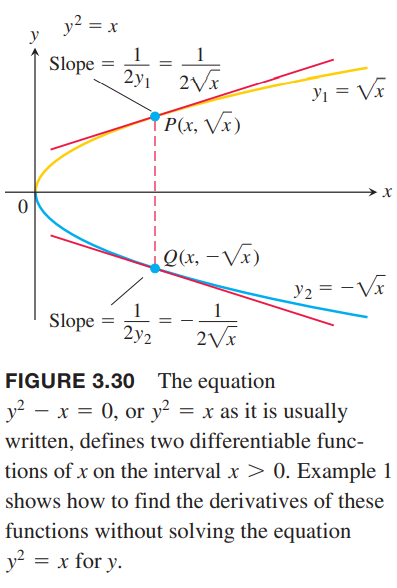
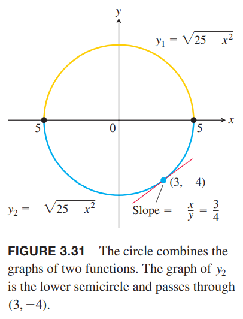
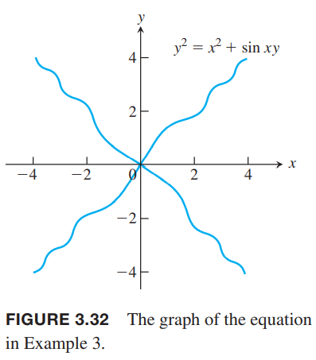
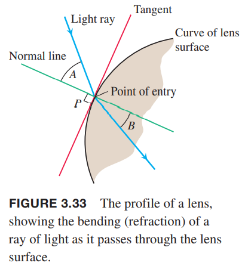
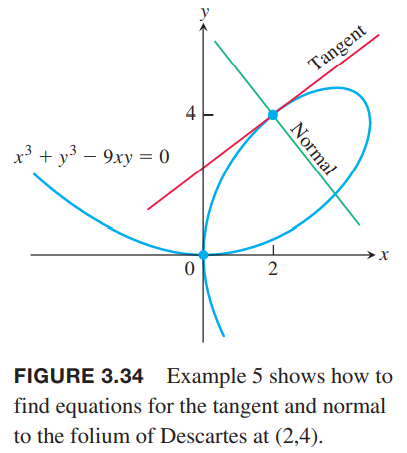

我们现在处理的大部分函数的形式均为$y=f(x)$，显式的使用变量$x$表示$y$，并且我们已经学了很多关于这种形式的函数的求导方法。除此之外，我们还可能会遇到形如
$$x^3+y^3-9xy=0,y^2-x=0,x^2+y^2-25=0$$
下图是第一个函数的图像  
  
这些方程给出了$x$和$y$之间的隐式关系。有的时候我们无法解出显式的方程。当我们不能把方程$F(x,y)=0$写作$y=f(x)$进而求导的时候，我们需要使用隐式求导的方式来求解。

### 隐式定义的函数
我们先看几个可以将隐式函数写作显式函数的例子，先使用常规方法求导，再使用隐式求导的方法。我们可以看出，这两种方法得到的答案是一致的。下面这些例子隐含着$dy/dx$是存在的这一条件。

例1 $y^2=x$，求$dy/dx$。  
解：方程$y^2=x$定义了两个可导函数分别是$y_1=\sqrt{x},y_2=-\sqrt{x}$，如下图所示：  
  
我们可以得到$x>0$时的导数
$$\frac{dy_1}{dx}=\frac{1}{2\sqrt{x}},\frac{dy_2}{dx}-\frac{1}{2\sqrt{x}}$$
如果只知道$y^2=x$不知道$x>0$时怎么用$x$表示$y$，那么怎么求导呢？  
为了找到$dy/dx$，我们两边对$x$求导，因为$y$是可导函数，使用链式法则
$$y^2=x$$
$$2y\frac{dy}{dx}=1$$
$$\frac{dy}{dx}=\frac{1}{2y}$$
这个方程和上面显式的求导的两个式子是等价的，代入$y_1=\sqrt{x},y_2=-\sqrt{x}$可以得到
$$\frac{dy_1}{dx}=\frac{1}{2y_1}=\frac{1}{2\sqrt{x}},\frac{dy_2}{dx}=\frac{1}{2y_2}=-\frac{1}{2\sqrt{x}}$$

例2 求$x^2+y^2=25$在点$(3,-4)$的斜率。  
解：圆可以分为两个函数$y_1=\sqrt{25-x^2},y_2=-\sqrt{25-x^2}$，如下图所示，点$(3,-4)$在$y_2$上。  
  
对$y_2$求导且代入$x=3$得到
$$\frac{dy_2}{dx}\bigg|_{x=3}=-\frac{-2x}{2\sqrt{25-x^2}}\bigg|_{x=3}=\frac{3}{\sqrt{25-9}}=\frac{3}{4}$$
对方程两边进行隐式求导
$$\frac{d}{dx}x^2+\frac{d}{dx}y^2=\frac{d}{dx}25$$
$$2x+2y\frac{dy}{dx}=0$$
$$\frac{dy}{dx}=-\frac{x}{y}$$
代入$(3,4)$得到$-\frac{x}{y}\bigg|_{(3,-4)}=-\frac{3}{-4}=\frac{3}{4}$。  
不像$dy_2/dx$只能求下半个圆上的点的导数，但是$dy/dx=-x/y$可以求整个圆上的点的导数，当然前提是$y\neq 0$。求导涉及变量$x,y$而不仅仅是变量$x$。

例3 求$y^2=x^2+\sin xy$的导数。  
  
解：
$$y^2=x^2+\sin xy$$
$$\frac{d}{dx}y^2=\frac{d}{dx}x^2+\frac{d}{dx}\sin xy$$
$$2y\frac{dy}{dx}=2x+(\cos xy)\frac{d}{dx}xy$$
$$2y\frac{dy}{dx}=2x+(\cos xy)(y+x\frac{dy}{dx})$$
$$2y\frac{dy}{dx}-(\cos xy)(x\frac{dy}{dx})=2x+(\cos xy)y$$
$$(2y-x\cos xy)\frac{dy}{dx}=2x+y\cos xy$$
$$\frac{dy}{dx}=\frac{2x+y\cos xy}{2y-x\cos xy}$$

### 高阶导数
隐式求导可以用于更高阶的导数。

例4 求函数$2x^3-3y^2=8$的二阶导$d^2y/dx^2$。  
解：首先求一阶导$y'=dy/dx$
$$\frac{d}{dx}(2x^3-3y^2)=\frac{d}{dx}8$$
$$6x^2-6y\frac{dy}{dx}=0$$
$$\frac{dy}{dx}=\frac{x^2}{y},y\neq 0$$
现在用除法法则来求二阶导$y''$
$$y''=\frac{d}{dx}(\frac{x^2}{y})=\frac{2xy-x^2y'}{y^2}=\frac{2x}{y}-\frac{x^2}{y^2}\cdot y'=\frac{2x}{y}-\frac{x^4}{y^3},y\neq 0$$

### 透镜，切线，法线
光线进入透镜的入射角和折射角分别是光线和垂直于入射点的直接的夹角。如下图所示的角$A$和角$B$。  
  
法线（`normal`）是垂直于入射点的切线的。

例5 证明点$(2,4)$在曲线$x^3+y^3-9xy=0$，然后求该点处的切线和法线。  
  
解：点$(2,4)$满足曲线方程$2^3+4^3-9(2)(4)=8+64-72=0$，所以在曲线上。  
为了找到切线和法线，第一步是对方程求导得到斜率。  
$$\frac{d}{dx}x^3+\frac{d}{dx}y^3-\frac{d}{dx}9xy=\frac{d}{dx}0$$
$$3x^2+3y^2\frac{dy}{dx}-9(y+x\frac{dy}{dx})=0$$
$$(3y^2-9x)\frac{dy}{dx}=9y-3x^2$$
$$\frac{dy}{dx}=\frac{3y-x^2}{y^2-3x}$$
代入点$(2,4)$
$$\frac{dy}{dx}\bigg|_{(2,4)}=\frac{12-4}{16-6}=\frac{5}{4}$$
所以切线是
$$y-4=\frac{4}{5}(x-2)$$
$$y=\frac{4}{5}x+\frac{12}{5}$$
法线是
$$y-4=-\frac{5}{4}(x-2)$$
$$y=-\frac{5}{4}x+\frac{13}{2}$$
