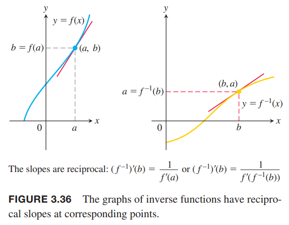
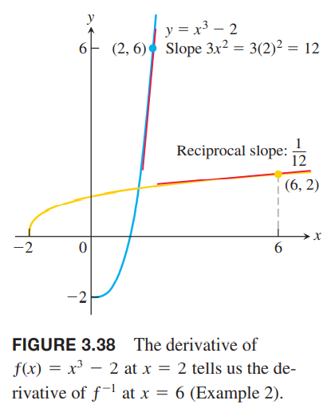
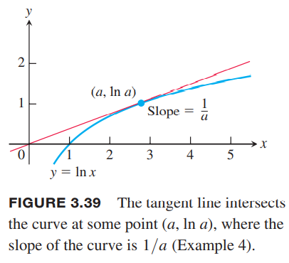
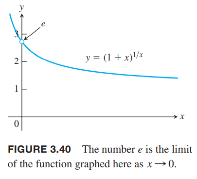

### 反函数的导数
1.5节中例3的函数$f(x)=(1/2)x+1$，反函数是$f^{-1}(x)=2x-2$。下图展示了两个函数的图像。  
  
计算它们的导数
$$\frac{d}{dx}f(x)=\frac{1}{2}$$
$$\frac{d}{dx}f'^{-1}(x)=2$$
可以看出，导数是另一个函数的导数的倒数，所以斜率是另一条线的倒数。  
这个规律是普遍适用的。沿着$y=x$翻转非垂直、非水平的直线，斜率总是变成倒数。如果原始直线的斜率是$m\neq 0$，那么镜像直线的斜率是$1/m$。  
对于其他函数，$f,f^{-1}$的斜率也符合这个规律，不过需要小心处理对应的点。如果$y=f(x)$在$(a,f(a))$处的斜率是$f'(a)$，且$f'(a)\neq 0$，那么函数$y=f^{-1}(x)$在点$(f(a),a)$处的斜率是$1/f'(a)$。如下图所示：  
  
令$b=f(a)$，有
$$(f^{-1})'(b)=\frac{1}{f'(a)}=\frac{1}{f'(f^{-1}(b))}$$
如果$y=f(x)$在$(a,f(a))$处有水平切线，那么反函数$f^{-1}$在$f(a),a)$处有垂直切线，斜率无限大说明在该点不可导。

**定理3** 反函数的求导法则  
函数$f$在区间$I$上有定义，并且$f'(x)$存在且在$I$上不为零，那么$f^{-1}$在它的定义域上是可导的。$f^{-1}$在$b$处的值是$f'$在$a=f^{-1}(b)$处的值的倒数。
$$(f^{-1})'(b)=\frac{1}{f'(f^{-1}(b))}$$
或
$$\frac{df^{-1}}{dx}\bigg|_{x=b}=\frac{1}{\frac{df}{dx}\bigg|_{x=f^{-1}(b)}}$$

定理3告诉我们两件事：一是在定理描述的条件下$f^{-1}$可导；二是在可导的前提下它的导数。下面证明后者。
$$f(f^{-1}(x))=x$$
$$\frac{d}{dx}f(f^{-1}(x))=1$$
$$f'(f^{-1}(x))\frac{d}{dx}f^{-1}(x)=1$$
$$\frac{d}{dx}f^{-1}(x)=\frac{1}{f'(f^{-1}(x))}$$

例1 函数$f(x)=x^2,x>0$，其反函数是$f^{-1}=\sqrt{x}$，导数分别是$f'(x)=2x,(f^{-1})'=1/(2\sqrt{x})$。  
应用定理3计算$f^{-1}(x)$的导数
$$\begin{aligned}
(f^{-1})'&=\frac{1}{f'(f^{-1}(x))}\\
&=\frac{1}{2(f^{-1}(x))}\\
&=\frac{1}{2\sqrt{x}}
\end{aligned}$$
在某点处检查定理3的正确性。令$x=2,(a)$，$f(2)=4,(b)$。定理3告诉我们$f$在$x=2$处的导数$f'(2)=4$和$f^{-1}$在$f(2)$处的导数$(f^{-1})'(4)$互为倒数。也就是说
$$(f^{-1})'(4)=\frac{1}{f'(f^{-1})(4))}=\frac{1}{f'(2)}=\frac{1}{4}$$
如下图所示：  

例2 令$f(x)=x^3-2,x>0$。不计算$f^{-1}(x)$的公式，计算$df^{-1}/dx$在$x=6=f(2)$的值。如下图所示：  
  
解：应用定理3
$$\frac{df}{dx}\bigg|_{x=2}=3x^2\bigg|_{x=2}=12$$
$$\frac{df^{-1}}{dx}\bigg|_{x=f(2)}=\frac{1}{\frac{df}{dx}\bigg|_{x=2}}=\frac{1}{12}$$

### 自然对数函数的导数
我们知道指数函数$f(x)=e^x$在各处可导，应用定理3可以找到其反函数$f^{-1}(x)=\ln x$的导数：
$$\begin{aligned}
(f^{-1})'(x)&=\frac{1}{f'(f^{-1}(x))}\\
&=\frac{1}{e^{f^{-1}(x)}}\\
&=\frac{1}{e^{\ln x}}\\
&=\frac{1}{x}
\end{aligned}$$
除了应用定理3，我们通过隐式函数的求导也能得到同样的结果。
$$\begin{aligned}
y&=\ln x\\
e^y&=x\\
\frac{d}{dx}e^y&=\frac{d}{dx}x\\
e^y\frac{dy}{dx}&=1\\
\frac{dy}{dx}&=\frac{1}{e^y}=\frac{1}{x}
\end{aligned}$$
所以我们可以得到$y=\ln x$的导数
$$\frac{d}{dx}\ln x=\frac{1}{x},x>0$$
应用链式法则可以得到任意正函数$u(x)$的对数函数的导数
$$\frac{d}{dx}\ln u=\frac{1}{u}\frac{du}{dx},u>0$$

例3  
（a）
$$\frac{d}{dx}\ln 2x=\frac{1}{2x}\frac{d}{dx}2x=\frac{1}{2x}(2)=\frac{1}{x}$$
（b）
$$\frac{d}{dx}\ln(x^2+3)=\frac{1}{x^2+3}\cdot 2x=\frac{2x}{x^2+3}$$
（c）
$$\begin{aligned}
\frac{d}{dx}\ln |x|&=\frac{1}{|x|}\frac{d}{dx}|x|\\
&=\frac{1}{|x|}\cdot\frac{x}{|x|}\\
&=\frac{x}{x^2}\\
&=\frac{1}{x}
\end{aligned}$$
$x>0$时，$\ln x$的导数是$1/x$；$x<0$时，$\ln(-x)$的导数也是$1/x$。

（a）说明$y=\ln 2x$和$y=\ln x$的导数是一样的。对于任意常数$b$，如果$bx>0$，都有
$$\frac{d}{dx}\ln bx=\frac{1}{bx}\cdot b=\frac{1}{x}$$

例4 一条穿过原点的直线是$y=\ln x$的切线，斜率是$m$。求$m$。  
解：假设切点在$x=a>0$处，那么切点是$(a,\ln a)$，那么直线的斜率是
$$m=\frac{\ln a-0}{a-0}=\frac{\ln a}{a}$$
如下图所示：  
  
该点的导数是$1/a$，所以
$$\begin{aligned}
\frac{\ln a}{a}&=\frac{1}{a}\\
\ln a&=1\\
a&=e\\
m&=\frac{1}{e}
\end{aligned}$$

### $a^u,\log_a u$的导数
我们从求$a^x$的导数开始。$a^x=e^{\ln(a^x)}=e^{x\ln a}$，那么
$$\begin{aligned}
\frac{d}{dx}a^x&=\frac{d}{dx}e^{x\ln a}\\
&=e^{x\ln a}\frac{d}{dx}x\ln a\\
&=a^x\ln a
\end{aligned}$$
因此，如果$a>0$，函数$a^x$是可导的，且
$$\frac{d}{dx}a^x=a^x\ln a$$
这个推导过程说明为什么微积分中偏爱$e^x$。如果$a=e$，那么$\ln a=1$，所以
$$\frac{d}{dx}e^x=e^x\ln e=e^x$$
应用链式法则，我们可以得到更一般的结论。

如果$a>0$，$u$是关于$x$的可导函数，那么$a^u$是可导函数，且
$$\frac{d}{dx}a^u=a^u\ln a\frac{du}{dx}$$

例5  
（a）
$$\frac{d}{dx}3^x=3^x\ln 3$$
（b）
$$\frac{d}{dx}3^{-x}=3^{-x}\ln 3\frac{d}{dx}(-x)=-3^{-x}\ln 3$$
（c）
$$\frac{d}{dx}3^{\sin x}=3^{\sin x}\ln 3\frac{d}{dx}\sin x=3^{\sin x}\ln 3\cos x$$

3.3节中，我们研究了指数函数$f(x)=a^x$的导数$f'(0)$。$f'(0)$是极限$\lim_{h\to 0}(a^h-1)/h$，且表示点$(0,1)$处的曲线斜率。现在我们知道这个斜率的值
$$\lim_{h\to 0}\frac{a^h-1}{h}=\ln a$$
如果$a=e$，那么
$$\lim_{h\to 0}\frac{e^h-1}{h}=\ln e=1$$
但是我们还没有充分论证这些极限是存在的。指数函数、对数函数的导数的推导的前提就是这些极限存在。第七章会论证这些。

现在我们对于任意底数$a>0,a\neq 1$，求函数$\log_a u$求导。通过换底公式有
$$\log_a x=\frac{\ln x}{\ln a}$$
两边同时求导
$$\begin{aligned}
\frac{d}{dx}\log_a x&=\frac{d}{dx}(\frac{\ln x}{\ln a})\\
&=\frac{1}{\ln a}\frac{d}{dx}\ln x\\
&=\frac{1}{\ln a}\frac{1}{x}\\
&=\frac{1}{x\ln a}
\end{aligned}$$
如果$u$是$x$的可导函数，且$u>0$，那么根据链式法则
对$a>0,a\neq 1$，有
$$\frac{d}{dx}\log_a u=\frac{1}{u\ln a}\frac{du}{dx}$$

### 对数求导法
对于只涉及乘法、除法和幂次的正函数求导，我们可以在求导前对两边取自然对数。这使得我们可以简化求导过程。这种方法称为对数求导法（`logarithmic differentiation`）。

例6 求下面函数的导数
$$y=\frac{(x^2+1)(x+3)^{1/2}}{x-1},x>1$$
解：两边取自然对数可以简化函数
$$\begin{aligned}
\ln y&=\ln\frac{(x^2+1)(x+3)^{1/2}}{x-1}\\
&=\ln((x^2+1)(x+3)^{1/2})-\ln(x-1)\\
&=\ln(x^2+1)+\ln(x+3)^{1/2}-\ln(x-1)\\
&=\ln(x^2+1)+\frac{1}{2}\ln(x+3)-\ln(x-1)
\end{aligned}$$
两边同时求导
$$\frac{1}{y}\frac{dy}{dx}=\frac{1}{x^2+1}\cdot 2x+\frac{1}{2}\frac{1}{x+3}-\frac{1}{x-1}$$
那么
$$\frac{dy}{dx}=y(\frac{2x}{x^2+1}+\frac{1}{2x+6}-\frac{1}{x-1})=\frac{(x^2+1)(x+3)^{1/2}}{x-1}(\frac{2x}{x^2+1}+\frac{1}{2x+6}-\frac{1}{x-1})$$
如果使用导数的乘法法则、除法法则和幂次法则求解的话，推导过程会长的多。

### 无理指数和幂次法则
第七章我们会给出自然对数和指数函数的精确定义。我们可以用指数函数定义指数函数，那么可以拓展任意正整数次幂到任意实数次幂。

对任意$x>0$和任意实数$n$，有
$$x^n=e^{n\ln x}$$
上面公式使得$n$不必只是正整数或者有理数，可以是任意实数。下面是更一般的幂次法则：  
对任意$x>0$和任意实数$n$，有
$$\frac{d}{dx}x^n=nx^{n-1}$$
如果$x\leq 0$，如果$x^n,x^{n-1}$存在的话，那么这个公式也成立。  
证明：对指数函数的公式两边同时求导
$$\begin{aligned}
\frac{d}{dx}x^n&=\frac{d}{dx}e^{n\ln x}\\
&=e^{n\ln x}\frac{d}{dx}n\ln x\\
&=x^n\cdot\frac{x}{x}\\
&=nx^{n-1}
\end{aligned}$$
如果$x>0$，那么直接就有
$$\frac{d}{dx}x^n=nx^{n-1}$$
如果$x<0$，令$y=x^n$，如果$y',x^{n-1}$存在，那么
$$\ln|y|=\ln|x|^n=n\ln|x|$$
利用隐式求导和例3（c）中的结论得到
$$\frac{y'}{y}=\frac{n}{x}$$
所以
$$y'=n\frac{y}{x}=n\frac{x^n}{x}=nx^{n-1}$$
当$x=0,n\geq 1$时，从定义出发
$$\lim_{h\to 0}\bigg|_{x=0}=\lim_{h\to 0}\frac{(x+h)^n-x^n}{h}=\lim_{h\to 0}\frac{\begin{pmatrix}
n\\1
\end{pmatrix}hx^{n-1}+\cdots}{h}=0$$

例7 求$f(x)=x^x,x>0$的导数。  
解：由$f(x)=e^{x\ln x}$可以得到
$$\begin{aligned}
f'(x)&=\frac{d}{dx}(e^{x\ln x})\\
&=e^{x\ln x}\frac{d}{dx}x\ln x\\
&=x\ln x(\ln x+x\frac{1}{x})\\
&=x\ln x(\ln x+1)
\end{aligned}$$
对$y=x^x$使用对数求导法也可以方便的得到同样的结果。

### 使用极限表示$e$
1.4节我们给出了$e$的定义，一组$y=a^x$曲线，恰好有一底数$a$使得在$y$轴交点$(0,1)$处的斜率是1，这个$a$就是$e$，满足
$$\lim_{h\to 0}\frac{e^h-1}{h}=\ln e=1$$
我们可以把$e$表示成极限的形式：
$$e=\lim_{x\to 0}(1+x)^{1/x}$$
证明：如果$f(x)=\ln x$，那么$f'(x)=1/x$，且$f'(1)=1$。根据极限定义
$$\begin{aligned}
f'(1)&=\lim_{h\to 0}\frac{f(1+h)-f(1)}{h}\\
&=\lim_{x\to 0}\frac{f(1+x)-f(1)}{x}\\
&=\lim_{x\to 0}\frac{\ln (1+x)-\ln 1}{x}\\
&=\lim_{x\to 0}\frac{1}{x}\ln (1+x)\\
&=\lim_{x\to 0}\ln (1+x)^{1/x}\\
&=\ln [\lim_{x\to 0}(1+x)^{1/x}]=1
\end{aligned}$$
两边求自然对数
$$\lim_{x\to 0}(1+x)^{1/x}=e$$
如下图所示：  
  
根据极限表达式可以得到近似值$e\approx 2.718281828459045$。
