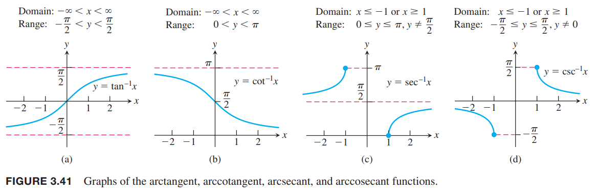
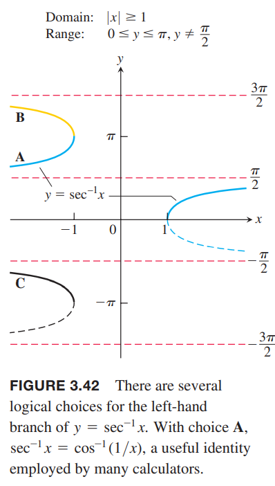
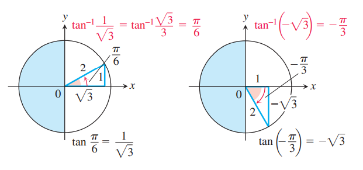
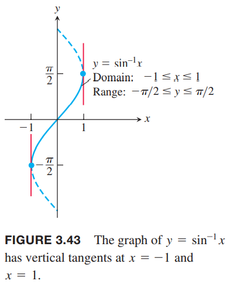
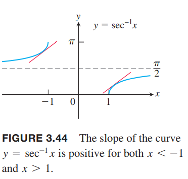

### 正切、余切、正割、余割的反函数
下图展示了这四个基本函数的反函数图像。这些图像是通过沿$y=x$翻转1.5节中描述的限制定义域的三角函数图像得到的。  
  
$x$的反正切是表示正切值为$x$的角度，$x$的反余切是表示余切值为$x$的角度，以此类推。角度在限定的定义域内。

**定义**
* $y=\tan^{-1}x$值属于$(-\pi/2,\pi/2)$，且$\tan y=x$
* $y=\cot^{-1}x$值属于$(0,\pi)$，且$\cot y=x$
* $y=\sec^{-1}x$值属于$[0,\pi/2)\cup(\pi/2,\pi]$，且$\sec y=x$
* $y=\csc^{-1}x$值属于$[-\pi/2,0)\cup(0,\pi/2]$，且$\csc y=x$

我们使用开区间或者半开区间，因为在某些端点处是没有定义的。  
正如1.5小节讨论的，我们经常使用$\arcsin,\arccos$而不是$\sin^{-1},\cos^{-1}$表示反正弦、反余弦函数，我们也常常使用$\arctan,\text{arccot},\text{arcsec},\text{arccsc}$表示其他的反三角函数。  
$y=\tan^{-1} x$是中心对称的，因为它的图象是$x=\tan y$其中中心对称的那一个分支。如上图的（a）所示。那么意味着
$$\tan^{-1}(-x)=-\tan^{-1}x$$
成立，反正切是奇函数。$y=\cot^{-1}x$没有任何对称性，如上图（b）所示。从上图（a）可以初看反正切函数有两条水平渐近线，分别是$y=\pi/2,y=-\pi/2$。  
注意：对于如何定义$\sec^{-1} x$中$x$为负数的情况，没有统一的意见。这里选择$\pi/2$到$\pi$，使得$\sec^{-1} x=\cos^{-1}(1/x)$，也使得在各个区间是递增函数。但是有的书对于负数部分的选择是$[-\pi,-\pi/2)$或者是$[\pi,3\pi/2)$，如下图所示。  
  
这样选择可以简化导数的公式，但是不能满足$\sec^{-1} x=\cos^{-1}(1/x)$。从这个公式出发可以得到
$$\sec^{-1}x=\cos^{-1}(\frac{1}{x})=\frac{\pi}{2}-\sin^{-1}\frac{1}{x}$$

例1 求图中$\tan^{-1}x$的值。  
  
| $x$ | $\tan^{-1}$ |
|--|--|
| $\sqrt{3}$ | $\pi/3$ |
| $1$ | $\pi/4$ |
| $\sqrt{3}/3$ | $\pi/6$ |
| -$\sqrt{3}/3$ | -$\pi/6$ |
| $-1$ | $-\pi/4$ |
| $-\sqrt{3}$ | $-\pi/3$ |

这些角都来自第一象限和第四象限，因为$\tan^{-1}x$的值域是$(-\pi/2,\pi/2)$。

### 函数$y=\sin^{-1}u$的导数
在区间$-\pi/2<y<\pi/2$上$x=\sin y$是可导的，导函数是余弦函数。那么根据3.8节定理3可知$y=\sin^{-1}x$在区间$-1<x<1$上是可导的。在$x=1,x=-1$处是不可导的，因为这些地方的切线是垂线。如下图所示。  
  
根据定理3，$f(x)=\sin x,f^{-1}(x)=\sin^{-1}x$，可以得到反正弦函数的导数
$$\begin{aligned}
(f^{-1})(x)&=\frac{1}{f'(f^{-1}(x))}\\
&=\frac{1}{\cos(\sin^{-1}x)}\\
&=\frac{1}{\sqrt{1-\sin^2(\sin^{-1}x)}}\\
&=\frac{1}{\sqrt{1-x^2}}
\end{aligned}$$
如果$u$是可导函数且$|u|<1$，那么有
$$\frac{d}{dx}\sin^{-1}u=\frac{1}{\sqrt{1-u^2}}\frac{du}{dx},|u|<1$$

例2 使用链式法则，计算导数
$$\frac{d}{dx}\sin^{-1}(x^2)=\frac{1}{\sqrt{1-(x^2)^2}}\frac{d}{dx}x^2=\frac{2x}{\sqrt{1-x^4}}$$

### 函数$y=\tan^{-1}u$的导数
和上面类似，应用定理3。可以使用的原因是在区间$-\pi/2<x<\pi/2$，$\tan x$是正的。
$$\begin{aligned}
(f^{-1})'(x)&=\frac{1}{f'(f^{-1}(x))}\\
&=\frac{1}{\sec^2(\tan^{-1}x)}\\
&=\frac{1}{1+\tan^2(\tan^{-1}x)}\\
&=\frac{1}{1+x^2}
\end{aligned}$$
对所有实数都成立。如果$u$是$x$的函数，那么
$$\frac{d}{dx}\tan^{-1}u=\frac{1}{1+u^2}\frac{du}{dx}$$

### 函数$y=\sec^{-1}u$的导数
对于$0<x<\pi/2,\pi/2<x<\pi$，$\sec x$的导数是正数，那么定理3告诉我们$\sec^{-1}x$的导数是存在的。这次不直接使用定理3，而是使用隐式求导和链式法则求$y=\sec^{-1}x,|x|>1$的导数
$$\begin{aligned}
y&=\sec^{-1}x\\
\sec y&=x\\
\sec y\tan y\frac{dy}{dx}=1\\
\frac{dy}{dx}=\frac{1}{\sec y\tan y}
\end{aligned}$$
通过$\sec y=x$可以得到
$$\tan y=\pm\sqrt{\sec^2 y-1}=\pm\sqrt{x^2-1}$$
那么
$$\frac{dy}{dx}=\pm\frac{1}{x\sqrt{x^2-1}}$$
如何处理$\pm$呢？如下图所示，$y=\sec^{-1}x$的斜率总是正数  
  
所以
$$\frac{d}{dx}\sec^{-1}x=\begin{cases}
+\frac{1}{x\sqrt{x^2-1}},x>1\\
-\frac{1}{x\sqrt{x^2-1}},x<-1
\end{cases}$$
那么我们可以用绝对值重写这个公式
$$\frac{d}{dx}\sec^{-1}x=\frac{1}{|x|\sqrt{x^2-1}}$$
如果$u$是可导函数，且$|u|>1$，那么
$$\frac{d}{dx}\sec^{-1}u=\frac{1}{|u|\sqrt{u^2-1}}\frac{du}{dx},|u|>1$$

例3 使用链式法则求如下反正割函数的导数
$$\begin{aligned}
\frac{d}{dx}\sec^{-1}(5x^4)&=\frac{1}{|5x^4|\sqrt{(5x^4)^2-1}}\frac{d}{dx}(5x^4)\\
&=\frac{1}{5x^4\sqrt{25x^8-1}}(20x^3)\\
&=\frac{4}{x\sqrt{25x^8-1}}
\end{aligned}$$

### 其他三个反三角函数的导数
我们可以用以上的方法继续得到反余弦、反余切、反余割的导数，不过也可以从恒等函数入手。

$$\cos^{-1}x=\pi/2-\sin^{-1}x$$
$$\cot^{-1}x=\pi/2-\tan^{-1}x$$
$$\csc^{-1}x=\pi/2-\sec^{-1}x$$

第一个恒等关系在1.5节出现的，其余两个公式的推导类似。有了这些关系，很容易求导了。比如反余弦的导数
$$\begin{aligned}
\frac{d}{dx}\cos^{-1}x&=\frac{d}{dx}(\pi/2-\sin^{-1}x)\\
&=-\frac{d}{dx}\sin^{-1}x\\
&=-\frac{1}{\sqrt{1-x^2}}
\end{aligned}$$

以下是所有反三角函数的导数
$$\begin{aligned}
\frac{d(\sin^{-1}u)}{dx}&=\frac{1}{\sqrt{1-u^2}}\frac{du}{dx},|u|<1\\
\frac{d(\cos^{-1}u)}{dx}&=-\frac{1}{\sqrt{1-u^2}}\frac{du}{dx},|u|<1\\
\frac{d(\tan^{-1}u)}{dx}&=\frac{1}{1+u^2}\frac{du}{dx}\\
\frac{d(\cot^{-1}u)}{dx}&=-\frac{1}{1+u^2}\frac{du}{dx}\\
\frac{d(\sec^{-1}u)}{dx}&=\frac{1}{|u|\sqrt{u^2-1}}\frac{du}{dx},|u|>1\\
\frac{d(\csc^{-1}u)}{dx}&=-\frac{1}{|u|\sqrt{u^2-1}}\frac{du}{dx},|u|>1\\
\end{aligned}$$
