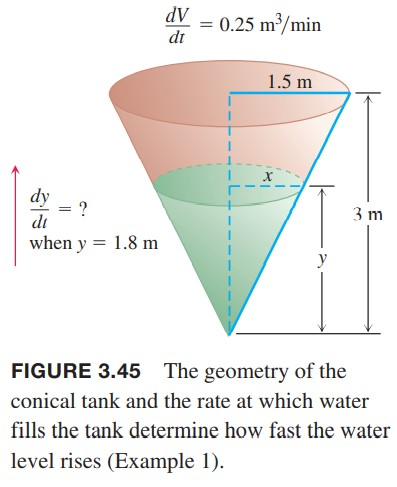
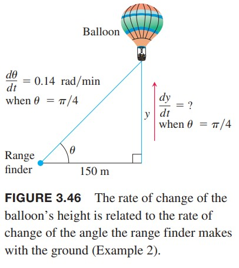
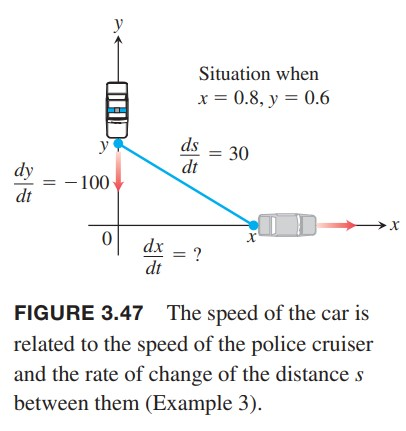
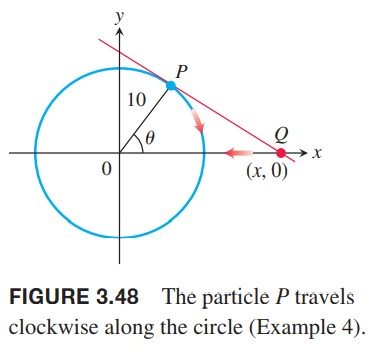
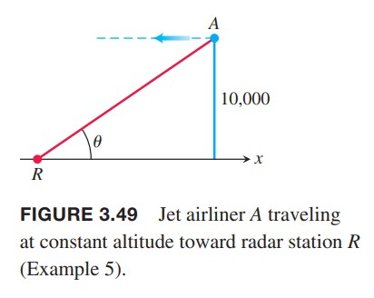
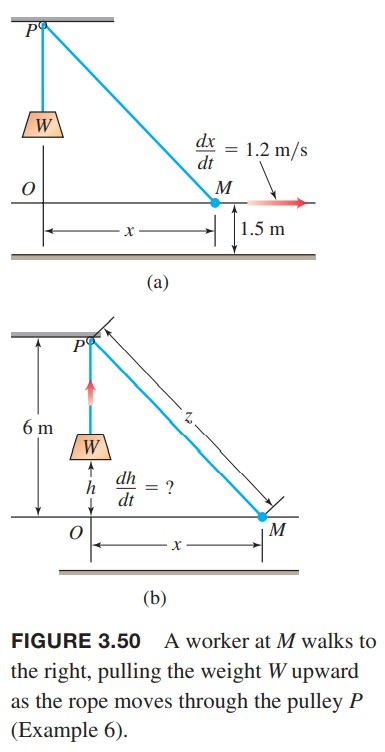

这一节我们会研究两个或多个相关变量变化的问题。确定其中一个量变化是如何影响对其他量的变化的问题称为相关变化率问题（`related rates problem`）。

### 相关变化率方程
假设我们往一个气球里面注入空气。体积和半径都随时间而增加。如果某个时刻体积是$V$，半径是$r$，那么
$$V=\frac{4}{3}\pi r^3$$
应用链式法则，两边对$t$求导，得到$V$和$r$相关变化率的方程
$$\frac{dV}{dt}=\frac{dV}{dr}\frac{dr}{dt}=4\pi r^2\frac{dr}{dt}$$
如何我们知道半径$r$和体积增加的速率$dV/dt$，那么就可以求出那个时刻半径的变化率$dr/dt$。测量体积的变化率（注入气体体积）比测量半径的变化率要容易。  
求相关变化率的问题的关键是找出变量之间的关系，如下例。

例1 向圆锥罐注水速度是$0.25m^3/min$。圆锥高3m，底半径1.5m。求水深1.8m时水位的变化率。  
  
解：如上图所示。$V,x,y$分别是$t$时刻的体积、水面半径和水深，并且对时间$t$可导。那么已知
$$y=1.8m,\frac{dV}{dt}=0.25m^3/min$$
锥体体积是
$$V=\frac{1}{3}\pi x^2y$$
但是题目没有给出$x$和这一时刻的$dx/dt$，不过通过相似三角形可以得到
$$\frac{x}{y}=\frac{1.5}{3}$$
$$x=\frac{y}{2}$$
消除$x$得到
$$V=\frac{1}{3}\pi(\frac{y}{2})^2y=\frac{\pi}{12}y^3$$
求导
$$\frac{dV}{dt}=\frac{\pi}{12}3y^2\frac{dy}{dt}$$
代入已知条件
$$0.25=\frac{\pi}{4}(1.8)^2\frac{dy}{dt}$$
$$\frac{dy}{dt}=\frac{1}{3.14\pi}\approx 0.098$$
所以这个时刻水面上升速率是0.098m/min。

**相关变化率问题的策略**
1. 画出图像，找到变量和常量。用$t$表示时间，假设所有变量对$t$可导。
2. 描述变量之间的关系。
3. 描述要求解什么，一般情况是导数。
4. 列方程。
5. 求导。
6. 求值。

例2 距离测距仪150m的地方放飞一个热气球。此时测距仪的角度是$\pi/4$，角度变化率是0.14rag/min。热气球上升速度是多少？  
  
解：如上图所示。$\theta$表示测距仪的角度，$y$表示热气球距离地面的距离。所以
$$\frac{d\theta}{dt}=0.14\text{rad/min},\theta=\frac{\pi}{4}$$
要求$dy/dt$，$y$和$\theta$的关系如下
$$\frac{y}{150}=\tan\theta,y=150\tan\theta$$
求导
$$\frac{dy}{dt}=150(\sec^2\theta)\frac{d\theta}{dt}$$
代入数值
$$\frac{dy}{dt}=150(\sqrt{2})^2(0.14)=42$$
所以热气球上升速度是42m/min。

例3 警车从北开向十字路口，追逐超速的车，后者已经过了十字路口向东开。警车距离十字路口0.6kn，超速的车距离十字路口0.8km。警车上的雷达显式超速车的速度是30km/h。如果警车速度是100km/h，那么超速的车的速度是多少？  
  
解：$x$表示超速车的位置，$y$表示警车的位置，$s$表示两车的距离。那么根据题意
$$x=0.8km,y=0.6kn,\frac{dy}{dt}=-100km/h,\frac{ds}{dt}=30km/h$$
$dy/dt$是负值的原因是$y$在减小。  
变量之间的关系是
$$s^2=x^2+y^2$$
求导
$$\begin{aligned}
2s\frac{ds}{dt}&=2x\frac{dx}{dt}+2y\frac{dy}{dt}\\
\frac{ds}{dt}&=\frac{1}{s}(x\frac{dx}{dt}+y\frac{dy}{dt})\\
&=\frac{1}{\sqrt{x^2+y^2}}(x\frac{dx}{dt}+y\frac{dy}{dt})
\end{aligned}$$
代入数值
$$30=\frac{1}{\sqrt{(0.8)^2+(0.6)^2}}(0.8\frac{dx}{dt}+0.6\cdot -100)=0.8\frac{dx}{dt}-60$$
$$\frac{dx}{dt}=\frac{30+60}{0.8}=112.5$$
此时，超速车的车速是112.5km/h。

例4 一个粒子$P$沿着半径为10m圆心位于原点的圆逆时针顺时针运动。粒子初始位置位于$y$轴$(0,10)$，重点是$x$轴$(10,0)$。一旦粒子开始运动，$P$的切线和$x$轴的交点$Q$开始向原点运动。粒子总运动时间是30s，求当$Q$距离原点20m时，$Q$的运动速度。  
  
解：如上图所示。$\theta$表示$OP$和$x$轴的夹角。运动时间是30s，所以半分钟运动$\pi/2$弧度，那么角速度是$\pi$rad/min，那么$d\theta/dt=-\pi$，负号表示$\theta$在减小。  
$x$表示$Q$距离原点的距离，问题是要求$x=20$时$dx/dt$。  
从图中可知$x\cos\theta=10,x=10\sec\theta$，所以
$$\frac{dx}{dt}=10\sec\theta\tan\theta=-10\pi\sec\theta\tan\theta$$
负号的原因是$x$在减小，$Q$沿$x$轴负向运动。  
$x=10$，那么$\cos\theta=1/2,\sec\theta=2,\tan\theta=\sqrt{\sec^2\theta-1}=\sqrt{3}$，因此
$$\frac{dx}{dt}=-10\pi\cdot 2\cdot \sqrt{3}=-20\pi\sqrt{3}$$
此时，$Q$移向原点的速率是$20\pi\sqrt{3}\approx 109m/min$。

例5 一架飞机在高度10000m的高空水平飞向一个小岛。岛上的雷达可以直接监测到这架飞机，和飞机之间的直线与水平夹角是30°。如果雷达监测角度变化率是1/3 deg/s，求飞机的速度。  
  
解：如上图所示。飞机$A$和雷达站$R$在坐标平面，水平方向是$x$轴，垂直向上是$y$轴。所以$y=10000$。我们要求$\theta=\pi/6,d\theta/dt=1/3 \text{ deg/s}$时$dx/dt$。  
从图中可以看出
$$x=10000\cot\theta$$
换成千米作为单位的话
$$x=10\cot\theta$$
求导
$$\frac{dx}{dt}=-10\csc^2\theta\frac{d\theta}{dt}$$
当$\theta=\pi/6$时，$\sin^2\theta=1/4$，那么$\csc^2\theta=4$。我们把$d\theta/dt=1/3 \text{ deg/s}$转化成弧度每小时
$$\frac{d\theta}{dt}=\frac{1}{3}(\frac{\pi}{180})(3600) \text{ rad/hour}$$
那么
$$\frac{dx}{dt}=(-10)(4)(\frac{1}{3})(\frac{\pi}{180})(3600)\approx 838$$
负号表示距离$x$在缩小。飞机的速度是838千米每小时。

例6 如下图所示。$P$点是滑轮挂着重物$W$。另一个端点$M$是工人的手，距离地面1.5m。假设$P$距离地面7.5m，绳长13.5m，工人离开垂线$PW$的速度是1.2m/s。当工人的手距离$PW$ 6.3m的时候，重物$W$上升的速度是多少。  
  
解：令$OM$是水平线，$x$是$OM$距离，$h$表示$W$距离$O$的高度，$z$表示$PM$的长度。我们想要知道当$x=6.3,dx/dt=1.2$时$dh/dt$。注意$OP$是6m，三角形$OPM$是直角三角形，点$O$处是直角。  
任意时刻我们有如下关系
$$\begin{aligned}
6-h+z&=13.5\\
x^2+6^2&=z^2
\end{aligned}$$
解得$z=7.5+h$，代入第二个式子得到
$$x^2+6^2=(7.5+h)^2$$
求导
$$2x\frac{dx}{dt}=2(7.5+h)\frac{dh}{dt}$$
那么
$$\frac{dh}{dt}=\frac{x}{7.5+h}\frac{dx}{dt}$$
因为
$$7.5+h=\sqrt{6^2+x^2}=\sqrt{6^2+6.3^2}=8.7$$
所以
$$\frac{dh}{dt}=\frac{6.3}{8.7}\cdot 1.2\approx 0.87 \text{m/s}$$
这就是$x=6.3m$时重物上升的速度。
