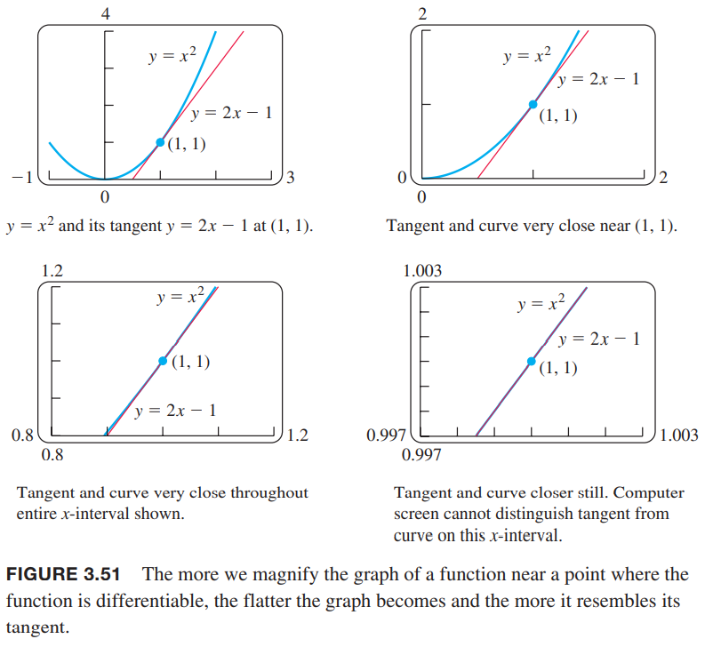
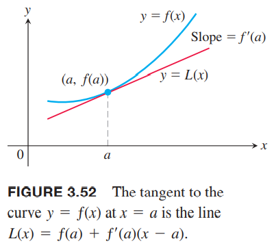
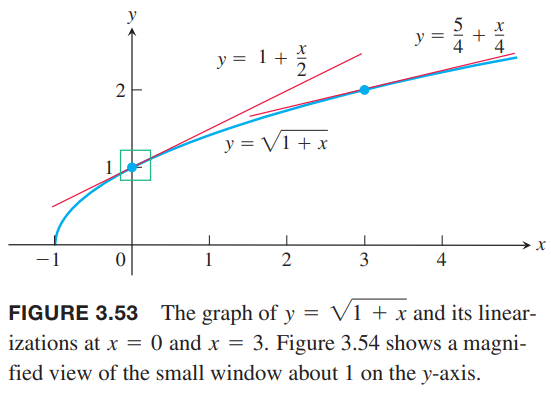
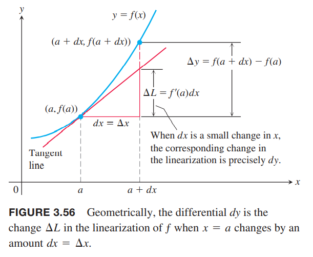
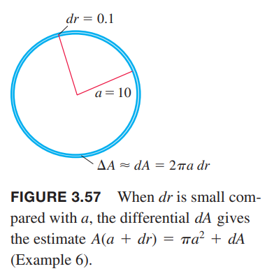

### 线性化
看下图，$y=x^2$的切线在切点附近非常接近曲线。在切点任意一边的区间，切线的$y$值是曲线$y$值的足够好的近似。下图的后面是放大的图像，区间很小时，值非常接近。这一点不仅对多项式曲线成立，对任意曲线都成立。  
  
一般地，如果$f$是可导函数，在$x=a$处，$y=f(x)$的切线通过点$(a,f(a))$，点斜式方程式
$$y=f(a)+f'(a)(x-a)$$
切线就是线性方程
$$L(x)=f(a)+f'(a)(x-a)$$
的图像。稍微离开接触点，$L(x)$是$f(x)$的近似。  

**定义** 如果$f$在$x=a$处可导，近似方程
$$L(x)=f(a)+f'(a)(x-a)$$
是$f$在$a$处的线性化（`linearization`）。近似
$$f(x)\approx L(x)$$
是$f$在$a$处的标准线性近似（`standard linear approximation`）。点$a$是近似中心。

例1 求$f(x)=\sqrt{1+x}$在$x=0$处的近似。如下图。  
  
解：由
$$f'(x)=\frac{1}{2}(1+x)^{-1/2}$$
我们有$f(0)=1,f'(0)=1/2$，那么线性方程是
$$L(x)=f(a)+f'(a)(x-a)=1+\frac{x}{2}$$
如下图所示。  

下面的表展示了$\sqrt{1+x}\approx 1+(x/2)$的在0附近的精确度，如果离0很远的话，那么就不准确了。比如$x=2$，线性化的近似是2，实际值是$\sqrt{3}$，准确度差很远。

| Approximation | True value | True value - approximation |
|--|--|--|
| $\sqrt{1.005}\approx 1+\frac{0.005}{2}=1.0025$ | $1.002497$ | $0.000003 < 10^{-5}$ |
| $\sqrt{1.05}\approx 1+\frac{0.05}{2}=1.025$ | $1.024695$ | $0.000305 < 10^{-3}$ |
| $\sqrt{1.2}\approx 1+\frac{0.2}{2}=1.1$ | $1.095445$ | $0.004555 < 10^{-2}$ |

不要这个例子误导了，以为线性化是为了更好的计算某个值。实际中，我们不会用线性化来求具体的某个平方根。线性化的作用是在很小的值区间上用简单函数替换复杂函数。如果我们需要在0附近用到函数$\sqrt{1+x}$并且可以容忍一些误差，那么可以用$1+(x/2)$替代。当然，我们需要知道误差有多少。第九章会讨论这个事情。  
线性近似离开中心点之后会不准确。如图3.53，近似$\sqrt{1+x}\approx 1+(x/2)$在$x=3$就会差距太大。我们需要在$x=3$处从新做线性化。

例2 求$f(x)=\sqrt{1+x}$在$x=3$处的近似。  
解：
$$f(3)=2,f'(3)=\frac{1}{2}(1+x)^{-1/2}\bigg|_{x=3}=\frac{1}{4}$$
所以
$$L(x)=2+\frac{1}{4}(x-3)=\frac{5}{4}+\frac{x}{4}$$
比如$x=3.2$，近似值是
$$\sqrt{1+x}=\sqrt{1+3.2}\approx \frac{5}{4}+\frac{3.2}{2}=2.05$$
而$\sqrt{4.2}\approx 2.04939$，差距小于千分之一。如果用例子的线性化近似值是
$$\sqrt{1+x}=\sqrt{1+3.2}\approx 1+\frac{3.2}{2}=2.6$$
差距超过了25%。

例3 求$f(x)=\cos x$在$x=\pi/2$处的近似。  
解：$f(\pi/2)=\cos(\pi/2)=0,f'(\pi/2)=-\sin(x)=-\sin(\pi/2)=-1$，那么在$a=\pi/2$处的线性化方程是
$$\begin{aligned}
L(x)&=f(a)+f'(a)(x-a)\\
&=0+(-1)(x-\frac{\pi}{2})\\
&=-x+\frac{\pi}{2}
\end{aligned}$$

下面是一个重要的近似
$$(1+x)^k\approx 1+kx$$
要求$x$在0附近，对任意$k$都成立。
这个近似有广泛的应用。比如，当$x$很小时有
$$\begin{aligned}
\sqrt{1+x}&\approx 1+\frac{1}{2}x&&k=1/2\\
\frac{1}{1-x}&= (1-x)^{-1}\approx 1+(-1)(-x)=1+x&&k=-1,x\leftarrow -x\\
\sqrt[3]{1+5x^4}&=(1+5x^4)^{1/3}\approx 1+\frac{1}{3}5x^4=1+\frac{5}{3}x^4&&k=1/3,x\leftarrow 5x^4\\
\frac{1}{\sqrt{1-x^2}}&=(1-x^2)^{-1/2}\approx 1+(-\frac{1}{2})(-x^2)=1+\frac{1}{2}x^2&&k=-1/2,x\leftarrow -x^2
\end{aligned}$$

### 微分
我们有时使用莱布尼茨记号$dy/dx$表示$y$的导数，并不表示比值。限制引入两个变量$dx,dy$，它们是成比例的，值等于导数。

**定义** 令$f(x)$是可导函数。微分$dx$是自变量，微分$dy$是
$$dy=f'(x)dx$$

$dx$是自变量，$dy$是因变量，依赖于$x,dx$的值。给定$dx$和$f$定义域中的某个$x$值，就决定了$dy$的值。$dx$有时记作$\Delta x$，表示$x$的变化。

例4  
（a）求函数$y=x^5+37x$的导数$dy$  
（b）当$x=1,dx=0.2$，求$dy$的值。  
解：  
（a）$dy=(5x^4+37)dx$  
（b）代入$x=1,dx=0.2$得到
$$dy=(5(1)^4+37)(0.2)=8.4$$

微分的几何意义如下图所示：  
  
令$x=a,dx=\Delta x$，对应$y=f(x)$的变化是
$$\Delta y=f(a+dx)-f(a)$$
切线$L$上的变化是
$$\begin{aligned}
\Delta L&=L(a+dx)-L(a)\\
&=f(a)+f'(a)[(a+dx)-a]-f(a)\\
&=f'(a)dx
\end{aligned}$$
这说明当$x=a,dx=\Delta x$时，$f$的线性化的变化就是$dy$的微分的值。因此，$dy$表示当$x$变化$dx=\Delta x$时切线上升或者下降的量。  
如果$dx\neq 0$，微分$dy$除以微分$dx$的商恰好是导数$f'(x)$
$$dy\div dx=\frac{f'(x)dx}{dx}=f'(x)=\frac{dy}{dx}$$
有时写作
$$df=f'(x)dx$$
称$df$是$f$的微分。例如$f(x)=3x^2-6$，那么
$$df=d(3x^2-6)=6xdx$$
每一个导数公式比如
$$\frac{d(u+v)}{dx}=\frac{du}{dx}+\frac{dv}{dx},\text{ or } \frac{d(\sin u)}{dx}=\cos u\frac{du}{dx}$$
对应微分形式是
$$d(u+v)=du+dv, \text{ or } d(\sin u)=\cos u du$$

例5 使用各种求导法则得到下面函数的微分形式  
（a）$d(\tan 2x)=\sec^2(2x)d(2x)=2\sec^22xdx$  
（b）$d(\frac{x}{x+1})=\frac{(x+1)dx-xd(d+1)}{(x+1)^2}=\frac{xdx+dx-xdx}{(x+1)^2}=\frac{dx}{(x+1)^2}$

### 用微分进行估算
假设我们知道可导函数$f(x)$在$a$点值，如果我们移动到附近一点$a+dx$，如何估算函数值的变化呢？如果$dx=\Delta x$非常小，那么$\Delta y$近似等于微分$dy$。当$dx=\Delta x$时，由于
$$f(a+dx)=f(a)+\Delta y$$
那么微分近似是
$$f(a+dx)\approx f(a)+dy$$
因此当$f(a)$已知且$dx$很小时，$dy=f'(a)dx$，近似$\Delta y\approx dy$用于估计$f(a+dx)$。

例6 圆的半径$r$从$a=10m$增加到$10.1m$。如下图所示。  
  
使用$dA$来估算面积$A$。和直接使用公式得到的面积进行对比。  
解：因为$A=\pi r^2$，那么估计增加的面积是
$$dA=A'(a)dr=2\pi a dr=2\pi(10)(0.1)=2\pi m^2$$
因为$A(r+\Delta r)\approx A(r)+dA$，所以
$$A(10+0.1)\approx A(10)+2\pi=102\pi$$
我们得到半径为$10.1m$时圆的面积近似是$102\pi m^2$。  
通过圆的面积公式
$$A(10.1)=\pi(10.1)^2=102.01\pi$$
估算误差是$0.01\pi m^2$，是$\Delta A-dA$的差。

我们使用微分来估算函数，要选择点$x=a$附近的点，其中比较容易计算$f(a),f'(a)$的值。

例7 使用微分估算  
（a）$7.97^(1/3)$  
（b）$\sin(\pi/6+0.01)$  
解：  
（a）立方根函数$y=x^3$的微分是
$$dy=\frac{1}{3x^{2/3}}dx$$
令$a=8$，这个点在7.97附近，同时容易计算$f(a),f'(a)$的值。$a+dx=7.97$，那么$dx=-0.03$。求近似值
$$\begin{aligned}
f(7.97)&=f(a+dx)\\
&\approx f(a)+dy\\
&=8^{1/3}+\frac{1}{3(8)^{2/3}}(-0.03)
&=2+\frac{1}{12}(-0.03)\\
&=1.9975
\end{aligned}$$
$7.97^{1/3}$的真实近似值（六位小数）是$1.997497$，估算的十分接近。  
（b）$y=\sin x$的微分是
$$dy=\cos xdx$$
为了估算$\sin(\pi/6+0.01)$，令$a=\pi/6,dx=0.01$，那么
$$\begin{aligned}
f(\pi/6+0.01)&=f(a+dx)\\
&\approx f(a)+dy\\
&=\sin(\pi/6)+\cos(\pi/6)(0.01)\\
&=\frac{1}{2}+\frac{\sqrt{3}}{2}(0.01)\\
&\approx 0.5087
\end{aligned}$$
$\sin(\pi/6+0.01)$的真实值（六位小数）是0.508635。

例7 的（b）方法可以用于计算三角函数的值。算法存储一个很大的表，里面有$[0,\pi/4]$对应的正弦值和余弦值。在这个区间的三角函数值，使用表格里面的值加上述的方法计算。区间范围外的，通过三角恒等变换来计算。

### 微分近似的误差
令$f(x)$在$x=a$处可导，假设$x$的增量是$dx=\Delta$。我们有两种方式描述$f$的变化。真实变化是
$$\Delta f=f(a+\Delta x)-f(x)$$
微分估算是
$$df=f'(a)\Delta x$$
用$df$近似$\Delta f$有多好呢？  
$\Delta f$减去$df$得到了近似估计的误差
$$\begin{aligned}
\text{error}&=\Delta f-df\\
&=\Delta f-f'(a)\Delta x\\
&=f(a+\Delta x)-f(a)-f'(a)\Delta x\\
&=(\frac{f(a+\Delta x)-f(a)}{\Delta x}-f'(a))\Delta x\\
&=\varepsilon \Delta x
\end{aligned}$$
当$\Delta x\to 0$时，
$$\frac{f(a+\Delta x)-f(a)}{\Delta x}$$
趋于$f'(a)$（这就是$f'(a)$的定义）。所以上面公式括号内的差值也趋于零，用$\varepsilon$表示。也就是说$\Delta x\to 0$时$\varepsilon\to 0$。当$\Delta x$很小的时候，近似估计误差$\varepsilon\Delta x$更小。  
虽然我们不知道精确的误差，但是$\varepsilon\Delta x$是二阶小量。对于许多函数，$\Delta x$很小时，误差都更小。

如果$y=f(x)$在$x=a$处可导，$x$从$a$变化到$a+\Delta x$，那么$f$的变化$\Delta y$是
$$\Delta y=f'(a)\Delta x+\varepsilon\Delta x$$
其中当$\Delta x\to 0$时$\varepsilon\to 0$。

例6 中有
$$\Delta A=\pi(10.1)^2-\pi(10)^2=2.01\pi=(2\pi+0.01\pi)$$
前者是$dA=2\pi$，后者$\varepsilon\Delta r=0.01\pi$是误差，那么$\varepsilon=0.01\pi/\Delta r=0.01\pi/0.1=0.1\pi$。

### 链式法则的证明
目标是证明$f(u)$是$u$的可导函数，$g(x)$是$x$的可导函数，那么复合函数$y=f(g(x))$是$x$的可导函数。函数可导等价于在定义域内任一点都可导，必须证明$g$在任一点$x_0$是可导的，$f$在任一点$g(x_0)$上是可导的，那么复合函数在$x_0$处可导，且导数满足
$$\frac{dy}{dx}\bigg|_{x=x_0}=f'(g(x_0))g'(x_0)$$
令$\Delta x$是$x$的增加量，$\Delta u,\Delta y$分别是$u,y$的变化量。运用上一节得到的公式有
$$\Delta u=g'(x_0)\Delta x+\epsilon_1\Delta x=(g'(x_0)+\epsilon_1)\Delta x$$
其中，当$\Delta x\to 0$时$\epsilon_1\to 0$。同样
$$\Delta y=f'(u_0)\Delta u+\epsilon_2\Delta u=(f'(u_0)+\epsilon_2)\Delta u$$
其中，当$\Delta u\to 0$时$\epsilon_2\to 0$。我们还可以得到$\Delta x\to 0$时有$\Delta u\to 0$。联合上面两个方程有
$$\Delta y=(f'(u_0)+\epsilon_2)(g'(x_0)+\epsilon_1)\Delta x$$
那么
$$\frac{\Delta y}{\Delta x}=f'(u_0)g'(x_0)+\epsilon_2g'(x_0)+f'(u_0)\epsilon_1+\epsilon_2\epsilon_1$$
当$\Delta x$趋于零时，$\epsilon_1,\epsilon_2$都趋于零，那么取极限后上式后面三项都是零了，那么有
$$\frac{dy}{dx}\bigg|_{x=x_0}=\lim_{\Delta x\to 0}\frac{\Delta y}{\Delta x}f'(g(x_0))g'(x_0)$$

### 变化灵敏度
方程$df=f'(x)dx$告诉我们$f$的变化对$x$变化的灵敏度。$f'$越大，给定$dx$，函数变化也越大。当我们从$a$移动到$a+dx$时，可以用三种方式描述$f$的变化：绝对值，相对值，百分比。
|  | True | Estimated |
|--|--|--|
| 绝对变化 | $\Delta f=f(a+dx)-f(a)$ | $df=f'(a)dx$ |
| 相对变化 | $\frac{\Delta f}{f(a)}$ | $\frac{df}{f(a)}$ |
| 变化百分比 | $\frac{\Delta f}{f(a)}\times 100$ | $\frac{df}{f(a)}\times 100$ |

例8 通过扔石头估算水井的深度，公式为$s=4.9t^2$。时间测量误差是0.1s，测量深度的变化有多大呢？  
解：$ds$的大小是
$$ds=9.8tdt$$
所以灵敏度依赖于时间$t$。如果$t=2, dt=0.1$，那么
$$ds=9.8(2)(0.1)=1.96m$$
如果$t=5$，那么
$$ds=9.8(5)(0.1)=4.9m$$
如果时间越大，深度的测量误差越大。

例9 牛顿第二定律
$$F=\frac{d}{dt}(mv)=m\frac{dv}{dt}=ma$$
假设质量是不变的，但是相对论告诉我们质量随速度变化而变化
$$m=\frac{m_0}{\sqrt{1-v^2/c^2}}$$
其中$m_0$是静止质量，$c$是光速。使用近似公式
$$\frac{1}{\sqrt{1-x^2}}\approx 1+\frac{1}{2}x^2$$
来估计随速度$v$变化是$\Delta m$的变化？  
解：当$v$和光速$c$相比很小时，$v^2/c^2$趋于零，可以使用近似公式
$$\frac{1}{1-v^2/c^2}\approx 1+\frac{1}{2}(\frac{v^2}{c^2}）$$
那么
$$m=\frac{m_0}{\sqrt{1-v^2/c^2}}\approx m_0+\frac{1}{2}m_0v^2(\frac{1}{c^2})$$
上式的后者这就是质量的增加量。  
牛顿物理中，$(1/2)m_)v^2$是一个物体的动能（`kinetic energy, KE`），那么改写上面的方程
$$(m-m_0)c^2\approx \frac{1}{2}m_0v^2$$
那么
$$(m-m_0)c^2\approx \frac{1}{2}m_0v^2=\frac{1}{2}m_0v^2-\frac{1}{2}m_0(0)^2=\Delta KE$$
所以一个物体速度从零到$v$，动能的变化近似是$\Delta m c^2$，由于$c\approx 3\times 10^8m/s$，质量变化很小，能量就很大。
