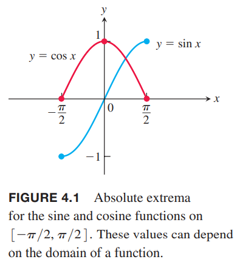
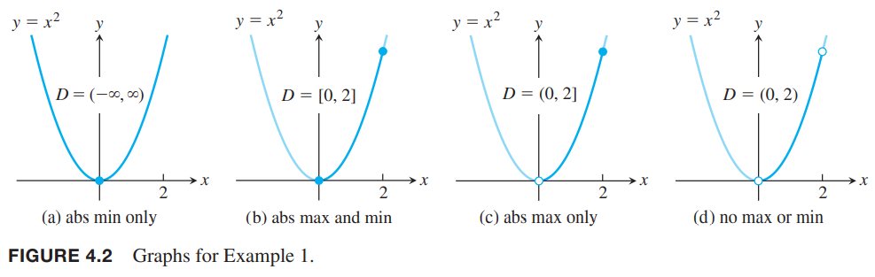
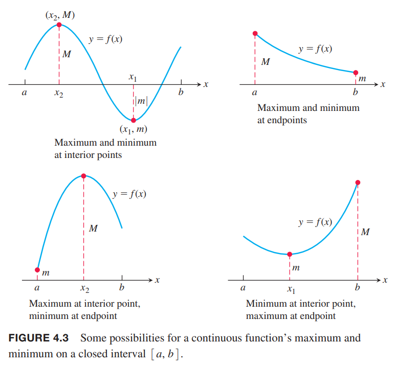
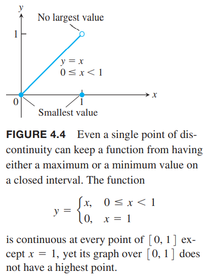
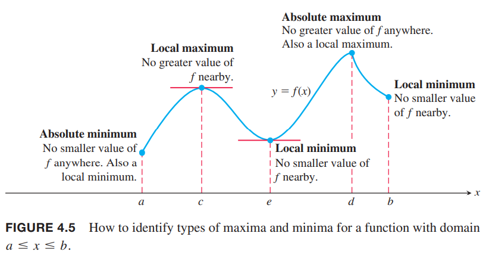
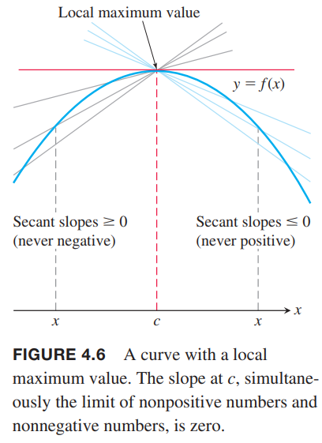
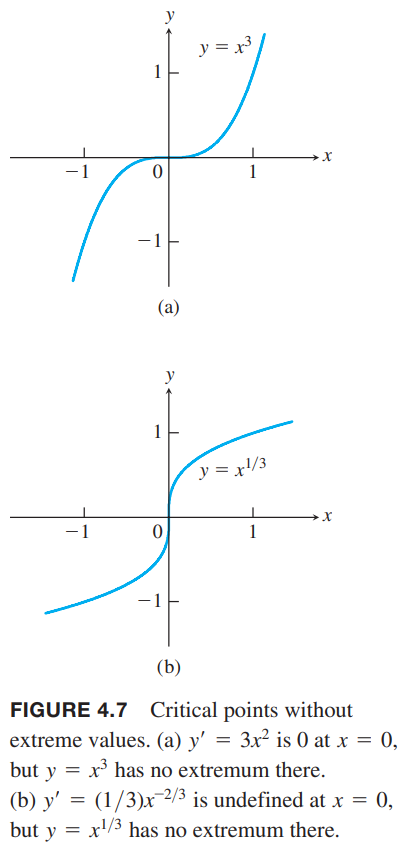
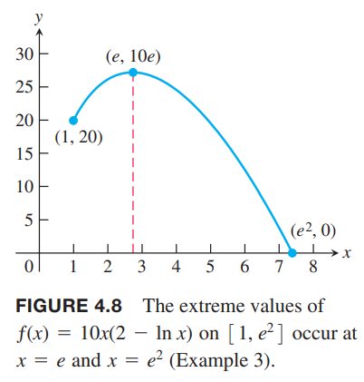
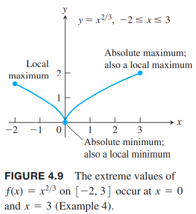

**定义** 令$f$是定义域$D$上的函数。如果$D$上有一点$c$满足
$$f(x)\leq f(c), \text{ for all $x$ in } D$$
那么$f$在$D$上有（绝对）最大值。类似的如果有点$c$满足
$$f(x)\geq f(c), \text{ for all $x$ in } D$$
那么有（绝对）最小值。

（绝对）最大值和最小值也称作$f$的（绝对）极值（`extreme values`）。后续简称最大值和最小值。  
比如在区间$[-\pi/2,\pi/2]$上，函数$f(x)=\cos x$有最大值1（一次）和最小值0（两次），函数$f(x)=\sin x$有最大值1和最小值-1。如下图所示。  
  
有相同表达式的函数如果定义域不同，可能有不同的极值。如果定义域无界或者不包含端点，函数可能没有最大值或最小值。

例1 下面函数的极值如下图所示。每个函数方程都是$y=x^2$，但是定义域不同。  

| 函数方程 | 定义域 $D$ | 极值 |
|--|--|--|
| $y=x^2$ | $(-\infty, \infty)$ | 没有最大值，最小值是0，此时$x=0$ |
| $y=x^2$ | $[0, 2]$ | 最大值是4，此时$x=2$，最小值是0，此时$x=0$ |
| $y=x^2$ | $(0,2]$ | 最大值是4，此时$x=2$，没有最小值 |
| $y=x^2$ | $(0, 2)$ | 没有最大值和最小值 |

上面的例子中没有最大值或者最小值。下面的定理告诉我们一个函数在闭区间$[a,b]$上连续，那么一定有最大值和最小值。

**定理1 极值定理**  
如果函数$f$在闭区间$[a, b]$上连续，那么一定有最大值$M$和最小值$m$。也就是说，在闭区间$[a, b]$上存在$x_1, x_2$使得$f(x_1)=m,f(x_2)=M$，且区间上其他$x$都满足$m\leq f(x)\leq M$。

定理的证明超出了需要更多实数系统的知识。下图展示了极值可能出现在闭区间的不同位置。观察之前$f=\cos x$的图，最小值可以在不同位置出现多次。  
  
定理1要求函数是连续的且区间是闭区间且有界。例1展示了区间不是闭合区间或者无界的情况下，极值不存在。指数函数$y=e^x$，定义域为$(-\infty,\infty)$，说明在无限区间上没有极值。下图说明连续的必要性。  

### 局部极值
下图展示了函数在区间$[a,b]$上有五个不同类型极值。函数的最小值在$a$处，尽管$e$处的值比其邻居要小。$c$点附近有左边曲线上升右边曲线下降，所以$f(c)$局部最大。在$d$有最大值。  

**定义** 如果在定义域内某个包含$c$的开区间上有$f(x)\leq f(c)$，那么在定义域$D$上函数$f$在$c$处有局部最大值。  
类似的，如果在定义域内某个包含$c$的开区间上有$f(x)\geq f(c)$，那么在定义域$D$上函数$f$在$c$处有局部最小值。

如果函数$f$的定义域是闭区间$[a, b]$，如果在左闭右开区间$[a, a+\delta),\delta>0$上的$x$都有$f(x)\leq f(a)$，那么$f$在端点$x=a$处有局部最大值。类似的，如果开区间$(c-\delta,c+\delta),\delta>0$上所有$x$都有$f(x)\leq f(c)$，那么$f$在内部点$x=c$处有局部最大值；如果在左开右闭区间$(b-\delta, b],\delta>0$上的$x$都有$f(x)\leq f(b)$，那么$f$在端点$x=b$处有局部最大值。对于局部最小值，不等式方向相反。如上图，函数在$c,d$上有局部最大值，在$a,e,b$上有局部最小值。局部极值也称为相对极值。有些函数即使在有限区间内也有无限多局部极值。比如函数$f(x)=\sin (1/x),x\in(0,1]$。  
全局最大值也是局部最大值。如果最大值存在，那么一定是局部最大值的一个，类似的，如果最小值存在，也一定是局部最小值其中的一个。

### 求极值
**定理2 局部极值的一阶导定理**  
如果函数$f$在内部点$c$处局部最大或最小，且如果$f'$在$c$处存在，那么
$$f'(c)=0$$
证明：我们证明的方法是证明$f'(c)$不为负数也不为正数，那么就只能是零。  
如下图所示我们先假设$f$在$x=c$处有局部最大值。那么对于$c$充分近的$x$有$f(x)-f(c)\leq 0$。  
  
$c$是内点，所以存在双边极限
$$\lim_{x\to c}\frac{f(x)-f(c)}{x-c}$$
那么从两边分别讨论
$$f'(c)=\lim_{x\to c^+}\frac{f(x)-f(c)}{x-c}\leq 0$$
$$f'(c)=\lim_{x\to c^-}\frac{f(x)-f(c)}{x-c}\geq 0$$
那么$f'(c)=0$。  
如果$c$是局部最小值，即$f(x)\geq f(c)$，后续证明不等号方向相反。  
定理2告诉我们在内部某点有极值且导数存在，那么该点处的导数为零。所以我们只需要在如下三个地方寻找极值：
1. 内部导数为零的点，$f'=0$
2. 内部导数不存在的点
3. 端点

**定义** 函数$f$的内部使得$f'=0$或导数不存在点称为临界点。

所以极值只可能出现在临界点或端点。注意，这里并不意味着临界点一定存在极值。比如下图，$y=x^3,y=^{1/3}$，原点是临界点，但不是极值点。这个点称为拐点，4.4节会讨论。  
  
大部分问题是求解连续函数在有限闭区间的极值。定理1告诉我们极值一定存在。定理2告诉我们会发生在哪些点上。如果区间不是闭区间或者不是有限的，比如$a<x<b,a<x<\infty$，全局极值可能不存在。

**求有限闭区间上函数$f$的极值**
1. 寻找区间上的临界点
2. 求临界点和端点的函数值
3. 找到极值

例2 求$f(x)=x^2$在$[-2,1]$上的最大值和最小值。  
解：临界点在$f'(x)=2x=0$，即$x=0$。求函数值
$$f(0)=0,f(-2)=4,f(1)=1$$
所以在$x=0$处取最小值0，在$x=-2$处取最大值4。

例3 求$f(x)=10x(2-\ln x)$在区间$[1,e^2]$上的最大值和最小值。  
解：下图提示我们最大值在$x=3$附近，最小值在$x=e^2$处，大小是0。  
  
先求导
$$f'(x)=10(2-\ln x)-10x\frac{1}{x}=10(1-\ln x)$$
所以临界点是$1-\ln x=0, x=e$。求函数值
$$f(e)=10e,f(1)=20,f(e^2)=0$$
所以在$x=e$处取最大值$10e$，在$x=e^2$处取最小值0。

例4 求$f(x)=x^{2/3}$在区间$[-2,3]$上的最大值和最小值。  
解：求导
$$f'(x)=\frac{2}{3}\frac{1}{\sqrt[3]{x}}$$
虽然导数不会为零，但是$x=0$处导数不存在，也是临界点。求函数值
$$f(0)=0,f(-2)=\sqrt[3]{4},f(3)=\sqrt[3]{9}$$
所以在$x=0$处取得最小值0，在$x=3$处取最大值$\sqrt[3]{9}$。函数图像图下所示  

在更一般的定义域上，比如$(0,1),[2,5),[1,\infty),(-\infty,\infty)$，最大值和最小值可能不存在。我们可以做出可导函数图像，我们知道函数的渐近线，也知道局部极值，我们可以推得全局极值。
