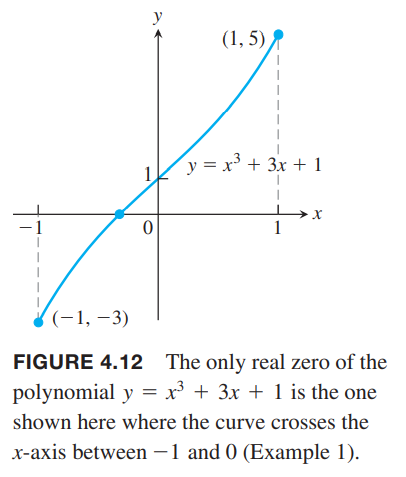

### 罗尔中值定理
如果可导函数穿过一水平线的不同两点，那么在这两点之间有一点的切线式水平的，即导数为零。如下图所示。  

**定理3 罗尔中值定理（`Rolle's Theorem`）**  
函数$y=f(x)$在区间$[a,b]$上连续在内部每点都可导，如果$f(a)=f(b)$，那么至少有一点$c\in (a,b)$，有$f'(c)=0$。

证明：定理1告诉我们闭区间$[a,b]$上一定有最大值和最小值。且只能出现在三个位置：
* 内部$f'$为零的点
* 内部$f'$不存在的点
* 端点$a, b$

根据题设，$f$在内部每点处都可导，所以排除第二条。  
如果$c\in (a,b)$处有最大值或最小值，那么根据定理2，其导数$f'(c)=0$。  
如果没有内部点有最大值或最小值，那么端点同时是最大值和最小值，但是$f(a)=f(b)$，那么说明任意一点$x\in [a, b]$都有$f(x)=f(a)$，是常值函数，那么内部各点处均有$f'(c)=0$。  
定理3的各个前提假设都是必要条件。下面是三种不满足条件的情况，不存在导数为零的内部点。  
  
罗尔中值定理和连续函数的中间值定理联合起来，可以判定方程$f(x)=0$有唯一解。

例1 证明
$$x^3+3x+1=0$$
只有一个实数解。  
证明：定义如下函数
$$f(x)=x^3+3x+1$$
由于$f(-1)=-3,f(0)=1$，中间值定理告诉我们函数在开区间$(-1,0)$上和$x$轴有交点。如下图所示。  
  
如果有两点$a,b$使得$f(x)=0$，那么存在在区间内有$x=c$使得$f'(c)=0$。对函数求导
$$f'(x)=3x^2+3>0$$
因此，没有两个点使其值为零。

### 中值定理
这里的中值定理是拉格朗日中值定理，是罗尔中值定理的倾斜版本。如下图所示  

**定理4 中值定理**  
函数$y=f(x)$在区间$[a,b]$上连续在内部每点都可导，那么至少有一点$c\in (a,b)$，有
$$\frac{f(b)-f(a)}{b-a}=f'(c)$$

证明：一条直线通过函数$f$的两点$A(a,f(a)),B(b,f(b))$。直线方程是
$$g(x)=f(a)+\frac{f(b)-f(a)}{b-a}(x-a)$$
  
$f,g$在$x$处的垂直差是
$$h(x)=f(x)-g(x)=f(x)-f(a)-\frac{f(b)-f(a)}{b-a}(x-a)$$
三个函数如下图所示  
  
因为$f,g$在区间$[a,b]$上连续，且内部可导，那么$h$满足罗尔中值定理的条件。又因为$h(a)=h(b)$，那么存在一点$c\in (a,b)$使得$h'(c)=0$，这就是要证明的点$c$。  
$$\begin{aligned}
h'(x)&=f'(x)-\frac{f(b)-f(a)}{b-a}\\
h'(c)&=f'(c)-\frac{f(b)-f(a)}{b-a}\\
0&=f'(c)-\frac{f(b)-f(a)}{b-a}\\
f'(c)&=\frac{f(b)-f(a)}{b-a}
\end{aligned}$$

中值定理不要求端点处可导，在$a,b$单边连续就足够了。  

例2 函数$f(x)=x^2$在区间$0\leq x\leq 2$上连续且在$0<x<2$上可导。因为$f(0)=0,f(2)=4$，那么在这个区间内有一点$c$，有$f'(c)=(4-0)/(2-0)=2$。因为$f'(x)=2x$，那么$c=1$。虽然我们知道$c$点总是存在，但并不总能求出其代数解。  

### 物理解释
把$(f(b)-f(a))/(b-a)$看作是$f$在$[a,b]$上的平均变化率，$f'(c)$是瞬时变化率。中值定理是说在内部某点处的瞬时变化率等于整个区间上的平均变化率。

例3 如果汽车花了8秒从起始零的地方开到了176米的地方，平均速度是176/8=22米每秒。中值定理告诉我们某时汽车速率表上显式的值是79.2千米每小时（22米每秒）。

### 数学推论
**推论1** 如果$f$在开区间$(a,b)$上每一点都有$f'(x)=0$，那么对所有$x\in (a,b)$有$f(x)=C$，其中$C$是常量。

证明：只需证明区间$(a,b)$上的任意两点$x_1,x_2(x_1<x_2)$的函数值相等即可。函数$f$在区间$[x_1,x_2]$上满足中值定理条件，因此
$$\frac{f(x_2)-f(x_1)}{x_2-x_1}=f'(c)$$
其中$c\in (x_1,x_2)$。推论中给出条件$f'=0$，所以
$$\frac{f(x_2)-f(x_1)}{x_2-x_1}=0$$
那么
$$f(x_2)=f(x_1)$$

**推论 2** 如果在开区间 $(a,b)$ 上每一点都有 $f'(x)=g'(x)$，那么存在一个常量 $C$ 对任意 $x\in (a,b)$ 都有 $f(x)=g(x)+C$。也就是说在 $(a,b)$ 上 $f-g$ 是一个常值函数。

证明：令$h=f-g$是开区间$(a,b)$上函数，因为$f'(x)=g'(x)$，所以
$$h'(x)=f'(x)-g'(x)=0$$
根据推论1，那么$h=C$是常值函数，进而$f(x)-g(x)=C$。

推论1和推论2在非有限区间上也是成立的，比如区间$(a,\infty),(-\infty,b),(-\infty,\infty)$。  
推论2在4.8节讨论反导数的时候很有用。比如，我们知道$f(x)=x^2$在$(-\infty,\infty)$上的导数是$2x$，那么如果有一个函数导数也是$2x$，那么这个函数一定能写作$x^2+C$。如下图所示。  

例4 求函数$f(x)$，其导数是$\sin x$且通过点$(0,2)$。  
解：由于函数$g(x)=-\cos x$的导数是$g'(x)=\sin x$，所以函数$f(x)=g(x)+C$，又因为通过点$(0,2)$，那么
$$f(0)=-\cos 0+C=-1+C=2,C=3$$
所以
$$f(x)=-\cos x+3$$

### 由加速度求速度和位置
已知自由落地运动的加速度是9.8米每秒。假设初始位置是0，初始速度也是0。  
速度函数$v(t)$的导数是9.8，那么
$$v(t)=9.8t+C$$
代入初始速度$v(0)=C=0$，所以$v(t)=9.8t$。  
位置函数$s(t)$的导数是$9.8t$，我们已知函数$4.9t^2$的导数是$9.8t$，所以
$$s(t)=4.9t^2+C$$
代入初始位置$s(0)=C=0$，所以$s(t)=4.9t^2$。  
上述就是简单的求解积分的过程，会在第五章讨论。

### 证明对数运算法则
证明$\ln bx=\ln b+\ln x$。函数$\ln bx$和函数$\ln x$的导数相同
$$\frac{d}{dx}\ln bx=\frac{b}{bx}=\frac{1}{x}=\frac{d}{dx}\ln x$$
由推论2可知
$$\ln bx=\ln x+C$$
方程对所有$x$都成立，那么对$x=1$也成立
$$\ln b=\ln 1+C=C$$
所以
$$\ln bx=\ln b+\ln x$$

证明$\ln x^r=r\ln x$。和上面一样，导数相同
$$\begin{aligned}
\frac{d}{dx}\ln x^r&=\frac{1}{x^r}\frac{d}{dx}x^r\\
&=\frac{1}{x^r}rx^{r-1}\\
&=r\frac{1}{x}\\
&=\frac{d}{dx}r\ln x
\end{aligned}$$
所以
$$\ln x^r=r\ln x+C$$
代入$x=1$得到$C=0$。

证明$\ln(\frac{b}{x})=\ln b-\ln x$。类似可以证明
$$\frac{d}{dx}(\ln \frac{b}{x})=\frac{d}{dx}(-\ln x)$$
然后将$x=1$代入求得$C=\ln b$。

### 指数函数的运算法则
自然指数函数$e^x$的运算法则类似与$\ln x$。

对于任意$x_1,x_2$，自然指数函数满足以下规律
$$e^{x_1}e^{x_2}=e^{x_1+x_2}$$
$$e^{-x}=\frac{1}{e^x}$$
$$\frac{e^{x_1}}{e^{x_2}}=e^{x_1-x_2}$$
$$(e^{x_1})^{x_2}=e^{x_1x_2}=(e^{x_2})^{x_1}$$

证明法则1。令
$$y_1=e^{x_1},y_2=e^{x_2}$$
那么
$$\begin{aligned}
x_1&=\ln y_1,x_2=\ln y_2\\
x_1+x_2&=\ln y_1+\ln y_2\\
x_1+x_2&=\ln y_1y_2\\
e^{x_1+x_2}&=e^{\ln y_1y_2}\\
&=y_1y_2\\
&=e^{x_1}e^{x_2}
\end{aligned}$$
法则4的证明类似。法则2和法则3可以从法则1开始推导。
