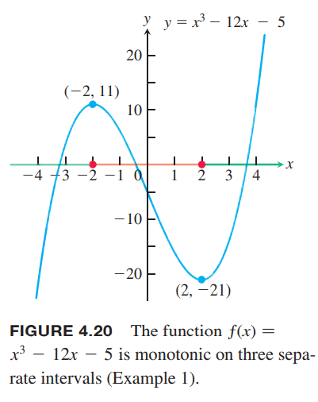
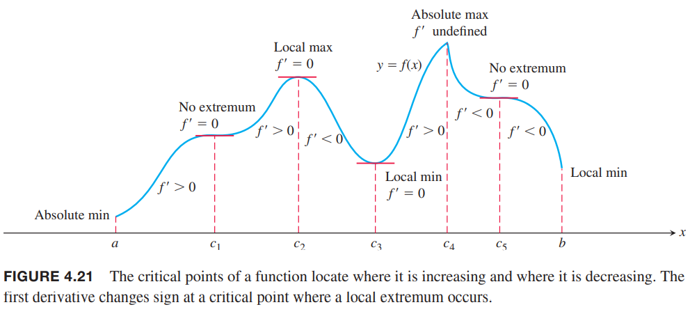
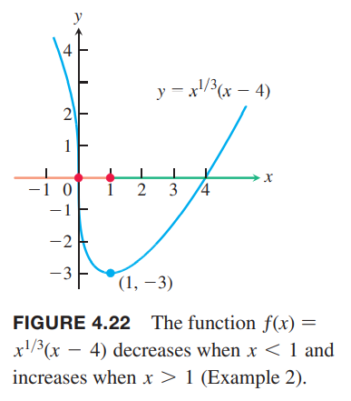
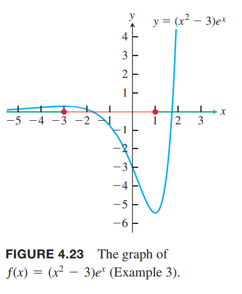

### 递增函数和递减函数
作为中值定理的另一个推论，我们会证明导数为正数是递增函数，反之导数为负数是递减函数。一个函数在某个区间上是递增或者是递减的，称在这个区间上是单调的（`monotonic`）。

**推论3** 假设函数$f$在$[a,b]$上连续在$(a,b)$上可导。那么  
如果在任一点$x\in (a,b)$都有$f'(x)>0$，那么$f$在$[a,b]$上是递增的。  
如果在任一点$x\in (a,b)$都有$f'(x)<0$，那么$f$在$[a,b]$上是递减的。

证明：令$x_1,x_2$是区间$[a,b]$上任意两点且$x_1<x_2$。那么应用中值定理有
$$f(x_2)-f(x_1)=f'(c)(x_2-x_1)$$
其中$c\in (x_1,x_2)$。由于$x_2-x_1>0$，那么$f'(c)$和等式左边符号相等。如果导数为正数，那么$f(x_2)>f(x_1)$，反之$f(x_2)<f(x_1)$。

由于在$(0,b),b>0$上，$f'(x)=1/(2\sqrt{x})$是正数，所以在区间$[0,b]$上$f(x)=\sqrt{x}$是递增的。导数在$x=0$处不存在不影响推论3的使用。推论对无限区间也是成立的，所以$f(x)=\sqrt{x}$在$[0,\infty)$上都是递增的。  
为了找到函数在哪些区间递增哪些区间递减，首先要找到临界点。如果对$f$来说$a<b$是两个临界点，如果在区间$(a,b)$上$f'$是连续且不为零，那么根据中值定理，在此区间导数要么为正要么为负。一旦通过点$c\in (a,b)$确定$f'$在$(a,b)$上的符号，就知道是递增区间还是递减区间了。选择那个点不重要，所以选择容易计算$f'$值的点即可。

例1 求函数$f(x)=x^3-12x-5$的临界点并确定在这些开区间上函数的单调性。  
解：函数$f$各处连续且可导。一阶导
$$f'(x)=3x^2-12=3(x^2-4)$$
临界点是$x=2,x=-2$，将定义域分成三个开区间$(-\infty,-2),(-2,2),(2,\infty)$。每个区间选择选择一个点确定导数符号。函数图像如下图所示  

各区间单调性如下表格。

|  |  |  |  |
|--|--|--|--|
| 区间 | $(-\infty,-2)$ | $(-2,2)$ | $(2,\infty)$ |
| $f'$ | $f'(-3)=15>0$ | $f'(0)=-12<0$ | $f'(3)=15>0$ |
| 单调性 | 递增 | 递减 | 递增 |

例1的表格中我们使用严格的不等于（开区间）。推论3告诉我们使用$\leq,\geq$也可以。那么上面的区间也可以写作$(-\infty,-2],[-2,2],[2,\infty)$。单独对一点是没法讨论单调性的。

### 对局部极值的一阶导测试
如下图所示。在$f$有最小值的点，左边$f'<0$右边$f'>0$（端点处只用考虑一边即可）。也就是说在最小值的左边是递减的右边是递增的。最大值的点附近恰好相反。总之，在局部极值处，导数符号发生了改变。  

**对局部极值的一阶导测试**  
假设$c$是连续函数$f$的临界点，$f$在包含$c$的区间上可导，可排除点$c$自身。从左向右
1. 如果$f'$在$c$处由负变正，那么$f$在$c$处有局部最小值
2. 如果$f'$在$c$处由正变负，那么$f$在$c$处有局部最大值
3. 如果$f'$符号不变，那么$f$在$c$处没有局部极值

在端点处，只需要考虑单边即可。

证明：（1）不妨令$a<c<b$，根据条件，在$(a,c)$上有$f'<0$，函数递减，$(c,b)$上有$f'>0$，函数递增。如果$x\in (a,c)$，那么$f(x)>f(c)$。如果$x\in (c,b)$，那么$f(x)>f(c)$。所以在$(a,b)$上都有$f(x)>f(c)$，所以$c$处有局部最小值。  
（2）和（3）类似。

例2 求函数
$$f(x)=x^{1/3}(x-4)=x^{4/3}-4x^{1/3}$$
的临界点。然后确定各开区间上的单调性。求函数的局部极值和全局极值。  
解：函数是由两个连续函数$x^{1/3},x-4$的乘积，也是连续函数。一阶导
$$\begin{aligned}
f'(x)&=\frac{d}{dx}(x^{4/3}-4x^{1/3})\\
&=\frac{4}{3}x^{1/3}-\frac{4}{3}x^{-2/3}\\
&=\frac{4}{3}x^{-2/3}(x-1)\\
&=\frac{4(x-1)}{3x^{2/3}}
\end{aligned}$$
在$x=1$处导数为零，在$x=0$处导数不存在。临界点把函数分成三个区间，各个区间行为如下表。
|  |  |  |  |
|--|--|--|--|
| 区间 | $(-\infty,0)$ | $(0,1)$ | $(1,\infty)$ |
| $f'$ | $f'(-1)=-8/3<0$ | $f'(\frac{1}{8})=4(\frac{1}{8}-1)/(3\cdot\frac{1}{4})<0$ | $f'(8)=7/3>0$ |
| 单调性 | 递减 | 递减 | 递增 |

在$x=0$两边导数符号不变，不存在局部极值。在$x=1$两边，导数由负变正，局部最小值。同时也是全局最小值。$f(1)=-3$。函数图像如下。  
  
注意$\lim_{x\to 0}f'(x)=-\infty$，所以函数$f$在原点处有垂直切线。

例3 求函数
$$f(x)=(x^2-3)e^x$$
的临界点，各个区间的单调性，函数的局部和全局极值。  
解：函数在实数集上连续且可导。所以临界点只出现在$f'=0$的点。  
一阶导
$$\begin{aligned}
f'(x)&=(x^2-3)\frac{d}{dx}e^x+\frac{d}{dx}(x^2-3)\cdot e^x\\
&=(x^2-3)e^x+(2x)e^x\\
&=e^x(x^2+2x-3)\\
&=e^x(x+3)(x-1)
\end{aligned}$$
那么由$f'(x)=0$可以得到
$$x=-3,x=1$$
那么开区间单调性如下所示
|  |  |  |  |
|--|--|--|--|
| 区间 | $(-\infty,-3)$ | $(-3,1)$ | $(1,\infty)$ |
| $f'$ | $f'(-4)=e^{-4}(5)>0$ | $f'(0)=-3<0$ | $f'(2)=e^2(5)>0$ |
| 单调性 | 递增 | 递减 | 递增 |

局部最大值在$x=3$处，大约是0.2999，局部最小值在$x=1$处，大约是-5.437。对$|x|>\sqrt{3}$时$f(x)>0$，所以全局最小值也在$x=1$处，但是没有全局最小值。函数图像如下图  

