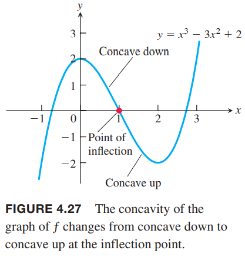

函数的一阶导会告诉我们哪里递增哪里递减，在临界点有无极值。这一节我们会看到二阶导会告诉我们可导函数是怎么弯曲的。再结合对称性和渐近线等信息，我们就可以精确的画出函数的图像。

### 凹凸性
如下图所示，$y=x^3$随$x$增加而增加，但是在$(-\infty,0),(0,\infty)$弯向不同的方向。从左边接近原点，曲线弯向右侧，并且切线在图像上方。在区间$(-\infty,0)$上曲线斜率递减。从原点向右，曲线弯向左侧，并且图像在切线上方。在区间$(0,\infty)$上曲线斜率递增。弯曲的行为定义为曲线的凹凸性（`concavity`）。  

**定义** 可导函数$y=f(x)$的图像是
1. 上凹（`concave up`）的，如果$f'$在区间$I$上递增
2. 下凹（`concave down`）的，如果$f'$在区间$I$上递减

这里的上和下指的是开口方向，上凹对应着下凸（向下凸），下凹对应着上凸。  
如果$y=f(x)$有二阶导，在一阶导函数上应用推论3，得到

**对凹凸性的二阶导测试**  
令$y=f(x)$在$I$上可二阶导，那么
1. 在$I$上$f''>0$，那么$f$在$I$上上凹
2. 在$I$上$f''<0$，那么$f$在$I$上下凹

例1  
（a）$y=x^3$在$(-\infty,0)$上下凹，此时$y''=6x<0$，在$(0,\infty)$上上凹，此时$y''=6x>0$  
（b）$y=x^2$在$(-\infty,\infty)$上上凹，因为二阶导$y''=2$始终大于零。如下图所示。  

例2 确定$y=3+\sin x$在$[0,2\pi]$上的凹凸性。  
解：一阶导$y'=\cos x$，二阶导$y''=-\sin x$。在$(0,\pi)$上，$y''<0$，所以是下凹的，在$(\pi,2\pi)$上，$y''>0$，所以是上凹的。如下图所示。  

### 拐点
例2中的曲线$y=3+\sin x$在点$(\pi,3)$改变了凹凸性。由于一阶导$y'=\cos x$对所有$x$都存在，那么在点$(\pi,3)$处的切线斜率是-1。这个点我们成为拐点（`point of inflection`）。上图可以看出图像在该点处跨过了切点，同时$x=\pi$时，二阶导$y''=-\sin x$值为零。一般地

**定义** 图像在点$(c,f(c))$上存在切线，并且凹凸性发生了变化，那么该点成为拐点。

一般地，如果二阶导在拐点存在，那么$f''(c)=0$。这是因为当$f''$在包含点$x=c$区间上改变了符号。即使不连续，如果二阶导存在的话，$f''(c)=0$仍然成立。由于该点处必须有切线，那么一阶导$f'(c)$存在或者有垂直切线。垂直切线意味着一阶导和二阶导均不存在。总结下

在拐点$(c,f(c))$处，要么$f''(c)=0$，要么$f''(c)$不存在。

例3 确定下面函数的凹凸性以及求拐点：
$$f(x)=x^3-3x^2+2$$
解：求导
$$f'(x)=3x^2-6x$$
$$f''(x)=6x-6$$
所以$x<1$时，二阶导是负数，$f$图像下凹，$x>1$时，二阶导是正数，$f$图像上凹。$x=1$时，二阶导是零，同时$(1,0)$点也是拐点。  
图像如下所示。我们不需要函数图像也可以判断处上述信息。  
  

下面的例子解释在拐点处，一阶导存在而二阶导不存在。  
例4 函数$f(x)=x^{5/3}$的图像在原点处有水平切线，因为$f'(x)=(5/3)x^{2/3}=0,x=0$，但是二阶导
$$f''(x)=\frac{10}{9}x^{-1/3}$$
在$x=0$处不存在。但是，$f''(x)<0,x<0$且$f''(x)>0,x>0$，那么二阶导在$x=0$处改变了符号，原点是拐点。图像如下所示。  

下面的例子说明即使一阶导和二阶导都存在且二阶导为零，也可以不是拐点。  
例5 曲线$y=x^4$在原点处不存在拐点。尽管二阶导$y''=12x^2$在原点处为零，但是符号没有发生改变。曲线总是上凹的。如下图所示。  

下面的例子说明拐点可以出现在垂直切线处，这里一阶导和二阶导均不存在。  
例6 图像$y=x^{1/3}$在原点处出现了拐点因为$x<0$时二阶导为正而$x>0$时二阶导为负。
$$y''=\frac{d^2}{dx^2}(x^{1/3})=\frac{d}{dx}(\frac{1}{3}x^{-2/3})=-\frac{2}{9}x^{-5/3}$$
在$x=0$处一阶导和二阶导都不存在，并且在原点处有垂直切线。如下图所示。  

4.1节例4的函数$f(x)=x^{2/3}$在$x=0$处不存在二阶导，并且由于在$x=0$处没有改变凹凸性，所以不是拐点。结合上个例子，二阶导不存在和拐点是否存在无关。如果一阶导或二阶导在某点处不存在，那么要小心的去判定函数的行为。这些点处可能是垂直切线、拐角、尖角或不连续等等。

例7 粒子沿着水平坐标轴运动，位置方程是
$$s(t)=2t^3-14t^2+22t-5,t\geq 0$$
求速度，加速度，描述运动行为。  
解：速度是
$$v(t)=s'(t)=6t^2-28t+22=2(t-1)(3t-11)$$
加速度是
$$a(t)=v'(t)=12t-28=4(3t-7)$$
当$s(t)$增加时，粒子向右运动，反之向左运动。

一阶导$v(t)$为零的点是临界点$t=1,t=11/3$

|  |  |  |  |
|--|--|--|--|
| 区间 | $0<t<1$ | $1<t<11/3$ | $11/3<t$ |
| $v$的符号 | + | - | + |
| $s$的变化 | 增加 | 减少 | 增加 |
| 粒子的运动 | 向右 | 向左 | 向右 |

在$t=1,t=11/3$粒子短暂的静止。

当$t=7/3$时$a(t)=0$

|  |  |  |
|--|--|--|
| 区间 | $0<t<7/3$ | $7/3<t$ |
| $a$的符号 | - | + |
| $s$的图像 | 下凹 | 上凹 |

粒子向右运动，速度越来越慢，在$t=1$时开始反向向左运动，这是因为加速度在$[0,7/3)$上向左。在$t=3$时，加速度开始反向向右，但是粒子仍旧向左运动，但是速度越来越慢。在$t=11/3$时，接着开始向右运动，由于加速度向右，那么速度越来越快。

### 对局部极值的二阶导测试
**定理5 对局部极值的二阶导测试**  
令$f''$在包含$c$的开区间上连续，那么
1. 如果$f'(c)=0,f''(c)<0$，那么$f$在$c$点有局部最大值
2. 如果$f'(c)=0,f''(c)>0$，那么$f$在$c$点有局部最小值
3. 如果$f'(c)=0,f''(c)=0$，那么$f$在$c$点行为不确定，可能有局部最大值/最小值，或者都不是

证明：（1）如果$f''(c)<0$，且$f''$连续的，那么在包含$c$的某个区间$I$上$f''(x)<0$，那么$f'$在$I$上是递减的。由于$f'(c)=0$，那么$f'$的符号是在$c$点从正号变成负号，那么$f$在$c$处有局部最大值。  
（2）与（1）类似。  
（3）考虑三个函数$f=x^4,f=-x^4,y=x^3$。它们的一阶导和二阶导在$x=0$处均为零。但是$y=x^4$有局部最小值，$y=-x^4$有局部最大值，$y=x^3$始终递增，既无局部最大值也没有局部最小值。

这个测试只需要知道在$c$的$f''$即可，而不是包含$c$的区间。但是，如果$f''$在$c$处为零或者不存在，需要使用一阶导测试来判定局部极值。  
结合$f',f''$，我们知道哪里是临界点，函数是递增还是递减的，曲线向什么方向弯曲。这对画函数图像很有用。

例8 利用下述步骤给出函数
$$f(x)=x^4-4x^3+10$$
的图像。  
（a）找到极值点  
（b）找到递增区间和递减区间  
（c）找到上凹和下凹的区间  
（d）画出函数$f$的大致轮廓  
（e）画出特殊点，比如极值点，拐点，截距。然后画出曲线。  
解：由于$f'(x)=4x^3-12x^2$存在，所以函数$f$连续。$f,f'$的定义域都是$(-\infty,\infty)$，那么临界点只出现在$f'=0$的地方。
$$f'(x)=4x^3-12x^2=4x^2(x-3)$$
那么$x=0,x=3$是临界点。进而可以得到

|  |  |  |  |
|--|--|--|--|
| 区间 | $x<0$ | $0<x<3$ | $3<x$ |
| $f'$负号 | - | - | + |
| 行为 | 递减 | 递减 | 递增 |

（a）在$x=0$处没有极值点，在$x=3$处是局部最小值。  
（b）递增区间递减区间如表格所示。  
（c）二阶导$f''(x)=12x^2-24x=12x(x-2)$，在$x=0,x=2$处导数为零。得到

|  |  |  |  |
|--|--|--|--|
| 区间 | $x<0$ | $0<x<2$ | $2<x$ |
| $f''$负号 | + | - | + |
| 行为 | 上凹 | 下凹 | 上凹 |

（d）综合以上信息得到

| $x<0$ | $0<x<2$ | $2<x<3$ | $x<3$ |
|--|--|--|--|
| 递减 | 递减 | 递减 | 递增 |
| 上凹 | 下凹 | 上凹 | 上凹 |

那么可以得到下面的草图。  

（e）画出截距和$x=0,2,3$各点，然后根据上面的大致形状可以得到下面的函数图像。  

上面的例子引出了画函数图像的关键步骤。之前我们讨论过渐近线的定义，下一节会讨论更多的方法找到渐近线。

**画函数$y=f(x)$的步骤**
1. 找到函数的定义域和对称性（如果有的话）
2. 求$y',y''$
3. 找到临界点，判断函数行为
4. 找到递增区间和递减区间
5. 找到拐点和对应的凹凸性
6. 找到渐近线
7. 画出关键点，结合上述信息画出图像

例9 画函数$f(x)=\frac{(x+1)^2}{1+x^2}$的图像。  
解：
1. 定义域是$(-\infty,\infty)$，关于$x,y$轴均不对称。
2. 求导数
   $$\begin{aligned}
    f(x)&=\frac{(x+1)^2}{1+x^2}\\
    f'(x)&=\frac{2(1-x^2)}{(1+x^2)^2}\\
    f''(x)&=\frac{4x(x^2-3)}{(1+x^2)^4}
   \end{aligned}$$
3. 临界点在$x=\pm 1$处。$x=-1$时，$f''(-1)=1>0$，那么此处是局部最小值。$x=1$时，$f''(1)=-1<0$，那么此处是局部最大值。
4. 区间$(-\infty,-1)$上$f'(x)<0$，递减；区间$(-1,1)$上$f'(x)>0$，递增；区间$(1,\infty)$上$f'(-1)<0$，递减。
5. $x=-\sqrt{3},0,\sqrt{3}$时$f''(x)=0$。区间$(-\infty,-\sqrt{3})$上二阶导为负，下凹；区间$(-\sqrt{3},0)$上二阶导为正，上凹；区间$(0,\sqrt{3})$上二阶导为负，下凹；区间$(\sqrt{3},\infty)$上二阶导为正，上凹。
6. 函数分子分母同时除以$x^2$
   $$\begin{aligned}
    f(x)&=\frac{(x+1)^2}{1+x^2}\\
    &=\frac{x^2+2x+1}{x^2+1}\\
    &=\frac{1+(2/x)+(1/x^2)}{1+(1/x^2)}
   \end{aligned}$$
   当$x\to\infty$，那么$f(x)\to 1^+$；当$x\to -\infty$，那么$f(x)\to 1^-$。那么$y=1$是水平渐近线。  
   函数在$(-\infty,-1)$上递减，在$(-1,1)$上递增，那么$f(-1)$是局部最小值。虽然在$(1,\infty)$上递减，但是不会跨过$y=1$这条线。所以$f(-1)=0$是全局最小值。类似的，$f(1)=2$是全局最大值，且在$(-\infty,-1)$也不会跨过$y=1$这条线，会无限接近。
7. 综合以上信息得到函数图像  
   

例10 画出函数$f(x)=\frac{x^2+4}{2x}$的图像。  
解：
1. 定义域是除零外的实数。没有截距，因为$x\neq 0$，且$f(x)$也不可能为零。因为$f(-x)=-f(x)$，奇函数，关于原点对称。
2. 求导
   $$\begin{aligned}
      f(x)&=\frac{x^2+4}{2x}=\frac{x}{2}+\frac{2}{x}\\
      f'(x)&=\frac{1}{2}-\frac{2}{x^2}=\frac{x^2-4}{2x^2}\\
      f''(x)&=\frac{4}{x^3}
   \end{aligned}$$
3. $f'(x)=0$，得到临界点是$x=\pm 2$。由于$f''(-2)<0$，所以在$x=-2$处有局部最大值$f(-2)=-2$；类似的$f''(2)>0$，在$x=2$处有局部最小值$f(2)=2$。
4. 导数$f'$在开区间$(-\infty,-2)$上是正数，递增；在开区间$(-2,0)$上是负数，递减。类似的，在$(0,2)$上递减，$(2,\infty)$上递增。
5. $x<0$时$f''(x)<0$，$x>0$时$f''(x)>0$，在$x=0$处不存在，所以不存在拐点。在$(-\infty,0)$上下凹，在$(0,\infty)$上上凹。
6. 改写函数我们可以得到
   $$\lim_{x\to 0^+}(\frac{x}{2}+\frac{2}{x})=\infty,\lim_{x\to 0^-}(\frac{x}{2}+\frac{2}{x})=-\infty$$
   那么$y$轴是垂直渐近线。当$x\to\infty,x\to -\infty$时，$f(x)$接近直线$y=x/2$，因此$y=x/2$是斜渐近线。
7. 函数图像如下图所示  
   

例11 画函数$f(x)=e^{2/x}$的图像。  
解：定义域是$(-\infty,0)\cup (0,\infty)$，关于坐标轴和原点都不对称。求导
$$f'(x)=e^{2/x}(-\frac{2}{x^2})=-\frac{2e^{2/x}}{x^2}$$
$$f''(x)=\frac{4e^{2/x}(1+x)}{x^4}$$
一阶导和二阶导在定义域内都存在。由于对$x\neq 0$，$e^{2/x},x^2$都为正数，那么在整个定义域上都有$f'<0$，也就是递减的。$x=-1$时$f''=0$，那么$x<-1$时$f''<0$，下凸；$x>-1$时$f''>0$，在$(-1,0),(0,\infty)$上上凹。那么点$(-1,e^{-2})$是拐点。  
$x\to 0^-,2/x\to -\infty,\lim_{x\to 0^-}f(x)=0$。$x\to 0^+,2/x\to\infty,\lim_{x\to 0^+}f(x)\infty$，所以$y$轴是垂直渐近线。$x\to \pm\infty,2/x\to 0$，那么$\lim_{x\to -\infty}=\lim_{x\to\infty}=e^0=1$，所以$y=1$是水平渐近线。函数$f$始终大于零，所以没有最小值，同时也没有最大值（无穷大）。函数图像如下所示：  

例12 给出函数$f(x)=\cos x-\frac{\sqrt{2}}{2}x,0\leq x\leq 2\pi$的草图。  
解：求导
$$f'(x)=-\sin x-\frac{\sqrt{2}}{2}$$
$$f''(x)=-\cos x$$
一阶导和二阶导在$(0,2\pi)$都存在。一阶导为零$\sin x=-\frac{\sqrt{2}}{2}$，所以临界点是$x=5\pi/4,x=7\pi/4$。因为$f''(5\pi/4)=-\cos(5\pi/4)=\sqrt{2}/2>0$，所以此时有局部最小值$f(5\pi/4)\approx -3.48$。$f''(7\pi/4)=-\cos(7\pi/4)=-\sqrt{2}/2<0$，函数有局部最大值$f(7\pi/4)\approx -3.18$。  
考虑二阶导，$f''=0$，$x=\pi/2,3\pi/2$。那么点$(\pi/2,f(\pi/2))$和$(3\pi/2,f(3\pi/2))$是拐点。  
最后，考虑端点。$f(0)=1,f(2\pi)\approx -3.44$。所以$f(0)=1,f(5\pi/4)\approx -3.48$是$[0,2\pi]$上的全局最大值和全局最小值。函数图像如下所示  

### 从导数中得到函数图像
下图一阶导和二阶导如何影响函数图像的形状。

