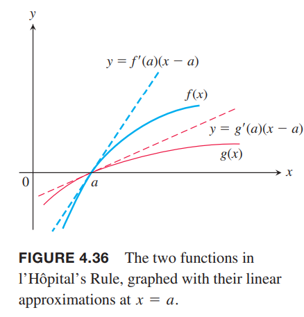
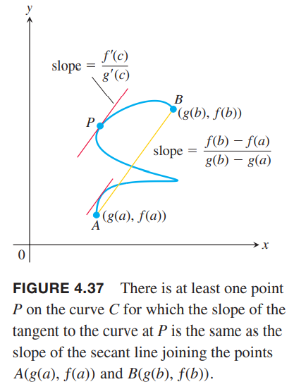

### 0/0型不定式
如果我们知道
$$f(x)=\frac{3x-\sin x}{x}$$
在$x=0$附近的行为（$x=0$处无定义），那么可以求$x\to 0$时$f(x)$的极限值。由于极限分母为零，我们不能用导数的除法法则。然而在这个例子中，分子分母都是零，而$0/0$是不确定的，其极限可能存在也可能不存在，洛必达法则（`l'Hôpital's Rule`）会告诉我们答案。  
如果连续函数$f(x),g(x)$在$x=a$处都是零，那么不能通过替换法求
$$\lim_{x\to a}\frac{f(x)}{g(x)}$$
替换出来的表示是$0/0$是没有意义的。我们用$0/0$来表示这一类极限形式，称为不定式（`indeterminate form`）。其他类似的无意义表达式如$\infty/\infty,\infty\cdot 0,\infty-\infty,0^0,1^\infty$，都不能用统一的方式求解。

**定理6 洛必达法则**  
假设$f(a)=g(a)=0$，$f,g$在包含$a$的开区间$I$上可导，且$x\neq a$时$g(x)\neq 0$。那么
$$\lim_{x\to a}\frac{f(x)}{g(x)}=\lim_{x\to a}\frac{f'(x)}{g'(x)}$$
假设右边的极限存在。  
本节最后会给出证明。

例1 求下面$0/0$型的极限值。有的例子中需要反复使用洛必达法则。  
（a）
$$\lim_{x\to 0}\frac{3x-\sin x}{x}=\lim_{x\to 0}\frac{3-\cos x}{1}=2$$
（b）
$$\lim_{x\to 0}\frac{\sqrt{1+x}-1}{x}=\lim_{x\to 0}\frac{\frac{1}{2\sqrt{1+x}}}{1}=\frac{1}{2}$$
（c）
$$\begin{aligned}
\lim_{x\to 0}\frac{\sqrt{1+x}-1-x/2}{x^2}&=\lim_{x\to 0}\frac{(1/2)(1+x)^{-1/2}-1/2}{2x}\\
&=\lim_{x\to 0}\frac{-(1/4)(1+x)^{-3/2}}{2}\\
&=-\frac{1}{8}
\end{aligned}$$
（d）
$$\begin{aligned}
\lim_{x\to 0}\frac{x-\sin x}{x^3}&=\lim_{x\to 0}\frac{1-\cos x}{3x^2}\\
&=\lim_{x\to 0}\frac{\sin x}{6x}\\
&=\lim_{x\to 0}\frac{\cos x}{6}\\
&=\frac{1}{6}
\end{aligned}$$

**使用洛必达法则**  
反复使用洛必达法则，直至分子和分母有一个是有限非零极限。

例2 使用洛必达法则要小心
$$\lim_{x\to 0}\frac{1-\cos x}{x+x^2}=\lim_{x\to 0}\frac{\sin x}{1+2x}$$
右边不是$0/0$不定式。如果进一步使用洛必达法则会得到
$$\lim_{x\to 0}\frac{\cos x}{2}=\frac{1}{2}$$
答案是不正确的。洛必达法则只适用于不定式，而$\lim_{x\to 0}(\sin x)/(1+2x)$不是不定式，通过代入法得到极限是$0/1=0$。

洛必达法则对单边极限也适用。

例3 这个例子中单边极限是不同的。  
（a）
$$\lim_{x\to 0^+}\frac{\sin x}{x^2}=\lim_{x\to 0^+}\frac{\cos x}{2x}=\infty$$
（b）
$$\lim_{x\to 0^-}\frac{\sin x}{x^2}=\lim_{x\to 0^-}\frac{\cos x}{2x}=-\infty$$

### $\infty/\infty,\infty\cdot 0,\infty-\infty$型不定式
首先考虑$\infty/\infty$的形式。  
需要更多微积分的知识才能证明这种形式。不过洛必达法则是类似的。  
如果$x\to a$时$f(x)\to\pm\infty,g(x)\to\pm\infty$，那么
$$\lim_{x\to a}\frac{f(x)}{g(x)}=\lim_{x\to a}\frac{f'(x)}{g'(x)}$$
成立的前提是后者存在。记号$x\to a$中的$a$可以是有限值也可以是$\infty$，甚至可以是单边极限$x\to a^+,x\to a^-$。

例4 求$\infty/\infty$型的极限值。  
（a）
$$\lim_{x\to \pi/2}\frac{\sec x}{1+\tan x}$$
分子分母在$x=\pi/2$处均不连续，所以需要考察单边极限。我们可以应用洛必达法则在一个以$x=\pi/2$为端点的开区间上。
$$\lim_{x\to(\pi/2)^-}\frac{\sec x}{1+\tan x}=\lim_{x\to(\pi/2)^-}\frac{\sec x\tan x}{\sec^2 x}=\lim_{x\to(\pi/2)^-}\sin x=1$$
右极限类似，是$-\infty/-\infty$，因此双边极限都是1。  
（b）
$$\lim_{x\to\infty}\frac{\ln x}{2\sqrt{x}}=\lim_{x\to\infty}\frac{1/x}{1/\sqrt{x}}=\lim_{x\to\infty}\frac{1}{\sqrt{x}}=0$$
（c）
$$\lim_{x\to\infty}\frac{e^x}{x^2}=\lim_{x\to\infty}\frac{e^x}{2x}=\lim_{x\to\infty}\frac{e^x}{2}=\infty$$

现在考虑不定式$\infty\cdot 0$和$\infty-\infty$，很多时候可以把它们转化成$0/0,\infty/\infty$型。这里并不是说$\infty\cdot 0, \infty-\infty$是一个数。它们只是考虑函数极限时的一种行为。

例5 求$\infty\cdot 0$型的极限。  
（a）
$$\lim_{x\to\infty}(x\frac{1}{\sin x})=\lim_{h\to 0^+}(\frac{1}{h}\sin h)=1$$
（b）
$$\begin{aligned}
\lim_{x\to 0^+}\sqrt{x}\ln x&=\lim_{x\to 0^+}\frac{\ln x}{1/\sqrt{x}}\\
&=\lim_{x\to 0^+}\frac{1/x}{-1/2 x^{3/2}}\\
&=\lim_{x\to 0^+}(-2x^{1/2})\\
&=0
\end{aligned}$$

例6 求$\infty-\infty$型的极限。
$$\lim_{x\to 0}(\frac{1}{\sin x}-\frac{1}{x})$$
解：如果$x\to 0^+$，那么$\sin x\to 0^+$，并且
$$\frac{1}{\sin x}-\frac{1}{x}\to \infty-\infty$$
类似的，$x\to 0^-$，那么$\sin x\to 0^-$，并且
$$\frac{1}{\sin x}-\frac{1}{x}\to (-\infty)-(\infty)=-\infty+\infty$$
我们仍旧无法知道极限。  
应用洛必达法则
$$\begin{aligned}
\lim_{x\to 0}(\frac{1}{\sin x}-\frac{1}{x})&=\lim_{x\to 0}\frac{x-\sin x}{x\sin x}\\
&=\lim_{x\to 0}\frac{1-\cos x}{\sin x+x\cos x}\\
&=\lim_{x\to 0}\frac{\sin x}{2\cos x-x\sin x}\\
&=\frac{0}{2}=0
\end{aligned}$$

### 指数不定式
处理指数形式的不定式$1^\infty,0^0,\infty^0$，可以先求对数。使用洛必达法则先求处对数表达式的极限，然后通过极限的指数找到原函数的极限。这个过程依赖于指数函数的连续性和2.6节的定理10。下面是公式化这个过程（对单边极限也成立）。

如果
$$\lim_{x\to a}\ln f(x)=L$$
那么
$$\lim_{x\to a}f(x)=\lim_{x\to a}e^{\ln f(x)}=e^L$$
这里的$a$可以有限也可以是$\infty$。

例7 应用洛必达法则证明
$$\lim_{x\to 0^+}(1+x)^{1/x}=e$$
证明：这个极限是$1^\infty$不定型。令$f(x)=(1+x)^{1/x}$，求$\lim_{x\to 0^+}\ln f(x)$的极限。
因为
$$\ln f(x)=\ln (1+x)^{1/x}=\frac{1}{x}\ln (1+x)$$
那么
$$\begin{aligned}
\lim_{x\to 0^+}\ln f(x)&=\lim_{x\to 0^+}\frac{\ln(x+1)}{x}\\
&=\lim_{x\to 0^+}\frac{1/(1+x)}{1}\\
&=\frac{1}{1}\\
&=1
\end{aligned}$$
因此
$$\lim_{x\to 0^+}(1+x)^{1/x}=\lim_{x\to 0^+}f(x)=\lim_{x\to 0^+}e^{\ln f(x)}=e^1=e$$

例8 求
$$\lim_{x\to\infty}x^{1/x}$$
解：这个极限是$\infty^0$型。令$f(x)=x^{1/x}$，那么求$\lim_{x\to\infty}\ln f(x)$。因为
$$\ln f(x)=\ln x^{1/x}=\frac{\ln x}{x}$$
应用洛必达法则
$$\begin{aligned}
\lim_{x\to\infty}\ln f(x)&=\lim_{x\to\infty}\frac{\ln x}{x}\\
&=\lim_{x\to\infty}\frac{1/x}{1}\\
&=\frac{0}{1}\\
&=0
\end{aligned}$$
因此
$$\lim_{x\to\infty}x^{1/x}=\lim_{x\to\infty}e^{\ln f(x)}=e^0=1$$

### 证明洛必达法则
在证明之前，我们先从几何视角分析合理性。考虑两个连续可导函数$f(x),g(x)$，满足$f(a)=g(a)=0,g'(a)=0$。$f(x),g(x)$的图像如下所示，它们的线性近似分别是$y=f'(a)(x-a),y=g'(a)(x-a)$。  
  
在$x=a$附近，线性近似足够好。本质上
$$f(x)=f'(a)(x-a)+\epsilon_1(x-a),g(x)=g'(a)(x-a)+\epsilon_2(x-a)$$
随着$a\to 0$，那么$\epsilon_1\to 0,\epsilon_2\to 0$。那么
$$\begin{aligned}
\lim_{x\to a}\frac{f(x)}{g(x)}&=\lim_{x\to a}\frac{f'(a)(x-a)+\epsilon_1(x-a)}{g'(a)(x-a)+\epsilon_2(x-a)}\\
&=\lim_{x\to a}\frac{f'(a)+\epsilon_1}{g'(a+\epsilon_2)}\\
&=\lim_{x\to a}\frac{f'(a)}{g'(a)}
\end{aligned}$$
这里的证明要求$g'(a)\neq 0$。  
洛必达法则的证明基于柯西中值定理，后者是涉及两个函数的中值定理。

**定理7 柯西中值定理（`Cauchy's Mean Value Theorem`）**  
假设函数$f,g$在$[a,b]$上连续，在$(a,b)$上可导，且在$(a,b)$上都有$g'(x)\neq 0$。那么在$(a,b)$区间内存在一个数$c$，有
$$\frac{f'(c)}{g'(c)}=\frac{f(b)-f(a)}{g(b)-g(a)}$$
证明：应用4.2节的中值定理两次。首先我们要证明$g(b)\neq g(a)$。如果$g(b)=g(a)$，那么
$$g'(c)=\frac{g(b)-g(a)}{b-a}=0$$
但是前提是在$(a,b)$上都有$g'(x)\neq 0$。矛盾。  
第二次在下面的函数上应用中值定理。
$$F(x)=f(x)-f(a)-\frac{f(b)-f(a)}{g(b)-g(a)}[g(x)-g(a)]$$
由于$f,g$连续可导，那么上面的函数也是连续可导的。并且$F(b)=F(a)=0$，那么$a,b$之间存在一个$c$使得$F'(c)=0$。使用$f,g$表示为
$$F'(c)=f'(c)-\frac{f(b)-f(a)}{g(b)-g(a)}[g'(c)]=0$$
所以
$$\frac{f'(c)}{g'(c)}=\frac{f(b)-f(a)}{g(b)-g(a)}$$
柯西中值定理有一个几何解释。任意弯曲曲线$C$连接两点$A=(g(a),f(a)),B=(g(b),f(b))$。第十章会说明如何画出这样一条曲线$C$使得曲线上有一点$P$，它的切线和$AB$连线平行。切线的斜率是商$f'/g'$在$(a,b)$中一点$c$的取值，是公式的左边。$AB$斜率是
$$\frac{f(b)-f(a)}{g(b)-g(a)}$$
柯西中值定理告诉我们两个斜率相等。如下图所示。曲线$C$上满足条件的点$P$可能不止一个。  

证明洛必达法则  
我们先证明$x\to a^+$的情况。$x\to a^-$的证明基本类似。那么我们就得到了完整的结果。  
假设$x$在$a$右边。由于$g'(x)\neq 0$，在闭区间$[a,x]$上应用柯西中值定理得到在$a,x$中存在$c$满足
$$\frac{f'(c)}{g'(c)}=\frac{f(x)-f(a)}{g(x)-g(a)}$$
由于$f(a)=g(a)=0$，所以
$$\frac{f'(c)}{g'(c)}=\frac{f(x)}{g(x)}$$
随着$x$趋近于$a$，那么$c$也趋于$a$，所以
$$\lim_{x\to a^+}\frac{f(x)}{g(x)}=\lim_{c\to a^+}\frac{f'(c)}{g'(c)}=\lim_{x\to a^+}\frac{f'(x)}{g'(x)}$$
另外一边只需要在$[x,a],x<a$上运用柯西中值定理即可。
