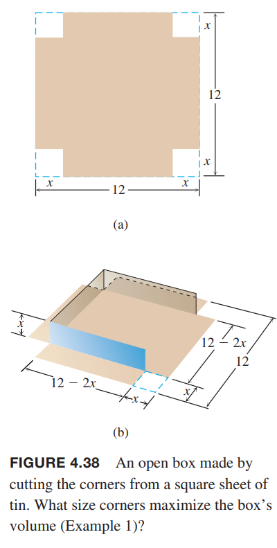
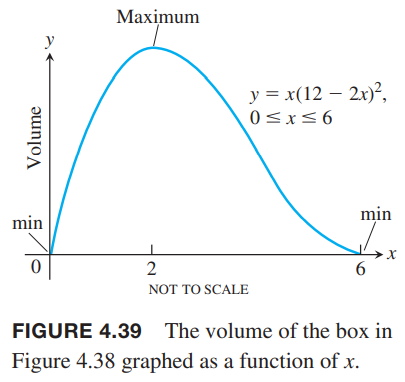
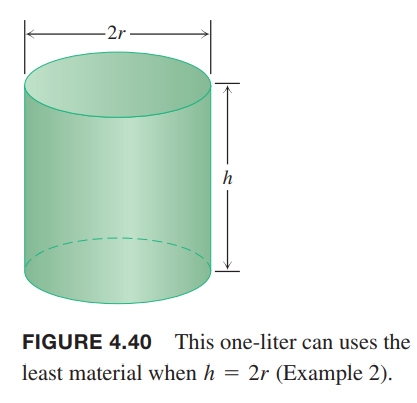
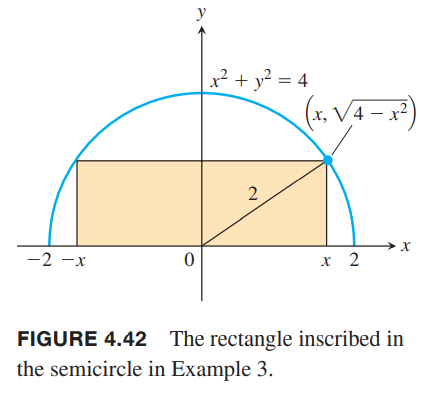
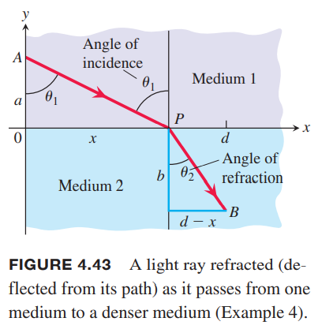
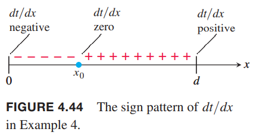
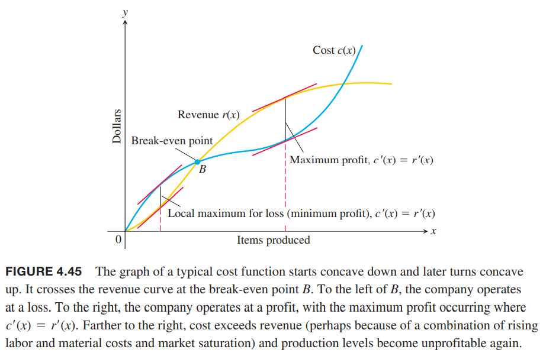
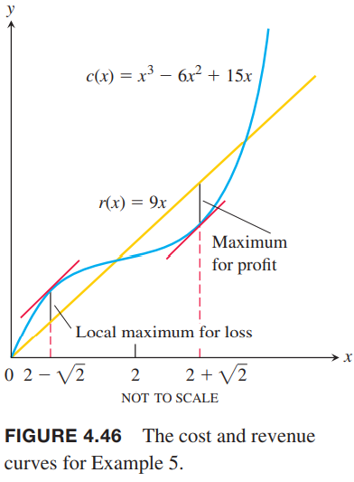
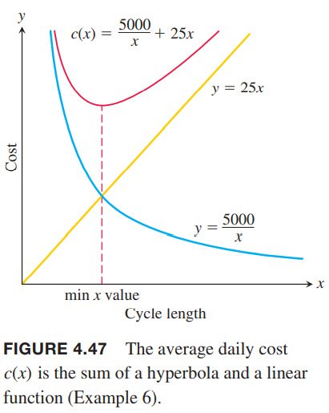

**解决应用优化问题**
1. 读懂问题。题目给了哪些条件？哪个未知变量需要优化？
2. 画图，标出重要的部分。
3. 引入变量。列出它们之间的关系。
4. 为未知量写方程。
5. 在定义域内测试临界点和边界点。

例1 12厘米见方的正方形减去四个角，组成一个开头的盒子。这个盒子体积最大是多少？  
解：如下图所示，减去的正方形边长是$x$。  
  
那么体积是
$$V(x)=x(12-2x)^2=144x-48x^2+4x^3$$
由于边长只有 12cm，那么$V$的定义域是$0\leq x\leq 6$。函数求导寻找临界点
$$\frac{dV}{dt}=114-96x+12x^2=12(12-8x+x^2)=12(2-x)(6-x)$$
$x=2$在内部是唯一临界点。$x=0,6$是端点。计算它们对应的体积。
$$V(2)=128,V(0)=V(6)=0$$
所以最大体积是 128$cm^3$，减去的正方形边长是 2cm。  

例2 设计一个一升的圆柱体。如下图所示。维度多少的时候用料最少？  
  
解：$r,h$用厘米作单位，那么体积是
$$\pi r^2h=1000$$
表面积是
$$A=2\pi r^2+2\pi rh$$
何为用料最少？我们忽略材料的厚度和裁剪时的损耗。最少就是表面积最小。  
为了用一个变量表示表面积，需要用体积公式计算出$r$或者$h$代入表面积公式。这里计算$h$比较简单
$$h=\frac{1000}{\pi r^2}$$
那么
$$\begin{aligned}
A&=2\pi r^2+2\pi rh\\
&=2\pi r^2+2\pi r(\frac{1000}{\pi r^2})\\
&=2\pi r^2+\frac{2000}{r}
\end{aligned}$$
我们的目标是寻找$r>0$使得$A$最小。下图说明这样的值是存在的。  
  
$r$非常小，是瘦高型的圆柱体，那么$2000/r$就会主导表面积，$A$会很大。如果$r$很大，非常扁的圆柱体，那么$2\pi r^2$会占主导地位，那么$A$也会非常大。  
$A$对$r$是可导的，同时区间没有端点，那么如果存在最小值，是导数为零的点。
$$\begin{aligned}
\frac{dA}{dr}&=4\pi r-\frac{2000}{r^2}\\
0&=4\pi r-\frac{2000}{r^2}\\
4\pi r^3&=2000\\
r&=\sqrt[3]{\frac{500}{\pi}}\approx 5.42
\end{aligned}$$
在$r=\sqrt[3]{\frac{500}{\pi}}$处函数行为如何呢？  
现在求二阶导
$$\frac{d^2A}{dt^2}=4\pi+\frac{4000}{r^3}>0$$
二阶导始终大于零，那么函数图像是上凹的，那么在$r=\sqrt[3]{\frac{500}{\pi}}$处有最小值。  
相应的高度
$$h=\frac{1000}{\pi r^2}=2\sqrt[3]{\frac{500}{\pi}}=2r$$
一升体积的圆柱体表面积最小时高度等于半径的两倍（高度等于直径），此时$r\approx 5.42 cm,h\approx 10.84 cm$。

### 来自数学和物理的例子
例3 一个矩形内接于半径为2的半圆。求长宽为多少时矩形面积最大？  
解：如下图所示。令$(x, \sqrt{4-x^2})$是矩形的一个顶点。  
  
那么矩形的长宽和面积分别为
$$2x,\sqrt{4-x^2},2x\sqrt{4-x^2}$$
$x$取值范围是$[0,2]$。
我们的目标是最大化面积函数
$$A=2x\sqrt{4-x^2}$$
求导
$$\frac{dA}{dx}=\frac{-2x^2}{\sqrt{4-x^2}}+2\sqrt{4-x^2}$$
在$x=2$处无定义。令导数为零，那么
$$\begin{aligned}
\frac{-2x^2}{\sqrt{4-x^2}}+2\sqrt{4-x^2}&=0\\
-2x^2+2(4-x^2)&=0\\
8-4x^2&=0\\
x^2&=2\\
x&=\pm \sqrt{2}
\end{aligned}$$
其中$x=\sqrt{2}$在$A$的定义域范围。下面计算临界点和端点对应的面积
$$A(\sqrt{2})=2\sqrt{2}\sqrt{4-2}=4,A(0)=0,A(2)=0$$
所以半圆的最大内接矩形面积是4，高度是$\sqrt{2}$，长度是$2\sqrt{2}$。

例4 光速依赖于介质，一般情况下稠密的介质速度慢。费马原理（`Fermat's principle`）是说光沿时间最少的路径传播。描述一条路径，从光速$c_1$的介质中$A$点到光速为$c_2$的介质中的$B$点。  
解：我们需要寻找传播时间最短的路径。假设$x$轴是两种介质的分割线，$A,B$分别在$x$轴两侧，坐标分别是$(0,a),(d,-b)$。如下图所示。  
  
在均匀介质中，光速是恒定的，那么最短路径就是直线。因此$A$到$B$的路径会经过$x$轴的$P$点，而$AP,PB$都是直线。从上图可以看出，光经过$AP$所需的时间是
$$t_1=\frac{AP}{c_1}=\frac{\sqrt{a^2+x^2}}{c_1}$$
从$P$到$B$的时间是
$$t_2=\frac{PB}{c_2}=\frac{\sqrt{b^2+(d-2)^2}}{c_2}$$
那么$A$到$B$的时间是
$$t=t_1+t_2=\frac{\sqrt{a^2+x^2}}{c_1}+\frac{\sqrt{b^2+(d-2)^2}}{c_2}$$
$x$函数在整个作用域$[0,d]$上可导。求导
$$\frac{dt}{dx}=\frac{x}{c_1\sqrt{a^2+x^2}}-\frac{d-x}{c_2\sqrt{b^2+(d-x)^2}}$$
导函数也是连续的。根据上图可以把上式用$\theta_1,\theta_2$表示
$$\frac{dt}{dx}=\frac{\sin\theta_1}{c_1}-\frac{\sin\theta_2}{c_2}$$
在$x=0$时，$t$的导数是负数，当$x=d$时，导数是正数。由于$dt/dx$在$[0,d]$连续，那么根据2.6节的中值定理，存在$x_0\in [0,d]$使得$dt/dx=0$。如下图所示。由于$dt/dx$是递增函数，那么只存在一个这样的点。  
  
在这个点上
$$\frac{\sin\theta_1}{c_1}=\frac{\sin\theta_2}{c_2}$$
这就是光学中的斯涅尔定律（`Snell's Law`）或折射定律（`Law of Refraction`）。

### 来自经济学的例子
使用$r(x),c(x),p(x)$表示卖$x$个产品的收入、生产$x$个产品的成本和相应的利润。尽管在实际应用中$x$是整数，为了讨论其行为，我们可以看作是大于零的实数，并且假设这些函数是可导的。经济学中用边际收益（`marginal revenue`）、边际成本（`marginal cost`）、边际利润（`marginal profit`）来作为收入、成本、利润的导数$r'(x),c'(x),p'(x)$的名字。  
如果$r(x),c(x)$在$x$属于某个区间上可导，并且$p(x)=r(x)-c(x)$有最大值，那么最大值在临界点或者区间的端点。如果出现在临界点，那么$p'(x)=r'(x)-c'(x)=0$，即$r'(x)=c'(x)$。使用经济学术语表示就是边际收益等于边际成本的时候利润最大。如下图所示。  

例5 假设$r(x)=9x,c(x)=x^3-6x^2+15x$，其中$x$表示$MP3$生产的百万数。存在最大利润产量吗？如果存在，是多少？  
解：求导
$$r'(x)=9$$
$$c'(x)=3x^2-12x+15$$
令两者相等
$$3x^2-12x+6=0$$
$$x^2-4x+2=0$$
那么
$$x=2\pm\sqrt{2}$$
对$p(x)=r(x)-c(x)$求二阶导得到$p''(x)=-c''(x)=6x-12=2(2-x)$，那么$x=2+\sqrt{2}$时二阶导为负数，那么有局部最大值，$x=2-\sqrt{2}$是二阶导为整数，那么有局部最小值（收益最大的反面，损失最大）。如下图所示：  

例6 一个家具木工一天可以生产5个桌子。每次采购原料的快递成本是5000，存储一个桌子需要的材料每天需要10元。每多少天采购一次原料，使得整个周期内的成本最低？  
解：设$x$天采购一次，那么送货成本是5000，需要$5x$个桌子的原料，平均每天需要存储$5x/2$的原料。所以总成本是
$$5000+\frac{5x}{2}\cdot x\cdot 10$$
平均成本是
$$c(x)=\frac{5000}{x}+25x$$
函数图像如下图所示  
  
当$x\to 0$和$x\to\infty$时，平均成本都会非常大。所以期望存在成本最低点。求导数为零的点
$$c'(x)=-\frac{5000}{x^2}+25=0$$
$$x=\pm\sqrt{200}$$
$c(x)$的定义域是全体正数。那么临界点的成本是
$$c(\sqrt{200})=\frac{5000}{\sqrt{200}}+25\sqrt{200}=500\sqrt{2}$$
在定义域$(0,\infty)$上，$c''(x)=\frac{10000}{x^3}>0$，那么$x=\sqrt{200}$就是全局最小值。所以家具木工每$10\sqrt{2}\approx 14$天进一次原材料。
