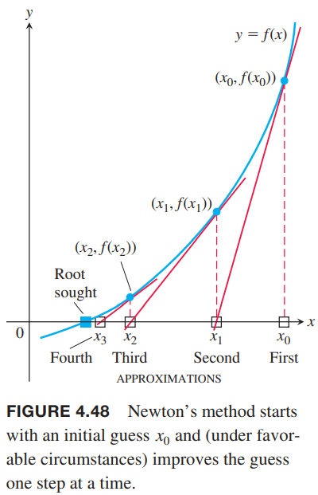
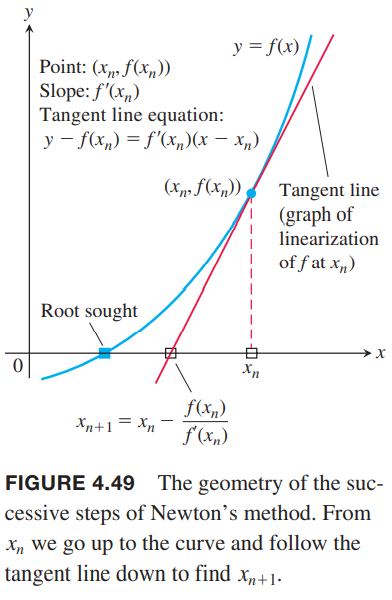
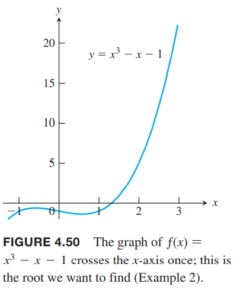
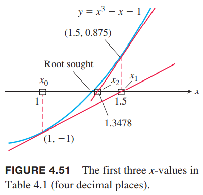
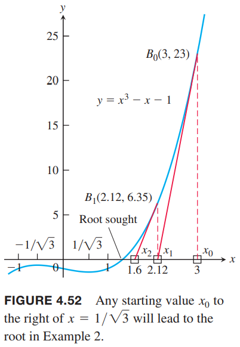
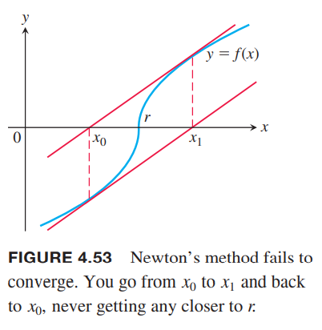
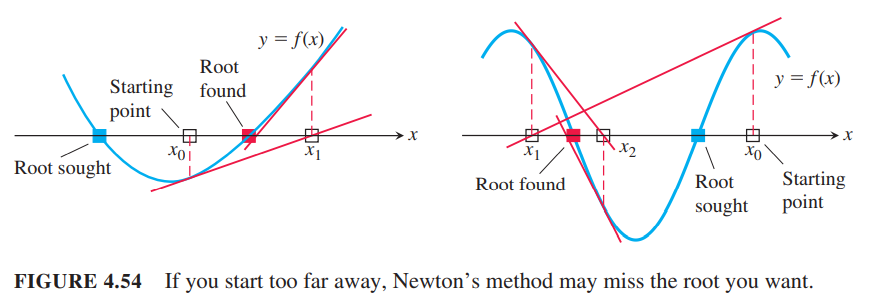

### 牛顿法的过程
牛顿法（`Newton's Method`）是通过迭代一系列接近解的值来得到方程$f(x)=0$的近似解。首先取一个$x_0$，如下图所示，该方法一步一步的向正确答案迭代。每一步是用方程的线性近似为零的解来估计$f$为零的解。  
  
通过图像或者猜一个$x_0$。牛顿法使用点$(x_0,f(x_0))$的切线来近似曲线$y=f(x)$。如上图，令切线与$x$轴交点为$x_1$。通常$x_1$是比$x_0$更好的近似。接着$x_2$是点$(x_1,f(x_1))$的切线与$x$轴的交点。以此类推，直到非常近似根的时候停止。  
下面我们来推导整个过程的公式。给定近似$x_n$，那么对应点的切线方程是
$$y=f(x_n)+f'(x_n)(x-x_n)$$
求交点
$$\begin{aligned}
0&=f(x_n)+f'(x_n)(x-x_n)\\
-\frac{f(x_n)}{f'(x_n)}&=x-x_n\\
x&=x_n-\frac{f(x_n)}{f'(x_n)}, &&f'(x_n)\neq 0
\end{aligned}$$
这里的$x$就是下一个近似值$x_{n+1}$。  
  

所以牛顿法分成两步。
1. 猜测方程$f(x)=0$的近似解。图像$y=f(x)$是有用的。
2. 使用下面的公式使用第一个近似值迭代出第二个、第三个等，直到得到答案。
$$x_{n+1}=x_n-\frac{f(x_n)}{f'(x_n)}, f'(x_n)\neq 0$$

### 使用牛顿法
我们往往使用计算机或者计算器来应用牛顿法。  
下面通过计算$f(x)=x^2-2=0$来得到$\sqrt{2}$的近似值。

例1 求下面方程的正数近似解
$$f(x)=x^2-2=0$$
解：由$f(x)=x^2-2$得到一阶导$f'(x)=2x$，那么迭代公式是
$$\begin{aligned}
x_{n+1}&=x_n-\frac{x_n^2-2}{2x_n}\\
&=x_n-\frac{x_n}{2}+\frac{1}{x_n}\\
&=\frac{x_n}{2}+\frac{1}{x_n}
\end{aligned}$$
通过从$x_0=1$开始迭代，可以得到下表。

|  | 误差 | 准确的数字个数 |
|--|--|--|
| $x_0 = 1$ | -0.41421 | 1 |
| $x_1 = 1.5$ | 0.08579 | 1 |
| $x_2 = 1.41667$ | 0.00246 | 3 |
| $x_3 = 1.41422$ | 0.00001 | 5 |

非常多的软件使用牛顿法来求根，因为它收敛的很快。如果我们将上表的第一列用13位小数而不是5位小数表示，那么只需要再迭代一步，和$\sqrt{2}$能有十个数字相同。

例2 求曲线$y=x^3-x$与$y=1$交点的横坐标。  
解：即求$y=x^3-x-1=0$的根。由于$f(1)=-1,f(2)=5$，根据中值定理，在$(1,2)$内有解。如下图所示。  
  
从$x_0=1$迭代，得到下面的表格。

| $n$ | $x_n$ | $f(x_n)$ | $f'(x_n)$ | $x_{n+1}$ |
|--|--|--|--|--|
| 0 | 1 | -1 | 2 | 1.5 |
| 1 | 1.5 | 0.875 | 5.75 | 1.3478 26087 |
| 2 | 1.3478 26087 | 0.1006 82173 | 4.4499 05482 | 1.3252 00399 |
| 3 | 1.3252 00399 | 0.0020 58362 | 4.2684 68292 | 1.3247 18174 |
| 4 | 1.3247 18174 | 0.0000 00924 | 4.2646 34722 | 1.3247 17957 |
| 5 | 1.3247 17957 | -1.8672E-13 | 4.2646 32999 | 1.3247 17957 |

下图展示了前几个值。  
  

继续迭代可以得到$x_6=x_5=1.3247 17957$。如果$x_n=x_{n+1}$，对于当前计算精确而言就是解了，满足$f(x)=0$。

下面的图展示了从点$B(3,23)$开始迭代。这个点距离$x$轴很远，但是切点和$x$轴的交点是$(2.12,0)$，仍旧比$x_0$要好一些，使用牛顿迭代法，只多了一步就得到了相同的结果$x_7=x_6=1.3247 17957$。  

### 近似值的收敛
第九章我们会给出$x_n$收敛的精确定义。直观上，$x_n$可以任意接近根$r$。  
实践中，牛顿法收敛的速度非常快，不过也不一定。为了测定收敛，从$x_0$开始迭代，我们可以通过计算$|f(x_n)|$是否趋于零，或者是计算$|x_n-x_{n+1}|$。  
牛顿法不总是收敛。比如
$$f(x)=\begin{cases}
-\sqrt{r-x}, &&x<r\\
\sqrt{x-r}, &&x\geq r
\end{cases}$$
如下图所示。我们从$x_0=r-h$开始，得到$x_1=r+h$，接着一系列值是在这两个值之间来回跳。不管迭代多少次都无法接近根。  
  
如果牛顿法收敛，会收敛到根。有的场景会收敛，但是没有根。这总场景非常少。  
有的时候牛顿法会收敛到根，但是可能不是我们想求解的那一个。如下所示两种情况。  

