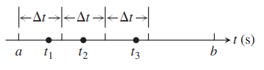
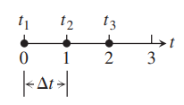
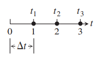
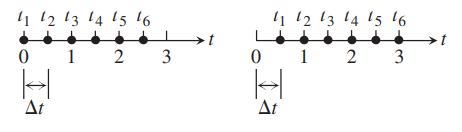
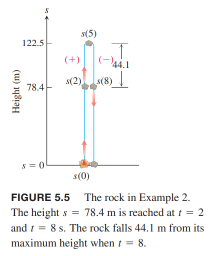
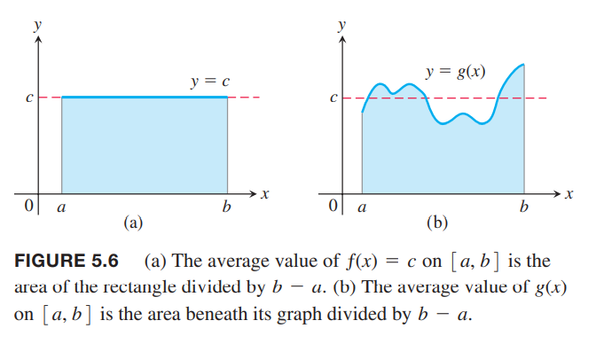
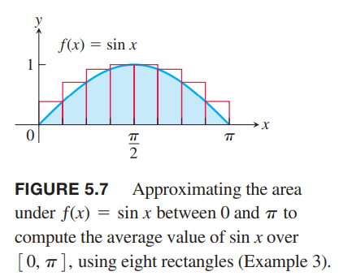

通过构造有限和的近似是得到定积分公式的基础。

### 面积
如下图所示。我们想求解 $x$ 轴以上，曲线 $y=1-x^2$ 以下，介于 $x=0,x=1$ 之间的面积。  
  
很遗憾的是没有简单的几何公式求解阴影面积，改如何计算呢？  
我们可以类似于下图所示的方式近似求解 $R$ 的面积。将 $R$ 分成两个矩形，宽度是 1/2，高度分别是 1 和 3/4。高度是对应区间的最大值，原因是 $f$ 在该区间是递减的。两个矩形面积加起来是
$$A\approx 1\cdot\frac{1}{2}+\frac{3}{4}\cdot\frac{1}{2}=\frac{7}{8}=0.875$$
  
估算值比 $R$ 的真实面积要大。我们称为上和（`upper sum`）。  如上图 b 所示，如果切成四个矩形，那么得到
$$A\approx 1\cdot\frac{1}{4}+\frac{15}{16}\cdot\frac{1}{4}+\frac{3}{4}\cdot\frac{1}{4}+\frac{7}{16}\cdot\frac{1}{4}=\frac{25}{32}=0.78125$$
仍旧比真实面积大一些。  
如果我们像下图一样，矩形位于 $R$ 以内，那么得到的面积比真实的要小。由于 $f=1-x^2$ 在 $[0,1]$ 上递减，那么每个区间取右端点即可。这样得到的值称为下和（`lower sum`）。
$$A\approx \frac{15}{16}\cdot\frac{1}{4}++\frac{3}{4}\cdot\frac{1}{4}+\frac{7}{16}\cdot\frac{1}{4}+0\cdot\frac{1}{4}=\frac{17}{32}=0.53125$$
  
那么 $R$ 的真实面积 $A$ 介于两者之间
$$0.53125<A<0.78125$$
估算的上下界可以界定这些估算的误差最大值。由于真实值介于两者之间，那么误差不会查过两者之差 $0.78125-0.53125=0.25$。  
如上如的 b，我们还可以根据每个子区间的中点计算得到 $f$ 作为矩形的高以估算面积。这称为中点法则（）。中点法则给出的估算结果介于上和和下和之间，但是我们无法得到估算值比真实值大还是小。根据中点法则得到估算的面积
$$A\approx \frac{63}{64}\cdot\frac{1}{4}+\frac{39}{64}\cdot\frac{1}{4}+\frac{15}{64}\cdot\frac{1}{4}+\frac{15}{64}\cdot\frac{1}{4}=\frac{172}{64}\cdot\frac{1}{4}=0.671875$$
上述求和中，函数 $f$ 在区间 $[a,b]$ 上分成了 $n$ 个子区间，每个子区间宽度是 $\Delta x=(b-a)/n$。在每个子区间根据 $c_1,c_2,\cdots$ 得到 $f(c_k)$。上和中我们选择的 $c_k$使得 $f(c_k)$ 在对应区间是最大值，下和的话使得 $f(c_k)$ 是最小值。中点法则是选择第 $k$ 个子区间的中点 $c_k$。那么求和公式是
$$f(c_1)\Delta x+f(c_2)\Delta x+\cdots+f(c_n)\Delta x$$
随着分割成更多的矩形，每个矩形越来越瘦，这些矩形的有限和也越来越接近真实值。  
下面 a 图展示了用 16 个矩形来近似 $R$ 的面积，和是 0.634765625，这个值还是比真实值要小。  
b 图展示了上和的情况，和是 0.697265625，比真实值稍大。中点法则得到 0.6669921875，但不清楚是过大还是过小。  
  
下面的表格展示了分割多达 1000 个矩阵时的上和和下和以及中间法则的估算结果。估算结果都趋于 2/3。下一小节会分析当矩阵宽度趋于零个数趋于无限多时得到的 $R$ 面积，我们会发现其面积就是 2/3。

| 子区间个数 | 下和 | 中点法则 | 上和 |
|--|--|--|--|
| 2 | 0.375 | 0.6875 | 0.875 |
| 4 | 0.53125 | 0.671875 | 0.78125 |
| 16 | 0.634765625 | 0.6669921875 | 0.697265625 |
| 50 | 0.6566 | 0.6667 | 0.6766 |
| 100 | 0.66165 | 0.666675 | 0.67165 |
| 1000 | 0.6661665 | 0.66666675 | 0.6671665 |

### 移动距离
假设我们知道一个物体沿着一个方向运动的速度 $v(t)$，需要求在 $t=a,t=b$ 之间物体移动的距离是多少。位置函数 $s(t)$ 的导数是速度函数 $v(t)$。如果我们找到 $v(t)$ 的反导数 $F(t)$，那么 $s(t)=F(t)+C$，那么移动的距离就是 $s(b)-s(a)=F(b)-F(a)$。不过，有的时候只有一系列数值而没有公式来表示 $v(t)$，如何求移动的距离呢？  
可以用上面估算面积的方法来估算移动的距离。我们把区间 $[a,b]$ 分割成若干个很短的时间区间，假设在这个区间上速度不变。那么可以求出短时间的移动距离，然后把 $[a,b]$ 上的结果加和即可。  
假设切分的区间如下所示  
  
每个子区间长度都是 $\Delta t$。从第一个区间取时间 $t_1$，假设 $\Delta t$ 足够短速度不变，那么这段移动距离就是 $v(t_1)\Delta t$，第二个区间取时间 $t_2$，那么距离是 $v(t_2)\Delta t$。所有区间加和就是
$$D\approx v(t_1)\Delta t+v(t_2)\Delta t+\cdots+v(t_n)\Delta t$$
求和结果是真实值 $D$ 的近似，不过随着取越来越多的区间，会越来越精确。

例1 抛射物发射出去之后速度函数是 $v(t)=160-9.8t$。使用求和法计算前三秒运动的距离。和精确值 435.9m 相比，精度如何？  
解：$f(t)$ 是递减函数，所以每个区间取左端点得到上和，取右端点得到下和。  
分割成三个长度为 1 的区间，用左端点求 $f$ 得到上和。  
  
$t=0,1,2$三个左端点来计算 $f$ 得到近似值
$$\begin{aligned}
D&\approx f(t_1)\Delta t+f(t_2)\Delta t+f(t_3)\Delta t\\
&=[160-9.8(0)](1)+[160-9.8(1)](1)+[160-9.8(2)](1)\\
&=450.6
\end{aligned}$$
同样的划分，不过取右端点。  
  
此时 $t=1,2,3$，那么
$$\begin{aligned}
D&\approx f(t_1)\Delta t+f(t_2)\Delta t+f(t_3)\Delta t\\
&=[160-9.8(1)](1)+[160-9.8(2)](1)+[160-9.8(3)](1)\\
&=421.6
\end{aligned}$$
如下图所示，我们分割成六个长度为 1/2 的区间。  
  
取左端点得到的上和是 $D\approx 443.25$，取右端点得到的下和是 $D\approx 428.55$。六个区间比三个区间更接近精确值。  
如下表所示，上和从上方接近真实值 435.9，下和从下方接近。真实值介于两者之间。利用最后一行数值（最接近真实值）得到误差是 0.23，百分比是 $0.23/435.9\approx 0.05%$。我们可以说，前三秒抛射物运动距离是 436m。

| 区间个数 | 区间长度 | 上和 | 下和 |
|--|--|--|--|
| 3 | 1 | 450.6 | 421.2 |
| 6 | 1/2 | 443.25 | 428.55 |
| 12 | 1/4 | 439.58 | 432.23 |
| 24 | 1/8 | 437.74 | 434.06 |
| 48 | 1/16 | 436.82 | 434.98 |
| 96 | 1/32 | 436.36 | 435.44 |
| 192 | 1/64 | 436.13 | 435.67 |

### 位移与距离
当正函数 $s(t)$ 沿着一个方向运动，那么通过求和很小的区间得到 $t=a,t=b$ 之间运动的距离。如果会反向，那么需要用速度的绝对值 $|v(t)|$ 来计算运动的距离。如果使用 $b(t)$ 的话，得到的是位移 $s(b)-s(a)$，起点和终点的差。  
将区间 $[a,b]$ 分成充分小的等值区间 $\Delta t$ 使得速度在每个区间恒定。$v(t_k)$ 是这个区间的速度近似。那么位置的变化就是
$$v(t_k)\Delta t$$
$v(t_k)$ 的正负和位置的变化一致。  
不管正负号，移动的距离总是
$$|v(t_k)|\Delta t$$
那么总的移动距离就是
$$|v(t_1)|\Delta t+|v(t_2)|\Delta t+\cdots+|v(t_n)|\Delta t$$

例2 3.4 节例 4 中，我们分析了向上运动的物体。速度函数是 $v(t)=49-9.8t \text{ m/s}$。爆炸 2 秒后距离地面 78.4m，继续运动 5 秒的时候达到最高 122.5m，在经过 3 秒，下降 44.1m 到达距离地面 78.4m 的地方。如下图。8 秒总共移动的距离是 $122.5 + 44.1 = 166.6\text{ m}$。  
  
像例 1 一样，我们可以估算出前 8 秒运动的距离。从 $t=0$ 开始向上运动，达到顶峰之后向下运动，这时速度是负值。使用 $v(t_1)\Delta t+v(t_2)\Delta t+\cdots+v(t_n)\Delta t$ 得到是 $t=8$ 和 $t=0$ 时的位移，是 78.4m。如果使用速度的绝对值 $|v(t)|$，得到的是总的移动距离，是 166.6m。  
我们把区间 $[0,8]$ 分成 16 个子区间，那么 $\Delta t=1/2$，取右端点作为 $t_k$ 计算速度。如下表所示。

| $t$ | $v(t)$ |
|--|--|
| 0 | 49 |
| 0.5 | 44.1 |
| 1.0 | 39.2 |
| 1.5 | 34.3 |
| 2.0 | 29.4 |
| 2.5 | 24.5 |
| 3.0 | 19.6 |
| 3.5 | 14.7 |
| 4.0 | 9.8|
| 4.5 | 4.9|
| 5.0 | 0|
| 5.5 | -4.9|
| 6.0 | -9.8|
| 6.5 | -14.7|
| 7.0 | -19.6|
| 7.5 | -24.5|
| 8.0 | -29.4|

求和得到
$$(44.1 + 39.2 + 34.3 + 29.4 + 24.5 + 19.6 + 14.7 + 9.8 + 4.9 + 0 - 4.9 - 9.8 - 14.7 - 19.6 - 24.5 - 29.4)\cdot\frac{1}{2}=58.8$$
误差是
$$78.4-58.8=19.6$$
只用绝对值得到移动距离
$$(44.1 + 39.2 + 34.3 + 29.4 + 24.5 + 19.6 + 14.7 + 9.8 + 4.9 + 0 + 4.9 + 9.8 + 14.7 + 19.6 + 24.5 + 29.4)\frac{1}{2}=161.7$$
误差是
$$166.6-161.7=4.9$$
将区间分割的更多子区间，那么估算值就会趋于 78.4m 和 166.6m。如下表。

| 区间数 | 子区间长度 | 位移 | 距离 |
|--|--|--|--|
| 16| 1/2 | 58.8 | 161.7 |
| 32| 1/4 | 68.6 | 164.15 |
| 64| 1/8 | 73.5 | 165.375 |
| 128| 1/16 | 75.95 | 165.9875 |
| 256| 1/32 | 77.175 | 166.29375 |
| 512| 1/64 | 77.7875 | 166.446875 |

### 非负连续函数的均值
$n$ 个数的集合 $x_1,x_2,\cdots,x_n$ 的平均数是把所有数加起来除以 $n$。对于区间 $[a,b]$ 上的连续函数呢？这样的函数有无限多的值。  
如果是常量函数，这很容易。常值函数在区间 $[a,b]$ 上的值是 $c$，那么平均数就是 $c$。当 $c$ 是正数，图象是 $[a,b]$ 上高度为 $c$ 的矩形。函数平均值的几何解释是矩形面积除以宽度。如下图 (a) 所示。  
  
如果是如上图 (b) 所示的非常值函数呢？想象这个函数图像是一个罐子的液体被两个面 $x=a,x=b$ 限制住了，液体在其中晃动。随着液体的晃动，每个点的高度在变化，但是平均值不会变。为了得到平均高度，静置罐子得到高度即平均值。正如 (a)，高度是图的面积除以宽度。那么我们定义区间 $[a,b]$ 上的非负函数的平均值是曲线 $g$ 下和 $x$ 轴围起来的面积除以宽度 $b-a$。那么我们理解图的面积。5.3 会讨论，这里先看一个例子。

例3 估算函数 $f(x)=\sin x$ 在区间 $[0,\pi]$ 的平均值。  
解：如下图所示。为了求出平均值，我们需要计算曲线下图像的面积，然后除以宽度 $\pi$。  
  
目前我们没有简单的方式求和，不过可以用有限和来近似。为了得到上和，我们分成八个等宽子区间。选择每个区间的最大值，最大值可能在区间的最左侧也可能是最右侧，或者两者之间。那么得到估算值
$$\begin{aligned}
A&\approx (\sin\frac{\pi}{8}+\sin\frac{\pi}{4}+\sin\frac{3\pi}{8}+\sin\frac{\pi}{2}+\sin\frac{\pi}{2}+\sin\frac{5\pi}{8}+\sin\frac{3\pi}{4}+\sin\frac{8\pi}{8})\cdot\frac{\pi}{8}\\
&\approx((.38 + .71 + .92 + 1 + 1 + .92 + .71 + .38)\cdot\frac{\pi}{8}\\
&=(6.02)\cdot\frac{\pi}{8}\\
&\approx 2.364
\end{aligned}$$
这就杨就可以得到 $\sin x$ 在区间 $[0,\pi]$ 的平均值 $2.364/\pi\approx 0.753$。  
这里使用上和，所以预估的面积比真实面积大，那么平均值也会比平均值大。如果我们用更多的矩阵来估算，那么会更精确，如下表。5.3 节会给出方法计算精确值 $2/\pi\approx 0.63662$。

| 区间数 | 上和 |
|--|--|
| 8 | 0.75342 |
| 16 | 0.69707 |
| 32 | 0.65212 |
| 50 | 0.64657 |
| 100 | 0.64161 |
| 1000 | 0.63712 |

和之前一样，我们也可以使用下和或者中点法则也估算。5.3 节中指出，只要矩形充分多，这些估算都会趋于真实值。
