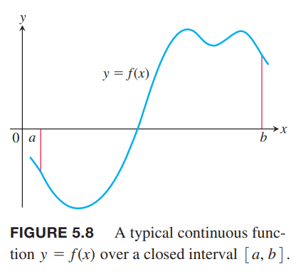
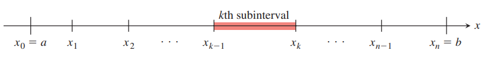
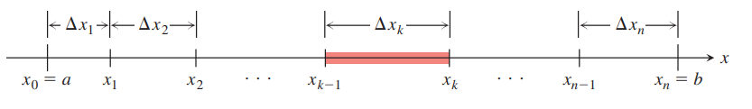
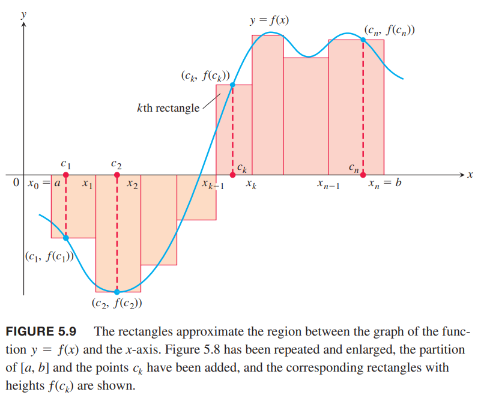
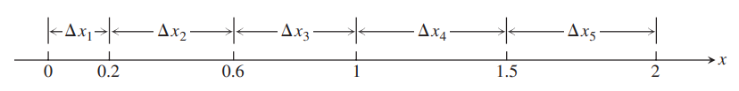

### 有限和和西格玛符号
西格玛符号可以使用紧凑的形式表示许多项的和
$$\sum_{k=1}^n a_k=a_1+a_2+a_3+\cdots+a_{n-1}+a_n$$

例1

| 西格玛符号 | 展开形式 | 和 |
|--|--|--|
| $\sum_{k=1}^5k$ | $1+2+3+4+5$ | $15$ |
| $\sum_{k=1}^3(-1)^kk$ | $(-1)^1(1)+(-1)^2(2)+(-1)^3(3)$ | $-1+2-3=-2$ |
| $\sum_{k=1}^2\frac{k}{k+1}$ | $\frac{1}{1+1}+\frac{2}{2+1}$ | $\frac{1}{2}+\frac{2}{3}=\frac{7}{6}$ |
| $\sum_{k=4}^5\frac{k^2}{k-1}$ | $\frac{4^2}{3}+\frac{5^2}{4}$ | $\frac{16}{3}+\frac{25}{4}=\frac{12}{139}$ |

例2 用西格玛符号表示和式 $1+3+5+7+9$。  
解：这取决于下限的选择，不过最后的结果应该是一样的。一般地，选择 $k=0,k=1$。不过可以从任何正数开始。比如
$$k=0: 1+3+5+7+9=\sum_{k=0}^4(2k+1)$$
$$k=1: 1+3+5+7+9=\sum_{k=1}^5(2k-1)$$
$$k=2: 1+3+5+7+9=\sum_{k=2}^6(2k-3)$$
$$k=-3: 1+3+5+7+9=\sum_{k=-3}^1(2k+7)$$
当求下面和式时
$$\sum_{k=1}^3(k+k^2)$$
可以重新排列这些项
$$\begin{aligned}
\sum_{k=1}^3(k+k^2)&=(1+1^2)+(2+2^2)+(3+3^2)\\
&=(1+2+3)+(1^2+2^2+3^2)\\
&=\sum_{k=1}^3k+\sum_{k=1}^3k^2
\end{aligned}$$
一般地
$$\sum_{k=1}^n(a_k+b_k)=\sum_{k=1}^na_k+\sum_{k=1}^nb_k$$
这个式子和下面额外三个法则一样，使用数学归纳法证明即可。

有限和法则：
$$\sum_{k=1}^n(a_k+b_k)=\sum_{k=1}^na_k+\sum_{k=1}^nb_k$$
$$\sum_{k=1}^n(a_k-b_k)=\sum_{k=1}^na_k-\sum_{k=1}^nb_k$$
$$\sum_{k=1}^nca_k=c\sum_{k=1}^na_k$$
$$\sum_{k=1}^nc=cn$$

例3 运用上述法则
$$\sum_{k=1}^n(3k-k^2)=3\sum_{k=1}^nk-\sum_{k=1}^nk^2$$
$$\sum_{k=1}^n(-a_k)=-\sum_{k=1}^na_k$$
$$\sum_{k=1}^3(k+4)=\sum_{k=1}^3k+\sum_{k=1}^34=1+2+3+4\cdot 4=18$$
$$\sum_{k=1}^n\frac{1}{n}=\frac{1}{n}\cdot n=1$$

人们发现了很多很重要和式的公式。其中最重要的是前 $n$ 个整数和，及其前 $n$ 个整数的平方和和立方和。

例4 证明前 $n$ 个整数和是
$$\sum_{k=1}^nk=\frac{n(n+1)}{2}$$
证明：将这些项正向写一遍，逆向写一遍
$$\begin{aligned}
1&+&2&+&3&+\cdots&+&n\\
n&+&(n-1)&+&(n-2)&+\cdots&+&1
\end{aligned}$$
每一列的两项相加是 $n+1$，总共有 $n$ 项，所以和是 $n(n+1)/2$。

前 $n$ 个整数的平方和和立方和分别是
$$\sum_{k=1}^nk^2=\frac{n(n+1)(2n+1)}{6}$$
$$\sum_{k=1}^nk^3=(\frac{n(n+1)}{2})^2$$
使用数学归纳法证明这两个公式。

高德纳的《具体数学》对求和有详细讨论，有很多有趣的方法：参考[这里](../../../ComputerScience/TAOCP/ConcreteMathematics/02-Sums/README.md)。

### 有限和的极限
5.1 节告诉我们有限和估算会随着子区间变多变窄而更精确。下面这个例子求子区间无限窄无限多的时候估算的极限。

例5 使用估算法求 $y=1-x^2$ 在区间 $[0,1]$ 上曲线和 $x$ 轴围成的面积的下和，求当宽度趋于零，子区间趋于无限多时的极限。  
解：切分成 $n$ 个子区间，每个子区间宽度是 $\Delta x=1/n$。我们要求 $n\to\infty$ 时的值。这 $n$ 个子区间分别是
$$[0,\frac{1}{n}],[\frac{1}{n},\frac{2}{n}],\cdots,[\frac{n-1}{n},\frac{n}{n}]$$
由于 $y=1-x^2$ 在 $[0,1]$ 是递减函数，所以每个区间的最小值是取右端点，那么区间 $[\frac{k-1}{n},\frac{k}{n}]$ 对应的高度是 $f(k/n)=1-(k/n)^2$，那么
$$\begin{aligned}
\sum_{k=1}^nf(k/n)\cdot \frac{1}{n}&=\sum_{k=1}^n(1-(\frac{k}{n})^2)\frac{1}{n}\\
&=\sum_{k=1}^n(\frac{1}{n}-\frac{k^2}{n^3})\\
&=\sum_{k=1}^n\frac{1}{n}-\sum_{k=1}^n\frac{k^2}{n^3}\\
&=n\cdot\frac{1}{n}-\frac{1}{n^3}\sum_{k=1}^nk^2\\
&=1-\frac{1}{n^3}\frac{n(n+1)(2n+1)}{6}\\
&=1-\frac{2n^3+3n^2+n}{6n^3}
\end{aligned}$$
这就是 $n$ 为任意值时的下和公式。当 $n\to\infty$ 时
$$\lim_{n\to\infty}(1-\frac{2n^3+3n^2+n}{6n^3})=1-\frac{2}{6}=\frac{2}{3}$$
下和估算收敛于 $2/3$，同样的方式可以得到上和也收敛于 $2/3$。任意有限和 $\sum_{k=1}^nf(c_k)(1/n)$ 的值介于上和与下和之间，所以都收敛于 $2/3$。据此，我们说区域 $R$ 的面积就是这个极限值。

### 黎曼和
德国科学家 `Bernhard Riemann` 给出了有限近似极限理论的精确定义。下面介绍黎曼和（`Riemann sum`），它对下节介绍的定积分有深远影响。  
我们从任意在 $[a,b]$ 上定义的有界函数 $f$ 开始。如下图所示。$f$ 可能是正的也可能是负的。  
  
我们把 $[a,b]$ 区间分割成子区间，不必是等宽的，利用 5.1 节的方法可以用有限和来求近似值。为此，我们在 $[a,b]$ 区间上选取 $n-1$ 个点 $x_1,x_2,\cdots,x_{n-1}$
$$a<x_1<x_2<\cdots<x_{n-1}<b$$
为了一致，令$a=x_0,b=x_n$，那么
$$a=x_0<x_1<x_2<\cdots<x_{n-1}<x_n=b$$
那么这些点的集合
$$P=\{x_0,x_1,x_2,\cdots,x_{n-1},x_n\}$$
称为区间 $[a,b]$ 上的分区（`partition`）。  
分区 $P$ 把区间 $[a,b]$ 分成下面 $n$ 个闭区间
$$[x_0,x_1],[x_1,x_2],\cdots,[x_{n-1},x_n]$$
第 $k$ 个子区间是 $[x_{k-1},x_k]$：  
  
第 $k$ 个子区间是宽度是 $\Delta x_k=x_k-x_{k-1}$：  
  
如果所有子区间等宽，那么记作 $\Delta x=(b-a)/n$。  
我们在每个子区间选择一个点。第 $k$ 个子区间选择的点是 $c_k$。那么对应的矩形高度就是 $f(c_k)$，可正可负，也可以是零。  
  
那么每个矩阵的面积是 $f(c_k)\cdot\Delta x$。乘积也可正可负可为零。最后，我们对这些乘积求和
$$S_P=\sum_{k=1}^nf(c_k)\Delta x_k$$
和 $S_P$ 是 $f$ 在区间 $[a,b]$ 上的黎曼和。依赖于 $P$ 和 $c_k$ 的不同选择，这样的和有很多个。比如我们等宽分割成 $n$ 个子区间，那么宽度是 $\Delta x=(b-a)/n$，$c_k$ 选择是每个区间的右端点，那么这样选择对应的黎曼和是
$$S_n=\sum_{k=1}^nf(a+k\frac{b-a}{n})\cdot\frac{b-a}{n}$$
类似地，我们可以选择左端点或者中点作为 $c_k$。  
选择等宽的情况，即 $\Delta x=(b-a)/n$，$n$ 增加，宽度变窄。如果是变宽情况，所有区间中肯定有最宽的区间，该区间的宽度是分区 $P$ 的模（`norm`），写作 $\parallel P\parallel$。如果 $\parallel P\parallel$ 很小，那么所有区间的宽度都很小。

例6 集合 $P=\{0,0.2,0.6,1,1.5,2\}$ 是 $[0,2]$ 上的分区。有五个子区间 $[0,0.2],[0.2,0.6],[0.6,1],[1,1.5],[1.5,2]$：  
  
每个区间的宽度分别是 $0.2,0.4,0.4,0.5,0.5$。最宽的区间宽度是 0.5，那么分区的模是 $\parallel P\parallel=0.5$。在这个例子中，有两个区间长度都是 0.5。
