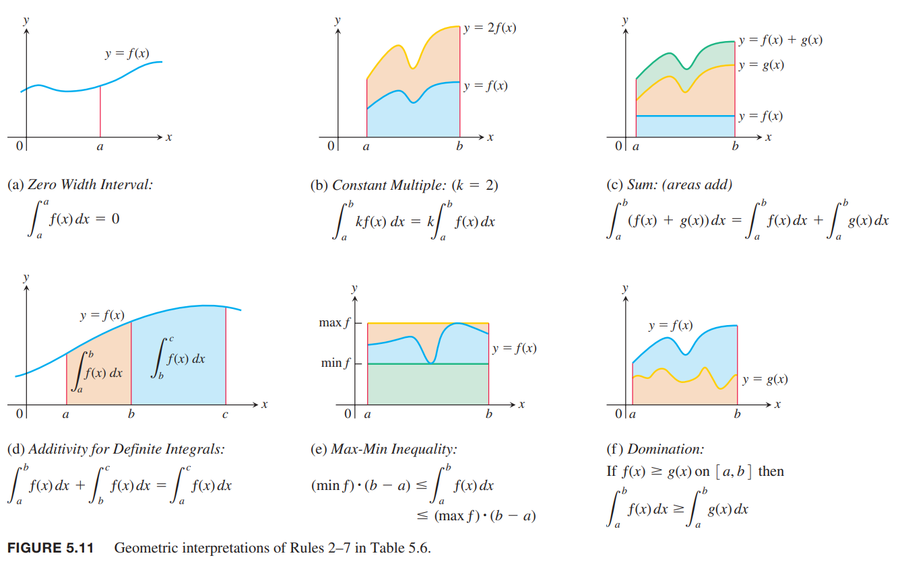
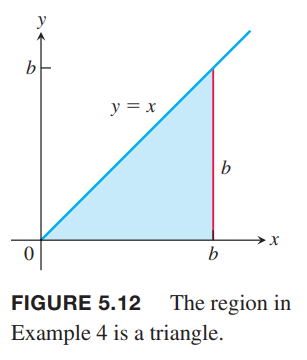
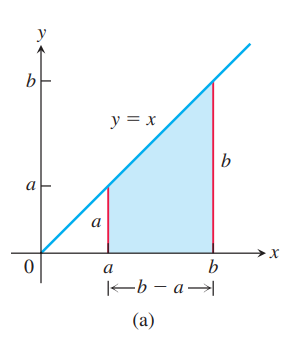
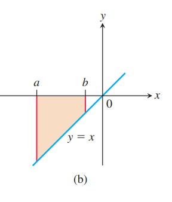
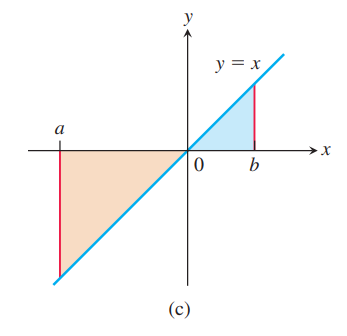
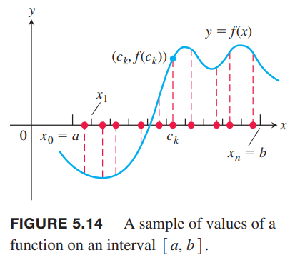
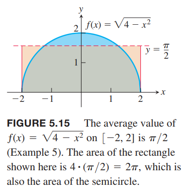

### 定积分的定义
对于某些函数而言，随着区间 $[a,b]$ 上的分区的模趋于零，黎曼和趋于极限值 $J$，这就是定积分的定义。引入符号 $\varepsilon$ 是一个小的整数，表示黎曼和要多么接近极限值 $J$，符号 $\delta$ 表示模多小的时候和收敛。

**定义** 令 $f(x)$ 是定义在闭区间 $[a,b]$ 上的函数。如果 $J$ 满足下面的条件，那么是黎曼和 $\sum_{k=1}^nf(c_k)\Delta x_k$ 的极限，即是 $f$ 在 $[a,b]$ 上的**定积分**：  
给定任意数 $\varepsilon>0$ 都有一个与之相应的 $\delta>0$ 使得对 $[a,b]$ 上任意分区 $P=\{x_0,x_1,\cdots,x_n\}$，其模满足 $\parallel P\parallel <\delta$，任意选择 $c_k\in[x_{k-1},x_k]$ 都有
$$\bigg|\sum_{k=1}^nf(c_k)\Delta x_k-J\bigg|<\varepsilon$$

模趋于零的分区有无数多，$c_k$ 的选择也任意多。不管如何选择，总能得到同样的极限值 $J$，那么定积分才存在。当极限存在时
$$J=\lim_{\parallel P\parallel\to 0}\sum_{k=1}^nf(c_k)\Delta x_k$$
莱布尼茨发明了记号 $\int$ 表示积分，是和（`Sum`）的首字母 $S$ 的变形。有限和变成了无限和，函数值 $f(x)$ 替代 $f(c_k)$ 乘以无穷小量 $dx$。记作
$$\int_a^b f(x)dx$$
当定积分存在时，$f$ 在 $[a,b]$ 上的黎曼和收敛于定积分 $J=\int_a^b f(x)dx$，并且 $f$ 在$[a,b]$ 上是可积的。  
如果所有区间相等 $\Delta x=(b-a)/n$，黎曼和形式是
$$S_n=\sum_{k=1}^nf(c_k)\Delta x_k=\sum_{k=1}^nf(c_k)\frac{b-a}{n}$$
其中 $c_k$ 是第 $k$ 个区间选择的值。如果定积分存在，那么
$$J=\int_a^bf(x)dx=\lim_{n\to\infty}\sum_{k=1}^nf(c_k)\frac{b-a}{n}$$
如果令每个子区间的右端点为 $c_k$，那么 $c_k=a+k\Delta x=a+k(b-a)/n$，那么公式变成
$$\int_a^bf(x)dx=\lim_{n\to\infty}\sum_{k=1}^nf(a+k\frac{b-a}{n})(\frac{b-a}{n})$$
上面的公式可以用于计算定积分。随着分区的模趋于令，那么 $n\to\infty$，不管如何选择分区和 $c_k$，黎曼和都会收敛到同一个值。  
一个函数的定积分的值之和函数自身相关，和用哪个字母表示无关。下面三种表示是等价的。
$$\int_a^bf(t)dt,\int_a^bf(u)du,\int_a^bf(x)dx$$

### 可积函数和非可积函数
即使函数是有界的，也不是所有函数在闭区间 $[a,b]$ 上都是可积的。对于一些函数，黎曼和不会趋于同一个值，甚至不收敛。函数是否可积需要更高等的数学分析知识，不过幸好应用中遇到的绝大多数函数都是可积的。函数在 $[a,b]$ 上连续或者只有有限个跳跃点（分段连续函数）是可积的。  
简单地说，$f$ 是连续的，我们可以选择每个区间的最大值对应的变量作为 $c_k$，那么得到一个上界。类似地，可以得到下界。当分区 $P$ 的模趋于零的时候，可以证明上界和下届收敛到同一个极限值。每一个黎曼和都介于这两者之间，所以这些黎曼和也都收敛到同样的极限值。  
一个函数非常地不连续，那么可能不可积。看下面的例子。

例1 函数
$$f(x)=\begin{cases}
1,&&x \text{ is rational}\\
0,&&x \text{ is irrational}
\end{cases}$$
在 $[0,1]$ 上定积分不存在。我们已经知道任意两个数之间都存在一个无理数和一个有理数。那么这个函数会在 $[0,1]$ 上无规则的上下跳跃。下面证明上和和下和收敛于不同的极限值。  
如果在 $[0,1]$ 上选择一个分区 $P$，分区的长度和是 1，即 $\sum_{k=1}^n\Delta x_k=1$。每个区间上都会有一个有理数，称为 $c_k$，那么 $f(c_k)=1$。同时，1 是各个区间的最大值，所以上和是
$$U=\sum_{k=1}^nf(c_k)\Delta x_k=\sum_{k=1}^n 1\Delta x_k=1$$
同样地，每个区间也都有一个无理数，那么每个区间的最小值是 0，所以下和是
$$L=\sum_{k=1}^nf(c_k)\Delta x_k=\sum_{k=1}^n 0\Delta x_k=0$$
所以上和和下和收敛于不同值，也就是选择不同的 $c_k$，黎曼和有不同的极限值。根据定义，定积分不存在。

### 定积分的属性
我们定义 $\int_a^b f(x)dx$ 作为 $\sum_{k=1}^n f(c_k)\Delta x_k$ 的极限，从左往右扫过区间 $[a,b]$。如果从右向左呢？从 $x_0=b$ 开始到 $x_n=a$？黎曼和中的每一个 $\Delta x_k$ 的符号都发生了改变，选择同样的 $c_k$，那么黎曼和的符号改变了，那么极限值、定积分也都一样。那么我们得到定义
$$\int_a^bf(x)dx=-\int_b^af(x)dx$$
尽管一般情况下区间 $[a,b]$ 有 $a<b$，不过很容易得到 $a=b$ 的情况。因为 $\Delta x=0$，不管 $f(a)$ 的值是多少，乘积都为零。那么
$$\int_a^af(x)dx=0$$
下面给出一些定积分的运算法则。前两个就是上述的定义。后面几个需要严格证明。我们后面会给出法则 6 的证明，其余是类似的。
$$\begin{aligned}
\int_a^bf(x)dx&=-\int_b^af(x)dx\\
\int_a^af(x)dx&=0\\
\int_a^bkf(x)dx&=k\int_a^bf(x)dx\\
\int_a^b(f(x)\pm g(x))dx&=\int_a^bf(x)dx\pm \int_a^bg(x)dx\\
\int_a^bf(x)dx+\int_b^cf(x)dx&=\int_a^cf(x)dx\\
(\min f)(b-a)&\leq \int_a^bf(x)dx\leq (\max f)(b-a)\\
\int_a^bf(x)dx&\geq\int_a^bg(x)dx \text{ , if } f(x)\geq g(x)\\
\int_a^bf(x)dx&\geq 0 \text{ , if }f(x)\geq 0
\end{aligned}$$
下面的图像是法则二到七的几何解释。图像中的函数都是正值，不过法则具有普适性，函数值可正可负。  

证明法则六：规则六是说，$f$ 在 $[a,b]$ 上的积分不会小于最小值乘以区间长度，不会大于最大值乘以区间长度。在 $[a,b]$ 上的任意分区任意选取 $c_k$ 都有
$$\begin{aligned}
(\min f)(b-a)&\leq (\min f)\sum_{k=1}^n\Delta x_k\\
&=\sum_{k=1}^n (\min f) \Delta x_k\\
&\leq\sum_{k=1}^n f(c_k)\Delta x_k\\
&\leq\sum_{k=1}^n (\max f) \Delta x_k\\
&=(\max f)\sum_{k=1}^n\Delta x_k\\
&=(\max f)(b-a)
\end{aligned}$$
也就是说，所有的黎曼和都满足不等式
$$(\min f)(b-a)\leq \sum_{k=1}^n f(c_k)\Delta x_k\leq (\max f)(b-a)$$
因此，黎曼和的极限，即定积分，也满足这个不等式。

例2 假设
$$\int_{-1}^1f(x)dx=5,\int_1^4f(x)dx=-2,\int_{-1}^1h(x)dx=7$$
运用上述法则可以得到下列结果
$$\int_4^1f(x)dx=-\int_1^4f(x)dx=-(-2)=2$$
$$\begin{aligned}
\int_{-1}^1[2f(x)+3h(x)]dx&=2\int_{-1}^1f(x)dx+3\int_{-1}^1h(x)dx\\
&=2(5)+3(7)\\
&=31
\end{aligned}$$
$$\begin{aligned}
\int_{-1}^4f(x)dx&=\int_{-1}^1f(x)dx+\int_1^4f(x)dx\\
&=5+(-2)\\
&=3
\end{aligned}$$

例3 证明 $\int_0^1\sqrt{1+\cos x}dx$小于等于 $\sqrt{2}$。  
证明：$\sqrt{1+\cos x}$ 的最大值是 $\sqrt{2}$，那么其在 $[0,1]$ 的积分小于等于最大值乘以区间长度，即
$$\int_0^1\sqrt{1+\cos x}\leq\sqrt{2}\cdot(1-0)=\sqrt{2}$$

### 非负函数图像的面积
回到这一章开始的问题，求解非负函数曲线和 $x$ 轴之间图像的面积，使用了有限的上和、下和以及中间法则进行估算，这些都是特殊的黎曼和。由于黎曼和会收敛到确定的极限值，那么可以使用定积分来定义面积。

**定义** 如果 $y=f(x)$ 是非负函数且在 $[a,b]$ 上是可积的，那么曲线 $y=f(x)$ 在 $[a,b]$ 这一段下方区域的面积是 $f$ 从 $a$ 到 $b$ 的积分
$$A=\int_a^bf(x)dx$$

例4 计算 $\int_0^b xdx$，并且求解 $y=x$ 在 $[0,b],b>0$ 下方区域的面积 $A$。  
解：如下图所示，我们需要求解阴影面积。  
  
（a）通过计算黎曼和的极限来求解定积分，即求解模趋于零时 $\lim_{\parallel P\parallel}\sum_{k=1}^nf(c_k)\Delta x_k$。分区方法和 $c_k$ 的选择可以是任意的，所以我们选择等宽 $\Delta x=(b-0)/n=b/n$，$c_k$ 选择右端点，那么 $P=\{0,\frac{b}{n},\frac{2b}{n},\cdots,\frac{nb}{n}\}, c_k=\frac{kb}{n}$
$$\begin{aligned}
\sum_{k=1}^nf(c_k)\Delta x&=\sum_{k=1}^n\frac{kb}{n}\frac{b}{n}\\
&=\sum_{k=1}^n\frac{kb^2}{n^2}\\
&=\frac{b^2}{n^2}\sum_{k=1}^nk\\
&=\frac{b^2}{n^2}\frac{n(n+1)}{2}\\
&=\frac{b^2}{2}(1+\frac{1}{n})
\end{aligned}$$
随着 $n\to\infty,\parallel P\parallel\to 0$，上面表达式的极限是 $b^2/2$。因此
$$\int_0^bxdx=\frac{b^2}{2}$$
（b）要求的阴影部分是三角形，根据几何意义，三角形的宽是 $b$，高度也是 $b$，那么 $A=(1/2)(b)(b)=b^2/2$。

上面的例子可以通过定积分属性一般化得到 $f(x)=x$ 在任意闭区间 $[a,b],0<a<b$ 的定积分值
$$\begin{aligned}
\int_a^bxdx&=\int_a^0xdx+\int_0^bxdx\\
&=-\int_0^axdx+\int_0^bxdx\\
&=-\frac{a^2}{2}+\frac{b^2}{2}\\
&=\frac{b^2}{2}-\frac{a^2}{2}&&a<b
\end{aligned}$$
上面计算的是下面图中的阴影面积。  
  
$a,b$ 可以是负数，那么定积分值 $\frac{b^2}{2}-\frac{a^2}{2}$ 也是一个负数，表示 $y=x$ 陷到 $x$ 轴以下图像的面积，如下图所示。  
  
当 $a<0,b>0$时，上面的定积分含义是两个面积之差，$[0,b]$ 区间上上方的面积减去 $[a,0]$ 区间上下方的面积。如下图所示。  

类似例4，通过计算黎曼和可以得到下面的结论：
$$\int_a^b cdx=c(b-a),c \text{ any constant}$$
$$\int_a^b x^2dx=\frac{b^3}{3}-\frac{a^3}{3},a<b$$

### 连续函数的平均值
我们现在有了面积的定义，平均值是面积除以宽度，那么平均值的定义
$$\text{Avg}=\frac{1}{b-a}\int_a^bf(x)dx$$
从另一个角度也可以解释这个公式。$n$ 个数的算术平均数是求和之后除以 $n$。连续函数 $f$ 在 $[a,b]$ 上有无数多的值，我们可以用采样的方式估算。如下图所示。  
  
把区间平均成成 $n$ 个子区间，每个子区间选择一个 $c_k$，那么采样平均值就是
$$\begin{aligned}
\frac{f(c_1)+f(c_2)+\cdots+f(c_n)}{n}&=\frac{1}{n}\sum_{k=1}^nf(c_k)\\
&=\frac{\Delta x}{b-a}\sum_{k=1}^nf(c_k)\\
&=\frac{1}{b-a}\sum_{k=1}^nf(c_k)\Delta x
\end{aligned}$$
采样平均值等于 $f$ 在 $[a,b]$ 上的黎曼和除以宽度 $b-a$。增加采样数使得模趋于零，黎曼和收敛到 $\int_a^bf(x)dx$，均值是 $\frac{1}{b-a}\int_a^bf(x)dx$。

**定义** 如果 $f$ 在 $[a,b]$ 上可积，那么在 $[a,b]$ 上的均值是
$$\text{avg}=\frac{1}{b-a}\int_a^bf(x)dx$$

例5 求 $f(x)=\sqrt{4-x^2}$ 在 $[-2,2]$ 的平均值。  
解：函数 $f(x)=\sqrt{4-x^2}$ 的图像是半径为 2 的上半圆，如下图所示。  
  
所以我们没有必要通过黎曼和的极限得到积分值。由几何公式得
$$A=\frac{1}{2}\pi r^2=\frac{1}{2}\pi (2)^2=2\pi$$
由于 $f$ 是非负得，那么图形的面积就是从 -2 到 2 的积分
$$\int_{-2}^2\sqrt{4-x^2}dx=2\pi$$
那么 $f$ 的平均值是
$$\frac{2\pi}{2-(-2)}=\frac{\pi}{2}$$
