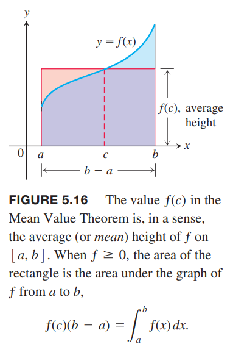
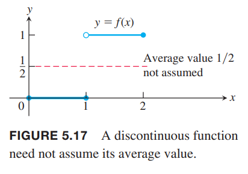
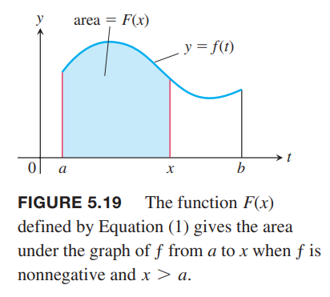
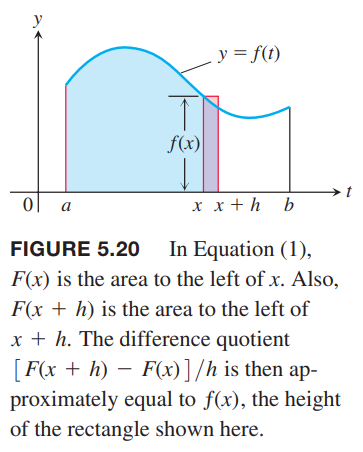
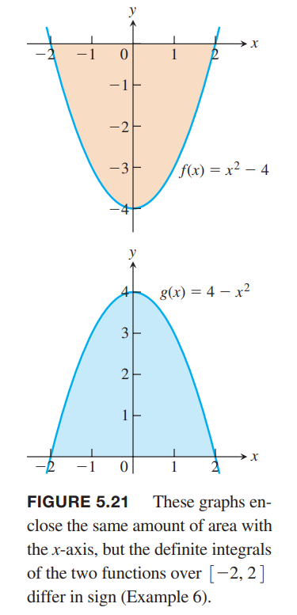
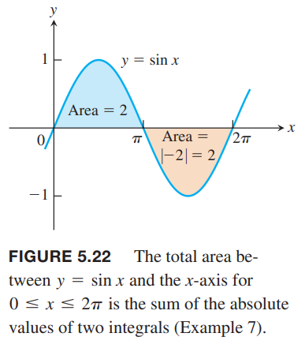
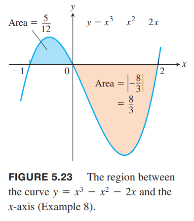

### 定积分的中值定理
上一节我们定义了在 $[a,b]$ 上的连续函数的均值是定积分 $\int_a^b f(x)dx$ 除以区间宽度 $b-a$。定积分的中值定理是说至少存在一个点其函数值等于均值。  
下图展示了一个正的定义在 $[a,b]$ 上的连续函数 $y=f(x)$。从几何角度看，中值定理是说在 $[a,b]$ 上存在一点 $c$，基底是 $b-a$ 高度是 $f(c)$ 的矩形面积恰好等于 $f$ 在 $[a,b]$ 区间上的下方区域的面积。

**定理3 定积分的中值定理**  
如果 $f$ 在 $[a,b]$ 上是连续的，那么在某点 $c\in [a,b]$ 使得
$$f(c)=\frac{1}{b-a}\int_a^bf(x)dx$$

证明：将上一节的定积分法则六（最大值最小值不等式）两边同时除以 $b-a$ 得到
$$\minf\leq\frac{1}{b-a}\int_a^bf(x)dx\leq\maxf$$
由于 $f$ 是连续的，连续函数的中间值定理告诉我们 $f$ 的所有值都必须在最大值和最小值之间，那么存在点 $c\in [a,b]$ 的值恰好是 $\frac{1}{b-a}\int_a^bf(x)dx$。  
  
连续是必要条件。如下图所示。如果 $f$ 不是连续的，可能不存在一点的函数值等于均值。  

例1 证明如果 $f$ 在 $[a,b],a\neq b$ 上连续，并且如果
$$\int_a^bf(x)dx=0$$
那么在 $[a,b]$ 上，至少出现一个 $f(x)=0$。  
证明：$f$ 在 $[a,b]$ 上的平均值是
$$\text{avg($f$)}=\frac{1}{b-a}\int_a^bf(x)dx=0$$
那么根据中值定理，至少有一个 $c\in [a,b]$ 使得 $f$ 的值是零。下图展示了函数 $f(x)=9x^2-16x+4$ 在区间 $[0,2]$ 上存在两个点满足题意。  

### 基本定理（1）
利用黎曼和的极限来计算积分是比较困难的。这里引入一种新方法，通过反导数来求解。这种方法把微积分的两条主线结合在了一起。一条是导数和反导数，一条是通过有限和的极限得到积分。这就是微积分基本定理。我们从使用积分描述的函数的求导开始。  
如果 $f(t)$ 在有限区间 $I$ 上是可积函数，从任意固定点 $a\in I$ 开始到另一点 $x\in I$ 的积分定义了一个新函数 $F$ 是
$$F(x)=\int_a^xf(t)dt$$
如果函数 $f$ 是非负函数，且 $x$ 在 $a$ 的右侧，那么 $F(x)$ 是从 $a$ 到 $x$ 的曲线下的区域的面积。如下图所示。  
  
$x$ 是积分的上界，不过 $F$ 和一般的实函数一样。给定一个输入 $x$，有唯一的输出，是 $f$ 从 $a$ 到 $x$ 的积分。  
上面的方程是一种新的构造函数的方式，更重要的是它把微分和积分联系到了一起。如果 $f$ 是连续函数，基本定理是说 $F$ 是可导的，导数就是 $f$。对于每一个 $x\in [a,b]$ 有
$$F'(x)=f(x)$$
为了获得直观印象，我们先看下其几何意义。  
如果在 $[a,b]$ 上 $f(x)\geq 0$，可以通过定义计算 $F$ 的导数，它就是 $h\to 0$ 时差值的商的极限
$$\frac{F(x+h)-F(x)}{h}$$
如果 $h>0$，$F(x+h)$ 就是从 $a$ 到 $x+h$ 曲线下区域的面积，减去 $F(x)$，就是 $f(x)$ 在 $[x, x+h]$ 这个区间的面积。如下图所示。  
  
如果 $h$ 很小，那么这块面积就近似等于宽度 $h$ 高度 $f(x)$ 矩形的面积，即
$$F(x+h)-F(x)\approx hf(x)$$
两边同时除以 $h$ 得到差值的商接近 $f(x)$
$$\frac{F(x+h)-F(x)}{h}\approx f(x)$$
当 $h$ 趋于零时，差值的商的极限 $F'(x)$ 就等于 $f(x)$，即
$$F'(x)=\lim_{h\to 0}\frac{F(x+h)-F(x)}{h}=f(x)$$
这个方程在 $f$ 是负数是也是成立的。

**定理4 微积分基本定理（1）**
> 如果 $f$ 在 $[a,b]$ 上是连续的，那么 $F(x)=\int_a^xf(t)dt$ 在 $[a,b]$ 上也是连续的，并且在 $(a,b)$ 上导数是 $f(x)$
> $$F'(x)=\frac{d}{dx}\int_a^xf(t)dt=f(x)$$

在证明之前，我们也看几个例子。$x$ 可以是上界也可以是下界。$y$ 是 $x$ 的因变量，而 $t$ 只是虚拟变量罢了。

例2 使用基本定理求导。  
（a）$y=\int_a^x(t^3+1)dt$  
（b）$y=\int_x^53t\sin tdt$  
（c）$y=\int_1^{x^2}\cos tdt$  
（d）$y=\int_{1+3x^2}^4\frac{1}{2+e^t}dt$  
解：

（a）
$$\frac{dy}{dx}=\frac{d}{dx}\int_a^x(t^3+1)dt=x^3+1$$
（b）
$$\begin{aligned}
\frac{dy}{dx}&=\frac{d}{dx}\int_x^53t\sin tdt\\
&=-\frac{d}{dx}\int_5^x3t\sin tdt\\
&=-3x\sin x
\end{aligned}$$
（c）积分上界是 $x^2$ 而不是 $x$，这使得 $y$ 是两个函数组合起来的
$$y=\int_1^u\cos tdt,u=x^2$$
那么需要使用链式法则
$$\begin{aligned}
\frac{dy}{dx}&=\frac{dy}{du}\frac{du}{dx}\\
&=(\frac{d}{du}\int_1^u\cos tdt)\frac{du}{dx}\\
&=\cos u(2x)\\
&=2x\cos x^2
\end{aligned}$$
（d）
$$\begin{aligned}
\frac{dy}{dx}&=\frac{d}{dx}\int_{1+3x^2}^4\frac{1}{2+e^t}dt\\
&=-\int_4^{1+3x^2}\frac{1}{2+e^t}dt\\
&=-\frac{1}{2+e^{1+3x^2}}\frac{d}{dx}(1+3x^2)\\
&=-\frac{6x}{2+e^{1+3x^2}}
\end{aligned}$$

证明定理 4。通过定义来证明。差值的商是
$$\frac{F(x+h)-F(x)}{h}$$
根据定义求 $h\to 0$ 时上式的值。
$$\begin{aligned}
F'(x)&=\lim_{h\to 0}\frac{F(x+h)-F(x)}{h}\\
&=\lim_{h\to 0}\frac{1}{h}\bigg[\int_a^{x+h}f(t)dt-\int_a^xf(t)dt\bigg]\\
&=\lim_{h\to 0}\frac{1}{h}\int_x^{x+h}f(t)dt
\end{aligned}$$
根据定积分中值定理，在 $[x,x+b]$ 上至少存在一点 $c$ 使得 $f(c)$ 等于 $f$ 在这个区间的平均值，即
$$\frac{1}{h}\int_x^{x+h}f(t)dt=f(c)$$
随着 $h\to 0$，$x+h$ 趋于 $x$，那么 $c$ 也趋于 $x$，由于 $f$ 在 $x$ 处连续，所以 $f(c)$ 趋于 $f(x)$，即
$$\lim_{h\to 0}f(c)=f(x)$$
这就证明了对于任意 $x\in (a,b)$ 都有
$$F'(x)=f(x)$$
并且 $F(x)$ 在 $x$ 处是可导的。由于可导意味着连续，所以 $F$ 在 $(a,b)$ 上是连续的。为了完成证明，我们需要考察 $x=a,x=b$ 两个端点。类似的，在 $x=a$ 我们只需要考虑 $h\to 0^+$ 即可，在 $x=b$ 只需要考虑 $h\to 0^-$。这就证明了在两个端点存在单边极限，根据 3.2 节的定理1，蕴涵着在这两处也是连续的。

### 基本定理（2）
第二部分主要描述不通过黎曼和求定积分。

**定理4 微积分基本定理（2）**
> 如果 $f$ 在 $[a,b]$ 上连续，$F$ 是 $f$ 在 $[a,b]$ 上的反导数，那么
> $$\int_a^bf(x)dx=F(b)-F(a)$$

证明：基本定理（1）告诉我们如果反导数存在，那么
$$G(x)=\int_a^xf(t)dt$$
如果 $F$ 是 $f$ 任意反导数，那么 $F(x)=G(x)+C$。由于 $F,G$ 在 $[a,b]$ 上连续，那么 $F(x)=G(x)+C$ 在端点处 $x=a,x=b$ 也是成立的。这一点通过单边极限（$x\to a^+,x\to b^-$）可以证明。现在求解 $F(b)-F(a)$。
$$\begin{aligned}
F(b)-F(a)&=[G(b)+C]-[G(a)+C]\\
&=G(b)-G(a)\\
&=\int_a^bf(t)dt-\int_a^af(t)dt\\
&=\int_a^bf(t)dt
\end{aligned}$$
只需要
1. 找到 $f$ 的反导数 $F$
2. 计算 $F(b)-F(a)$ 的值

就能得到函数 $f$ 在 $[a,b]$ 上的定积分，所以这个定理很重要。  
通常使用如下记号表示 $F(b)-F(a)$
$$F(x)\bigg]_a^b,\bigg[F(x)\bigg]_a^b$$
不过我还是习惯下面的记号
$$F(x)\bigg|_a^b$$
不过本书的记号对 $F(x)$ 包含多项更友好。

例3 使用上述定理计算定积分。  
（a）
$$\begin{aligned}
\int_0^\pi\cos xdx&=\sin x\bigg|_0^\pi\\
&=\sin\pi-\sin 0\\
&=0-0\\
&=0
\end{aligned}$$
（b）
$$\begin{aligned}
\int_{-\pi/4}^0\sec x\tan xdx&=\sec x\bigg|_{-\pi/4}^0\\
&=\sec 0-\sec (-\frac{\pi}{4})\\
&=1-\sqrt{2}
\end{aligned}$$
（c）
$$\begin{aligned}
\int_1^3(\frac{3}{2}\sqrt{x}-\frac{4}{x^2})dx&=\bigg[x^{3/2}+\frac{4}{x}\bigg]_1^4\\
&=(4^{3/2}+\frac{4}{4})-(1^{3/2}+\frac{4}{1})\\
&=9-5\\
&=4
\end{aligned}$$
（d）
$$\begin{aligned}
\int_0^1\frac{dx}{x+1}&=\ln |x+1|\bigg|_0^1\\
&=\ln 2-\ln 1\\
&=\ln 2
\end{aligned}$$
（e）
$$\begin{aligned}
\int_0^1\frac{dx}{x^2+1}&=\tan^{-1}x\bigg|_0^1\\
&=\tan^{-1}1-\tan^{-1}0\\
&=\frac{\pi}{4}-0\\
&=\frac{\pi}{4}
\end{aligned}$$

### 变化率的积分
我们现在从另一个角度看微积分基本定理（2）。如果 $F$ 是 $f$ 任意一个反导数，那么 $F'=f$。基本定理（2）可以写作
$$\int_a^bF'(x)dx=F(b)-F(a)$$
$F'(x)$ 表示 $F(x)$ 的变化率，上面的等式是说变化率 $F'(x)$ 的积分是 $x$ 从 $a$ 到 $b$ 时 $F$ 的净变化。

**定理5 净变化定理**  
可微函数 $F(x)$ 在 $a\leq x\leq b$ 上的净变化等于它的变化率的积分
$$F(b)-F(a)=\int_a^b F'(x)dx$$

例4 下面是一些解释净变化定理的例子。  
（a）如果 $c(x)$ 是生成 $x$ 单位某种产品的成本，那么边际成本是 $c'(x)$，那么根据定理5 有
$$\int_{x_1}^{x_2}c'(x)dx=c(x_2)-c(x_1)$$
是生产量从 $x_1$ 增加到 $x_2$ 的成本。  
（b）一个物体沿着坐标轴运动，位移函数 $s(t)$，速度是 $v(t)=s'(t)$，根据定理5 有
$$\int_{t_1}^{t_2}v(t)dt=s(t_2)-s(t_1)$$
所以速度的积分是区间 $t_1\leq t\leq t_2$ 上的位移。另一方面，速度的绝对值 $|v(t)|$ 的积分是移动距离。

如果重写这个方程为
$$F(b)=F(a)+\int_a^bF'(x)dx$$
可以理解为 $F(x)$ 在 $[a,b]$ 上的终值等于初始值 $F(a)$ 加上该区间上的净变化。

例5 5.1 节例 2 再次出现。一个岩石被炸飞垂直向上。任意时刻的速度是 $v(t)=49-9.8t \text{ m/s}$。  
（a）求时间周期 $0\leq t\leq 8$ 上的位移；  
（b）求该周期上的总移动距离。  
解：（a）根据例4 （b）可以得到位移是积分
$$\begin{aligned}
\int_0^8v(t)dt&=\int_0^8(49-9.8t)dt\\
&=\bigg[49t-4.9t^2\bigg]_0^8\\
&=(49)(8)-(4.9)(64)\\
&=78.4
\end{aligned}$$
这说明 8 秒的时候石块距离地面 78.4m，和 5.1 节一致。  
（b）在 $[0,5]$ 上速度为正，$[5,8]% 上速度为负，那么需要分段求解
$$\begin{aligned}
\int_0^8|v(t)|dt&=\int_0^5|v(t)|dt+\int_5^8|v(t)|dt\\
&=\int_0^5(49-9.8t)dt-\int_5^8(49-9.8t)dt\\
&=\bigg[49t-4.9t^2\bigg]_0^5-\bigg[49t-4.9t^2\bigg]_5^8\\
&=122.5-(-44.1)\\
&=166.6
\end{aligned}$$
移动总距离是 166.6m。

### 积分和微分的关系
微积分基本定理告诉我们如下事实。
$$\frac{d}{dx}\int_a^xf(t)dt=f(x)$$
是说对函数 $f$ 先积分再微分会得到函数本身。重写变化率的积分里面的公式为
$$\int_a^xF'(t)dt=F(x)-F(a)$$
对函数 $F$ 先微分再积分也会得到 $F$ 本身加一个常数。也就是说积分和微分互为逆运算。  
微积分基本定理还告诉我们连续函数 $f$ 总是存在反导数 $F$。同时，找到反导数对于简便的求积分很重要。最后，还告诉我们微分方程 $dy/dx=f(x)$ 总是有解的（$y=F(x)+C$）。

### 总面积
面积总是正值。在用黎曼和近似求解面积时，$f(c_k)$ 为正时，$f(c_k)\Delta x$ 就是给定矩形的面积，如果 $f(c_k)$ 是负数，那么得到的是矩形面积的相反值。只要加上绝对值就能得到正确的面积。

例6 如下图所示是函数 $f(x)=x^2-4$ 的图像和其关于 $x$ 轴镜像 $g(x)=4-x^2$ 的函数图像。  
  
求  
（a）在区间 $[-2,2]$ 上的积分  
（b）在区间 $[-2,2]$ 上图像曲线和 $x$ 围城的面积  
解：（a）
$$\begin{aligned}
\int_{-2}^2f(x)dx&=\bigg[\frac{x^3}{3}-4x\bigg]_{-2}^2\\
&=(\frac{8}{3}-8)-(\frac{-8}{3}+8)\\
&=-\frac{32}{3}
\end{aligned}$$
$$\int_{-2}^2g(x)dx=-\int_{-2}^2f(x)dx=\frac{32}{3}$$
（b）两者的面积都是 $\frac{32}{3}$。尽管 $f(x)$ 在该区间上的积分是负值，但是面积总是正的。

当函数 $y=f(x)$ 有正有负的时候，为了计算函数曲线和 $x$ 轴围成的区域的总面积，我们需要将区间 $[a,b]$ 若干个子区间，各个子区间函数值不变符号，将各个子区域的面积相加得到总面积。这样求得的面积就是正确的总面积。

例7 下图展示了函数 $f(x)=\sin x$ 在 $[0,2\pi]$ 的图像，求  
（1）计算在 $[0,2\pi]$ 上 $f(x)$ 的积分  
（2）在 $[0,2\pi]$ 区间上，$f(x)$ 和 $x$ 轴围成区域的面积。  
  
解：（1）
$$\int_0^{2\pi}\sin xdx=-\cos x\bigg|_0^{2\pi}=\cos 0-\cos 2\pi=0$$
如上图，$x$ 轴上下部分对称，恰好抵消了，所以积分是零。  
（2）分成两个子区间 $[0,\pi],[\pi,2\pi]$
$$\int_0^{\pi}\sin xdx=-\cos x\bigg|_0^{\pi}=\cos 0-\cos \pi=1-(-1)=2$$
$$\int_{\pi}^{2\pi}\sin xdx=-\cos x\bigg|_{\pi}^{2\pi}=\cos \pi-\cos 2\pi=-1-1=-2$$
面积是 $2+|-2|=4$。

总结下求 $f(x)$ 在 $[a,b]$ 区间上曲线与 $x$ 轴围成区域的总面积的步骤：
1. 以 $f$ 的零点将 $[a,b]$ 划分出子区间
2. 在每个区间上对 $f$ 积分
3. 将各个积分的绝对值相加

例8 求函数 $f(x)=x^3-x^2-2x,-1\leq x\leq 2$ 与 $x$ 轴围成区域的面积。  
解：首先找到函数零点
$$f(x)=x^3-x^2-2x=x(x^2-x-2)=x(x-2)(x+1)$$
所以有三个零点 $x=-1,0,2$，如下图所示。  
  
所以划分成两个子区间 $[-1,0],[0,2]$，然后分别求积分
$$\begin{aligned}
\int_{-1}^0(x^3-x^2-2x)dx&=\bigg[\frac{x^4}{4}-\frac{x^3}{3}-x^2\bigg]_{-1}^0\\
&=0-\bigg[\frac{1}{4}-\frac{-1}{3}-1\bigg]\\
&=\frac{5}{12}
\end{aligned}$$
$$\begin{aligned}
\int_0^2(x^3-x^2-2x)dx&=\bigg[\frac{x^4}{4}-\frac{x^3}{3}-x^2\bigg]_0^2\\
&=\bigg[\frac{16}{4}-\frac{8}{3}-4\bigg]-0\\
&=-\frac{8}{3}
\end{aligned}$$
那么总面积就是各个区间积分的绝对值相加
$$A=\frac{5}{12}+\bigg|-\frac{8}{3}\bigg|=\frac{37}{12}$$
