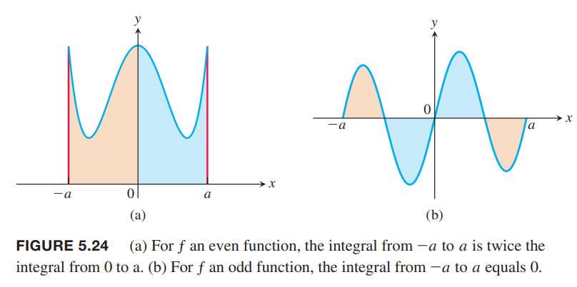
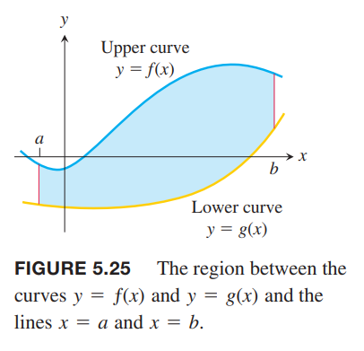
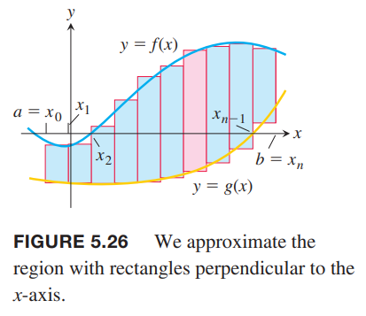
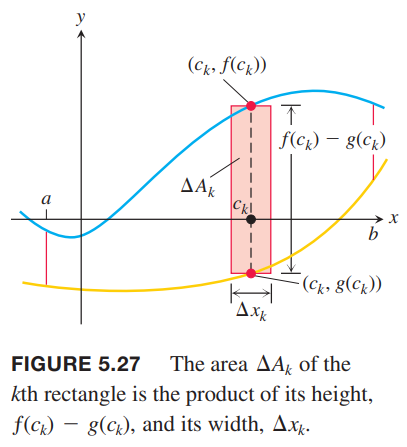
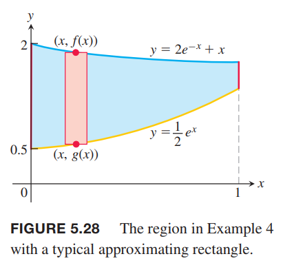
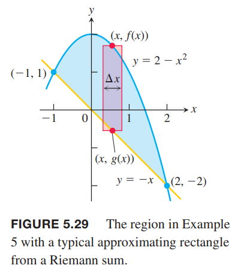
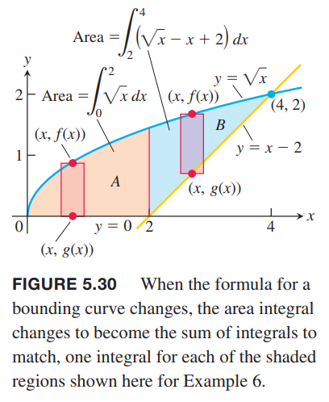
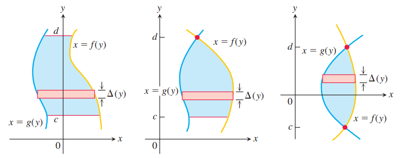
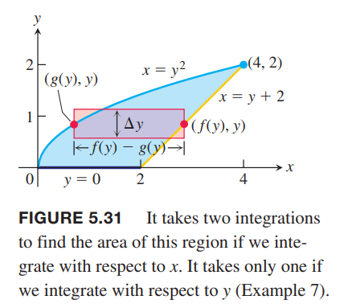
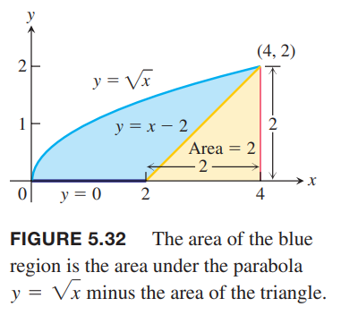

### 换元公式
下面的公式告诉我们当使用换元法的时候，如何更新上下界。

**定理7 定积分的换元法**  
如果 $g'$ 在区间 $[a,b]$ 上连续，$f$ 在 $g(x) =u$ 的值域上连续，那么
$$\int_a^b f(g(x))\cdot g'(x)dx=\int_{g(a)}^{g(b)} f(u)du$$

证明：令 $F$ 是 $f$ 任意一个反导数，那么
$$\begin{aligned}
\int_a^b f(g(x))\cdot g'(x)dx&=F(g(x))\bigg|_{x=a}^{x=b}\\
&=F(g(b))-F(g(a))\\
&=F(u)\bigg|_{u=g(a)}^{u=g(b)}\\
&=\int_{g(a)}^{g(b)} f(u)du
\end{aligned}$$

使用定理7 分两步，首先使用 $u=g(x), du=g'(x)dx$ 替换积分式，然后修改对应的上下界到 $g(a)=u(a), g(b)=u(b)$。

例1 求 $\int_{-1}^1 3x^2\sqrt{x^3+1}dx$。  
解：下面使用两种方法求解。  
方法一：应用定理7。令 $u=x^3+1,du=3x^2,u(-1)=0,u(1)=2$。
$$\begin{aligned}
\int_{-1}^1 3x^2\sqrt{x^3+1}dx&=\int_0^2\sqrt{u}du\\
&=\frac{2}{3}u^{3/2}\bigg|_0^2\\
&=\frac{2}{3}(2^{3/2}-0)\\
&=\frac{2}{3}2\sqrt{2}\\
&=\frac{4\sqrt{2}}{3}
\end{aligned}$$
方法二：先求不定积分，是 $x$ 的表达式，然后代入上下界计算定积分。
$$\begin{aligned}
\int 3x^2\sqrt{x^3+1}dx&=\int\sqrt{u}du\\
&=\frac{2}{3}u^{3/2}+C\\
&=\frac{2}{3}(x^3+1)^{3/2}+C
\end{aligned}$$
$$\begin{aligned}
\int_{-1}^1 3x^2\sqrt{x^3+1}dx&=\frac{2}{3}(x^3+1)^{3/2}\bigg|_{-1}^1\\
&=\frac{2}{3}((1^3+1)^{3/2}-((-1)^3+1)^{3/2})\\
&=\frac{2}{3}(2\sqrt{2}-0)\\
&=\frac{4\sqrt{2}}{3}
\end{aligned}$$
哪种方法更好呢？上面的例子似乎是方法一更简单一点。但一般说来没有定论，所以需要熟悉两种方法，灵活使用。

例2  
（a）
$$\begin{aligned}
\int_{\pi/4}^{\pi/2}\cot\theta\csc^2\theta d\theta&=\int_1^0 u\cdot(-du)\\
&=-\int_1^0 udu\\
&=-\frac{u^2}{2}\bigg|_1^0\\
&=\frac{1}{2}
\end{aligned}$$
（b）
$$\begin{aligned}
\int_{-\pi/4}^{\pi/4}\tan xdx&=\int_{-\pi/4}^{\pi/4}\frac{\sin x}{\cos x}dx\\
&=-\int_{\sqrt{2}/2}^{\sqrt{2}/2}\frac{du}{u}\\
&=-\ln |u|\bigg|_{\sqrt{2}/2}^{\sqrt{2}/2}\\
&=0
\end{aligned}$$

### 对称函数的定积分
应用定理7 可以容易的求在对称区间 $[a,b]$ 上奇函数或者偶函数的定积分。如下图所示。  

**定理8** 令函数 $f$ 在对称区间 $[a,b]$ 上连续。  
如果 $f$ 是偶函数，那么
$$\int_{-a}^af(x)dx=2\int_0^af(x)dx$$
如果 $f$ 是奇函数，那么
$$\int_{-a}^af(x)dx=0$$

证明第一个部分
$$\begin{aligned}
\int_{-a}^af(x)dx=&=\int_{-a}^0f(x)dx+\int_0^af(x)dx\\
&=-\int_0^{-a}f(x)dx+\int_0^af(x)dx\\
&=-\int_0^af(-u)(-du)+\int_0^af(x)dx\\
&=\int_0^af(-u)du+\int_0^af(x)dx\\
&=\int_0^af(u)du+\int_0^af(x)dx\\
&=2\int_0^af(x)dx
\end{aligned}$$
第二部分的证明类似。

例3 求 $\int_{-2}^2(x^4-4x^2+6)dx$。  
解：由于 $f(x)=x^4-4x^2+6$ 满足 $f(-x)=f(x)$，所以在区间 $[-2,2]$ 上是偶函数，所以
$$\begin{aligned}
\int_{-2}^2(x^4-4x^2+6)dx&=2\int_0^2(x^4-4x^2+6)dx\\
&=2\bigg[\frac{x^5}{5}-\frac{4x^3}{3}+6x\bigg]_0^2\\
&=2(\frac{32}{5}-\frac{16}{3}+12)\\
&=\frac{232}{15}
\end{aligned}$$

### 曲线间的面积
如下图所示。从 $x=a$ 到 $x=b$，曲线 $y=g(x)$ 以上 $y=f(x)$ 一下围成的区域的面积是多少呢？这个区域几乎不可能是规则图形使得可以用几何法计算。如果 $f, g$ 是任意连续函数，通常通过积分来求解。  
  
为了得到积分式，我们基于在 $[a,b]$ 上的分区 $P=\{x_0,x_1,\cdots,x_n\}$ 得到的 $n$ 个矩形来估算面积。如下图所示。  
  
那么第 $k$ 个面积如下如所示。  
  
$$\Delta A_k=[f(c_k)-g(c_k)]\Delta x_k$$
将 $n$ 个矩形面积求和
$$A\approx\sum_{k=1}^n\Delta A_k=\sum_{k=1}^n [f(c_k)-g(c_k)]\Delta x_k$$
由于 $f,g$ 连续，随着 $\parallel P\parallel\to 0$，右边黎曼和的极限是 $\int_a^b[f(x)-g(x)]dx$，所以面积
$$A=\lim_{\parallel P\parallel\to 0}\sum_{k=1}^n [f(c_k)-g(c_k)]\Delta x_k=\int_a^b[f(x)-g(x)]dx$$

**定义** 如果 $f,g$ 是区间 $[a,b]$ 上的连续函数，且 $f(x)\geq g(x)$，那么从 $a$ 到 $b$，在曲线 $y=f(x),y=g(x)$ 之间的区域面积是从 $a$ 到 $b$ 上 $f-g$ 的积分：
$$A=\int_a^b[f(x)-g(x)]dx$$

为了求解面积，画出图像往往是有帮助的。容易知道哪个曲线是 $f(x)$，哪个曲线是 $g(x)$。有时，需要知道交点，即求解 $f(x)=g(x)$，然后分段积分。

例4 求曲线 $y=2e^{-x}+x$ 与 $y=e^x/2$ 在 $[0,1]$ 这个区间上所围区域的面积。  
解：下图展示了要求的区域。  

$$\begin{aligned}
A&=\int_0^1[(2e^{-x}+x-e^x/2)]dx\\
&=\bigg[-2e^{-x}+\frac{1}{2}x^2-\frac{1}{2}e^x\bigg]_0^1\\
&=(-2e^{-1}+\frac{1}{2}-\frac{1}{2}e)-(-2+0-\frac{1}{2})\\
&=3-\frac{2}{e}-\frac{e}{2}
\end{aligned}$$

例5 求曲线 $y=2-x^2$ 和直线 $y=-x$ 所围成区域的面积。  
解：区域如图所示。  
  
首先需要求曲线和直线的交点，确定积分的上下界。
$$\begin{aligned}
2-x^2&=-x\\
x^2-x-2&=0\\
(x+1)(x-2)&=0\\
x=-1,x&=2
\end{aligned}$$
所以积分的上下界是 $a=-1,b=2$。
$$\begin{aligned}
A&=\int_a^b[f(x)-g(x)]dx\\
&=\int_{-1}^2[(2-x^2)-(-x)]dx\\
&=\int_{-1}^2(2+x-x^2)dx\\
&=\bigg[2x+\frac{x^2}{2}-\frac{x^3}{3}\bigg]_{-1}^2\\
&=(4+2-\frac{8}{3})-(-2+\frac{1}{2}+\frac{1}{3})\\
&=\frac{9}{2}
\end{aligned}$$

如果被积函数发生了变化，我们需要把被积区间分割成若干个子区间，分别求解。

例6 求曲线 $y=\sqrt{x}$ 和直线 $y=x-2$ 在第一象限围成区域的面积。  
解：如下图所示。  
  
区域 A 的积分上下界是 $a=0,b=2$，区域 B 的积分下界是 $a=2$，需要求交点的到上界。
$$\begin{aligned}
\sqrt{x}&=x-2\\
x&=(x-2)^2=x^2-4x+4\\
x^2-5x+4&=0\\
(x-4)(x-1)&=0\\
x=1,x&=4
\end{aligned}$$
只有 $x=4$ 满足 $\sqrt{x}=x-2$，而 $x=1$ 是由第一步平方带来无关的解。所以区域 B 的积分上界是 $b=4$。  
在区间 $[0,2]$ 上，$f(x)-g(x)=\sqrt{x}-0=\sqrt{x}$。  
在区间 $[2,4]$ 上，$f(x)-g(x)=\sqrt{x}-(x-2)=\sqrt{x}-x+2$。  
所以总面积是
$$\begin{aligned}
A&=\int_0^2\sqrt{x}dx+\int_2^4(\sqrt{x}-x+2)dx\\
&=\frac{2x^{3/2}}{3}\bigg|_0^2+\bigg[\frac{2x^{3/2}}{3}-\frac{x^2}{2}+2x\bigg]_2^4\\
&=\frac{2}{3}(2)^{3/2}-0+(\frac{2}{3}(4)^{3/2}-8+8)-(\frac{2}{3}(2)^{3/2}-2+4)\\
&=\frac{2}{3}(8)-2\\
&=\frac{10}{3}
\end{aligned}$$

### 对 $y$ 积分
如果区域是由 $y$ 的函数围起来的，如下图，需要使用水平的矩阵来近似。  
  
那么面积公式是
$$A=\int_c^d[f(y)-g(y)]dy$$

例7 使用对 $y$ 积分的方法求解例6。  
解：如下图所示使用水平矩形来近似。  
  
右边界函数是 $x=y+2$，即 $f(y)=y+2$，左边界曲线是 $x=y^2$，即 $g(y)=y^2$。积分的下界是 0，现在求交点得到上界。
$$\begin{aligned}
y+2&=y^2\\
y^2-y-2&=0\\
(y-2)(y+1)&=0\\
y=-1,y&=2
\end{aligned}$$
所以上界是 $d=2$。$y=-1$ 是在下方的交点。
$$\begin{aligned}
A&=\int_c^d[f(y)-g(y)]dy\\
&=\int_0^2[y+2-y^2]dy\\
&=\bigg[\frac{1}{2}y^2+2y-\frac{y^3}{3}\bigg]_0^2\\
&=2+4-\frac{8}{3}\\
&=\frac{10}{3}
\end{aligned}$$
例7 的方法比例6 简单很多，不过最简单的方式如下图所示。  
  
面积可以看作是 $y=\sqrt{x}$ 在 $[0,4]$ 上与 $x$ 围成的面积减去腰长为 2 的等腰直角三角形，所以
$$\begin{aligned}
A&=\int_0^4\sqrt{x}dx-\frac{1}{2}(2)(2)\\
&=\frac{2}{3}x^{3/2}\bigg|_0^4-2\\
&=\frac{16}{3}-2\\
&=\frac{10}{3}
\end{aligned}$$
