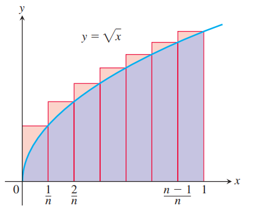

### Approximating Finite Sums with Integrals
在许多应用中，积分可以应用于近似有限和，这个有限和近似积分刚好相反。

举一个例子，我们相求前 $n$ 个整数的平方和 $\sqrt{1}+\sqrt{2}+\cdots+\sqrt{n}$。积分
$$\int_0^1\sqrt{x}dx=\frac{2}{3}x^{3/2}\bigg|_0^1=\frac{2}{3}$$
是下面和式的极限
$$\begin{aligned}
S_n&=\sqrt{\frac{1}{n}}\cdot\frac{1}{n}+\sqrt{\frac{2}{n}}\cdot\frac{1}{n}+\cdots+\sqrt{\frac{n}{n}}\cdot\frac{1}{n}\\
&=\frac{\sqrt{1}+\sqrt{2}+\cdots+\sqrt{n}}{n^{3/2}}
\end{aligned}$$
几何意义如下：  
  
当 $n$ 很大的时候，$S_n$ 的极限是 $2/3$，那么
$$\sqrt{1}+\sqrt{2}+\cdots+\sqrt{n}=S_n\cdot n^{3/2}\approx\frac{2}{3}n^{3/2}$$

### Leibniz's Rule
有时，我们对使用积分定义的函数求导，但是上下界都是函数，那么需要使用下面给出的莱布尼茨法则。

**Leibniz's Rule**  
如果 $f$ 在 $[a,b]$ 上连续，且 $u(x),v(x)$ 可导并且对应函数值在 $[a,b]$ 内，那么
$$\frac{d}{dx}\int_{u(x)}^{v(x)}f(t)dt=f(v(x))\frac{dv}{dx}-f(u(x))\frac{du}{dx}$$

证明：令 $F$ 是 $[a,b]$ 上 $f$ 的反导数，那么
$$\int_{u(x)}^{v(x)}f(t)dt=F(v(x))-F(u(x))$$
求导
$$\begin{aligned}
\frac{d}{dx}\int_{u(x)}^{v(x)}f(t)dt&=\frac{d}{dx}\bigg[F(v(x))-F(u(x))\bigg]\\
&=F'(v(x))\frac{dv}{dx}-F'(u(x))\frac{du}{dx}\\
&=f(v(x))\frac{dv}{dx}-f(u(x))\frac{du}{dx}
\end{aligned}$$
