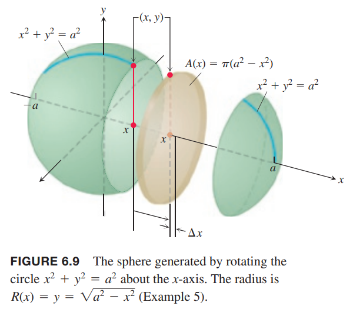

我们这里通过横截面的面积定义立体图形的体积。如下图所示。一个平面与立体图形 $S$ 相交得到了横截面。  
  
下面我们学习三种方法来计算体积：切片法、圆盘法和垫圈法。  
我们计算上图立体图形 $S$ 的体积。在区间 $[a,b]$ 上的每一点 $x$，一个与 $x$ 轴垂直的平面与 $S$ 相交得到一个横截面，其面积是 $A(x)$。我们将会证明，如果 $A(x)$ 是 $x$ 的连续函数，那么 $A(x)$ 的定积分是 $S$ 的体积。  
我们将圆柱的定义拓展到基底形状更一般的圆柱状的立体图形。如下图所示。  
  
体积是
$$V=A\cdot h$$
在切片法中，我们将区间 $[a,b]$ 切割成若个区域，第 $k$ 个区间是 $[x_{k-1},x_k]$，横截面面积是 $A(x)$，高度是对应的宽度 $\Delta x_k$。

### 平行面切片
我们把 $[a,b]$ 切分成宽度是 $\Delta x_k$ 的厚片，对应 $x$ 轴的切分点分别是 $a=x_0<x_1<\cdots<x_n=b$。如下图所示。  
  
我们近似的认为 $x_{k-1},x_k$ 两个横截面之间的立体图形基底面积是 $A(x_k)$。如下图所示。  
  
那么体积是
$$V_k=A(x_k)\Delta x_k$$
整个立体图形 $S$ 的体积就是
$$V\approx\sum_{k=1}^nV_k=\sum_{k=1}^nA(x_k)\Delta x_k$$
这是函数 $A(x)$ 在 $[a,b]$ 上的黎曼和。当 $n\to\infty$ 时，黎曼和收敛于 $A(x)$ 的定积分。
$$\lim_{n\to\infty}\sum_{k=1}^nA(x_k)\Delta x_k=\int_a^bA(x)dx$$
这就是 $S$ 体积的定义。

这个定义适用于 $A(x)$ 是可积函数，特别是连续函数。

例1 一个高 3m 金字塔型，基底是 3m 的正方形。距离塔顶 $x$ 的平面也是边长为 $x$ 的正方形。求金字塔体积。  
解：首先画出草图。我们使用垂直于 $x$ 轴的平面与金字塔相交得到一系列横截面。如下图所示。  
  
在 $x$ 处的横截面是边长为 $x$ 的正方形，那么面积是
$$A(x)=x^2$$
积分的上下界是
$$x=0,x=3$$
所以体积是
$$V=\int_0^3x^2dx=\frac{x^3}{3}\bigg|_0^3=9$$

例2 使用两个截面切割半径为 3 的圆柱体得到一个楔形。一个平面与圆柱体的底平行，另一个平面经过圆柱体的中心且与第一个平面成 45° 角。求楔形的体积。  
解：楔形的底是一个半圆，圆方程是
$$x^2+y^2=9$$
$x$ 区间是 $[0,3]$，半圆上的 $y$ 值区间是 $[-\sqrt{9-x^2},\sqrt{9-x^2}]$。如下图所示。  
  
我们使用垂直于 $x$ 轴的平面切片，高度是 $x$，宽度是 $2\sqrt{9-x^2}$，所以面积是
$$A(x)=2x\sqrt{9-x^2}$$
那么体积是
$$\begin{aligned}
V&=\int_a^bA(x)dx\\
&=\int_0^32x\sqrt{9-x^2}dx\\
&=-\int_9^0\sqrt{u}du\\
&=\frac{2}{3}u^{3/2}\bigg|_0^9\\
&=18
\end{aligned}$$

例3 卡瓦列里原理是说如果有两个立方图形高度一样，且对应高度的横截面面积一样，那么两个图形体积是一样的。如下图所示。  
  
这很容易用体积的定义定积分证明。高度一样的意思是积分的上下界一样，横截面一样那么被积函数 $A(x)$ 一样。

### 旋转体：圆盘法
沿着某个轴旋转一个平面区域得到的立体图形是旋转体（`solid of revolution`）。如下图所示。  
  
为了求体积，我们观察横截面的面积 $A(x)$ 是半径为 $R(x)$ 的圆盘，其中 $R(x)$ 是旋转轴到边缘的距离。因此
$$A(x)=\pi[R(x)]^2$$
那么体积是
$$V=\int_a^bA(x)dx=\int_a^b\pi[R(x)]^2dx$$

例4 曲线 $y=\sqrt{x},0\leq x\leq 4$ 与 $x$ 轴的区域绕 $x$ 轴得到一个立体图形。求体积。  
解：如上图所示。代入上面的公式
$$\begin{aligned}
V&=\int_a^b\pi[R(x)]^2dx\\
&=\int_0^4\pi[\sqrt{x}]^2dx\\
&=\pi\int_0^4xdx\\
&=\pi\frac{x^2}{2}\bigg|_0^4\\
&=8\pi
\end{aligned}$$

例5 圆
$$x^2+y^2=a^2$$
绕 $x$ 轴旋转得到球体。求体积。  
解：如下图所示。  
  
横截面面积是
$$A(x)=\pi y^2=\pi(a^2-x^2)$$
因此体积是
$$\begin{aligned}
V&=\int_{-a}^aA(x)dx\\
&=\int_{-a}^a\pi(a^2-x^2)dx\\
&=\pi\bigg[a^2x-\frac{x^3}{3}\bigg]_{-a}^a\\
&=\frac{4}{3}\pi a^3
\end{aligned}$$

例6 一个图形的边界是 $y=\sqrt{x},y=1,x=4$，沿着 $y=1$ 旋转。求体积。  
解：如下图所示。  
  
$$\begin{aligned}
V&=\int_1^4\pi[R(x)]^2dx\\
&=\int_1^4\pi[\sqrt{x}-1]^2dx\\
&=\pi\int_1^4[x-2\sqrt{x}+1]dx\\
&=\pi\bigg[\frac{x^2}{2}-2\frac{2}{3}x^{3/2}+x\bigg]_1^4\\
&=\frac{7\pi}{6}
\end{aligned}$$

如果平面区域是曲线 $y=R(y),c\leq y\leq d$ 和 $y$ 轴确定的，其沿着 $y$ 轴旋转。那么我们用 $y$ 替代 $x$ 即可求得对应的体积。横截面面积是
$$A(y)=\pi[R(y)]^2$$
那么体积是
$$V=\int_c^dA(y)dy=\int_c^d\pi[R(y)]^2dy$$

例7 求由 $y$ 和 $x=2/y,1\leq y\leq 4$ 围成的区域沿着 $y$ 轴旋转得到的立体图形的体积。  
解：图形如下所示。  
  
$$\begin{aligned}
V&=\int_1^4\pi[R(y)]^2dy\\
&=\int_1^4\pi(\frac{y}{2})^2dy\\
&=\pi\int_1^4\frac{4}{y^2}dy\\
&=4\pi\bigg[-\frac{1}{y}\bigg]_1^4\\
&=3\pi
\end{aligned}$$

例8 求由抛物线 $x=y^2+1$ 和直线 $x=3$ 围成的图形沿着 $x=3$ 旋转得到的旋转体的体积。  
解：这个图形如下图所示。  
  
$$\begin{aligned}
V&=\int_{-\sqrt{2}}^{\sqrt{2}}\pi[R(y)]^2dy\\
&=\int_{-\sqrt{2}}^{\sqrt{2}}\pi[2-y^2]^2dy\\
&=\pi\int_{-\sqrt{2}}^{\sqrt{2}}4-4y^2+y^4dy\\
&=\pi\bigg[4y-\frac{4}{3}y^3+\frac{y^5}{5}\bigg]_{-\sqrt{2}}^{\sqrt{2}}\\
&=\frac{64\pi\sqrt{2}}{15}
\end{aligned}$$

### 旋转体：垫圈法
如果生成旋转体的区域的边界不是旋转轴的话，那么立体图形会有一个洞。如下图所示。  
  
那么横截面像一个垫圈而不是圆盘。设圆盘内外半径分别是 $r(x), R(x)$，那么横截面的面积是
$$A(x)=\pi[R(x)]^2-\pi[r(x)]^2=\pi([R(x)]^2-[r(x)]^2)$$
所以体积是
$$V=\int_a^bA(x)dx=\int_a^b\pi([R(x)]^2-[r(x)]^2)dx$$

例9 由曲线 $y=x^2+1$ 和直线 $y=-x+3$ 围成的区域绕着 $x$ 轴得到一个立体图形。求体积。  
解：如下图所示。  
  
那么内外半径是
$$R(x)=-x+3,r(x)=x^2+1$$
求两条线的交点得到积分的上下界
$$\begin{aligned}
x^2+1&=-x+3\\
x^2+x-2&=0\\
(x+2)(x-1)&=0\\
x&=-2,x=1
\end{aligned}$$
积分得到体积
$$\begin{aligned}
V&=\int_a^b\pi([R(x)]^2-[r(x)]^2)dx\\
&=\int_{-2}^1\pi((-3+x)^2-(x^2+1)^2)dx\\
&=\pi\int_{-2}^1(8-6x-x^2-x^4)dx\\
&=\pi\bigg[8x-3x^2-\frac{x^3}{3}-\frac{x^5}{5}\bigg]_{-2}^1\\
&=\frac{117\pi}{5}
\end{aligned}$$

如果某个区域绕着 $y$ 轴旋转，只需要把上述 $x$ 替换成 $y$ 即可计算体积。在这种场景下，垫圈是垂直于 $y$ 轴的，内外半径都是 $y$ 的函数。

例10 求由 $y=x^2, y=2x$ 在第一象限的围成的图形绕着 $y$ 轴旋转得到的立体图形的体积。  
解：第一象限的图形如下图所示。  
  
内外半径分别是 $R(y)=\sqrt{y},x=y/2$。交点对应的 $y$ 分别是 $0,4$，所以体积是
$$\begin{aligned}
V&=\int_c^d\pi([R(y)]^2-[r(y)]^2)dy\\
&=\int_0^4\pi([\sqrt{y}]^2-(\frac{y}{2})^2)dy\\
&=\pi\int_0^4(y-\frac{y^2}{4})dy\\
&=\pi\bigg[\frac{y^2}{2}-\frac{y^3}{12}\bigg]_0^4\\
&=\frac{8}{3}\pi
\end{aligned}$$
旋转体图形如下。  

