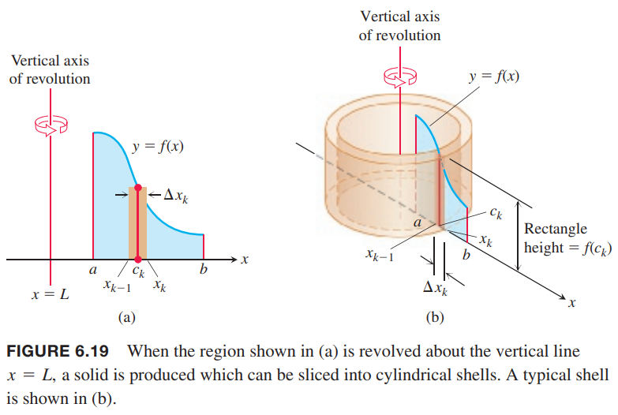

### 圆柱形切片
这里我们使用一系列半径逐渐增加的圆柱形对立体图形切片。这样每一个圆柱的垂直轴都平行于 $y$ 轴。每一个圆柱的厚度都是常数，类似于年轮。展开这个圆柱形的图形，厚度是 $\Delta x$，面积是 $A(x)$，两者之积就是体积。

例1 由 $x$ 轴和曲线 $y=f(x)=3x-x^2$ 围成的区域绕 $x=-1$ 生成如下立体图形。求体积。  
  
解：如果使用上一小节的方法求体积，那么内外径需要用 $x$ 表示，即求解 $y=3x-x^2$，会得到一个比较复杂的式子。这里我们不旋转 $\Delta y$ 厚度的水平带子，而是旋转 $\Delta x$ 厚度的垂直带子。在 $x_k$ 处，就是一个高度为 $y_k$ 的圆柱形壳。如下图所示。  
  
从最内层开始，切这样一个个的圆柱环，直到最内层。这些圆柱环的高度随着抛物曲线变化。这 $n$ 个圆柱环体积求和就是黎曼和，是体积的近似。

每一个壳位于横坐标 $[x_{k-1},x_k]$，厚度是 $\Delta x_k$。由于绕着 $x=-1$ 旋转，那么外径是 $1+x_k$。高度是在区间 $[x_{k-1},x_k]$ 上某一点的抛物线告诉，可以用 $y_k=f(x_k)=3x_k-x_k^2$ 近似。展开之后可以近似的视为厚度为 $\Delta x_k$ 的矩形，长度是圆柱环的周长 $2\pi(1+x_k)$。如下图所示：  
  
所以体积就是
$$\Delta V_k=2\pi(1+x_k)(3x_k-x_k^2)\Delta x_k$$
求和
$$\sum_{k=1}^n\Delta V_k=\sum_{k=1}^n2\pi(1+x_k)(3x_k-x_k^2)\Delta x_k$$
随着 $n\to\infty,\Delta x_k\to 0$，定积分即为体积
$$\begin{aligned}
V&=\lim_{n\to\infty}\sum_{k=1}^n2\pi(1+x_k)(3x_k-x_k^2)\Delta x_k\\
&=2\pi\int_0^3(x+1)(3x-x^2)dx\\
&=2\pi\int_0^3(3x+2x^2-x^3)dx\\
&=2\pi\bigg[\frac{3}{2}x^2+\frac{2}{3}x^3-\frac{1}{4}x^4\bigg]_0^3\\
&=\frac{45}{2}\pi
\end{aligned}$$

### 柱壳法
假设一个区域由在 $[a,b]$ 上连续的非负函数 $f(x)$ 和 $x$ 轴围成，在其左边有一条垂直于 $x$ 轴的直线 $x=L$。我们假设 $a\geq L$，这样垂线会接触这个区域，但是不会穿过这个区域。通过将这个区域绕 $L$ 旋转得到了物体 $S$。如下图所示。  
  
令 $P$ 是 $[a,b]$ 上的一个分区 $a=x_0<x_1<x_2<\cdots<x_n=b$。每个子区间 $[x_{k-1},x_k]$ 上选择一个点 $c_k$，例1 选择了右端点 $x_k$，这里选择中点。我们用基于这个分区的矩形来近似上图左边图形的面积，每个分区的面积近似为 $f(c_k)\Delta x_k$。我们将这个矩形绕 $x=L$ 旋转得到一个圆柱壳，如上图右边所示。这个壳的体积就是
$$\Delta V_k=2\pi(c_k-L)f(c_k)\Delta x_k$$
将 $n$ 个矩形扫过的壳的体积相加得到 $S$ 体积的近似。
$$V\approx\sum_{k=1}^n\Delta V_k$$
当 $\Delta x_k\to 0,n\to\infty$，黎曼和的极限，即定积分，就是物体的体积：
$$V=\lim_{n\to\infty}\sum_{k=1}^n\Delta V_k=\int_a^b 2\pi(x-L)f(x)dx$$

例2 由曲线 $y=\sqrt{x}$ 和 $x$ 轴、$x=4$ 围成的区域绕 $y$ 轴得到一个立体图形。求体积。  
解：区域如下图左边所示。圆柱形的壳如下图右边所示。  
  
积分上下界分别是 $a=0,b=4$，体积是
$$\begin{aligned}
V&=\int_0^42\pi(x)(\sqrt{x})dx\\
&=2\pi\int_0^4x^{3/2}dx\\
&=2\pi\bigg[\frac{2}{5}x^{5/2}\bigg]_0^4\\
&=\frac{128\pi}{5}
\end{aligned}$$

如果绕着水平轴旋转的话，使用 $y$ 代替 $x$。

例3 由曲线 $y=\sqrt{x}$ 和 $x$ 轴、$x=4$ 围成的区域绕 $x$ 轴得到一个立体图形。求体积。  
解：这个问题是上个小节的例4。这里使用柱壳法求体积。下图为示意图。  
  
积分上下界是 $a=0,b=2$。体积是
$$\begin{aligned}
V&=\int_0^22\pi(y)(4-y^2)dy\\
&=2\pi\int_0^2(4y-y^3)dy\\
&=2\pi\bigg[2y^2-\frac{y^4}{4}\bigg]_0^2\\
&=8\pi
\end{aligned}$$

在第十四章我们会看到双重或三重积分，这里的公式是一般地求体积公式的特例。

上一节讲述的旋转体：垫圈法和柱壳法计算结果都是旋转体的体积，那么结果应该是一样的。下面给出证明。

令 $f$ 在区间 $a\leq x\leq b,a>0$ 上可微，且 $f$ 有可微的反函数 $f^{-1}$。由 $x=a$、$y=f(b)$ 和 $f$ 围城的区域绕着 $y$ 轴旋转。两种方法得到体积一样描述为
$$\int_{f(a)}^{f(b)}\pi[(f^{-1}(y))^2-a^2]dy=\int_a^b 2\pi x(f(b)-f(x))dx$$
令
$$W(t)=\int_{f(a)}^{f(t)}\pi[(f^{-1}(y))^2-a^2]dy$$
$$S(t)=\int_a^t 2\pi x(f(t)-f(x))dx$$
应用微积分基本定理对这两个函数求导
$$W'(t)=\pi(t^2-a^2)f'(t)$$
$S(t)$ 的被积函数中有变量 $t$，要分开处理
$$\begin{aligned}
S'(t)&=2\pi \frac{d}{dt}(f(t)\int_a^t xdx)-2\pi tf(t)\\
&=2\pi f(t) t+2\pi f'(t)\int_a^txdx-2\pi tf(t)\\
&=2\pi f'(t)\frac{x^2}{2}\bigg|_a^t\\
&=\pi f'(t)(t^2-a^2)
\end{aligned}$$
因此
$$W'(t)=S'(t)$$
又因为 $W(a)=S(a)$，结合 4.8 节解的唯一性得到
$$W(t)=S(t)$$
因此体积
$$W(b)=S(b)$$
