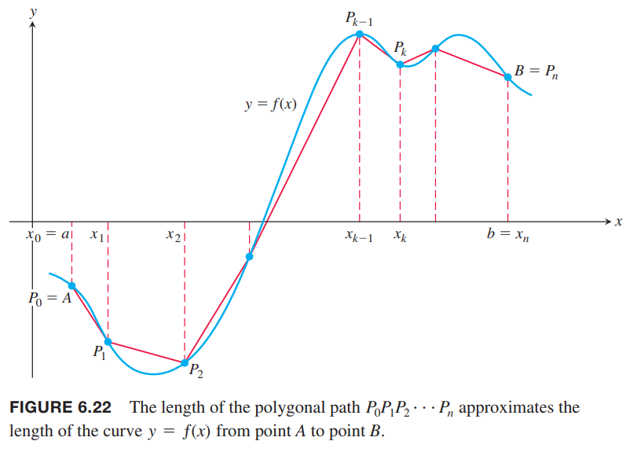
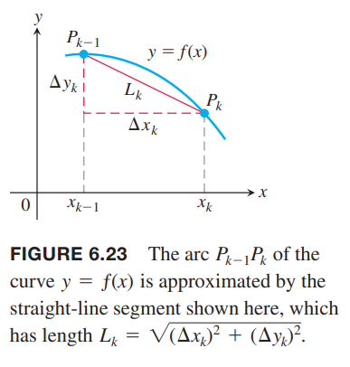
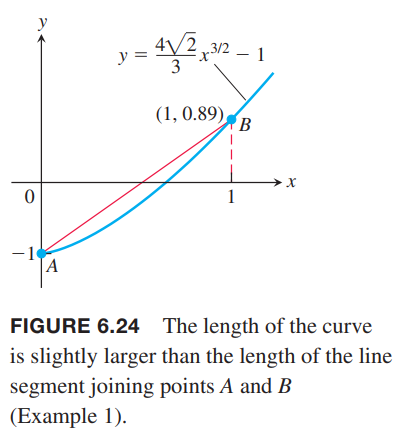
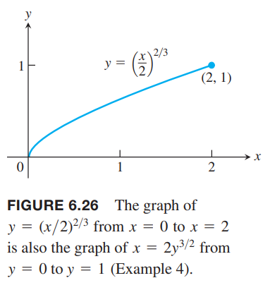

某个区间上的连续函数的图像是一条曲线，我们可以用前面近似面积的方式求解长度。切成若干份，每一份用直线近似长度，然后求和。曲线的长度就是当分段无限多时的和的极限。

### 曲线 $y=f(x)$ 的长度
我们要求函数 $y=f(x)$ 从 $x=a$ 到 $x=b$ 对应曲线的长度。为了推导定积分公式，假设 $f$ 在 $[a,b]$ 上的每一点都可导且导数连续。这样的曲线成为光滑曲线，因为没有断点和尖点。  
将区间 $[a,b]$ 分成 $n$ 个区间 $a=x_0<x_1<x_2<\cdots<x_n=b$。令 $y_k=f(x_k)$，点 $P(x_k,y_k)$ 在曲线上。接着依次将 $P_{k-1},P_k$ 用线段连起来，这个多边形的路径就近似曲线的长度。如下图所示。  
  
令 $\Delta x_k=x_k-x_{k-1},\Delta y_k=y_k-y_{k-1}$，那么对应线段长度是
$$L_k=\sqrt{(\Delta x_k)^2+(\Delta y_k)^2}$$
如下图所示。  
  
通过求和得到曲线长度的近似
$$\sum_{k=1}^nL_k=\sum_{k=1}^n\sqrt{(\Delta x_k)^2+(\Delta y_k)^2}$$
为了求得极限，我们使用中值定理，它告诉我们存在一个点 $x_{k-1}<c_k<x_k$ 满足
$$\Delta y_k=f'(c_k)\Delta x_k$$
代入求和式得到
$$\sum_{k=1}^nL_k=\sum_{k=1}^n\sqrt{(\Delta x_k)^2+(f'(c_k)\Delta x_k)^2}=\sum_{k=1}^n\sqrt{1+[f'(c_k)]^2}\Delta x_k$$
这是黎曼和，由于 $\sqrt{1+[f'(c_k)]^2}$ 在 $[a,b]$ 上连续，那么极限存在且等于定积分：
$$\lim_{n\to\infty}\sum_{k=1}^nL_k=\lim_{n\to\infty}\sum_{k=1}^n\sqrt{1+[f'(c_k)]^2}\Delta x_k=\int_a^b\sqrt{1+[f'(x)]^2}dx$$
这就是曲线长度的定义。

例1 如下图所示，求函数
$$y=\frac{4\sqrt{2}}{3}x^{3/2}-1,0\leq x\leq 1$$
的曲线长度。  
  
解：积分上下界是 $a=0,b=1$，对函数求导
$$\begin{aligned}
y&=\frac{4\sqrt{2}}{3}x^{3/2}-1\\
\frac{dy}{dx}&=2\sqrt{2}x^{1/2}\\
(\frac{dy}{dx})^2&=8x
\end{aligned}$$
那么长度就等于定积分
$$\begin{aligned}
L&=\int_0^1\sqrt{1+(\frac{dy}{dx})^2}dx\\
&=\int_0^1\sqrt{1+8x}dx\\
&=\frac{2}{3}\frac{1}{8}(1+8x)^{3/2}\bigg|_0^1\\
&=\frac{13}{6}\\
&\approx 2.17
\end{aligned}$$
这略微大于点 $A(0,-1)$ 到点 $B(1,4\sqrt{2}/3-1)$ 的距离
$$2.17>\sqrt{1^2+(4\sqrt{2}/3)^2}\approx 2.13$$

例2 求函数
$$f(x)=\frac{x^3}{12}+\frac{1}{x},1\leq x\leq 4$$
的曲线长度。  
解：求导
$$f'(x)=\frac{x^2}{4}-\frac{1}{x^2}$$
那么
$$\begin{aligned}
1+[f'(x)]^2&=1+(\frac{x^2}{4}-\frac{1}{x^2})^2\\
&=1+(\frac{x^4}{16}-\frac{1}{2}+\frac{1}{x^4})\\
&=\frac{x^4}{16}+\frac{1}{2}+\frac{1}{x^4}\\
&=(\frac{x^2}{4}+\frac{1}{x^2})^2
\end{aligned}$$
长度为
$$\begin{aligned}
L&=\int_1^4\sqrt{1+[f'(x)]^2}dx\\
&=\int_1^4(\frac{x^2}{4}+\frac{1}{x^2})dx\\
&=\bigg[\frac{x^3}{12}-\frac{1}{x}\bigg]_1^4\\
&=(\frac{64}{12}-\frac{1}{4})-(\frac{1}{12}-1)\\
&=6
\end{aligned}$$

例3 求函数
$$y=\frac{1}{2}(e^x+e^{-x}),0\leq x\leq 2$$
的曲线长度。  
解：求导
$$\begin{aligned}
y&=\frac{1}{2}(e^x+e^{-x})\\
\frac{dy}{dx}&=\frac{1}{2}(e^x-e^{-x})\\
(\frac{dy}{dx})^2&=\frac{1}{4}(e^{2x}-2+e^{-2x})\\
1+(\frac{dy}{dx})^2&=\frac{1}{4}(e^{2x}+2+e^{-2x})\\
&=[\frac{1}{2}(e^x+e^{-x})]^2
\end{aligned}$$
长度是
$$\begin{aligned}
L&=\int_0^2\sqrt{1+(\frac{dy}{dx})^2}dx\\
&=\int_0^2\frac{1}{2}(e^2+e^{-x})dx\\
&=\frac{1}{2}\bigg[e^x-e^{-x}\bigg]_0^2\\
&=\frac{1}{2}(e^2-e^{-2})
\end{aligned}$$

### $dy/dx$ 不连续
即使导数 $dy/dx$ 在某一点不存在，但 $dx/dy$ 有可能存在。比如曲线在某点处的切线垂直于 $x$ 轴。这种情况下，我们使用 $y$ 替代公式中的 $x$ 计算弧长。

如果 $g'$ 在 $[c,d]$ 上连续，曲线 $x=g(y)$ 从点 $A=(g(c),c)$ 到点 $B=(g(d),d)$ 的弧长是
$$L=\int_c^d\sqrt{1+(\frac{dx}{dy})^2}dy=\int_c^d\sqrt{1+[g'(y)]^2}dy$$

例4 求曲线 $y=(x/2)^{2/3}$ 从 $x=0$ 到 $x=2$ 的弧长。  
解：导数
$$\frac{dy}{dx}=\frac{2}{3}(\frac{x}{2})^{-1/3}\frac{1}{2}=\frac{1}{3}(\frac{2}{x})^{1/3}$$
在 $x=0$ 处不存在。  
因此我们尝试用 $y$ 表示 $x$：  
$$\begin{aligned}
y&=(\frac{x}{2})^{2/3}\\
y^{3/2}&=\frac{x}{2}\\
x&=2y^{3/2}
\end{aligned}$$
如下图所示  
  
其导数
$$\frac{dx}{dy}=2(\frac{3}{2})y^{1/2}=3y^{1/2}$$
在 $[0,1]$ 上连续，那么弧长是
$$\begin{aligned}
L&=\int_c^d\sqrt{1+(\frac{dx}{dy})^2}dy\\
&=\int_0^1\sqrt{1+9y}dy\\
&=\frac{1}{9}\cdot\frac{2}{3}(1+9y)^{3/2}\bigg|_0^1\\
&=\frac{2}{27}(10\sqrt{10}-1)
\end{aligned}$$

### 弧长的微分公式
如果 $y=f(x)$ 的导数 $f'$ 在 $[a,b]$ 上连续，那么根据基本定理可以定义新的函数
$$s(x)=\int_a^x\sqrt{1+[f'(x)]^2}dt$$
新函数 $s(x)$ 是连续的，表示的是从点 $P_0(a,f(a))$ 到点 $Q(x,f(x))$ 的弧长，其中 $x\in [a,b]$。根据基本定理可知 $s$ 在 $(a,b)$ 上可微
$$\frac{ds}{dx}=\sqrt{1+[f'(x)]^2}=\sqrt{1+(\frac{dy}{dx})^2}$$
那么弧长的微分就是
$$ds=\sqrt{1+(\frac{dy}{dx})^2}dx$$
也可以写作
$$ds=\sqrt{dx^2+dy^2}$$
从这个角度看，所有的弧长公式可以简写为 $L=\int ds$。

例5 求例2 的弧长公式，起点是 $A=(1,13/12)$。  
解：根据例2 有
$$1+[f'(x)]^2=(\frac{x^2}{4}+\frac{1}{x^2})^2$$
那么
$$\begin{aligned}
s(x)&=\int_1^x\sqrt{1+[f'(t)]^2}dt\\
&=\int_1^x(\frac{t^2}{4}+\frac{1}{t^2})dt\\
&=\bigg[\frac{t^3}{12}-\frac{1}{t}\bigg]_1^x\\
&=\frac{x^3}{12}-\frac{1}{x}+\frac{11}{12}
\end{aligned}$$
利用这个公式可以计算点 $A=(1,13/12)$ 到点 $B=(4,67/12)$ 的弧长
$$s(4)=\frac{64}{12}-\frac{1}{4}+\frac{11}{12}=6$$
与例2 答案一致。

### 习题
13. 求函数图像
$$y=\frac{3}{2}x^{2/3}+1,\frac{1}{8}\leq x\leq 1$$
的弧长。  
解：求导
$$\begin{aligned}
\begin{aligned}
y'&=x^{-1/3}\\
y'^2&=x^{-2/3}\\
1+y'^2&=1+x^{-2/3}
\end{aligned}
\end{aligned}$$
那么弧长是
$$\begin{aligned}
L&=\int_{1/8}^1\sqrt{1+f'^2}dx\\
&=\int_{1/8}^1\sqrt{1+x^{-2/3}}dx\\
&=\int_{1/8}^1\frac{\sqrt{x^{2/3}+1}}{|x^{1/3}|}dx\\
&=\int_{1/8}^1\frac{\sqrt{x^{2/3}+1}}{x^{1/3}}dx
\end{aligned}$$
令
$$u=1+x^{2/3}$$
那么
$$du=\frac{2}{3}x^{-1/3}dx$$
所以
$$\begin{aligned}
L&=\frac{3}{2}\int_{5/4}^2\sqrt{u}du\\
&=\frac{3}{2}\cdot\frac{2}{3}u^{3/2}\bigg|_{5/4}^2\\
&=2^{3/2}-(5/4)^{3/2}
\end{aligned}$$
