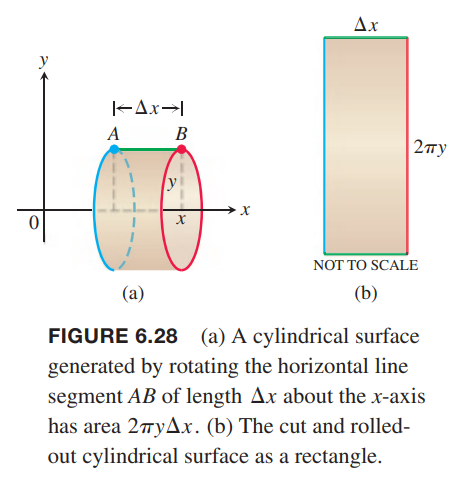
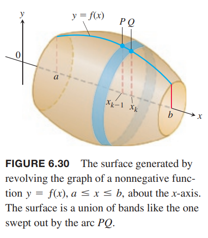
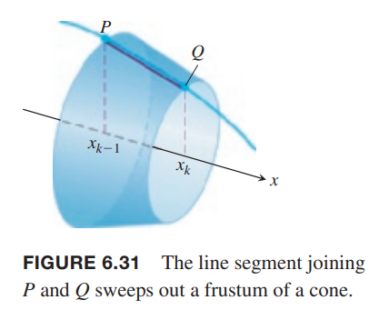
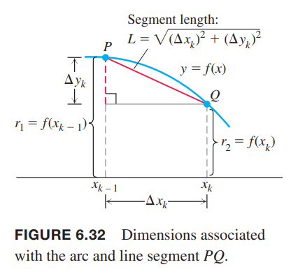
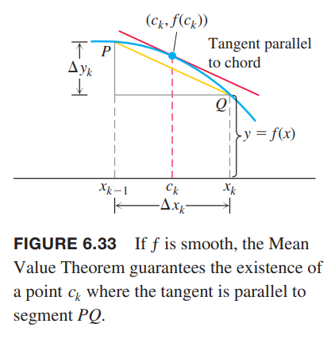
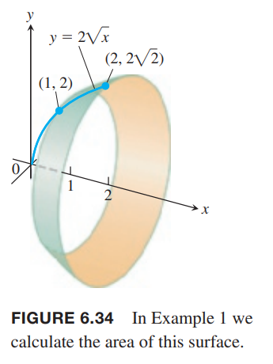

### 表面积定义
旋转一区间上函数围成的区域得到一个旋转体。如果只旋转函数曲线本身，得到一个曲面。我们使用上一节中定义和处理曲线的方法，这一节定义和处理曲面。  
考虑一般情况之前，我们先从水平线段和倾斜的线段开始。如下图所示。我们旋转长度为 $\Delta x$ 的线段 $AB$，得到一表面积为 $2\pi y\Delta x$ 的圆柱形。展开为下图右边所示。线段 $AB$ 上一点 $(x,y)$ 绕着 $x$ 轴旋转得到一个半径为 $y$ 的圆，$2\pi y$ 就是周长。  
  
假设线段是倾斜的而不是水平的。这样的线段 $AB$ 绕着 $x$ 轴旋转，得到圆锥体的平截头体，如下图左边所示。根据几何学可知这个平截头体的表面积是 $2\pi y^*L$，其中 $y^*=(y_1+y_2)/2$ 是线段 $AB$ 的平均高度。表面积与长宽为 $2\pi y^*, L$ 的矩形面积一样大。如下图右边所示。  
  
现在考虑一般情况。计算非负函数 $y=f(x),a\leq x\leq b$ 的函数曲线绕着 $x$ 轴形成图形的表面积。和之前讨论一样，将区间 $[a,b]$ 切分成 $n$ 个子区间。如下图所示 $PQ$ 是其中一段弧。  
  
$PQ$ 绕 $x$ 轴旋转，扫过的平截头体的曲面如下图所示。  
  
表面积可以近似看作是 $2\pi y^*L$，其中 $y^*$ 是 $PQ$ 的平均高度。由于 $f\geq 0$，从下图可以看出平均高度是 $y^*=(f(x_{k-1})+f(x_k))/2$，线段长度是 $L=\sqrt{(\Delta x_k)^2+(\Delta y_k)^2}$。  
  
因此面积是
$$A=2\pi\frac{f(x_{k-1})+f(x_k)}{2}\cdot\sqrt{(\Delta x_k)^2+(\Delta y_k)^2}=\pi(f(x_{k-1})+f(x_k))\sqrt{(\Delta x_k)^2+(\Delta y_k)^2}$$
对 $n$ 个子区间求和得到平截头体的表面积
$$\sum_{k=1}^n\pi(f(x_{k-1})+f(x_k))\sqrt{(\Delta x_k)^2+(\Delta y_k)^2}$$
如果函数 $f$ 可导，中值定理告诉我们 $PQ$ 之间存在一点 $(c_k,f(c_k))$ 使得其切线平行于线段 $PQ$，如下图所示。  
  
在这一点上有
$$f'(c_k)=\frac{\Delta y_k}{\Delta x_k}$$
$$\Delta y_k=f'(c_k)\Delta x_k$$
代入上面的和式可以得到
$$\sum_{k=1}^n\pi(f(x_{k-1})+f(x_k))\sqrt{(\Delta x_k)^2+(\Delta y_k)^2}=\sum_{k=1}^n\pi(f(x_{k-1})+f(x_k))\sqrt{1+(f'(c_k))^2}\Delta x_k$$
注意，这不是黎曼和，因为 $x_{k-1},x_k,c_k$ 不相同。不过，它们距离非常近，所以我们期待（能够证明）随着 $[a,b]$ 的分区的模趋于零，和式收敛于
$$\int_a^b2\pi f(x)\sqrt{1+(f'(c_k))^2}dx$$
因此我们可以得到如下定义：

**定义** 如果函数 $y=f(x)$ 在 $[a,b]$ 上连续地可导，那么将其绕 $x$ 轴得到的图形的表面积是
$$S=\int_a^b2\pi y\sqrt{1+(\frac{dy}{dx})^2}dx=\int_a^b2\pi f(x)\sqrt{1+(f'(c_k))^2}dx$$

例1 求曲线 $y-\sqrt{x},1\leq x\leq 2$ 绕 $x$ 轴旋转得到的图形的面积。如下图所示。  
  
解：根据题意，公式中量分别是
$$a=1,b=2,y=2\sqrt{x},\frac{dy}{dx}=\frac{1}{\sqrt{x}}$$
首先求被积函数
$$\begin{aligned}
\sqrt{1+(\frac{dy}{dx})^2}&=\sqrt{1+(\frac{1}{\sqrt{x}})^2}\\
&=\sqrt{1+\frac{1}{x}}\\
&=\frac{\sqrt{x+1}}{\sqrt{x}}
\end{aligned}$$
因此面积是
$$\begin{aligned}
S&=\int_1^22\pi\cdot 2\sqrt{x}\frac{\sqrt{x+1}}{\sqrt{x}}dx\\
&=4\pi\int_1^2\sqrt{x+1}dx\\
&=4\pi\cdot\frac{2}{3}(x+1)^{3/2}\bigg|_1^2\\
&=\frac{8\pi}{3}(3\sqrt{3}-2\sqrt{2})
\end{aligned}$$

### 绕 $y$ 轴旋转
对于绕 $y$ 轴旋转，只需要交换公式中的 $x$ 和 $y$ 即可。

如果 $x=g(y)\geq 0$ 在 $[a,b]$ 上连续地可导，那么曲线绕 $y$ 轴旋转生成的面的面积是
$$S=\int_c^d2\pi x\sqrt{1+(\frac{dx}{dy})^2}dy=\int_c^d2\pi g(y)\sqrt{1+[g'(y)]^2}dy$$

例2 求线段 $x=1-y,0\leq y\leq 1$ 绕 $y$ 轴旋转得到的面的面积，不包括底。如下图所示。  
解：可以使用几何法。
$$A=\frac{1}{2}\text{base circumference}\times\text{height}=\pi\sqrt{2}$$
下面使用公式，所以
$$c=0,d=1,x=1-y,\frac{dx}{dy}=-1$$
$$\sqrt{1+(\frac{dx}{dy})^2}=\sqrt{1+(-1)^2}=\sqrt{2}$$
所以面积是
$$\begin{aligned}
S&=\int_c^d2\pi x\sqrt{1+(\frac{dx}{dy})^2}dy\\
&=\int_0^12\pi(1-y)\sqrt{2}dy\\
&=2\pi\sqrt{2}(y-\frac{y^2}{2})\bigg|_0^1\\
&=\pi\sqrt{2}
\end{aligned}$$
