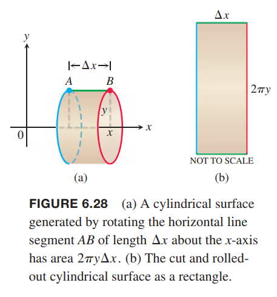
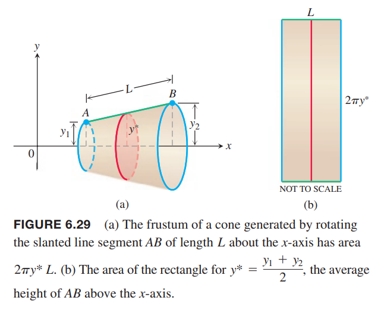
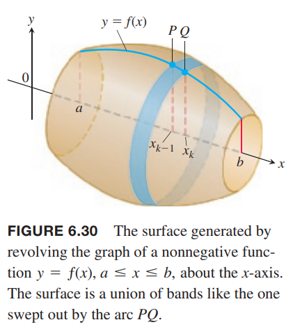
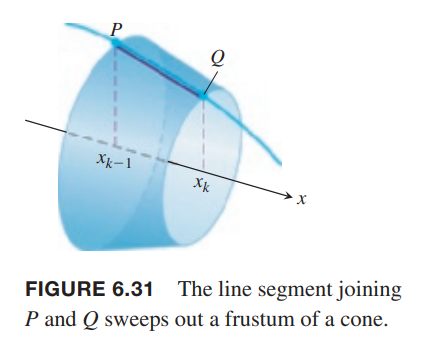
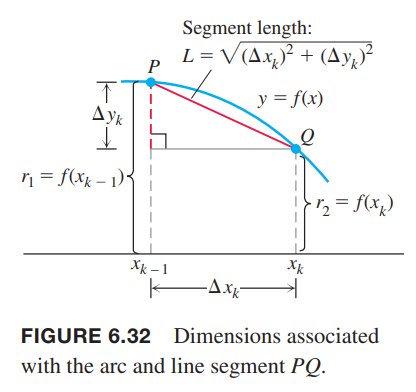
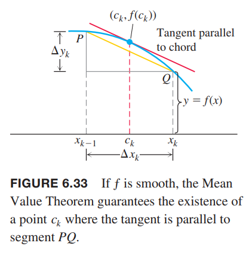
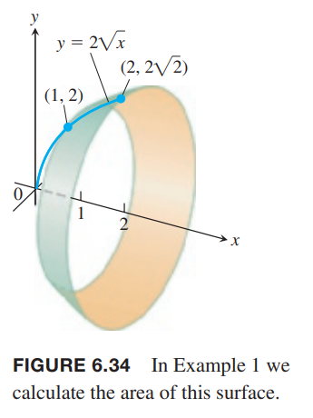

### 表面积定义

旋转一区间上函数围成的区域得到一个旋转体。如果只旋转函数曲线本身，得到一个曲面。我们使用上一节中定义和处理曲线的方法，这一节定义和处理曲面。

考虑一般情况之前，我们先从水平线段和倾斜的线段开始。如下图所示。我们旋转长度为 $\Delta x$ 的线段 $AB$，得到一个表面积为 $2\pi y\Delta x$ 的圆柱面。展开为下图右边所示。线段 $AB$ 上一点 $(x,y)$ 绕着 $x$ 轴旋转得到一个半径为 $y$ 的圆，$2\pi y$ 就是周长。

假设线段是倾斜的而不是水平的。这样的线段 $AB$ 绕着 $x$ 轴旋转，得到圆锥体的平截头体（圆台），如下图左边所示。根据几何学可知这个平截头体的表面积是 $2\pi y^* L$，其中 $y^*=(y_1+y_2)/2$ 是线段 $AB$ 的平均高度。表面积与长宽为 $2\pi y^*, L$ 的矩形面积一样大。如下图右边所示。

现在考虑一般情况。计算非负函数 $y=f(x), a\leq x\leq b$ 的函数曲线绕着 $x$ 轴形成曲面的表面积。和之前讨论一样，将区间 $[a,b]$ 切分成 $n$ 个子区间。如下图所示 $PQ$ 是其中一段弧。

$PQ$ 绕 $x$ 轴旋转，扫过的平截头体的曲面如下图所示。

表面积可以近似看作是 $2\pi y^* L$，其中 $y^*$ 是 $PQ$ 的平均高度。由于 $f\geq 0$，从下图可以看出平均高度是 $y^*=(f(x_{k-1})+f(x_k))/2$，线段长度是 $L=\sqrt{(\Delta x_k)^2+(\Delta y_k)^2}$。

因此面积是

$$A = 2\pi\frac{f(x_{k-1})+f(x_k)}{2}\cdot\sqrt{(\Delta x_k)^2+(\Delta y_k)^2} = \pi(f(x_{k-1})+f(x_k))\sqrt{(\Delta x_k)^2+(\Delta y_k)^2}$$

对 $n$ 个子区间求和得到平截头体的表面积：

$$\sum_{k=1}^n \pi(f(x_{k-1})+f(x_k))\sqrt{(\Delta x_k)^2+(\Delta y_k)^2}$$

如果函数 $f$ 可导，中值定理告诉我们 $PQ$ 之间存在一点 $(c_k, f(c_k))$ 使得其切线平行于线段 $PQ$，如下图所示。

在这一点上有

$$f'(c_k) = \frac{\Delta y_k}{\Delta x_k}$$

$$\Delta y_k = f'(c_k)\Delta x_k$$

代入上面的和式可以得到

$$\sum_{k=1}^n \pi(f(x_{k-1})+f(x_k))\sqrt{(\Delta x_k)^2+(\Delta y_k)^2} = \sum_{k=1}^n \pi(f(x_{k-1})+f(x_k))\sqrt{1+[f'(c_k)]^2}\Delta x_k$$

注意，这不是严格的黎曼和，因为 $x_{k-1}, x_k, c_k$ 不相同。不过，它们距离非常近，可以证明随着 $[a,b]$ 分区的模趋于零，和式收敛于

$$\int_a^b 2\pi f(x)\sqrt{1+[f'(x)]^2} dx$$

因此我们可以得到如下定义：

**定义 - 旋转体表面积公式（绕 $x$ 轴）**
> 如果函数 $y=f(x)\geq 0$ 在 $[a,b]$ 上连续可导，那么将其曲线绕 $x$ 轴旋转得到的曲面表面积是：
> 
> $$S = \int_a^b 2\pi y\sqrt{1+\left(\frac{dy}{dx}\right)^2} dx = \int_a^b 2\pi f(x)\sqrt{1+[f'(x)]^2} dx$$

例 1 求曲线 $y=2\sqrt{x}, 1\leq x\leq 2$ 绕 $x$ 轴旋转得到的曲面面积。如下图所示。

解：根据题意，公式中的量分别是

$$a=1, b=2, y=2\sqrt{x}, \frac{dy}{dx}=\frac{1}{\sqrt{x}}$$

首先求被积函数中的微分弧长部分：

$$\begin{aligned}
\sqrt{1+\left(\frac{dy}{dx}\right)^2} &= \sqrt{1+\left(\frac{1}{\sqrt{x}}\right)^2} \\
&= \sqrt{1+\frac{1}{x}} \\
&= \frac{\sqrt{x+1}}{\sqrt{x}}
\end{aligned}$$

因此面积是

$$\begin{aligned}
S &= \int_1^2 2\pi\cdot 2\sqrt{x}\frac{\sqrt{x+1}}{\sqrt{x}} dx \\
&= 4\pi\int_1^2\sqrt{x+1} dx \\
&= 4\pi\cdot\frac{2}{3}(x+1)^{3/2}\bigg|_1^2 \\
&= \frac{8\pi}{3}(3\sqrt{3}-2\sqrt{2})
\end{aligned}$$

### 绕 $y$ 轴旋转

对于绕 $y$ 轴旋转，只需要将公式中的半径由 $y$ 换成 $x$。

**旋转体表面积公式（绕 $y$ 轴）**
> 如果 $x=g(y)\geq 0$ 在 $[c,d]$ 上连续可导，那么曲线绕 $y$ 轴旋转生成的曲面面积是：
> 
> $$S = \int_c^d 2\pi x\sqrt{1+\left(\frac{dx}{dy}\right)^2} dy = \int_c^d 2\pi g(y)\sqrt{1+[g'(y)]^2} dy$$

例 2 求线段 $x=1-y, 0\leq y\leq 1$ 绕 $y$ 轴旋转得到的曲面面积（不包括底面）。

解：可以使用几何法验证：

$$A = \frac{1}{2}\times\text{周长}\times\text{母线长} = \frac{1}{2}(2\pi\cdot 1)\cdot\sqrt{2} = \pi\sqrt{2}$$

下面使用微积分公式：

$$c=0, d=1, x=1-y, \frac{dx}{dy}=-1$$

$$\sqrt{1+\left(\frac{dx}{dy}\right)^2} = \sqrt{1+(-1)^2} = \sqrt{2}$$

所以面积是

$$\begin{aligned}
S &= \int_c^d 2\pi x\sqrt{1+\left(\frac{dx}{dy}\right)^2} dy \\
&= \int_0^1 2\pi(1-y)\sqrt{2} dy \\
&= 2\pi\sqrt{2}\left(y-\frac{y^2}{2}\right)\bigg|_0^1 \\
&= \pi\sqrt{2}
\end{aligned}$$
