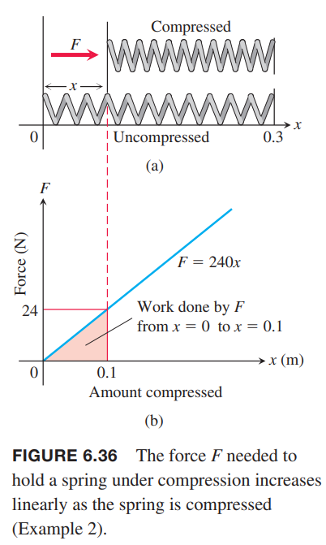
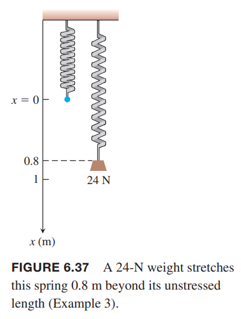
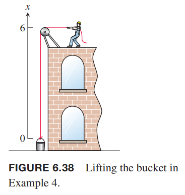
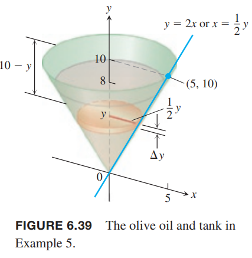
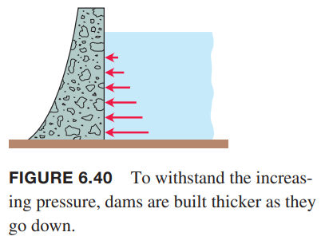
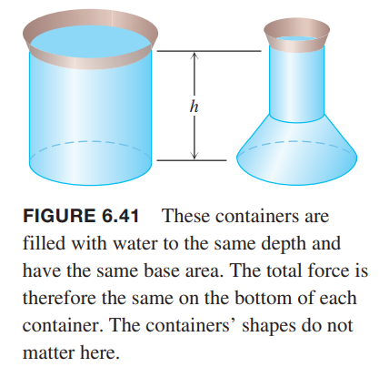
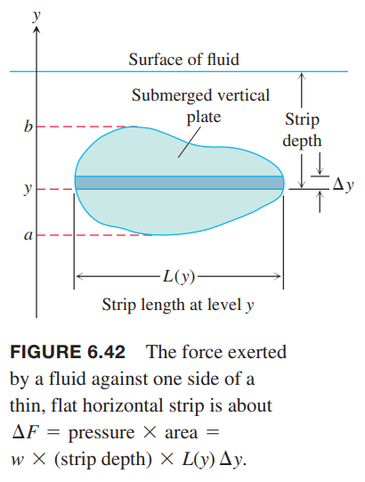
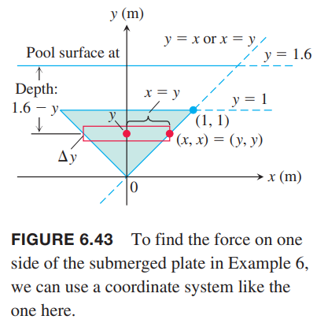

### 恒力做功

恒力 $F$ 作用于一个物体，沿着力的方向移动了距离 $d$，那么所做的功（work）是

$$W = Fd$$

国际单位制下，力的单位是牛顿（$\text{N}$），长度单位是米（$\text{m}$），乘积就是 $\text{N}\cdot\text{m}$，有专门的名字：焦耳（joule，$\text{J}$）。

### 沿直线的变力做功

如果沿直线的力是变力，如何求所做的功呢？和之前一样，切分、求和、取极限，转化成定积分。

**变力做功公式**
> 变力 $F(x)$ 沿着 $x$ 轴使一个物体从 $x=a$ 移动到 $x=b$ 所做的功是：
> 
> $$W = \int_a^b F(x) dx$$

如果 $F$ 的单位是牛顿，$x$ 的单位是米，那么积分的单位是焦耳。

### 胡克定律：$F=kx$

胡克定律（Hooke's Law）是说拉伸或者压缩一个弹簧所需要的力正比于偏离自然位置的距离 $x$：

$$F = kx$$

$k$ 称为弹簧系数（spring constant）。胡克定律有效的前提是力没有大到使弹簧产生永久形变。

例 1 一弹簧自然长度是 30cm，弹簧系数 $k = 240\text{ N/m}$，求压缩到 20cm 所做的功。

解：如下图所示，选择将弹簧自然平衡位置设为原点 $x=0$。

根据胡克定律有

$$F = kx = 240x$$

压缩量为 $30\text{cm} - 20\text{cm} = 10\text{cm} = 0.1\text{m}$，那么功的大小是

$$W = \int_0^{0.1} 240x dx = 120x^2\bigg|_0^{0.1} = 1.2\text{ J}$$

例 2 一弹簧自然长度是 1m。24N 的力将其拉长到 1.8m。求：

(a) 弹簧系数 $k$

(b) 拉长到超过自然长度 2m 所做的功

(c) 45N 的力能拉长到多少

解：

(a) 伸长量为 $1.8-1 = 0.8\text{m}$，根据胡克定律：

$$24 = k(0.8) \implies k = 30\text{ N/m}$$

(b) 变力

$$F(x) = 30x$$

弹簧从 0m 拉到 2m 所需要的功是

$$W = \int_0^2 30x dx = 15x^2\bigg|_0^2 = 60\text{ J}$$

(c) $F = 45\text{ N}$ 能拉长多少？代入胡克定律：

$$45 = 30x \implies x = 1.5\text{ m}$$

总长度为 $1+1.5 = 2.5\text{ m}$。

### 提物体和泵液体

例 3 一个 2kg 重的物体匀速提到 6m 高的地方。如下图所示。绳子的线密度是 0.1kg/m。求提升所作的功（重力加速度取 $g = 9.8\text{ m/s}^2$）。

解：重物的重力不变，提升重物做功是

$$2\times 9.8\times 6 = 117.6\text{ J}$$

提升到高度 $x$ 时悬挂的绳子质量是 $0.1(6-x)\text{ kg}$，所受重力是

$$F = 0.1\times 9.8(6-x)\text{ N} = 0.98(6-x)\text{ N}$$

提升绳子做功是

$$\begin{aligned}
W_{\text{rope}} &= \int_0^6 0.98(6-x) dx \\
&= \bigg[5.88x-0.49x^2\bigg]_0^6 \\
&= 17.64\text{ J}
\end{aligned}$$

所以总功大小是

$$W = 117.6 + 17.64 = 135.24\text{ J}$$

例 4 如下图所示的倒圆锥容器，装了密度为 $900\text{ kg/m}^3$（重量密度为 $8820\text{ N/m}^3$）的油，油面距离容器顶部 2m。求将油泵出容器顶部需要多少功？

解：将油切分成水平圆盘。在高度 $y$ 处的半径为 $x = y/2$，厚度为 $\Delta y$ 的圆盘薄片体积是

$$\Delta V = \pi\left(\frac{1}{2}y\right)^2\Delta y = \frac{\pi}{4}y^2\Delta y$$

提升该薄片所需的力等于其重力：

$$F(y) = 8820\cdot\frac{\pi}{4}y^2\Delta y$$

在高度 $y$ 处的油需要提升的高度是 $10-y$，所以做功的微分近似为

$$\Delta W\approx \frac{8820\pi}{4}(10-y)y^2\Delta y$$

油的高度范围从 $y=0$ 到 $y=8$，对所有薄片求和取极限得到定积分：

$$\begin{aligned}
W &= \int_0^8 \frac{8820\pi}{4}(10-y)y^2 dy \\
&= \frac{8820\pi}{4}\int_0^8 (10y^2-y^3) dy \\
&= 2205\pi\bigg[\frac{10y^3}{3}-\frac{y^4}{4}\bigg]_0^8 \\
&\approx 4{,}728{,}977\text{ J}
\end{aligned}$$

### 液体压强和压力

如下图所示。大坝所受的压强仅与深度相关。深度 $h$ 受到重量密度 $w$ 液体的压强是

$$p = wh$$

如果受到压力的面积是 $A$，那么平板水平放置时的压力是

$$F = pA = whA$$

比如，水的重量密度是 $9800\text{ N/m}^3$，容器底部是一个 $3\text{m}\times 6\text{m}$ 的矩形，深度是 1m，那么底部受到的力是

$$F = whA = 9800\times 1\times (3\times 6) = 176400\text{ N}$$

如果一个平板水平地浸入水中，那么平面受到的力按照上面的公式计算即可。如果垂直浸入水中，那么由于深度 $h$ 随位置变化，计算压力需要使用定积分。

**垂直平板流体静压力公式**
> $$F = \int_a^b w\cdot h(y)\cdot L(y) dy$$

其中 $w$ 为重量密度，$h(y)$ 为深度函数，$L(y)$ 为水平宽度函数。

例 5 一个等腰直角三角形平板，高 1m，底边长 2m，如下图所示垂直放置，底边平行于水面且距离水面 0.6m。求平板一侧所受的流体静压力。

解：建立坐标系，将顶点置于原点 $(0,0)$。三角形底的高度是 $y=1$，水面高度是 $y=1.6$。

腰所在的直线是 $x = y$，所以水平宽度为

$$L(y) = 2x = 2y$$

深度为 $h(y) = 1.6-y$，所以等腰直角三角形所受的压力是

$$\begin{aligned}
F &= \int_a^b w h(y) L(y) dy \\
&= \int_0^1 9800(1.6-y)(2y) dy \\
&= 19600\int_0^1(1.6y-y^2) dy \\
&= 19600\bigg[0.8y^2-\frac{y^3}{3}\bigg]_0^1 \\
&\approx 9147\text{ N}
\end{aligned}$$
