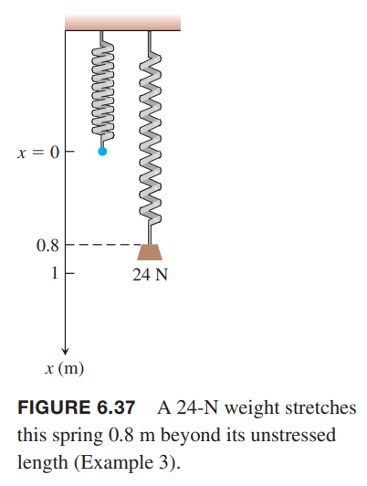

### 恒力做功
恒力 $F$ 作用于一个物体，沿着力的方向移动了距离 $d$，那么所做的功（`work`）是
$$W=Fd$$
国际单位制下，力的单位是牛顿 $N$，长度单位是 $m$，乘积就是 $N\cdot m$，有专门的名字：焦耳（`joule`）$J$。

### 沿直线的变力做功
如果沿直线的力是变力，如果求所做的功呢？和之前一样，切分，求和，求极限，转化成定积分。这里不再赘述，直接给出公式。

变力 $F(x)$ 沿着 $x$ 轴使一个物体从 $x=a$ 移动到 $x=b$ 所做的功是
$$W=\int_a^bF(x)dx$$

如果 $F$ 的单位是牛顿 $x$ 的单位是米，那么积分的单位是焦耳。

### 胡克定律：$F=kx$
胡克定律（`Hooke's Law`）是说拉伸或者压缩一个弹簧所需要的力正比于偏离自然位置的距离 $x$：
$$F=kx$$
$k$ 称为弹簧系数（`spring constant`）。胡克定律有效的前提是力没有大到使弹簧金属形变。

例2 一弹簧自然长度是 30cm，弹簧系数 $k=240N/m$，求压缩到 20cm 所做的功。  
解：如下图所示，选择将弹簧的一端固定到 $x=30cm$ 处，这样力的公式非常简单。  
  
根据胡克定律有
$$F=kx=240x$$
那么功的大小是
$$W=\int_0^{0.1}240xdx=120x^2\bigg|_0^{0.1}=1.2J$$

例3 一弹簧自然长度是 1m。24N 的力将其拉长到 1.8m。求
（a）弹簧系数 $k$  
（b）拉长到超过自然长度 2m 所做的功  
（c）45N 的力能拉长到多少  
解：（a）根据胡克定律
$$24=k(0.8)\Rightarrow k=30N/m$$
（b）变力
$$F(x)=30x$$
弹簧从 0m 拉到 2m 所需要的功是
$$W=\int_0^230xdx=15x^2\bigg|_0^2=60J$$
  
（c）$F=45N$ 能来到多长？代入胡克定律
$$45=30x,x=1.5m$$

### 提物体和泵液体
例4 一个 2kg 重的物体匀速提到 6m 高的地方。如下图所示。绳子的重量是 0.1kg/m。求提升所作的功。  
  
解：重物的重量不变，做功是
$$2\cdot 9.8\cdot 6=117.6J$$
绳子的重量是变量 $0.1\cdot(6-x)kg$，那么力是
$$F=0.1\cdot 9.8(6-x)N$$
所以做功是
$$\begin{aligned}
W&=\int_0^60.98(6-x)dx\\
&=\int_0^6(5.88-0.98)dx\\
&=\bigg[5.88x-0.49x^2\bigg]_0^6\\
&=17.64J
\end{aligned}$$
所以总功大小是 135.24J。

例5 如下图所示的锥体，装了重量为 $0.9g/cm^3$ 或 $8820 N/m^3$ 的油，距离顶部 2m。求将油泵出容器需要多少功？  
  
解：将油切分成水平圆盘。在 $y$ 到 $\Delta y$ 之间的体积是
$$\Delta V=\pi(\frac{1}{2}y)^2\Delta y=\frac{\pi}{4}y^2\Delta y$$
对应提取所需要的力等于重力
$$F(y)=\frac{8820\pi}{4}y^2\Delta y$$
在 $y$ 处的油需要提升的高度是 $10-y$，所以
$$\Delta W\approx\frac{8820\pi}{4}(10-y)y^2\Delta y$$
对 $n$ 个 $\Delta y$ 求和，$n$ 无穷大时等于定积分，所以
$$\begin{aligned}
W&=\lim_{n\to\infty}\sum_{k=1}^n\frac{8820\pi}{4}(10-y_k)y_k^2\Delta y_k\\
&=\int_0^8\frac{8820\pi}{4}(10-y)y^2dy\\
&=\frac{8820\pi}{4}\int_0^8(10y^2-y^3)dy\\
&=\frac{8820\pi}{4}\bigg[\frac{10y^3}{3}-\frac{y^4}{4}\bigg]_0^8\\
&\approx 4,728,977 J
\end{aligned}$$

### 液体压强和压力
如下图所示。大坝所受的压强仅与深度相关。深度 $h$ 受到重量密度 $w$ 液体的压强是
$$p=wh$$
  
如果受到压力的面积是 $A$，那么压力是
$$F=pA=whA$$
  
比如，水的重量密度是 9800$N/m^3$，液体底部是一个 $3m\times 6m$ 的矩形，深度是 1m，那么底部受到的力是
$$F=whA=9800\times 1\times (3\cdot 6)=176400N$$
如果一个平板水平的没入水中，那么平面受到的力按照上面的公式计算即可。如果垂直没入水中，那么由于 $h$ 是变量，计算压力使用微积分。  
  
这里还是切分，求和，$n$ 无穷多，求定积分。不再赘述，公式是
$$F=\int_a^bw\cdot h_y\cdot L(y)dy$$

例6 一个等腰直角三角形，高 1m，底边长 2m，如下图所示放置，底距离水面 0.6m。求平板所受的压力。  
  
解：顶位于坐标原点。那么水平高度是 1.6m，三角形底的高度是 1m，腰所在的直线是 $y=x$，所以
$$L(y)=2x=2y$$
深度是 $(1.6-y)$，所以等腰直角三角形所受的压力是
$$\begin{aligned}
F&=\int_a^bwh_yL(y)dy\\
&=\int_0^19800(1.6-y)2ydy\\
&=19600\int_0^1(1.6y-y^2)dy\\
&=19600\bigg[0.8y^2-\frac{y^3}{3}\bigg]_0^1\\
&=9147N
\end{aligned}$$
