### 直线上的质量
如下图所示。三个质量 $m_1,m_2,m_3$ 的物体在一条直线上。支点位于原点。  
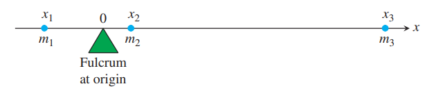  
力矩是
$$m_kgx_k$$
一般地，力矩逆时针为正，顺时针为负。系统力矩是
$$m_1gx_1+m_2gx_2+m_3gx_3$$
将 $g$ 去掉 $m_1x_1+m_2x_2+m_3x_3$ 称为系统的矩。
$$M_0=\sum m_kx_k$$
通常，存在一个点 $\bar{x}$ 使得系统的矩为零。  
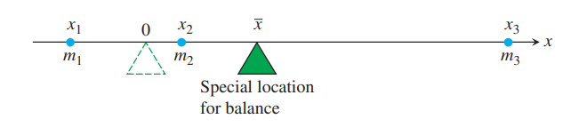  
关于 $\bar{x}$ 的系统的力矩是
$$\sum(x_k-\bar{x})m_kg$$
现在求 $\bar{x}$
$$\begin{aligned}
\sum(x_k-\bar{x})m_kg&=0\\
\bar{x}&=\frac{\sum m_kx_k}{\sum m_k}
\end{aligned}$$
点 $\bar{x}$ 称为质心。

### 细线
如果一条细线不均匀。  
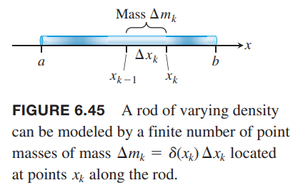  
其中很短的一段长度 $\Delta x$，质量是 $\Delta m$，线密度是
$$\delta(x)=\lim_{n\to\infty}\frac{\Delta m}{\Delta x}$$
这里就不再给出具体推导。质量、矩和质心分别是
$$M=\int_a^b\delta(x)dx$$
$$M_0=\int_a^bx\delta(x)dx$$
$$\bar{x}=\frac{M_0}{M}=\frac{\int_a^bx\delta(x)dx}{\int_a^b\delta(x)dx}$$

例1 求一段线密度为 $\delta(x)=2+3x^2$ 从 $x=1$ 到 $x=2$ 的细线的质心。  
解：质量是
$$M=\int_1^2(2+3x^2)dx=\bigg[2x+x^3\bigg]_1^2=9$$
矩是
$$M_0=\int_1^2x(2+3x^2)dx=\bigg[x^2+\frac{3x^4}{4}\bigg]_1^2=\frac{57}{4}$$
所以质心是
$$\bar{x}=\frac{M_0}{M}=\frac{57}{4\cdot 9}=\frac{19}{12}$$

### 平面上的质量分布
如下图所示，点 $(x_k,y_k)$ 处的质量是 $m_k$，那么系统质量是
$$M=\sum m_k$$
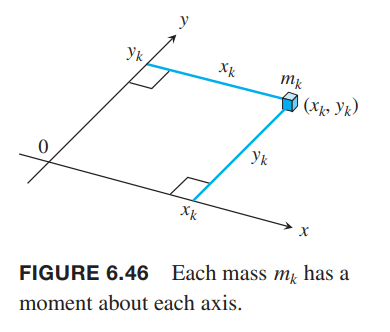  
每一个质量 $m_k$ 关于每个轴有对应的矩。关于 $x$ 轴是 $m_ky_k$，关于 $y$ 轴是 $m_kx_k$，那么系统的矩是
$$M_x=\sum m_ky_k$$
$$M_y=\sum m_kx_k$$
系统质心的 $x$ 坐标是
$$\bar{x}=\frac{M_y}{M}=\frac{\sum m_kx_k}{\sum m_k}$$
系统关于 $x=\bar{x}$ 平衡。如下图所示。  
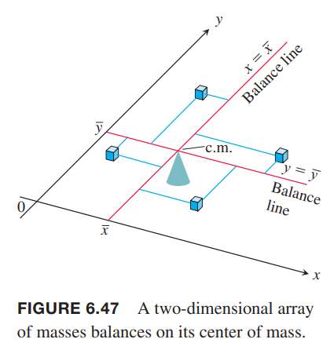  
同样地，系统质心的 $y$ 坐标是
$$\bar{y}=\frac{M_x}{M}=\frac{\sum m_ky_k}{\sum m_k}$$
系统关于 $y=\bar{y}$ 平衡。质量力矩左右抵消，仿佛质量集中于点 $(\bar{x}, \bar{y})$，这就是系统的质心。

### 薄的平板
如下图所示，我们把平板分割成若干条带子。带子的质心位于 $(\tilde{x},\tilde{y})$，即带子的质量 $\Delta m$ 都集中于 $(\tilde{x},\tilde{y})$。  
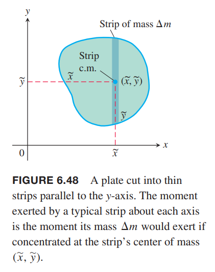  
关于 $y$ 轴的矩是 $\tilde{x}\Delta m$，关于 $x$ 轴的矩是 $\tilde{y}\Delta m$。所以质心位于
$$\bar{x}=\frac{M_y}{M}=\frac{\sum \tilde{x}\Delta m}{\sum \Delta m}$$
$$\bar{y}=\frac{M_x}{M}=\frac{\sum \tilde{y}\Delta m}{\sum \Delta m}$$
随着带子的宽度越来越小，黎曼和的极限就是定积分。所以
$$\begin{aligned}
M_x&=\int\tilde{y}dm\\
M_y&=\int\tilde{x}dm\\
M&=\int dm\\
\bar{x}&=\frac{M_x}{M},\bar{y}\frac{M_y}{M}
\end{aligned}$$

微分 $dm$ 是这些带子的质量，比如平面密度 $\delta$ 是常数或者是 $x$ 的连续函数，那么 $dm=\delta dA$，其中 $dA$ 是带子的面积。  

例2 如下图所示，三角形的平面密度是常量 $\delta = 3 g/cm^2$，求  
（a）关于 $y$ 轴的矩 $M_y$  
（b）平面质量 $M$  
（c）质心的 $x$ 坐标  
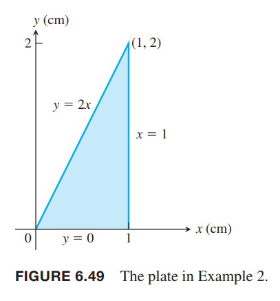  
解：方法一，垂直划分带子。  
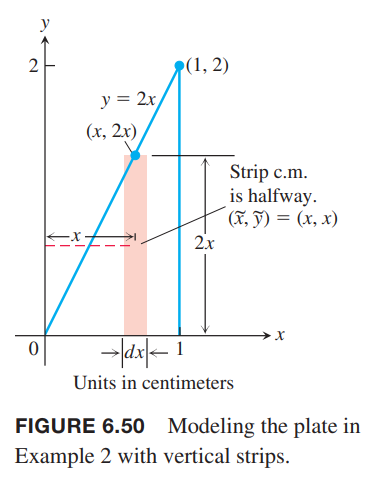  
（a）每条带子的质心是
$$(\tilde{x},\tilde{y})=(x,x)$$
长度是
$$2x$$
宽度是
$$dx$$
面积是
$$dA=2xdx$$
质量是
$$dm=\delta dA=3\cdot 2xdx=6x$$
带子关于 $y$ 轴的矩是
$$\tilde{x}dm=x(6xdx)=6x^2dx$$
积分
$$M_y=\int\tilde{x}dm=\int_0^16x^2dx=2x^3\bigg|_0^1=2g\cdot cm$$
（b）质量是
$$M=\int dm=\int_0^1 6xdx=3x^2\bigg|_0^1=3g$$
（c）质心的 $x$ 坐标是
$$\bar{x}=\frac{M_y}{M}=\frac{2}{3}cm$$
方法二，水平划分带子。  
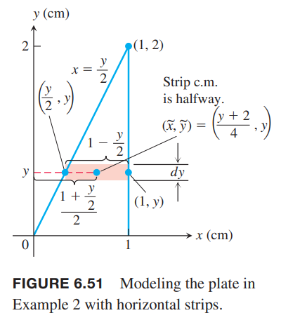  
（a）带子在 $y$ 轴上的质心是
$$\tilde{y}=y$$
带子在 $x$ 轴的左边界是 $y/2$，有边界是 $1$，所以
$$\tilde{x}=\frac{1+\frac{y}{2}}{2}=\frac{y+2}{4}$$
如图带子的长度是
$$1-\frac{y}{2}=\frac{2-y}{2}$$
宽度是
$$dy$$
面积是
$$dA=\frac{2-y}{2}dy$$
质量是
$$dm=\delta dA=3\cdot\frac{2-y}{2}dy$$
那么带子关于 $y$ 的矩是
$$\tilde{x}dm=\frac{y+2}{4}\cdot 3\cdot\frac{2-y}{2}dy=\frac{3}{8}(4-y^2)dy$$
求积分
$$M_y=\int\tilde{x}dm=\int_0^2\frac{3}{8}(4-y^2)dy=\frac{3}{8}\bigg[4y-\frac{y^3}{3}\bigg]_0^2\frac{3}{8}\frac{16}{3}=2g\cdot cm$$
（b）平面质量是
$$M=\int dm=\int_0^2\frac{3}{2}(2-y)dy=\frac{3}{2}\bigg[2y-\frac{y^2}{2}\bigg]_0^2=3g$$
（c）质心的 $x$ 坐标是
$$\bar{x}=\frac{M_y}{M}=\frac{2}{3}cm$$

如果质量分布关于某个轴对称，那么质心在这条轴上。如果关于两条轴对称，那么质心的两条轴的交点处。这可以用于简化计算。

例3 如下图所示。平面是由 $x$ 轴和 $y=4-x^2$ 围成的。平面密度 $\delta=2x^2$。求质心。  
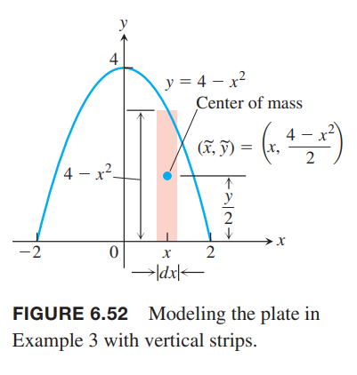  
解：平面和密度分布关于 $y$ 轴对称，所以 $\bar{x}=0$。垂直划分。所以带子的质心是
$$(\tilde{x},\tilde{y})=(x,\frac{4-x^2}{2})$$
长度是
$$4-x^2$$
宽度是
$$dx$$
面积是
$$dA=(4-x^2)dx$$
质量是
$$dm=\delta dA=2x^2(4-x^2)dx$$
关于 $x$ 轴的矩是
$$\tilde{y}dm=2x^2(4-x^2)\frac{4-x^2}{dx}=x^2(4-x^2)^2dx$$
积分
$$\begin{aligned}
M_x&=\int\tilde{y}dm\\
&=\int_{-2}^2x^2(4-x^2)^2dx\\
&=\int_{-2}^2(16x^2-16x^4+x^6)dx\\
&=\frac{2048}{105}
\end{aligned}$$
质量是
$$\begin{aligned}
M&=\int dm\\
&=\int_{-2}^22x^2(4-x^2)dx\\
&=\int_{-2}^2(8x^2-2x^4)dx\\
&=\frac{256}{15}
\end{aligned}$$
质心的 $y$ 坐标是
$$\bar{y}=\frac{M_x}{M}=\frac{2048}{105}\frac{15}{256}=\frac{8}{7}$$

### 两条曲线围成的平板
假设一个区域由 $a\leq x\leq b$、$y=g(x),y=f(x)$ 围成，其中 $f(x)\leq g(x)$。如下图所示。  
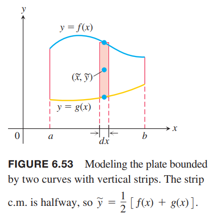  
垂直划分的带子的重心是
$$(\tilde{x},\tilde{y})=(x,\frac{1}{2}[f(x)+g(x)])$$
长度是
$$f(x)-g(x)$$
宽度是
$$dx$$
面积是
$$dA=[f(x)-g(x)]dx$$
质量是
$$dm=\delta dA=\delta[f(x)-g(x)]dx$$
平板关于 $y$ 轴的矩是
$$M_y=\int xdm=\int_a^b x\delta[f(x)-g(x)]dx$$
关于 $x$ 轴的矩是
$$\begin{aligned}
M_x&=\int ydm\\
&=\int_a^b\frac{1}{2}[f(x)+g(x)]\cdot\delta[f(x)-g(x)]dx\\
&=\int_a^b\frac{\delta}{2}[f^2(x)-g^2(x)]dx
\end{aligned}$$
所以质心的坐标是
$$\bar{x}=\frac{1}{M}\int_a^b x\delta[f(x)-g(x)]dx$$
$$\bar{y}=\frac{1}{M}\int_a^b\frac{\delta}{2}[f^2(x)-g^2(x)]dx$$

例4 求由曲线 $g(x)=x/2,f(x)=\sqrt{x},0\leq x\leq 1$ 围成的平板（如下图所示）的质心，平面密度 $\delta(x)=x^2$。  
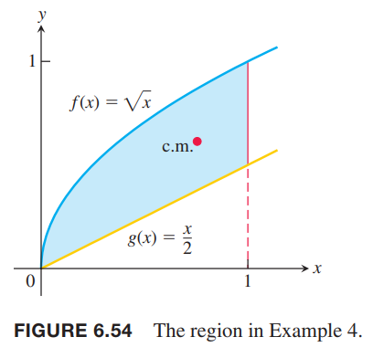  
解：首先计算质量。$dm=\delta[f(x)-g(x)]$，积分
$$\begin{aligned}
M&=\int_0^1x^2(\sqrt{x}-\frac{x}{2})dx\\
&=\int_0^1(x^{5/2}-\frac{x^3}{2})dx\\
&=\bigg[\frac{2}{7}x^{7/2}-\frac{x^4}{8}\bigg]_0^1\\
&=\frac{9}{56}
\end{aligned}$$
那么
$$\begin{aligned}
\bar{x}&=\frac{56}{9}\int_0^1x^2\cdot x(\sqrt{x}-\frac{x}{2})dx\\
&=\frac{5}{9}\int_0^1(x^{7/2}-\frac{x^4}{2})dx\\
&=\frac{56}{9}\bigg[\frac{2}{9}x^{9/2}-\frac{x^5}{10}\bigg]\\
&=\frac{308}{405}
\end{aligned}$$
$$\begin{aligned}
\bar{y}&=\frac{56}{9}\int_0^1\frac{x^2}{2}(x-\frac{x^2}{4})dx\\
&=\frac{28}{9}\int_0^1(x^3-\frac{x^4}{4})dx\\
&=\frac{28}{9}\bigg[\frac{x^4}{4}-\frac{x^5}{20}\bigg]\\
&=\frac{28}{45}
\end{aligned}$$

### 形心
例4 的重心不在其几何中心上，原因是密度分布不均匀。当密度是常量时，重心 $(\bar{x},\bar{y})$ 就是几何中心，也称为形心（`centroid`）。通常，我们令 $\delta$ 为零计算形心。

例5 半径为 $a$ 的半圆，线密度为常量 $\delta$，求质心（形心）。  
解：半圆的函数是 $y=\sqrt{a^2-x^2}$。如下图所示。质量分布关于 $y$ 轴对称，所以 $\bar{x}=0$。为了求 $\bar{y}$，我们把图像切割成若干个小的弧线。令角 $\theta$ 对应的一小段弧的重心是 $(\tilde{x},\tilde{y})$，那么 $\tilde{y}=a\sin\theta$。一小段弧对应的角度是 $d\theta$，那么弧长是 $ds=ad\theta$。  
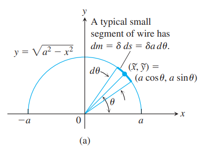  
质量是
$$dm=\delta ds=\delta ad\theta$$
因此
$$\begin{aligned}
\bar{y}&=\frac{\int\tilde{y}dm}{\int dm}\\
&=\frac{\int_0^\pi a\sin\theta\delta ad\theta}{\int_0^\pi \delta ad\theta}\\
&=\frac{\delta a^2\cdot -\cos\theta\bigg|_0^\pi}{\delta a\pi}\\
&=\frac{2}{\pi}a
\end{aligned}$$
那么重心在 $(0,\frac{2}{\pi}a)$，大约在原点向上三分之二处。如下图所示。上面的推导过程中，分子分母上的 $\delta$ 抵消了，所以我们可以令 $\delta=1$ 来解决 $\bar{y}$。  
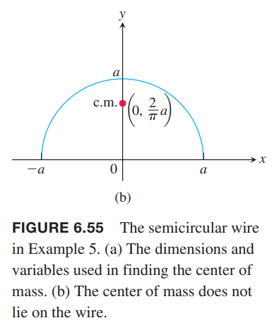

### 流体力学与形心
如下图所示。如果我们知道一个平板的形心，那么有简便方法计算平板某一面在液体中的压力。结合上一节中的压力公式和关于 $x$ 轴的矩的定义，我们有
$$\begin{aligned}
F&=\int_a^bwh_yL(y)dy\\
&=w\int_a^bh_yL(y)dy
\end{aligned}$$
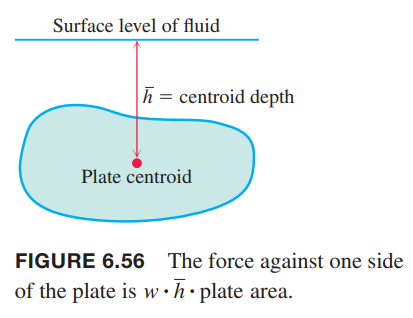  
上式积分式子就等价于平板关于液体平面的矩，即面积乘以形心深度。所以一个面积为 $A$ 的平板垂直浸入在密度 $w$ 的液体中，形心距离表面 $\bar{h}$，那么平板一个面受到的力
$$F=w\bar{h}A$$

例6 上一个节中的例6，一个等腰三角形底长 2m，高 1m，浸入水中，底平行于水面向上，距离水面 0.6m，三角形顶点在原点。求压力。  
解：等腰直角三角形的形心在距离底三分之一处，那么形心坐标 $y=\frac{2}{3}$，那么 $\bar{h}=\frac{1}{3}+\frac{3}{5}=\frac{14}{15}$。面积
$$A=\frac{1}{2}\cdot 2\cdot 1=1$$
所以
$$F=w\bar{h}A=9800\cdot\frac{14}{15}\cdot 1=9147N$$

### 帕普斯定理
四世纪的古希腊人帕普斯（`Pappus`）发现两条定理，将形心与旋转体的体积和表面积联系了起来，可以容易的计算体积和表面积。

**定理1 - 帕普斯体积定理**  
如果一个区域绕着某个不相交的轴旋转，其体积等于区域的面积乘以形心旋转走过的距离。如果用 $\rho$ 表示形心距离旋转轴的距离，那么
$$V=2\pi\rho A$$

证明：如下图所示，区域 $R$ 绕着 $x$ 轴旋转。  
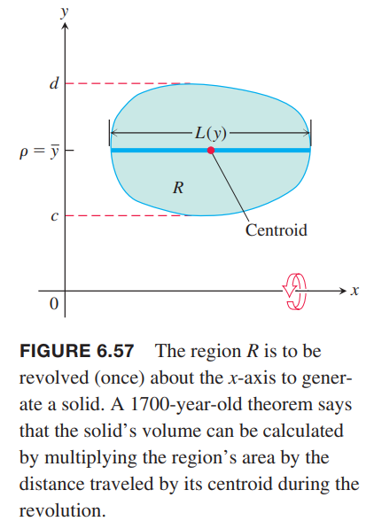  
令 $L(y)$ 是水平带子的长度，假设其连续。我们使用圆柱壳法求体积。
$$V=\int_c^d2\pi yL(y)dy$$
$R$ 的形心的纵坐标是
$$\bar{y}=\frac{\int_c^d\tilde{y}dA}{A}=\frac{\int_c^dyL(y)dy}{A}$$
所以
$$V=2\pi\bar{y}A$$
将 $\bar{y}$ 换成 $\rho$ 即为前面的公式。

例7 半径为 $a$ 的圆，绕着距离圆心 $b\geq a$ 的轴旋转。求体积。  
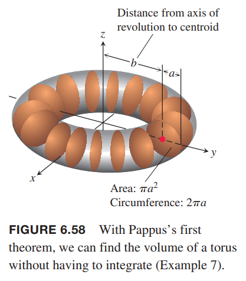  
解：应用帕普斯定理。面积 $A=\pi a^2$，圆心就是圆的形心，所以 $\rho=b$，所以
$$V=2\pi(b)A=2\pi^2ba^2$$

下一个例子说明如何利用这个定理求形心，前提是其面积和体积很容易得到。

例8 求半径为 $a$ 的半圆的形心。  
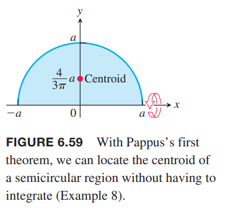  
解：如上图所示。半圆函数是 $y=\sqrt{a^2-x^2}$，绕着 $x$ 轴旋转得到了一个球体。由于半圆关于 $y$ 轴对称，所以形心的 $\bar{x}=0$。利用帕普斯定理求 $\bar{y}$。
$$\bar{y}=\frac{V}{2\pi A}=\frac{4/3 \pi a^3}{2\pi\cdot (1/2)\pi a^2}=\frac{4}{3\pi}a$$

**定理2 - 帕普斯表面积定理**  
一曲线长 $L$，绕与曲线不相交的轴旋转得到一个图形，其表面积等于曲线长乘以形心旋转走过的距离。
$$S=2\pi\rho L$$

证明：如下图所示。曲线横坐标从 $x=a$ 到 $x=b$。  
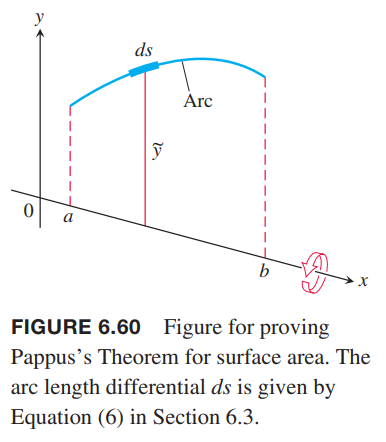  
通过积分计算表面积
$$S=\int_a^b 2\pi yds=2\pi\int_a^byds$$
曲线的形心的纵坐标是
$$\bar{y}=\frac{\int_a^byds}{\int_a^bds}=\frac{\int_a^byds}{L}$$
所以
$$S=2\pi\bar{y}L$$

例9 求例7 中甜甜圈的表面积。  
解：周长 $L=2\pi a$，形心到轴的距离 $\rho=b$，所以
$$S=2\pi\cdot b\cdot 2\pi a=4\pi^2 ab$$
