### 直线上的质量

如下图所示。三个质量为 $m_1, m_2, m_3$ 的物体在一条直线上。支点位于原点。

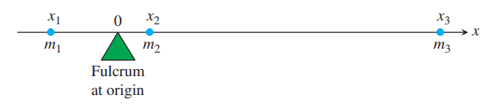

力矩是

$$m_k g x_k$$

一般地，力矩逆时针为正，顺时针为负。系统力矩是

$$m_1 g x_1 + m_2 g x_2 + m_3 g x_3$$

将 $g$ 去掉，$m_1 x_1 + m_2 x_2 + m_3 x_3$ 称为系统的矩（moment）：

$$M_0 = \sum m_k x_k$$

通常，存在一个点 $\bar{x}$ 使得系统的矩为零。

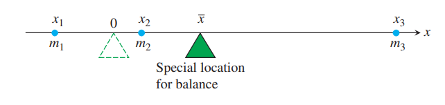

关于 $\bar{x}$ 的系统的力矩是

$$\sum (x_k-\bar{x})m_k g$$

现在求 $\bar{x}$：

$$\begin{aligned}
\sum(x_k-\bar{x})m_k g &= 0 \\
\bar{x} &= \frac{\sum m_k x_k}{\sum m_k}
\end{aligned}$$

点 $\bar{x}$ 称为质心（center of mass）。

### 细线

如果一条细线密度不均匀。

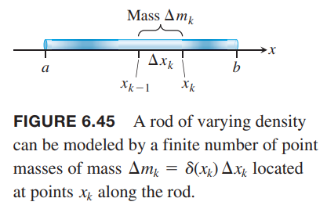

其中很短的一段长度 $\Delta x$，质量是 $\Delta m$，线密度是

$$\delta(x) = \lim_{\Delta x\to 0}\frac{\Delta m}{\Delta x}$$

质量、矩和质心分别是：

$$M = \int_a^b \delta(x) dx$$

$$M_0 = \int_a^b x\delta(x) dx$$

$$\bar{x} = \frac{M_0}{M} = \frac{\int_a^b x\delta(x) dx}{\int_a^b \delta(x) dx}$$

例 1 求一段线密度为 $\delta(x) = 2+3x^2$ 从 $x=1$ 到 $x=2$ 的细线的质心。

解：质量是

$$M = \int_1^2(2+3x^2) dx = \bigg[2x+x^3\bigg]_1^2 = 9$$

矩是

$$M_0 = \int_1^2 x(2+3x^2) dx = \bigg[x^2+\frac{3x^4}{4}\bigg]_1^2 = \frac{57}{4}$$

所以质心是

$$\bar{x} = \frac{M_0}{M} = \frac{57/4}{9} = \frac{19}{12}$$

### 平面上的质量分布

如下图所示，点 $(x_k, y_k)$ 处的质量是 $m_k$，那么系统总质量是

$$M = \sum m_k$$

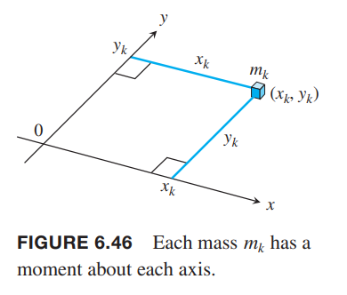

每一个质量 $m_k$ 关于每个坐标轴有对应的矩。关于 $x$ 轴是 $m_k y_k$，关于 $y$ 轴是 $m_k x_k$，那么系统的矩是

$$M_x = \sum m_k y_k$$

$$M_y = \sum m_k x_k$$

系统质心的 $x$ 坐标是

$$\bar{x} = \frac{M_y}{M} = \frac{\sum m_k x_k}{\sum m_k}$$

系统关于直线 $x=\bar{x}$ 平衡。如下图所示。

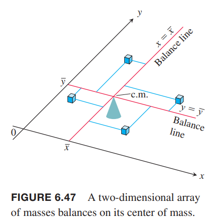

同样地，系统质心的 $y$ 坐标是

$$\bar{y} = \frac{M_x}{M} = \frac{\sum m_k y_k}{\sum m_k}$$

系统关于直线 $y=\bar{y}$ 平衡。质量力矩左右抵消，仿佛质量集中于点 $(\bar{x}, \bar{y})$，这就是系统的质心。

### 薄平板

如下图所示，我们把平板分割成若干条薄条。薄条的质心位于 $(\tilde{x}, \tilde{y})$，即薄条的质量 $\Delta m$ 都集中于 $(\tilde{x}, \tilde{y})$。

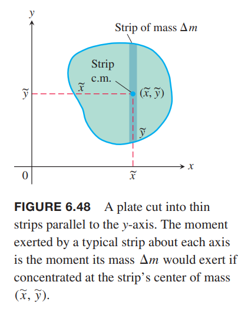

关于 $y$ 轴的矩是 $\tilde{x}\Delta m$，关于 $x$ 轴的矩是 $\tilde{y}\Delta m$。所以质心位于

$$\bar{x} = \frac{M_y}{M} = \frac{\sum \tilde{x}\Delta m}{\sum \Delta m}$$

$$\bar{y} = \frac{M_x}{M} = \frac{\sum \tilde{y}\Delta m}{\sum \Delta m}$$

随着薄条的宽度趋于 0，黎曼和的极限就是定积分。所以：

$$\begin{aligned}
M_x &= \int\tilde{y} dm \\
M_y &= \int\tilde{x} dm \\
M &= \int dm \\
\bar{x} &= \frac{M_y}{M}, \quad \bar{y} = \frac{M_x}{M}
\end{aligned}$$

微分 $dm$ 是这些薄条的质量，如果平面密度 $\delta$ 是常数或者是连续函数，那么 $dm = \delta dA$，其中 $dA$ 是薄条的面积。

例 2 如下图所示，三角形的平面密度是常量 $\delta = 3\text{ g/cm}^2$，求：

(a) 关于 $y$ 轴的矩 $M_y$

(b) 平面质量 $M$

(c) 质心的 $x$ 坐标

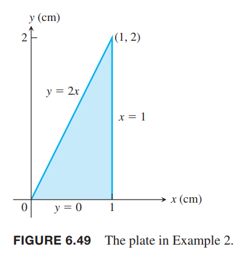

解：

方法一，垂直划分薄条。

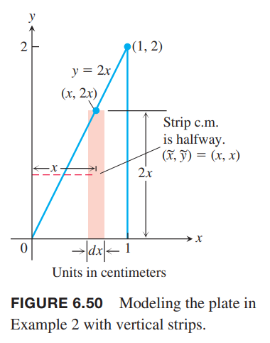

(a) 每条薄条的质心是

$$(\tilde{x}, \tilde{y}) = (x, x)$$

长度是 $2x$，宽度是 $dx$，面积是 $dA = 2x dx$，质量是

$$dm = \delta dA = 3\cdot 2x dx = 6x dx$$

薄条关于 $y$ 轴的矩是

$$\tilde{x} dm = x(6x dx) = 6x^2 dx$$

积分：

$$M_y = \int\tilde{x} dm = \int_0^1 6x^2 dx = 2x^3\bigg|_0^1 = 2\text{ g}\cdot\text{cm}$$

(b) 质量是

$$M = \int dm = \int_0^1 6x dx = 3x^2\bigg|_0^1 = 3\text{ g}$$

(c) 质心的 $x$ 坐标是

$$\bar{x} = \frac{M_y}{M} = \frac{2}{3}\text{ cm}$$

方法二，水平划分薄条。

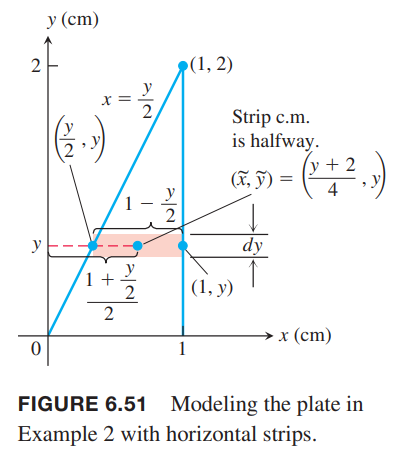

(a) 薄条在 $y$ 轴上的质心是 $\tilde{y} = y$。

薄条在 $x$ 轴的左边界是 $y/2$，右边界是 1，所以

$$\tilde{x} = \frac{1+y/2}{2} = \frac{y+2}{4}$$

薄条的长度是 $1 - y/2 = \frac{2-y}{2}$，宽度是 $dy$，面积是

$$dA = \frac{2-y}{2} dy$$

质量是

$$dm = \delta dA = 3\cdot\frac{2-y}{2} dy$$

那么薄条关于 $y$ 轴的矩是

$$\tilde{x} dm = \frac{y+2}{4}\cdot 3\cdot\frac{2-y}{2} dy = \frac{3}{8}(4-y^2) dy$$

求积分：

$$M_y = \int\tilde{x} dm = \int_0^2 \frac{3}{8}(4-y^2) dy = \frac{3}{8}\bigg[4y-\frac{y^3}{3}\bigg]_0^2 = \frac{3}{8}\cdot\frac{16}{3} = 2\text{ g}\cdot\text{cm}$$

(b) 平面质量是

$$M = \int dm = \int_0^2 \frac{3}{2}(2-y) dy = \frac{3}{2}\bigg[2y-\frac{y^2}{2}\bigg]_0^2 = 3\text{ g}$$

(c) 质心的 $x$ 坐标是

$$\bar{x} = \frac{M_y}{M} = \frac{2}{3}\text{ cm}$$

如果质量分布关于某个轴对称，那么质心在这条轴上。如果关于两条轴对称，那么质心在两条轴的交点处。这可以用于简化计算。

例 3 如下图所示。平面是由 $x$ 轴和 $y=4-x^2$ 围成的。平面密度 $\delta=2x^2$。求质心。

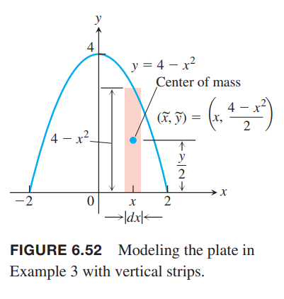

解：平面和密度分布关于 $y$ 轴对称，所以 $\bar{x}=0$。垂直划分。薄条的质心是

$$(\tilde{x}, \tilde{y}) = \left(x, \frac{4-x^2}{2}\right)$$

长度是 $4-x^2$，宽度是 $dx$，面积是 $dA = (4-x^2) dx$，质量是

$$dm = \delta dA = 2x^2(4-x^2) dx$$

关于 $x$ 轴的矩是

$$\tilde{y} dm = \frac{4-x^2}{2}\cdot 2x^2(4-x^2) dx = x^2(4-x^2)^2 dx$$

积分：

$$\begin{aligned}
M_x &= \int\tilde{y} dm \\
&= \int_{-2}^2 x^2(4-x^2)^2 dx \\
&= \int_{-2}^2 (16x^2-16x^4+x^6) dx \\
&= \frac{2048}{105}
\end{aligned}$$

质量是

$$\begin{aligned}
M &= \int dm \\
&= \int_{-2}^2 2x^2(4-x^2) dx \\
&= \int_{-2}^2 (8x^2-2x^4) dx \\
&= \frac{256}{15}
\end{aligned}$$

质心的 $y$ 坐标是

$$\bar{y} = \frac{M_x}{M} = \frac{2048/105}{256/15} = \frac{8}{7}$$

### 两条曲线围成的平板

假设一个区域由 $a\leq x\leq b, g(x)\leq y\leq f(x)$ 围成。如下图所示。

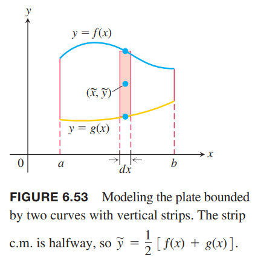

垂直划分的薄条重心是

$$(\tilde{x}, \tilde{y}) = \left(x, \frac{1}{2}[f(x)+g(x)]\right)$$

长度是 $f(x)-g(x)$，宽度是 $dx$，面积是

$$dA = [f(x)-g(x)] dx$$

质量是

$$dm = \delta dA = \delta[f(x)-g(x)] dx$$

**曲线围成平板的矩与质心公式**
> 平板关于 $y$ 轴的矩：
> 
> $$M_y = \int x dm = \int_a^b x\delta[f(x)-g(x)] dx$$
> 
> 平板关于 $x$ 轴的矩：
> 
> $$M_x = \int y dm = \int_a^b\frac{\delta}{2}[f^2(x)-g^2(x)] dx$$
> 
> 质心坐标：
> 
> $$\bar{x} = \frac{M_y}{M}, \quad \bar{y} = \frac{M_x}{M}$$

例 4 求由曲线 $g(x)=x/2, f(x)=\sqrt{x}, 0\leq x\leq 1$ 围成的平板（如下图所示）的质心，平面密度 $\delta(x)=x^2$。

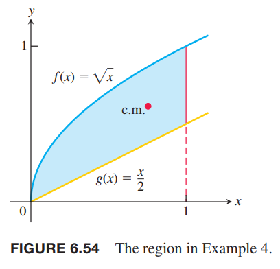

解：首先计算质量。$dm = \delta[f(x)-g(x)] dx$，积分：

$$\begin{aligned}
M &= \int_0^1 x^2\left(\sqrt{x}-\frac{x}{2}\right) dx \\
&= \int_0^1\left(x^{5/2}-\frac{x^3}{2}\right) dx \\
&= \bigg[\frac{2}{7}x^{7/2}-\frac{x^4}{8}\bigg]_0^1 \\
&= \frac{9}{56}
\end{aligned}$$

那么

$$\begin{aligned}
\bar{x} &= \frac{56}{9}\int_0^1 x^2\cdot x\left(\sqrt{x}-\frac{x}{2}\right) dx \\
&= \frac{56}{9}\int_0^1\left(x^{7/2}-\frac{x^4}{2}\right) dx \\
&= \frac{56}{9}\bigg[\frac{2}{9}x^{9/2}-\frac{x^5}{10}\bigg]_0^1 \\
&= \frac{308}{405}
\end{aligned}$$

$$\begin{aligned}
\bar{y} &= \frac{56}{9}\int_0^1\frac{x^2}{2}\left(x-\frac{x^2}{4}\right) dx \\
&= \frac{28}{9}\int_0^1\left(x^3-\frac{x^4}{4}\right) dx \\
&= \frac{28}{9}\bigg[\frac{x^4}{4}-\frac{x^5}{20}\bigg]_0^1 \\
&= \frac{28}{45}
\end{aligned}$$

### 形心

例 4 的重心不在其几何中心上，原因是密度分布不均匀。当密度是常量时，重心 $(\bar{x}, \bar{y})$ 就是几何中心，也称为形心（centroid）。通常，我们令 $\delta = 1$ 计算形心。

例 5 半径为 $a$ 的半圆弧，线密度为常量 $\delta$，求形心。

解：半圆的函数是 $y=\sqrt{a^2-x^2}$。如下图所示。质量分布关于 $y$ 轴对称，所以 $\bar{x}=0$。为了求 $\bar{y}$，我们把图像切割成若干个小的弧段。令角 $\theta$ 对应的一小段弧的重心是 $(\tilde{x}, \tilde{y})$，那么 $\tilde{y} = a\sin\theta$。一小段弧对应的角度是 $d\theta$，那么弧长是 $ds = a d\theta$。

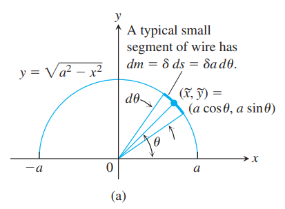

质量是

$$dm = \delta ds = \delta a d\theta$$

因此

$$\begin{aligned}
\bar{y} &= \frac{\int\tilde{y} dm}{\int dm} \\
&= \frac{\int_0^\pi a\sin\theta\cdot\delta a d\theta}{\int_0^\pi \delta a d\theta} \\
&= \frac{\delta a^2\cdot (-\cos\theta)\big|_0^\pi}{\delta a\pi} \\
&= \frac{2}{\pi}a
\end{aligned}$$

那么形心在 $(0, \frac{2}{\pi}a)$，大约在原点向上三分之二处。如下图所示。上面的推导过程中，分子分母上的 $\delta$ 抵消了，所以我们可以直接令 $\delta=1$ 求解形心。

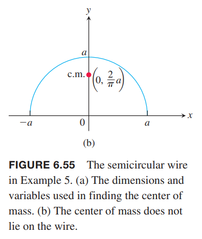

### 流体力学与形心

如下图所示。如果我们知道一个平板的形心，那么有简便方法计算平板某一面在液体中的压力。结合上一节中的压力公式和关于 $x$ 轴的矩的定义，我们有

$$\begin{aligned}
F &= \int_a^b w h(y) L(y) dy \\
&= w\int_a^b h(y) L(y) dy
\end{aligned}$$

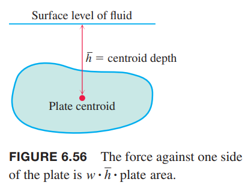

上式积分等价于平板关于液体表面的矩，即面积乘以形心深度。

**形心流体静压力公式**
> 一个面积为 $A$ 的平板垂直浸入在重量密度为 $w$ 的液体中，形心距离表面为 $\bar{h}$，那么平板一侧受到的力为：
> 
> $$F = w\bar{h}A$$

例 6 上一节中的例 5，一个等腰直角三角形底长 2m，高 1m，浸入水中，底平行于水面向上，距离水面 0.6m，三角形顶点在原点。求流体静压力。

解：等腰直角三角形的形心在距离底边三分之一处，那么形心坐标 $y = 1 - 1/3 = 2/3$，那么深度 $\bar{h} = 0.6 + (1 - 2/3) = 0.6 + 1/3 = 14/15\text{ m}$。

面积

$$A = \frac{1}{2}\cdot 2\cdot 1 = 1\text{ m}^2$$

所以

$$F = w\bar{h}A = 9800\cdot\frac{14}{15}\cdot 1 \approx 9147\text{ N}$$

### 帕普斯定理

四世纪的古希腊数学家帕普斯（Pappus）发现两条定理，将形心与旋转体的体积和表面积联系了起来，可以容易地计算体积和表面积。

**定理 1 - 帕普斯体积定理**
> 如果一个平面区域绕着平面内一条不相交的轴旋转，其体积等于区域的面积乘以形心旋转走过的周长。如果用 $\rho$ 表示形心距离旋转轴的距离，那么：
> 
> $$V = 2\pi\rho A$$

证明：如下图所示，区域 $R$ 绕着 $x$ 轴旋转。

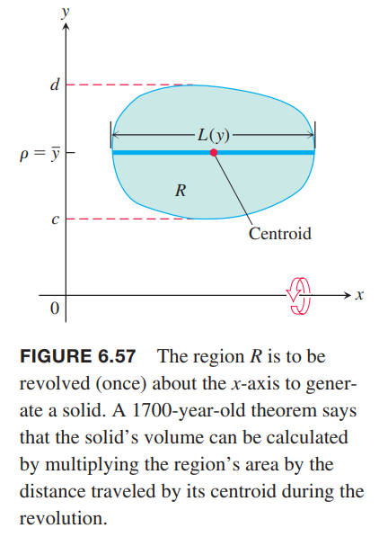

令 $L(y)$ 是水平薄条的长度，假设其连续。我们使用圆柱壳法求体积：

$$V = \int_c^d 2\pi y L(y) dy$$

$R$ 的形心的纵坐标是

$$\bar{y} = \frac{\int_c^d\tilde{y} dA}{A} = \frac{\int_c^d y L(y) dy}{A}$$

所以

$$V = 2\pi\bar{y} A$$

将 $\bar{y}$ 换成 $\rho$ 即为定理公式。

例 7 半径为 $a$ 的圆，绕着距离圆心 $b\geq a$ 的轴旋转得到圆环体（环面）。求体积。

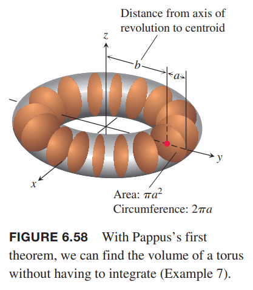

解：应用帕普斯定理。面积 $A = \pi a^2$，圆心就是圆的形心，所以 $\rho = b$，因此

$$V = 2\pi(b)A = 2\pi^2 b a^2$$

下一个例子说明如何利用这个定理求形心，前提是其面积和体积很容易得到。

例 8 求半径为 $a$ 的半圆盘的形心。

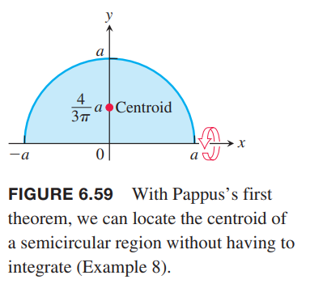

解：如上图所示。半圆函数是 $y=\sqrt{a^2-x^2}$，绕着 $x$ 轴旋转得到了一个球体。由于半圆关于 $y$ 轴对称，所以形心横坐标 $\bar{x} = 0$。利用帕普斯定理求 $\bar{y}$：

$$\bar{y} = \frac{V}{2\pi A} = \frac{\frac{4}{3}\pi a^3}{2\pi\cdot \left(\frac{1}{2}\pi a^2\right)} = \frac{4}{3\pi}a$$

**定理 2 - 帕普斯表面积定理**
> 一条平面曲线长为 $L$，绕平面内与其不相交的轴旋转得到一个曲面，其表面积等于曲线长乘以形心旋转走过的周长：
> 
> $$S = 2\pi\rho L$$

证明：如下图所示。曲线横坐标从 $x=a$ 到 $x=b$。

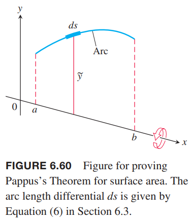

通过积分计算表面积：

$$S = \int_a^b 2\pi y ds = 2\pi\int_a^b y ds$$

曲线的形心的纵坐标是

$$\bar{y} = \frac{\int_a^b y ds}{\int_a^b ds} = \frac{\int_a^b y ds}{L}$$

所以

$$S = 2\pi\bar{y} L$$

例 9 求例 7 中圆环体的表面积。

解：圆周长 $L = 2\pi a$，形心到旋转轴的距离 $\rho = b$，所以

$$S = 2\pi b\cdot (2\pi a) = 4\pi^2 ab$$
