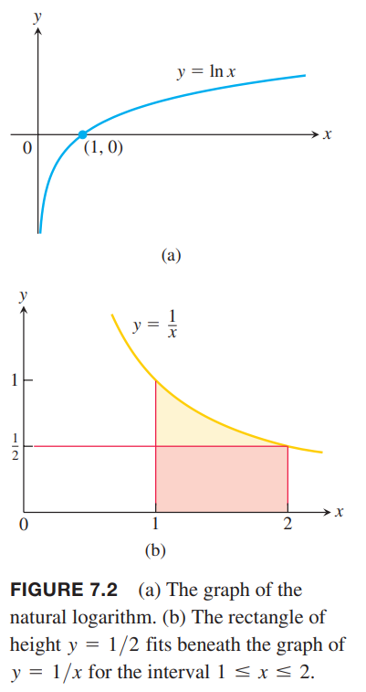
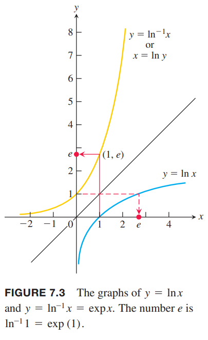
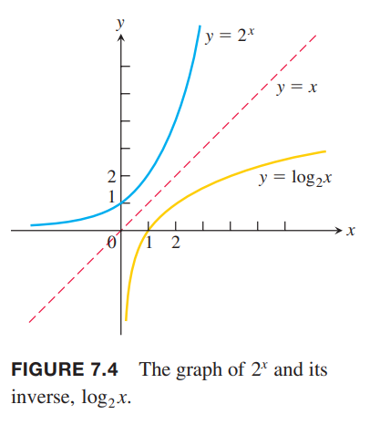

第一章中，我们说自然对数函数 $\ln x$ 是自然指数 $e^x$ 的反函数。函数 $e^x$ 是一族函数 $a^x,a>0$ 中的一个，其在 $y$ 轴交点处的斜率恰好是 1。  
这一节我们会从全新的视角来定义这些函数。首先，应用微积分基本定理以积分的形式定义自然对数函数 $\ln x$，然后分析其性质。然后定义其反函数 $e^x$，研究其性质。这看似是一种不直接的方式，且看起来有点奇怪，但是这使得我们可以用一种优雅的方式分析他们的性质。

### 自然对数函数的定义
正数 $x$ 的自然对数写作 $\ln x$，使用第五章的微积分基本定理，可以给出下面这个自然对数函数的定义
$$\ln x=\int_1^x\frac{1}{t}dt,x>0$$
从基本定理可知，$\ln x$ 是连续函数。从几何上分析，当 $x>1$ 时，$\ln x$ 对应从 $t=1$ 到 $t=x$ 图像 $1/t$ 下方的面积，如下图所示。当 $0<x<1$ 时，$\ln x$ 是从 $x$ 到 $1$ 图像下方面积的负数。$x\leq 0$ 时无定义。  
  
从定义我们可以得到
$$\ln x=\int_1^1 \frac{1}{t}dt=0$$
从 $t=1$ 到 $t=x$，我们使用矩形的有限和可以近似 $y=1/t$ 下方的面积，这样就可以近似估计对应 $x$ 的 $\ln x$ 的值。如下表所示。

| $x$ | $\ln x$ |
|--|--|
| 0 | undefined |
| 0.05 | -3.00 |
| 0.5 | -0.69 |
| 1 | 0 |
| 2 | 0.69 |
| 3 | 1.10 |
| 4 | 1.39 |
| 10 | 2.30 |

由于 $\ln x$ 是连续的，由中值定理可知在 $[2,3]$ 之间，存在一个数，其自然对数是 1。我们将这个数定义为 $e$
$$\ln(e)=\int_1^e\frac{1}{t}dt=1$$
从几何上解释，在 $[1,e]$ 这个区间上，图像 $y=1/t$ 下方的面积之和恰好是 1。如上图的蓝色部分所示。之前，我们给过 $e$ 的近似值是 $2.718281828\cdots$。

### $y=\ln x$ 的导数
由微积分积分定理可以得到
$$\frac{d}{dx}\ln x=\frac{d}{dx}\int_1^x\frac{1}{t}dt=\frac{1}{x}$$
因此，函数 $y=\ln x$ 是初始值问题 $dy/dx=1/x,x>0,y(1)=0$ 的解。注意，导数永远是正数。  
如果 $u$ 是 $x$ 的可导函数且值是正数，那么 $\ln u$ 是存在的。根据链式法则有
$$\frac{d}{dx}\ln u=\frac{1}{u}\frac{du}{dx}$$
3.8 小节的例3 我们求解过 $y=\ln |x|$ 的导数
$$\frac{d}{dx}\ln |x|=\frac{1}{x},x\neq 0$$
如果 $b$ 是常量，且有 $bx>0$ 那么
$$\frac{d}{dx}\ln bx=\frac{1}{bx}\frac{d}{dx}(bx)=\frac{1}{bx}\cdot b=\frac{1}{x}$$

### $\ln x$ 的值域和图像
由于 $dy/dx=1/x,x>0$ 是正数，所以 $\ln x$ 是递增函数。二阶导 $-1/x^2$ 是负数，所以函数图像上凸。如下图所示。  
  
$\ln x$ 有下面这些属性，下一个小节会给出严格的证明。

$$\begin{aligned}
\ln bx&=\ln b+\ln x\\
\ln \frac{b}{x}&=\ln b-\ln x\\
\ln \frac{1}{x}&=-\ln x\\
\ln x^r&=r\ln x, r \text{ rational}
\end{aligned}$$
我们可以根据上图估算 $\ln 2$ 的值。图像下方是一个宽 1 高 0.5 的矩形，所以面积是 1/2，所以
$$\ln 2>\frac{1}{2}$$
进而可以得到
$$\ln 2^n=n\ln 2>n(\frac{1}{2})=\frac{n}{2}$$
这也告诉我们当 $n\to\infty$ 时有 $\ln (2^n)\to\infty$。由于 $\ln x$ 是递增函数，所以
$$\lim_{x\to\infty}\ln x=\infty$$
同时
$$\lim_{x\to 0^-}\ln x=\lim_{t\to\infty}\ln t^{-1}=\lim_{t\to\infty}(-\ln t)=-\infty$$
我们定义 $y=\ln x,x>0$，所以其定义域是所有正实数。根据上述的讨论和中值定理，其值域是整个实数集。

### 积分 $\int 1/udu$
如果 $u$ 是可导函数且值域不为零，那么
$$\int\frac{1}{u}du=\ln|u|+C$$
上式要求 $u\neq 0$。形如 $\int\frac{du}{u}$ 的积分结果是对数函数。当 $u=f(x)$ 可导且不会为零时，我们有 $du=f'(x)dx$，所以
$$\int\frac{f'(x)}{f(x)}dx=\ln|f(x)|+C$$

例1 形如 $\int\frac{du}{u}$ 的积分
$$\begin{aligned}
\int_{-\pi/2}^{\pi/2}\frac{4\cos\theta}{3+2\sin\theta}d\theta&=\int_1^5\frac{2}{u}du\\
&=2\ln|u|\bigg|_1^5\\
&=2\ln 5-2\ln 1\\
&=2\ln 5
\end{aligned}$$
其中 $u=3+2\sin\theta$ 在$[-\pi/2,\pi/2]$ 上总是正数。

### $\ln x$ 的反函数和数 $e$
函数 $\ln x$ 的定义域是 $(0,\infty)$ 值域是 $(-\infty,\infty)$，那么其反函数 $\ln^{-1} x$ 的定义域是 $(-\infty,\infty)$ 值域是 $(0,\infty)$。两个函数的图像关于 $y=x$ 对称。如下图所示。  
  
$$\lim_{x\to\infty}\ln^{-1}x=\infty$$
$$\lim_{x\to-\infty}\ln^{-1}x=0$$
我们用 $\exp x$ 表示 $\ln^{-1} x$，注意这时我们还没有说 $\exp x$ 是指数函数，只是自然对数函数的反函数。  
数 $e$ 的定义是满足 $\ln e=1$ 的数，所以 $e=\exp(1)$。使用代数，可以得到实数 $r$ 对应的 $e^r$
$$e^2=e\cdot e,e^{-2}=\frac{1}{e^2},e^{1/2}=\sqrt{e},e^{2/3}=\sqrt[3]{e^2}$$
由于 $e$ 是正数，那么 $e^r$ 也是正数，那么 $e^r$ 存在对数。所以对所有实数 $r$ 有
$$\ln e^r=r\ln e=r$$
两边同时应用函数 $\ln^{-1}$
$$e^r=\exp r$$
这时，才有 $\exp r$ 是指数函数，底是 $e$。不过还没有给出 $x$ 是无理数时的 $e^x$ 定义。从 $\exp x$，即 $\ln^{-1} x$ 的定义域是整体实数，可以得到上面的式子对任意实数都是成立的。所以对任意实数 $x$，自然之数函数的定义就是
$$e^x=\exp x$$
由于 $\ln x$ 和 $e^x$ 互为反函数，所以
$$e^{\ln x}=x, x>0$$
$$\ln e^x=x,x\in(-\infty,\infty)$$

### $e^x$ 的积分和微分
因为指数函数的反函数可导，且导数不为零，所以指数函数也可导。根据 3.8 节的定理 3 和 $\ln x$ 的导数推导 $e^x$ 的导数。已知
$$f(x)=\ln x,y=e^x=\ln^{-1}x=f^{-1}(x)$$
那么
$$\begin{aligned}
\frac{dy}{dx}&=\frac{d}{dx}e^x\\
&=\frac{d}{dx}\ln^{-1}x\\
&=\frac{d}{dx}f^{-1}(x)\\
&=\frac{1}{f'(f^{-1}(x))}\\
&=\frac{1}{f'(e^x)}\\
&=\frac{1}{\frac{1}{e^x}}\\
&=e^x
\end{aligned}$$
所以自然指数函数的导数是其自身。下一节我们会证明满足这个性质的函数只有 $e^x$ 的常数倍。根据链式法则，我们可以得到更一般的规则。如果 $u$ 是 $x$ 的可导函数，那么
$$\frac{d}{dx}e^u=e^u\frac{du}{dx}$$
由于 $e^x$ 始终大于零，所以它的导数也是正数，那么它在定义域上都是递增函数，那么
$$\lim_{x\to -\infty}e^x=0,\lim_{x\to\infty}e^x=\infty$$
所以 $x$ 轴是水平渐近线。  
由上面的公式可以得到 $e^u$ 的积分
$$\int e^udu=e^u+C$$
如果 $f(x)=e^x$，那么 $f'(0)=e^0=1$，也就是说，当 $x=0$ 时，即和 $y$ 轴的交点上，其斜率是 1。这和 3.3 节得到的结论一致。

### 指数法则
由 $e^x$ 是 $\ln x$ 的反函数和对数法则可以得到下列指数法则。下一节会给出证明。
$$\begin{aligned}
e^{x_1}\cdot e^{x_2}&=e^{x_1+x_2}\\
e^{-x}&=\frac{1}{e^x}\\
\frac{e^{x_1}}{e^{x_2}}&=e^{x_1-x_2}\\
(e^{x_1})^{x_2}&=e^{x_1x_2}=(e^{x_2})^{x_1}
\end{aligned}$$

### 指数函数 $a^x$
任意正数 $a$ 可以写作 $a=e^{\ln a}$，所以我们可以通过 $(e^{\ln a})^x=e^{x\ln a}$ 来表示 $a^x$。

**定义** 对于任意数 $a>0$ 和 $x$，底为 $a$ 的指数函数是
$$a^x=e^{x\ln a}$$

当 $a=e$ 时，由定义有
$$a^x=e^{x\ln a}=e^{x\ln e}=e^x$$
类似的，任意正数 $x$ 的幂函数 $f(x)=x^r$ 也可以写作 $x^r=e^{r\ln x}$，对于所有实数 $r$ 都成立。  
上面的指数法则对 $a^x$ 也都成立。比如
$$\begin{aligned}
a^{x_1}\cdot a^{x_2}&=e^{x_1\ln a}\cdot e^{x_2\ln a}\\
&=e^{x_1\ln a+x_2\ln a}\\
&=e^{(x_1+x_2)\ln a}\\
&=a^{x_1+x_2}
\end{aligned}$$
从定义出发，我们可以得到导数
$$\frac{d}{dx}a^x=\frac{d}{dx}e^{x\ln a}=\ln ae^{x\ln a}=a^x\ln a$$
通过对数微分法也可以得到相同结果。
$$\begin{aligned}
y&=a^x\\
\ln y&=x\ln a\\
\frac{1}{y}\frac{dy}{dx}&=\ln a\\
\frac{dy}{dx}&=y\ln a=a^x\ln a
\end{aligned}$$
通过链式法则，可以得到下面的结论。

如果 $a>0$ 且 $u$ 是 $x$ 的可导函数，那么 $a^u$ 也是 $x$ 的可导函数。
$$\frac{d}{dx}a^u=a^u\ln a\frac{du}{dx}$$
积分结果是
$$\int a^udu=\frac{a^u}{\ln a}+C$$

### 底为 $a$ 的对数函数
如果 $a$ 是 1 以外的正数，那么函数 $a^x$ 是一个一对一的、任一点都可导且导数不为零。所以它有一个可导的反函数。

**定义** 对任意正数 $a\neq 1$，底为 $a$ 的 $x$ 的对数函数记作 $\log_a x$，是 $a^x$ 的反函数。

$y=a^x$ 图像沿着 $y=x$ 对称就得到了 $y=\log_a x$ 的图像。如下图所示。  
  
当 $a=e$ 时，$\log_e x$ 是 $e^x$ 的反函数，即 $\ln x$。因为 $a^x$ 和 $\log_a^x$ 互为反函数，所以
$$\begin{aligned}
a^{\log_a x}&=x,x>0\\
\log_a a^x&=a
\end{aligned}$$
正如 1.5 节所述，函数 $\log_a x$ 是 $\ln x$ 的若干倍。
$$\begin{aligned}
y&=\log_a x\\
a^y&=x\\
\ln a^y&=\ln x\\
y\ln a&=\ln x\\
y&=\frac{\ln x}{\ln a}\\
\log_a x&=\frac{\ln x}{\ln a}
\end{aligned}$$
对数法则也适用于 $\log_a x$，因为将对数法则两边同时除以 $\ln a$ 即可。
$$\begin{aligned}
\ln xy&=\ln x+\ln y\\
\frac{\ln xy}{\ln a}&=\frac{\ln x}{\ln a}+\frac{\ln y}{\ln a}\\
\log_a xy&=\log_a x+\log_a y
\end{aligned}$$
四条法则如下。
$$\begin{aligned}
\log_a xy&=\log_a x+\log_a y\\
\log_a \frac{x}{y}&=\log_a x-\log_a y\\
\log_a \frac{1}{y}&=-\log_a y\\
\log_a x^y&=y\log_a x
\end{aligned}$$

### 涉及 $\log_a x$ 的微分和积分
为了找到底为 $a$ 的对数函数的微分和积分，我们把它转化为自然对数函数。如果$u$ 是 $x$ 的正的可导函数，那么
$$\begin{aligned}
\frac{d}{dx}(\log_a u)&=\frac{d}{dx}\frac{\ln u}{\ln a}\\
&=\frac{1}{\ln a}\frac{d}{dx}\ln u\\
&=\frac{1}{\ln a}\frac{1}{u}\frac{du}{dx}
\end{aligned}$$

例2 求下面式子的微分和积分。  
（a）
$$\frac{d}{dx}\log_{10}(3x+1)=\frac{1}{\ln 10}\frac{1}{3x+1}\frac{d}{dx}(3x+1)=\frac{3}{(\ln 10)(3x+1)}$$
（b）
$$\begin{aligned}
\int\frac{\log_2 x}{x}dx&=\frac{1}{\ln 2}\int\frac{\ln x}{x}dx\\
&=\frac{1}{\ln 2}\int udu\\
&=\frac{1}{\ln 2}\frac{u^2}{2}+C\\
&=\frac{(\ln x)^2}{2\ln 2}+C
\end{aligned}$$
