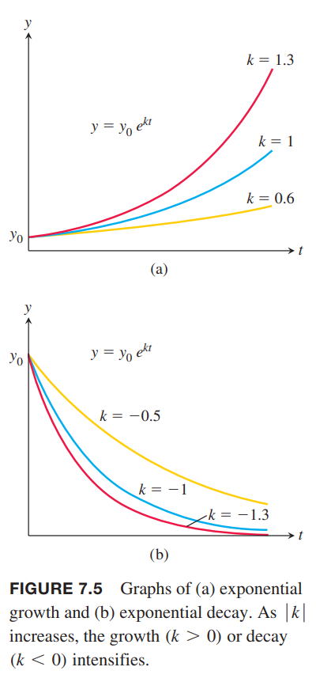
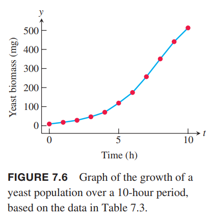
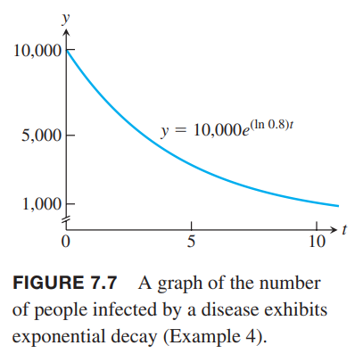

随着变量的变化，指数变化增加或者减小的非常快，能够描述很多自然和工业领域的场景，这也说明这些函数很重要。

### 指数变化
现实世界中，很多量 $y$ 在给定时间 $t$ 增长或衰减的部分正比如当前的量，比如人口的增长、放射性物质、温度的变化。这些量的变化称为指数变化（`exponential change`）。  
在 $t=0$ 时的量是 $y_0$，$y$ 关于 $t$ 的变化方程就是初始值问题
$$\frac{dy}{dt}=ky;y=y_0,t=0$$
如果 $y$ 是正数，$k$ 为正表示增长，$k$ 为负表示衰减。  
如果 $y_0=0$ 那么 $y=0$ 是方程的解。现在求解 $y_0\neq 0$ 的情况，方程两边同除 $y$
$$\begin{aligned}
\frac{1}{y}\frac{dy}{dx}&=k\\
\int\frac{1}{y}\frac{dy}{dx}dt&=\int kdt\\
\ln|y|&=kt+C\\
|y|&=e^{kt+C}\\
|y|&=e^{C}e^{kt}\\
y&=\pm e^Ce^{kt}\\
y&=Ae^{kt}
\end{aligned}$$
如果可能的话 $A=0$ 就是 $y=0$ 时的解。  
下面求初始值问题的 $A$
$$y_0=Ae^{k\cdot 0}=A$$
所以初始值问题
$$\frac{dy}{dx}=ky,y(0)=y_0$$
的解是
$$y=y_0e^{kt}$$
如果 $k>0$，那么指数增长，如果 $k<0$，那么指数衰减。如下图所示。  
  
上面的公式说明函数的导数是自身的函数只有指数函数（$k=1$）。

### 可分离微分方程
更一般的微分方程写作
$$\frac{dy}{dx}=f(x,y)$$
这里函数 $f$ 包含自变量和因变量。  
如果函数能写成如下形式，即 $f$ 写作 $x$ 的表达式乘以 $y$ 的表达式
$$\frac{dy}{dx}=g(x)H(y)$$
那么称为可分离（`separable`）的微分方程。  
将 $y,dy$ 和 $x,dx$ 分到两边得到
$$\frac{1}{H(y)}dy=g(x)dx$$
两边积分得到
$$\int\frac{1}{H(y)}dy=\int g(x)dx$$
通过代入法很容易验证
$$\begin{aligned}
\int\frac{1}{H(y)}dy&=\int\frac{1}{H(y)}\frac{dy}{dx}dx\\
&=\int\frac{1}{H(y)}g(x)H(y)dx\\
&=\int g(x)dx
\end{aligned}$$

例1 求
$$\frac{dy}{dx}=(1+y)e^x,y>-1$$
解：因为 $y>-1$ 所以 $1+y$ 不为零。分离变量
$$\begin{aligned}
\frac{dy}{dx}&=(1+y)e^x\\
\frac{dy}{1+y}&=e^xdx\\
\int\frac{dy}{1+y}&=\int e^xdx\\
\ln(1+y)&=e^x+C
\end{aligned}$$

例2 求解方程
$$y(x+1)\frac{dy}{dx}=x(y^2+1)$$
解：分离变量然后积分
$$\begin{aligned}
y(x+1)dy&=x(y^2+1)dx\\
\frac{ydy}{y^2+1}&=\frac{xdx}{x+1}\\
\int\frac{ydy}{y^2+1}&=\int(1-\frac{1}{x+1})dx\\
\frac{1}{2}\ln(y^2+1)&=x-\ln|x+1|+C
\end{aligned}$$

初始值问题
$$\frac{dy}{dx}=ky,y(0)=y_0$$
也是可分离微分方程，解 $y=y_0e^{kt}$ 表示指数变化。

### 无限人口增长
严格地将，人口数是离散的。不过人口数很大的话，可以看作是连续的函数，且是可微的，使得可以用微积分来建模和预测人口。  
假设 $t$ 时人口变化正比于 $y(t)$，即 $dy/dt=ky$，那么 $y=y_0e^{kt}$，$y_0$ 是 $t=0$ 时的人口数。这个模型有一个问题，人口会无限制的增长，但是人口往往会受到环境等因素的限制。16.4 节会讨论更严格的模型。当 $k$ 是正数时，人口就会无限增长，如下图所示。注意，这里并没有给出数据表格。  

例3 酵母培养物的量的初始值是 29 克，30 分钟之后是 37 克。假设小于 100 克时都符合无限人口增长的模型。求什么时候是初始值的两倍。  
解：模型是
$$y=y_0e^{kt}$$
且已知
$$y_0=29, y(30)=37$$
那么
$$y(30)=29e^{30k}=37$$
$$k=\frac{1}{30}\ln(\frac{37}{29})\approx 0.008118$$
所以
$$y=29e^{(0.008118)t}$$
数量翻倍
$$\begin{aligned}
29e^{(0.008118)t}&=58\\
(0.008118)t&=\ln(\frac{58}{29})\\
t&=\frac{\ln 2}{0.008118}\approx 85.38
\end{aligned}$$
所以大约在 85 分钟时数量翻倍。

例4 这是一个指数衰减的例子，即 $k$ 是负值。受到感染的人数是 $y(t)$，治愈数量正比于人数，即 $dy/dt=ky$。假设一年后受感染人数减少了 20%，现在感染人数是 10000 人，求何时感染人数是 1000 人？  
解：根据题意 $y_0=10000$，所以
$$y=10000e^{kt}$$
$t=1$ 时，减少了 20%，所以
$$\begin{aligned}
8000&=10000e^k\\
e^k&=0.8\\
k&=\ln 0.8
\end{aligned}$$
所以
$$y(t)=10000e^{(\ln 0.8) t}$$
题目给出 $y(t)=1000$，求 $t$。
$$\begin{aligned}
1000&=10000e^{(\ln 0.8)t}\\
e^{(\ln 0.8)t}&=0.1\\
(\ln 0.8)t&=\ln 0.1\\
t&=\frac{\ln 0.1}{\ln 0.8}\approx 10.32
\end{aligned}$$
大约需要 10 年感染人数会减低到 1000，如下图所示。  

### 放射性
一些原子不稳定，会进行放射性衰变。衰变速率正比于放射性物质的量，即 $dy/dt=-ky,k>0$，这里取 $k>0$ 为了强调 $y$ 的递减。如果 $y_0$ 表示初始量，那么任意时刻 $t$ 有
$$y=y_0e^{-kt},k>0$$
很容易计算得到半衰期
$$t_{\text{half}}=\frac{\ln 2}{k}$$

例5 碳14 常常用于推测历史事件的时间，其半衰期是 5730 年。问需要多久只剩余 10%。  
解：先求解 $k$。
$$k=\frac{\ln 2}{t_{\text{half}}}=\frac{\ln 2}{5730}$$
求 $t$ 使得 $e^{-kt}=0.9$。
$$\begin{aligned}
e^{-kt}&=0.9\\
e^{-(\ln 2/5730)t}&=0.9\\
-\frac{\ln 2}{5730}t&=\ln 0.9\\
t&=-\frac{5730\ln 0.9}{\ln 2}\approx 871
\end{aligned}$$

### 热传导：牛顿冷却定律
热的物体冷却的速率正比于热的物体的温度和周围温度的差，这就是牛顿冷却定律。  
如果一个物体的温度是 $H$，周围环境温度恒定为 $H_S$，那么微分方程是
$$\frac{dH}{dt}=-k(H-H_S)$$
使用 $y$ 替代 $H-H_S$，那么
$$\begin{aligned}
\frac{dy}{dt}&=\frac{d}{dt}(H-H_S)\\
&=\frac{dH}{dt}-\frac{dH_S}{dt}\\
&=\frac{dH}{dt}\\
&=-k(H-H_S)\\
&=-ky
\end{aligned}$$
解是
$$y=y_0e^{-kt},y_0=H_0-H_S$$
所以
$$H=H_S+(H_0-H_S)e^{-kt}$$

例6 煮好的鸡蛋温度是 98°C，放入 18°C 的水中，5分钟后鸡蛋温度是 38°C，水温没有明显变化，还需要多久鸡蛋温度能到 20°C？  
解：根据题意 $H_S=18,H_0=98$，那么
$$H=18+80e^{-kt}$$
由于 $H(5)=38$，所以
$$\begin{aligned}
38&=18+80e^{-5k}\\
e^{-5k}&=\frac{1}{4}\\
-5k&=\ln\frac{1}{4}=-\ln 4\\
k&=\frac{1}{5}\ln 4
\end{aligned}$$
求 $H=20$ 时的 $t$。  
$$\begin{aligned}
20&=18+e^{-(0.2\ln 4)t}\\
e^{-(0.2\ln 4)t}&=\frac{1}{40}\\
-(0.2\ln 4)t&=\ln\frac{1}{40}=-\ln 40\\
t&=\frac{5\ln 40}{\ln 4}\approx 13
\end{aligned}$$
也就是 13 分钟的时候鸡蛋温度会降到 20°C，由于已经过去了 5 分钟，所以还需要 8 分钟。
