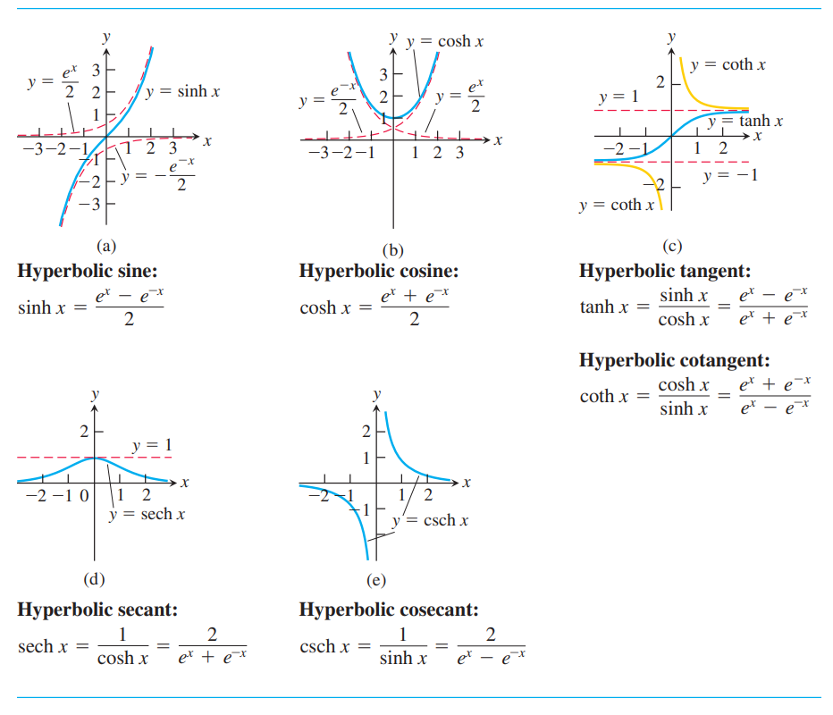
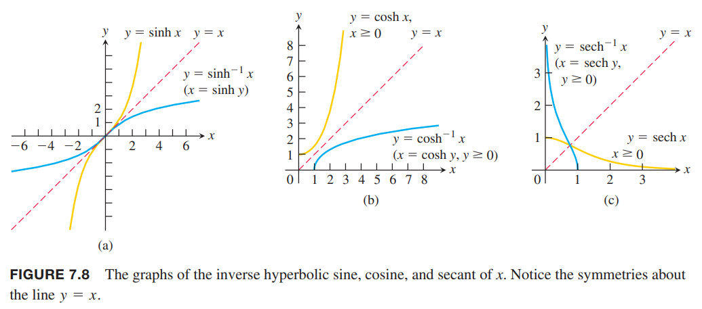
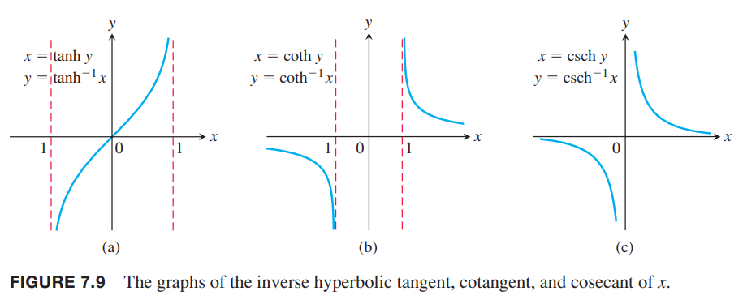

双曲函数由两个指数函数 $e^x,e^{-x}$ 组合得到，在数学和工程领域非常常见。

### 定义和恒等式
双曲正弦和双曲余弦定义如下
$$\sinh x=\frac{e^x-e^{-x}}{2}$$
$$\cosh x=\frac{e^x+e^{-x}}{2}$$
通过这对基本的例子，我们可以定义双曲正切、余切、正割、余割函数。
$$\tanh x=\frac{\sinh x}{\cosh x}=\frac{e^x-e^{-x}}{e^x+e^{-x}}$$
$$\coth x=\frac{\cosh x}{\sinh x}=\frac{e^x+e^{-x}}{e^x-e^{-x}}$$
$$\operatorname{sech} x=\frac{1}{\cosh x}=\frac{2}{e^x+e^{-x}}$$
$$\operatorname{csch} x=\frac{1}{\sinh x}=\frac{2}{e^x-e^{-x}}$$
图像如下图所示。  
  
满足如下恒等式。除了符号略有不同外，和三角函数的性质类似。
$$\cosh^2 x-\sinh^2 x=1$$
$$\sinh 2x=2\sinh x\cosh x$$
$$\cosh 2x=\cosh^2 x+\sinh^2 x$$
$$\cosh^2 x=\frac{\cosh 2x+1}{2}$$
$$\sinh^2 x=\frac{\cosh 2x-1}{2}$$
$$\tanh^2 x=1-\operatorname{sech}^2 x$$
$$\coth^2 x=1+\operatorname{csch}^2 x$$
这些恒等式都可以从定义出发得到证明。比如
$$\begin{aligned}
2\sinh x\cosh x&=2(\frac{e^x-e^{-x}}{2})(\frac{e^x+e^{-x}}{2})\\
&=\frac{e^{2x}-e^{-2x}}{2}\\
&=\sinh 2x
\end{aligned}$$
对于任意实数 $u$，点 $(\cos u,\sin u)$ 在单位圆 $x^2+y^2=1$ 上，所以三角函数也称为圆函数（`circular functions`）。恒等式的第一个
$$\cosh^2 u-\sinh^2 u=1$$
可知点 $(\cosh u,\sinh u)$ 在双曲线 $x^2-y^2=1$ 的右半边，这就是双曲函数（`hyperbolic function`）的由来。  
第八章将会看到双曲函数在求解积分时很有用。同时，他们在数学和工程领域也很有用。双曲余弦是一个绳索挂在等高的两个端点上绳索的形状。双曲正切描述了水深为常量时的波浪移动的速度。反双曲正切函数描述了在狭义相对论下的相对速度和。

### 双曲函数的微分和积分
六个双曲函数，是可导函数 $e^x,e^{-x}$ 的有理组合，所以在定义域上处处可导。如下所示。这些结论与三角函数类似。
$$\frac{d}{dx}\sinh u=\cosh u\frac{du}{dx}$$
$$\frac{d}{dx}\cosh u=\sinh u\frac{du}{dx}$$
$$\frac{d}{dx}\tanh u=\operatorname{sech}^2 u\frac{du}{dx}$$
$$\frac{d}{dx}\coth u=-\operatorname{csch}^2 u\frac{du}{dx}$$
$$\frac{d}{dx}\operatorname{sech} u=-\operatorname{sech} u\tanh u\frac{du}{dx}$$
$$\frac{d}{dx}\operatorname{csch} u=-\operatorname{csch} u\coth u\frac{du}{dx}$$
这些共识可以从 $e^u$ 推导出来。比如
$$\begin{aligned}
\frac{d}{dx}\sinh u&=\frac{d}{dx}(\frac{e^u-e^{-u}}{2})\\
&=\frac{e^udu/dx+e^{-udu/dx}}{2}\\
&=\cosh u\frac{du}{dx}
\end{aligned}$$
从定义出发，可以推导出双曲余割的导数。
$$\begin{aligned}
\frac{d}{dx}\operatorname{csch} u&=\frac{d}{dx}(\frac{1}{\sinh u})\\
&=-\frac{\cosh u}{\sinh^2 u}\frac{du}{dx}\\
&=-\frac{1}{\sinh u}\frac{\cosh u}{\sinh u}\frac{du}{dx}\\
&=-\operatorname{csch} u\coth u\frac{du}{dx}
\end{aligned}$$
其余公式可以用类似方法推导得出。  
从微分公式可以得到如下积分公式。
$$\int\sinh udu=\cosh u+C$$
$$\int\cosh udu=\sinh u+C$$
$$\int\operatorname{sech}^2 udu=\tanh u+C$$
$$\int\operatorname{csch}^2 udu=-\coth u+C$$
$$\int\operatorname{sech} u\tanh udu=-\operatorname{sech} u+C$$
$$\int\operatorname{csch} u\coth udu=-\operatorname{csch} u+C$$

例1  
（a）
$$\begin{aligned}
\frac{d}{dt}\tanh(\sqrt{1+t^2})&=\operatorname{sech}^2\sqrt{1+t^2}\frac{d}{dt}(\sqrt{1+t^2})\\
&=\frac{t}{\sqrt{1+t^2}}\operatorname{sech}^2\sqrt{1+t^2}
\end{aligned}$$
（b）
$$\begin{aligned}
\int\coth 5xdx&=\int\frac{\cosh 5x}{\sinh 5x}dx\\
&=\frac{1}{5}\int\frac{du}{u}\\
&=\frac{1}{5}\ln |u|+C\\
&=\frac{1}{5}\ln |\sinh 5x|+C
\end{aligned}$$
（c）
$$\begin{aligned}
\int_0^1\sinh^2xdx&=\int_0^1\frac{\cosh 2x-1}{2}dx\\
&=\frac{1}{2}\int_0^1(\cosh 2x-1)dx\\
&=\frac{1}{2}\bigg[\frac{\sinh 2x}{2}-x\bigg]_0^1\\
&=\frac{\sinh 2}{4}-\frac{1}{2}
\end{aligned}$$
（d）
$$\begin{aligned}
\int_0^{\ln 2}4e^x\sinh xdx&=\int_0^{\ln 2}4e^x\frac{e^x-e^{-x}}{2}dx\\
&=\int_0^{\ln 2}(2e^{2x}-2)dx\\
&=\bigg[e^{2x}-2x\bigg]_0^{\ln 2}\\
&=(e^{2\ln 2}-2\ln 2)-(e^0-0)\\
&=3-2\ln 2
\end{aligned}$$

### 反双曲函数
第八章中讲阐述六个双曲函数的反函数在积分领域是很有用的。由于 $d(\sinh x)/dx=\cosh x>0$，所以双曲正弦是 $x$ 的递增函数。我们将其反函数记作
$$y=\sinh^{-1}x$$
双曲余弦及其反函数图像如下图（a）所示。  
  
由于不能通过水平测试，所以 $y=\cosh x$ 不是一对一函数。限制定义域的函数 $y=\cosh x,x\geq 0$ 是一对一函数，有反函数
$$y=\cosh^{-1}x$$
其定义域是 $x\geq 1$。双曲余弦及其反函数图像如上图（b）所示。  
类似 $y=\cosh x$，$y=\operatorname{sech} x=\frac{1}{\cosh x}$ 也不是一对一函数，不过将定义域限制在非负数时，是一对一函数，其反函数记作
$$y=\operatorname{sech}^{-1}x$$
其定义域是 $(0,1]$。双曲正割及其反函数图像如上图（c）所示。  
其余双曲函数，双曲正切、双曲余切和双曲余割都是一对一函数，其反函数记作
$$y=\tanh^{-1}x$$
$$y=\coth^{-1}x$$
$$y=\operatorname{csch}^{-1}x$$
图像如下图所示。  

### 有用的恒等式
下面三个公式展示了反双曲函数之间的某种关系。
$$\operatorname{sech}^{-1}x=\cosh^{-1}\frac{1}{x}$$
$$\operatorname{csch}^{-1}x=\sinh^{-1}\frac{1}{x}$$
$$\coth^{-1}x=\tanh^{-1}\frac{1}{x}$$
这些恒等式可以从定义直接推导得到。比如 $0<x\leq 1$ 时，那么
$$\begin{aligned}
\operatorname{sech}(\cosh^{-1}\frac{1}{x})&=\frac{1}{\cosh(\cosh^{-1}\frac{1}{x})}\\
&=\frac{1}{\frac{1}{x}}\\
&=x
\end{aligned}$$
因为 $\operatorname{sech}(\operatorname{sech}^{-1}x)=x$，且双曲正割在 $(0,1]$ 上存在反函数，所以
$$\cosh^{-1}\frac{1}{x}=\operatorname{sech}^{-1}x$$

### 反双曲函数的微分
下面是反双曲函数的微分公式。注意，很多公式后面有适用范围。
$$\frac{d}{dx}\sinh^{-1}u=\frac{1}{\sqrt{1+u^2}}\frac{du}{dx}$$
$$\frac{d}{dx}\cosh^{-1}u=\frac{1}{\sqrt{u^2-1}}\frac{du}{dx},u>1$$
$$\frac{d}{dx}\tanh^{-1}u=\frac{1}{1-u^2}\frac{du}{dx},|u|<1$$
$$\frac{d}{dx}\coth^{-1}u=\frac{1}{1-u^2}\frac{du}{dx},|u|>1$$
$$\frac{d}{dx}\operatorname{sech}^{-1}u=-\frac{1}{u\sqrt{1-u^2}}\frac{du}{dx},0<u<1$$
$$\frac{d}{dx}\operatorname{csch}^{-1}u=-\frac{1}{|u|\sqrt{1+u^2}}\frac{du}{dx},u\neq 0$$
下面的例子将阐述其中第二个公式是如何推导的，其余的类似。

例2 证明如果 $u$ 是 $x$ 的可导函数且值大于 1，那么
$$\frac{d}{dx}\cosh^{-1}u=\frac{1}{\sqrt{u^2-1}}\frac{du}{dx}$$
证明：这里使用 3.8 节的定理3，是反函数与原函数导数的关系。这里 $f(x)=\cosh x,f^{-1}(x)=\cosh^{-1}x$
$$\begin{aligned}
(f^{-1})'(x)&=\frac{1}{f'(f^{-1}(x))}\\
&=\frac{1}{\sinh(\cosh^{-1}x)}&&&&f'(x)=\sinh x\\
&=\frac{1}{\sqrt{\cosh^2(\cosh^{-1}x)-1}}&&&&\begin{aligned}
&\cosh^2 x-\sinh^2 x=1\\
&\sinh x=\sqrt{\cosh^2 x-1}
\end{aligned}\\
&=\frac{1}{\sqrt{x^2-1}}
\end{aligned}$$
使用链式法则就可以得到
$$\frac{d}{dx}\cosh^{-1}u=\frac{1}{\sqrt{u^2-1}}\frac{du}{dx}$$
通过合适的替换，微分公式可以得到如下积分公式。每一个公式可以从右边开始进行微分来验证。
$$\int\frac{du}{\sqrt{a^2+u^2}}=\sinh^{-1}\frac{u}{a}+C,a>0$$
$$\int\frac{du}{\sqrt{u^2-a^2}}=\cosh^{-1}\frac{u}{a}+C,0<a<u$$
$$\int\frac{du}{a^2-u^2}=\begin{cases}
\frac{1}{a}\tanh^{-1}\frac{u}{a}+C,u^2<a^2\\
\frac{1}{a}\coth^{-1}\frac{u}{a}+C,u^2>a^2
\end{cases}$$
$$\int\frac{du}{u\sqrt{a^2-u^2}}=-\frac{1}{a}\operatorname{sech}^{-1}\frac{u}{a}+C,0<u<a$$
$$\int\frac{du}{u\sqrt{a^2+u^2}}=-\frac{1}{a}\operatorname{csch}^{-1}\bigg|\frac{u}{a}\bigg|+C,u\neq 0,a>0$$

例3 求
$$\int_0^1\frac{2dx}{\sqrt{3+4x^2}}$$
解：不定积分是
$$\begin{aligned}
\int\frac{2dx}{\sqrt{3+4x^2}}&=\int\frac{dx}{\sqrt{\frac{3}{4}+x^2}}\\
&=\sinh^{-1}\frac{2x}{\sqrt{3}}+C
\end{aligned}$$
因此
$$\begin{aligned}
\int_0^1\frac{2dx}{\sqrt{3+4x^2}}&=\sinh^{-1}\frac{2x}{\sqrt{3}}\bigg|_0^1\\
&=\sinh^{-1}\frac{2}{\sqrt{3}}-\sinh^{-1}0\\
&=\sinh^{-1}\frac{2}{\sqrt{3}}
\end{aligned}$$
