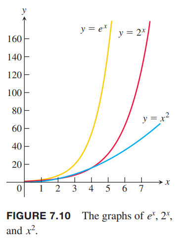
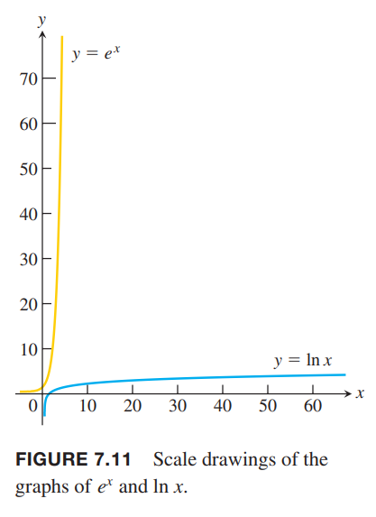

### 函数的增长速度
随着 $x$ 的增长，$2^x$ 和 $e^x$ 增长速度远远大于多项式函数。如下图所示，指数函数增长的更快。  
  
当 $x\to\infty$ 时，$2^x,e^x$ 比 $x$ 的任意次幂增长都快。相反，对数函数，如 $\log_2 x,\ln x$ 增长的要比 $x$ 的任意正数次幂都要慢。  
这里给出一个例子来解释 $e^x$ 增长的有多快。在一个黑板上有一个坐标系，当 $x=1 cm$ 时，高度只有 $e < 3 cm$；当 $x=6 cm$ 时，$e^6\approx 403 cm\approx 4m$，超过了一层楼的高度；当 $x=10 cm$ 时，$e^10\approx 22,026 cm\approx 220m$，这比绝大多数建筑都要高；当 $x=24 cm$ 时，高度达到了到月球距离的一半；当 $x=43 cm$ 时，高度足够达到距离太阳最近的恒星系统。相反，如果是对数函数 $\ln x$，在 $x$ 大约五光年的地方，高度才只有 43cm。如下图所示。  
  
下面是函数增长速度的精确定义。

**定义** 令 $f(x),g(x)$ 是正数且 $x$ 充分大。  
当 $x\to\infty$ 时，有
$$\lim_{x\to\infty}\frac{f(x)}{g(x)}=\infty$$
或
$$\lim_{x\to\infty}\frac{g(x)}{f(x)}=0$$
我们称 $f(x)$ 增长的比 $g(x)$ 更快，或 $g(x)$ 比 $f(x)$ 增长的更慢。  
当 $x\to\infty$ 时，有
$$\lim_{x\to\infty}\frac{f(x)}{g(x)}=L$$
其中 $L$ 是正数且有限，我们称 $f$ 和 $g$ 增长率一样。

根据定义，$y=2x$ 不比 $y=x$ 更快。因为增长率一样
$$\lim_{x\to\infty}\frac{2x}{x}=2$$
这里极限是正数且有限。脱离口语化的表达，这里 $f$ 比 $g$ 增长的更快意思是当 $x$ 变得充分大的时候，$g$ 相比 $f$ 可以忽略。

例1  
（a）$e^x$ 比 $x^2$ 增长更快是因为
$$\lim_{x\to\infty}\frac{e^x}{x^2}=\lim_{x\to\infty}\frac{e^x}{2x}=\lim_{x\to\infty}\frac{e^x}{2}=\infty$$
（b）$3^x$ 比 $2^x$ 增长更快是因为
$$\lim_{x\to\infty}\frac{3^x}{2^x}=\lim_{x\to\infty}(\frac{3}{2})^x=\infty$$
（c）$x^2$ 比 $\ln x$ 增长更快是因为
$$\lim_{x\to\infty}\frac{x^2}{\ln x}=\lim_{x\to\infty}\frac{2x}{1/x}=\lim_{x\to\infty}2x^2=\infty$$
（d）$\ln x$ 比 $x^{1/n}$ 增长更慢是因为
$$\lim_{x\to\infty}\frac{\ln x}{x^{1/n}}=\lim_{x\to\infty}\frac{1/x}{(1/n)x^{1/n-1}}=\lim_{x\to\infty}\frac{n}{x^{1/n}}=0$$
（e）根据（b），不同的底的指数函数增长速度不同。如果 $a>b>0$，因为 $(a/b)>1$，那么 $a^x$ 增长比 $b^x$ 更快。
$$\lim_{x\to\infty}\frac{a^x}{b^x}=\lim_{x\to\infty}(\frac{a}{b})^x=\infty$$
（f）与指数函数不同，不同底 $a>1,b>1$ 的对数函数增长速度一样。
$$\lim_{x\to\infty}\frac{\log_a x}{\log_b x}=\lim_{x\to\infty}\frac{\ln x/\ln a}{\ln x/\ln b}=\frac{\ln a}{\ln b}$$
其极限有限且不为零。

当 $x\to\infty$ 时，$f$ 和 $g$ 增长速率一样，$g$ 与 $h$ 增长速率一样，那么 $f$ 和 $h$ 增长速率一样。原因是
$$\lim_{x\to\infty}\frac{f}{g}=L_1,\lim_{x\to\infty}\frac{g}{h}=L_2$$
意味着
$$\lim_{x\to\infty}=\frac{f}{h}=\lim_{x\to\infty}\frac{f}{g}\frac{g}{h}=L_1L_2$$
而 $L_1,L_2$ 非零且有限，所以 $L_1L_2$ 非零且有限。

例2 证明当 $x\to\infty$ 时 $\sqrt{x^2+5}$ 与 $(2\sqrt{x}-1)^2$ 增长速率一样。  
证明：我们证明这两个函数都与 $g(x)=x$ 增长速率一样。
$$\lim_{x\to\infty}\frac{\sqrt{x^2+5}}{x}=\lim_{x\to\infty}\sqrt{1+\frac{5}{x^2}}=1$$
$$\lim_{x\to\infty}\frac{(2\sqrt{x}-1)^2}{x}=\lim_{x\to\infty}(\frac{2\sqrt{x}-1}{\sqrt{x}})^2=\lim_{x\to\infty}(2-\frac{1}{\sqrt{x}})^2=4$$

### 阶与记号$O$
数论研究人员在一百多年前发明了大 $O$ 与小 $o$ 记号，现在广泛用于数学分析与计算机科学。根据定义，当 $x\to\infty$ 时，$f=o(g)$ 意思是 $f$ 比 $g$ 增长慢。

**定义** 当 $x\to\infty$ 时，如果
$$\lim_{x\to\infty}\frac{f(x)}{g(x)}=0$$
我们称 $f$ 的阶比 $g$ 小，是低阶函数。记作
$$f=o(g)$$

例3 小 $o$ 记号的例子。  
（a）由于
$$\lim_{x\to\infty}\frac{\ln x}{x}=0$$
所以有
$$\ln x=o(x),x\to\infty$$
（b）由于
$$\lim_{x\to\infty}\frac{x^2}{x^3+1}=0$$
所以有
$$x^2=o(x^3+1),x\to\infty$$

**定义** 对于充分大的 $x$，$f(x),g(x)$ 都是正数。如果存在一个正数 $M$ 使得当 $x\to\infty$ 时有
$$\frac{f(x)}{g(x)}=M$$
那么 $f$ 至多与 $g$ 同阶。记作
$$f=O(g)$$

例4 大 $O$ 记号的例子。  
（a）由于 $x$ 充分大时有
$$\frac{x+\sin x}{x}\leq 2$$
所以有
$$x+\sin x=O(x),x\to\infty$$
（b）当 $x\to\infty$ 时有
$$\frac{e^x+x^2}{e^x}\to 1$$
所以当 $x\to\infty$ 时
$$e^x+x^2=O(e^x)$$
（c）当 $x\to\infty$ 时有
$$\frac{x}{e^x}\to 0$$
所以当 $x\to\infty$ 时
$$x=O(e^x)$$

对于充分大的 $x$，$f=o(g)$ 隐含着 $f=O(g)$。如果 $f,g$ 增长速率相同，那么 $f=O(g),g=O(f)$。
