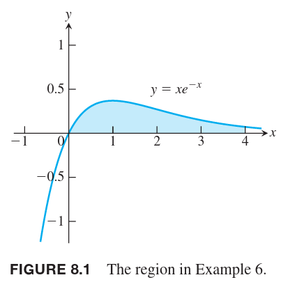

分部积分法可以简化形如下面的积分式子
$$\int u(x)v'(x)dx$$
当可以容易地对 $u(x)$ 反复微分，对 $v'(x)$ 反复积分时，这个方法很有用。积分
$$\int x\cos xdx,\int x^2e^xdx$$
就是这样类型的积分。因为 $u(x)=x,u(x)=x^2$ 很容易返回微分到零，并且可以很容易的对 $v'(x)=\cos x,v'(x)=e^x$ 反复积分。下面的积分式也可以用这个方法。
$$\int \ln xdx,\int e^x\cos xdx$$
因为第一个被积分式子可以写作 $(\ln x)(1)$，前者很容易微分，而且很容易对 $v'(x)=1$ 进行积分。第二个式子就更特殊了，乘积的两个子项都非常容易地进行微分和积分。

### 乘法法则的积分形式
如果 $u,v$ 是 $x$ 的可微函数，乘法法则如下
$$\frac{d}{dx}[u(x)v(x)]=u'(x)v(x)+u(x)v'(x)$$
两个积分得到
$$\int\frac{d}{dx}[u(x)v(x)]dx=\int u'(x)v(x)dx+\int u(x)v'(x)dx$$
调整项的位置得到
$$\int u(x)v'(x)dx=\int\frac{d}{dx}[u(x)v(x)]dx-\int u'(x)v(x)dx$$
所以分部积分公式是
$$\int u(x)v'(x)dx=u(x)v(x)-\int u'(x)v(x)dx$$
这个公式将问题从计算积分 $\int u(x)v'(x)dx$ 变换成了计算积分 $\int u'(x)v(x)dx$。通过选取合适的 $u,v$ 可以使得计算后者更容易。不过这两个函数的选取也并非总是很直观，所以有的时候需要尝试几次。  
这个公式还有另外一种简化的写法，令 $v'(x)dx=dv,u'(x)dx=du$，那么得到
$$\int udv=uv-\int vdu$$

例1 求
$$\int x\cos xdx$$
解：我们无法显而易见地直接找到 $x\cos x$ 的反函数，所以可以考虑分部积分法。  
我们这里需要决定如何选取 $u(x),v(x)$。这里，将原函数分解为
$$u(x)=x,v'(x)=\cos x$$
所以
$$u'(x)=1,v(x)=\sin x$$
当寻找 $v'(x)$ 的反函数时，需要确定一个常数 $C$。通常我们选择 $C=0$，这样反函数尽可能简单。下面是用分部积分公式。
$$\begin{aligned}
\int x\cos dx&=x\sin x-\int\sin xdx\\
&=x\sin x+\cos x+C
\end{aligned}$$

例2 求
$$\int\ln xdx$$
解：令 $u(x)=\ln x$，很容易得到微分 $u'(x)=1/x$。不过没有看到 $v'(x)$，这里可以选择常数 $v'(x)=1$。那么有
$$u(x)=\ln x,v'(x)=1$$
$$u'(x)=\frac{1}{x},v(x)=x$$
应用分部积分公式
$$\begin{aligned}
\int\ln x\cdot 1dx&=\ln x\cdot x-\int x\frac{1}{x}dx\\
&=x\ln x-x+C
\end{aligned}$$

有时，我们需要使用多次分部积分法。请看下面的例子。

例3 求
$$\int x^2e^xdx$$
解：我们选取
$$u(x)=x^2,v'(x)=e^x$$
那么
$$u'(x)=2x,v(x)=e^x$$
所以
$$\int x^2e^xdx=x^2e^x-\int e^x 2xdx$$
上面的式子还包含一个积分项，不过由于 $x$ 的幂次减一了，所以比原始积分式子简单。为了求取最后一项，再次使用分部法。令 $u(x)=x,v'(x)=e^x$，所以 $u'(x)=1,v(x)=e^x$，那么
$$\int xe^xdx=xe^x-\int e^xdx=xe^x-e^x+C$$
所以有
$$\begin{aligned}
\int x^2e^xdx&=x^2e^x-2\int xe^xdx\\
&=x^2e^x-2xe^x+2e^x+C
\end{aligned}$$

利用这个方法，我们可以求解积分 $\int x^ne^x$，因为一直对 $x^n$ 微分总是可以得到零，而对 $e^x$ 反复积分也简单。

例4 求
$$\int e^x\cos xdx$$
解：令
$$u=e^x,dv=\cos xdx$$
那么
$$du=e^xdx,v=\sin x$$
所以
$$\int e^x\cos xdx=e^x\sin x-\int e^x\sin xdx$$
最后一项和原积分非常类似，从 $\cos x$ 变成了 $\sin x$。为了求解这一项，令
$$u=e^x,dv=\sin xdx$$
那么
$$du=e^xdx,v=-\cos x$$
所以
$$\begin{aligned}
\int e^x\cos xdx&=e^x\sin x-\int e^x\sin xdx\\
&=e^x\sin x-(-e^x\cos x-\int e^x(-\cos x)dx)\\
&=e^x\sin x+e^x\cos x-\int e^x\cos xdx
\end{aligned}$$
通过简单的代数运算可以得到
$$2\int e^x\cos xdx=e^x\sin x+e^x\cos x+C$$
所以
$$\int e^x\cos xdx=\frac{e^x(\cos x+\sin x)}{2}+C$$

例5 使用 $\cos x$ 更低次幂的项表示
$$\int\cos^n xdx$$
解：因为 $\cos^n x=\cos x\cdot\cos^{n-1}x$，可以令
$$u=\cos^{n-1}x,dv=\cos xdx$$
那么
$$du=(n-1)\cos^{n-2}x(-\sin x)dx,v=\sin x$$
根据部分积分可以得到
$$\begin{aligned}
\int\cos^n xdx&=\cos^{n-1}x\sin x+(n-1)\int\sin^2 x\cos^{n-2}xdx\\
&=\cos^{n-1}x\sin x+(n-1)\int(1-\cos^2 x)\cos^{n-2}xdx\\
&=\cos^{n-1}x\sin x+(n-1)\int\cos^{n-2}xdx-(n-1)\int\cos^n xdx\\
\end{aligned}$$
两边同时加
$$(n-1)\int\cos^n xdx$$
得到
$$n\int\cos^n xdx=\cos^{n-1}x\sin x+(n-1)\int\cos^{n-2}xdx$$
两边同时除以 $n$
$$\int\cos^n xdx=\frac{\cos^{n-1}x\sin x}{n}+\frac{n-1}{n}\int\cos^{n-2}xdx$$

当 $n$ 是正整数时，可以反复使用这个公式来计算积分。比如
$$\begin{aligned}
\int\cos^3xdx&=\frac{\cos^2x\sin x}{3}+\frac{2}{3}\int\cos xdx\\
&=\frac{\cos^2x\sin x}{3}+\frac{2}{3}\sin x+C
\end{aligned}$$

### 分部法求定积分
结合分部积分法和微积分基本定理可以计算定积分。假设 $u',v'$ 在区间 $[a,b]$ 上连续，那么
$$\int_a^bu(x)v'(x)dx=u(x)v(x)\bigg|_a^b-\int_a^bv(x)u'(x)dx$$

例6 求 $x=0,x=4,y=xe^{-x}$ 与 $x$ 轴围城的区域面积。  
解：图像如下图所示。  
  
令
$$u=x,dv=e^{-x}dx$$
有
$$du=dx,v=-e^{-x}$$
所以
$$\begin{aligned}
\int_0^4xe^{-x}dx&=-xe^{-x}\bigg|_0^4-\int_0^4(-e^{-x})dx\\
&=-4e^{-4}+\int_0^4e^{-x}dx\\
&=-4e^{-4}-e^{-x}\bigg|_0^4\\
&=-4e^{-4}-(e^{-4}-1)\\
&=1-5e^{-4}
\end{aligned}$$
