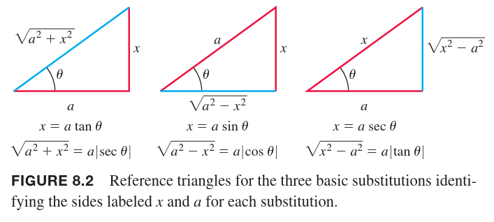
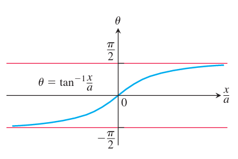
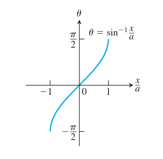
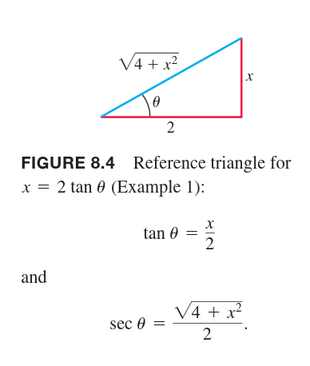
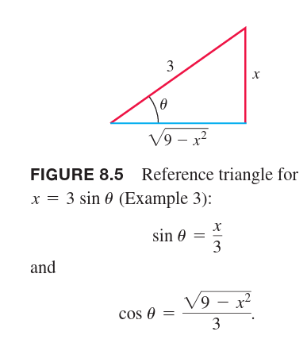
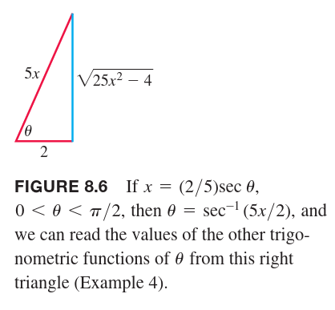

用三角函数替换被积的变量，称为三角函数代换。最常见的代换是 $x=a\tan\theta,x=a\sin\theta,x=a\sec\theta$。当被积式子包含 $\sqrt{a^2+x^2},\sqrt{a^2-x^2},\sqrt{x^2-a^2}$ 时，这些替换就很有效。如下图所示：

当 $x=a\tan\theta$ 时，
$$a^2+x^2=a^2+a^2\tan^2\theta=a^2(1+\tan^2\theta)=a^2\sec^2\theta$$
当 $x=a\sin\theta$ 时，
$$a^2-x^2=a^2-a^2\sin^2\theta=a^2(1-\sin^2\theta)=a^2\cos^2\theta$$
当 $x=a\sec\theta$ 时，
$$x^2-a^2=a^2\sec^2\theta-a^2=a^2(\sec^2\theta-1)=a^2\tan^2\theta$$
任意的替换函数需要能够可逆，因为我们需要还原回初始的变量。比如如果 $x=a\tan\theta$，求完积分之后需要用 $\theta=\tan^{-1}(x/a)$ 使得结果用原来的变量表示，$x=a\sin\theta,x=a\sec\theta$ 也类似。

从 1.5 小节可知，三角函数仅对选择合适的 $\theta$ 范围才是可逆的。
$$x=a\tan\theta$$
需要满足
$$\theta=\tan^{-1}\frac{x}{a},-\frac{\pi}{2}<\theta<\frac{\pi}{2}$$

$$x=a\sin\theta$$
需要满足
$$\theta=\sin^{-1}\frac{x}{a},-\frac{\pi}{2}<\theta<\frac{\pi}{2}$$

$$x=a\sec\theta$$
需要满足
$$\theta=\sec^{-1}\frac{x}{a},\begin{cases}
0\leq\theta<\frac{\pi}{2},&&&\frac{x}{a}\geq 1\\
\frac{\pi}{2}<\theta\leq\pi,&&&\frac{x}{a}\leq -1
\end{cases}$$
为了简化计算，当使用 $x=a\sec\theta$ 代换时，仅限用于 $x/a\geq 1$ 的积分式。此时，$\theta$ 的范围是 $[0,\pi/2)$，那么 $\tan\theta\geq 0$。进而有
$$\sqrt{x^2-a^2}=\sqrt{a^2\tan^2\theta}=|a\tan\theta|=a\tan\theta$$

例1 求
$$\int\frac{dx}{\sqrt{4+x^2}}$$
解：令
$$x=2\tan\theta$$
那么有
$$dx=2\sec^2\theta d\theta,-\frac{\pi}{2}<\theta<\frac{\pi}{2}$$
所以
$$4+x^2=4\sec^2\theta$$
那么
$$\begin{aligned}
\int\frac{dx}{\sqrt{4+x^2}}&=\int\frac{2\sec^2\theta d\theta}{\sqrt{4\sec^2\theta}}\\
&=\int\frac{\sec^2\theta d\theta}{|\sec\theta|}\\
&=\int\sec\theta d\theta\\
&=\ln|\sec\theta+\tan\theta|+C
&=\ln|\frac{4+x^2}{2}+\frac{x}{2}|+C
\end{aligned}$$
对于最后一步还原，可以如下做一个示意图，很容易得到三角函数的值。

例2 这个例子我们尝试使用自然对数表示反双曲正弦函数。根据上个例子我们有
$$\begin{aligned}
\int\frac{dx}{\sqrt{a^2+x^2}}&=\int\sec\theta d\theta\\
&=\ln|\sec\theta+\tan\theta|+C\\
&=\ln|\frac{\sqrt{a^2+x^2}}{a}+\frac{x}{a}|+C
\end{aligned}$$
根据 7.3 小节可知，$\sinh^{-1}(x/a)$ 也是 $1/\sqrt{a^2+x^2}$ 的反函数，两个反函数之间只相差一个常数，所以
$$\sinh^{-1}\frac{x}{a}=\ln|\frac{\sqrt{a^2+x^2}}{a}+\frac{x}{a}|+C$$
将 $x=0$ 代入上式，有
$$0=\ln|1|+C$$
所以
$$C=0$$
由于 $\sqrt{a^2+x^2}>|x|$，所以
$$\sinh^{-1}\frac{x}{a}=\ln(\frac{a^2+x^2}{a}+\frac{x}{a})$$

例3 求
$$\int\frac{x^2dx}{\sqrt{9-x^2}}$$
解：令
$$x=3\sin\theta,dx=3\cos\theta d\theta,-\frac{\pi}{2}<\theta<\frac{\pi}{2}$$
所以
$$9-x^2=9\cos^2\theta$$
那么
$$\begin{aligned}
\int\frac{x^2dx}{\sqrt{9-x^2}}&=\int\frac{9\sin^2\theta\cdot 3\cos\theta d\theta}{|3\cos\theta|}\\
&=9\int\sin^2\theta d\theta\\
&=9\int\frac{1-\cos 2\theta}{2}d\theta\\
&=\frac{9}{2}(\theta-\frac{\sin 2\theta}{2})+C\\
&=\frac{9}{2}(\theta-\sin\theta\cos\theta)+C\\
&=\frac{9}{2}(\sin^{-1}\frac{x}{3}-\frac{x}{3}\frac{\sqrt{9-x^2}}{3})+C\\
&=\frac{9}{2}\sin^{-1}\frac{x}{3}-\frac{x}{2}\sqrt{9-x^2}+C
\end{aligned}$$

例4 求
$$\frac{dx}{\sqrt{25x^2-4}},x>\frac{2}{5}$$
解：首先改写根号为
$$\sqrt{25x^2-4}=\sqrt{25(x^2-\frac{4}{25})}=5\sqrt{x^2-(\frac{2}{5})^2}$$
令
$$x=\frac{2}{5}\sec\theta,dx=\frac{2}{5}\sec\theta\tan\theta d\theta,0<\theta<\frac{\pi}{2}$$
有
$$x^2-(\frac{2}{5})^2=\frac{4}{25}\tan^2\theta$$
那么
$$\sqrt{x^2-(\frac{2}{5})^2}=\frac{2}{5}\tan\theta$$
所以
$$\begin{aligned}
\int\frac{dx}{\sqrt{25x^2-4}}&=\int\frac{dx}{5\sqrt{x^2-(4/25)}}\\
&=\int\frac{(2/5)\sec\theta\tan\theta d\theta}{5\cdot(2/5)\tan\theta}\\
&=\frac{1}{5}\int\sec\theta d\theta\\
&=\frac{1}{5}\ln|\sec\theta+\tan\theta|+C\\
&=\frac{1}{5}\ln|\frac{5x}{2}+\frac{\sqrt{25x^2-4}}{2}|+C
\end{aligned}$$

