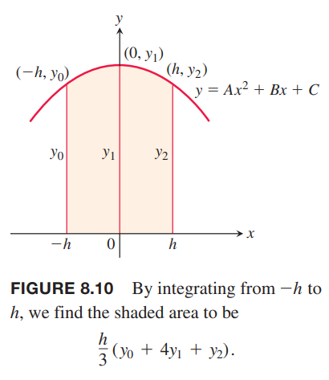

### 梯形近似
梯形近似方法使用梯形替换矩形来替代曲线对应的某一小段下的图形，如下图所示。

对于点 $x_0,x_1,x_2,\cdots,x_n$ 所对应的区间，不要求是等宽的，不过等宽的非常容易计算。因此对于等宽情况，宽度是
$$\Delta x=\frac{b-a}{n}$$
这个长度称为步长。第 $i$ 个梯形的面积是
$$\Delta x(\frac{y_{i-1}+y_i}{2})=\frac{\Delta x}{2}(y_{i-1}+y_i)$$
那么曲线 $y=f(x)$ 下方的面积近似于所有梯形之和。
$$\begin{aligned}
T&=\frac{1}{2}(y_0+y_1)\Delta x+\frac{1}{2}(y_1+y_2)\Delta x+\cdots+\frac{1}{2}(y_{n-2}+y_{n-1})\Delta x+\frac{1}{2}(y_{n-1}+y_n)\Delta x\\
&=\Delta x(\frac{1}{2}y_0+y_1+y_2+\cdots+y_{n-1}+\frac{1}{n}y_n)\\
&=\frac{\Delta x}{2}(y_0+2y_1+2y_2+\cdots+2y_{n-1}+y_n)
\end{aligned}$$

例1 使用 $n=4$ 的梯形近似法估算 $\int_1^2 x^2dx$。比较估算值于精确值。

解：如下图所示，区间 $[1,2]$ 平均分成四个子区间。

下表是对应的横纵坐标的值

| $x$ | $y=x^2$ |
|--|--|
| $1$ | $1$ |
| $\frac{5}{4}$ | $\frac{25}{16}$ |
| $\frac{4}{4}$ | $\frac{36}{16}$ |
| $\frac{7}{4}$ | $\frac{49}{16}$ |
| $2$ | $4$ |

代入公式
$$\begin{aligned}
T&=\frac{\Delta x}{2}(y_0+2y_1+2y_2+2y_3+y_4)\\
&=\frac{1}{8}(1+\frac{50}{16}+\frac{72}{16}+\frac{98}{16}+4)\\
&=\frac{75}{32}\\
&=2.34375
\end{aligned}$$
二次曲线是下凸的，所以梯形面积比曲线下的面积略微大一点点。精确积分是
$$\int_1^2 x^2dx=\frac{x^3}{3}\bigg|_1^2=\frac{7}{3}$$
误差比例是
$$(2.34375-\frac{7}{3})/\frac{7}{3}\approx 0.00446=0.446\%$$

### 辛普森法则：使用抛物线近似
另外一种求定积分的近似方式是使用抛物线替代梯形的直线。和之前一样，将 $[a,b]$ 分成 $n$ 个子区间，每个子区间长度 $h=\Delta x=(b-a)/n$，但是这次要求 $n$ 是偶数。在相邻的两个区间上，我们用抛物线近似曲线 $y=f(x)\geq 0$，如下图所示。一段抛物线穿过了连续的三个点 $(x_{i-1},y_{i-1}),(x_i,y_i),(x_{i+1},y_{i+1})$。

现在计算上图阴影部分的面积。简单起见，令 $x_0=-h,x_1=0,x_2=h$，如下图所示。

相当于图像沿着 $x$ 轴平移，面积不变。抛物线公式是
$$y=Ax^2+Bx+C$$
所有曲线下的面积是
$$\begin{aligned}
A_p&=\int_{-h}^h Ax^2+Bx+Cdx\\
&=\bigg[\frac{Ax^3}{3}+2Bx^2+Cx\bigg]_{-h}^h\\
&=\frac{2Ah^3}{3}+2Ch\\
&=\frac{h}{3}(2Ah^2+6C)
\end{aligned}$$
这个抛物线穿过三点 $(-h,y_0),(0,y_1),(h,y_2)$，所以
$$y_0=Ah^2-Bh+C,y_1=C,y_2=Ah^2+Bh+C$$
那么
$$\begin{aligned}
C&=y_1\\
Ah^2-Bh&=y_0-y_1\\
Ah^2+Bh&=y_2-y_1\\
2Ah^2&=y_0+y_2-2y_1
\end{aligned}$$
代入公式得到
$$\begin{aligned}
A_p&=\frac{h}{3}(2Ah^2+6C)\\
&=\frac{h}{3}(y_0+y_2-2y_1+6y_1)\\
&=\frac{h}{3}(y_0+4y_1+y_2)
\end{aligned}$$
同理，下一段抛物线穿过点 $(x_2,y_2),(x_3,y_3),(x_4,y_4)$，其下的面积是
$$\frac{h}{3}(y_2+4y_3+y_4)$$
累加得到积分的近似值
$$\begin{aligned}
\int_a^bf(x)dx&=\approx\frac{h}{3}(y_0+4y_1+y_2)+\frac{h}{3}(y_2+4y_3+y_4)+\cdots+\frac{h}{3}(y_{n-2}+4y_{n-1}+y_n)\\
&=\frac{h}{3}(y_0+4y_1+2y_2+4y_3+2y_4+\cdots+2y_{n-2}+4y_{n-1}+y_n)
\end{aligned}$$
这就是辛普森法则。函数可以是负数，但是 $n$ 必须是偶数，因为每段抛物线占用了两个子区间。

例2 使用 $n=4$ 时辛普森法则公式估算
$$\int_0^2 5x^4dx$$
解：将区间 $[0,2]$ 分成四个子区间，下表是对应的横纵坐标。

| $x$ | $y=5x^4$ |
|--|--|
| $0$ | $0$ |
| $\frac{1}{2}$ | $\frac{5}{16}$ |
| $1$ | $5$ |
| $\frac{3}{2}$ | $\frac{405}{16}$ |
| $2$ | $80$ |

$n=4,\Delta x=1/2$ 代入公式
$$\begin{aligned}
S&=\frac{\Delta x}{3}(y_0+4y_1+2y_2+4y_3+y_4)\\
&=\frac{1}{6}(0+4(\frac{5}{16})+2(5)+4\frac{405}{16}+80)\\
&=32\frac{1}{12}
\end{aligned}$$
精确值是 $32$，误差是 $1/12$，比百分之一的三分之一还小，而这个估算值只是用了四个区间。

### 误差分析
根据法则求得的近似值与定积分 $\int_a^b f(x)dx$ 之间的差值称为误差。

**定理1 梯形近似和辛普森法则的误差估计**
如果 $f''$ 是连续的且 $M$ 是 $|f''|$ 在区间 $[a,b]$ 上的任意上界，那么用 $n$ 步的梯形近似对函数 $f$ 从 $a$ 到 $b$ 的定积分进行估算，其误差
$$|E_T|\leq\frac{M(b-a)^3}{12n^2}$$
如果 $f^{(4)}$ 是连续的且 $M$ 是 $|f^{(4)}|$ 在区间 $[a,b]$ 上的任意上界，那么用 $n$ 步的辛普森法则对函数 $f$ 从 $a$ 到 $b$ 的定积分进行估算，其误差
$$|E_S|\leq\frac{M(b-a)^5}{180n^4}$$

从高级微积分知识可以知道当 $f''$ 在 $[a,b]$ 上连续时有
$$\int_a^b f(x)dx=T-\frac{b-a}{12}\cdot f''(c)(\Delta x)^2$$
其中 $c$ 是 $[a,b]$ 上的某一点。当 $\Delta x$ 趋于零时，误差
$$E_T=-\frac{b-a}{12}\cdot f''(c)(\Delta x)^2$$
也趋于零。

由于 $f''(c)\leq \operatorname{max}|f''(x)|$ 得到不等式
$$|E_T|\leq\frac{b-a}{12}\operatorname{max}|f''(x)|(\Delta x)^2$$
实践中，很难找到 $\operatorname{max}|f''(x)|$，不过可以用一个估计的上界或者更差的情况 $M$ 代替，那么就有 $|f''(x)|\leq M$，所有就有
$$|E_T|\leq\frac{b-a}{12}M(\Delta x)^2$$
将 $\Delta x=(b-a)/n$ 代入得到
$$|E_T|\leq\frac{M(b-a)^3}{12n^2}$$

第二个不等式的证明类似，只有最开始时借助高等微积分中的等式
$$\int_a^b f(x)dx=S-\frac{b-a}{180}\cdot f^{(4)}(c)(\Delta x)^4$$

例3 求例2 中的误差上界。

解：为了计算误差，我们需要知道上界 $M$。$f(x)=5x^4$ 求四阶导数得到 $f^{(4)}(x)=120$，所以 $M=120$。从题目可知 $n=4, b-a=2$，代入误差公式
$$|E_S|\leq\frac{M(b-a)^5}{180n^4}=\frac{120(2)^5}{180(4)^4}=\frac{1}{12}$$
这个结论符合例2 的结果。

例4 对于例3，当 $n$ 为多少时误差小于 $10^{-4}$？

解：$n$ 需要满足
$$\frac{M(b-a)^5}{180n^4}<10^{-4}$$
代入例3 的数值
$$\frac{120(2)^5}{180n^4}<10^{-4}$$
所以
$$n^4>\frac{64\cdot 10^4}{3}$$
$$n>10(\frac{64}{3})^{1/4}\approx 21.5$$
由于辛普森法则要求 $n$ 是偶数，所以这里 $n$ 最小是 22。

例5 $\ln 2$ 可以用积分表示
$$\ln 2=\int_1^2\frac{1}{x}dx$$
下表是用梯形近似和辛普森法则求 $\ln 2$ 的值。

| $n$ | $T$ | $E_T$ | $S$ | $E_S$ |
|--|--|--|--|--|
| 10 | 0.6937714032 | 0.0006242227 | 0.6931502307 | 0.0000030502 |
| 20 | 0.6933033818 | 0.0001562013 | 0.6931473747 | 0.0000001942 |
| 30 | 0.6932166154 | 0.0000694349 | 0.6931472190 | 0.0000000385 |
| 40 | 0.6931862400 | 0.0000390595 | 0.6931471927 | 0.0000000122 |
| 50 | 0.6931721793 | 0.0000249988 | 0.6931471856 | 0.0000000050 |
| 100 | 0.6931534305 | 0.0000062500 | 0.6931471809 | 0.0000000004 |

随着 $n$ 的翻倍，$T$ 的误差以 2 的平方量级缩小，而 $S$ 的误差以 2 的四次方的速度缩小。

如果 $f(x)$ 是小于四阶的多项式，其四阶导数为零，那么
$$E_S=-\frac{b-a}{180}f^{(4)}(c)(\Delta x)^4=0$$
那么用辛普森法则求 $f$ 的近似，没有误差。类似的，如果 $f$ 是常量或者线性函数，二阶导数是零，那么
$$E_T=-\frac{b-a}{12}f''(c)(\Delta x)^2=0$$
使用梯形近似求积分也没有误差。梯形的斜边是直线，能够完全拟合常量或者线性函数。

尽管随着 $\Delta x$ 越来越小，理论上近似的误差越来越小，但是实践中并不是这样的。当 $\Delta x$ 很小的时候，比如 $10^{-8}$，计算机浮点数的舍入误差会使得精确无法继续提高。这时，需要参考数值分析的书寻找更好的方法。

例6 如下图所示，小镇需要填充被污染的沼泽。平均深度是 1.5m，需要多少立方米的材料？

  

解：如上图所示，$\Delta x=6$，那么使用辛普森法则
$$\begin{aligned}
S&=\frac{\Delta x}{3}(y_0+4y_1+2y_2+4y_3+2y_4+4y_5+y_6)\\
&=\frac{6}{3}(44+148+46+64+24+36+4)\\
&=732
\end{aligned}$$
所以需要 $732\times 1.5=1098$ 方材料。
