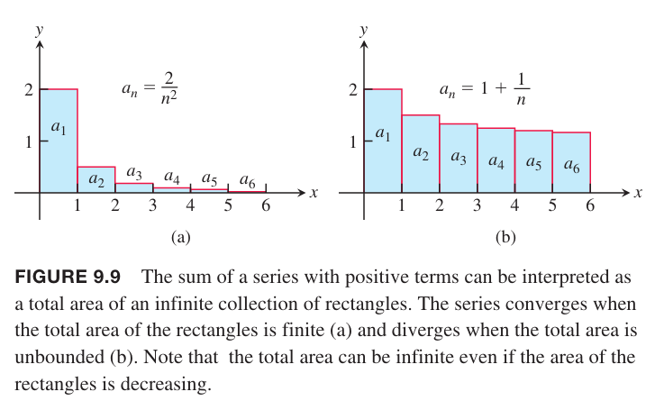
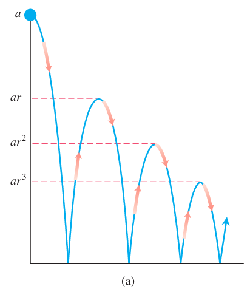
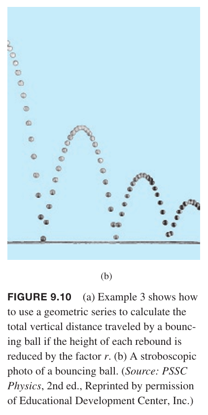

无穷级数（`infinite series`）是无穷数列的和
$$a_1+a_2+a_3+\cdots+a_n+\cdots$$
对于无穷数列，我们无法一个一个相加完成，不过我们可以先看前 $n$ 项和
$$s_n=a_1+a_2+a_3+\cdots+a_n$$
这称为前 $n$ 项部分和。随着 $n$ 越来越大，我们期望部分和趋于某个极限，就和之前讨论的数列的极限一样。

比如，无穷级数
$$1+\frac{1}{2}+\frac{1}{4}++\frac{1}{8}+\cdots$$
的前 $n$ 项和是
$$s_n=2-\frac{1}{n^{n-1}}$$
因为 $\lim_{n\to\infty}(1/2^{n-1})=0$，所以部分和的数列趋于 2，那么我们说无穷级数 $1+\frac{1}{2}+\frac{1}{4}++\frac{1}{8}+\cdots$ 的和是 2。

**定义**
> 给定数列 $\{a_n\}$，表达式
> $$a_1+a_2+a_3+\cdots+a_n+\cdots$$
> 是无穷级数。级数的第 $n$ 项是 $a_n$。数列 $\{s_n\}$ 定义为
> $$\begin{aligned}
> s_1&=a_1\\
> s_2&=a_1+a_2\\
> &\vdots\\
> s_n&=a_1+a_2+a_3+\cdots+a_n\\
> &\vdots
> \end{aligned}$$
> 被称为级数的部分和数列，$s_n$ 是第 $n$ 个部分和。如果部分和数列收敛到 $L$，那么级数收敛且和是 $L$，记作
> $$a_1+a_2+a_3+\cdots+a_n+\cdots=\sum_{n=1}^\infty=L$$
> 否则，我们称级数发散。

我们可以把无穷级数的每一项看作是一个矩形。如果项 $a_n$ 都是正的，如果总面积有限，那么级数收敛，否则发散。下图展示了这两种情况。

总面积收敛与广义积分相关，下一节会阐述两者的联系。

给定无穷级数 $a_1+a_2+a_3+\cdots+a_n+\cdots$，我们不知道其是收敛还是发散，但是不妨碍我们使用希格玛符号
$$\sum_{n=1}^\infty a_n,\sum_{k=1}^\infty a_k,\sum a_n$$

### 等比级数
等比级数（`geometric series`）形式如下
$$a+ar+ar^2+\cdots+ar^{n-1}+\cdots=\sum_{n=1}^\infty ar^{n-1}$$
其中 $a,r$ 是常量且 $a\neq 0$。级数也记作 $\sum_{n=1}^\infty ar^n$。公比 $r$ 可以是整数，比如
$$1+\frac{1}{2}+\frac{1}{4}+\cdots+(\frac{1}{2})^{n-1}+\cdots$$
也可以是负数，比如
$$1-\frac{1}{3}+\frac{1}{9}-\cdots+(-\frac{1}{3})^{n-1}+\cdots$$
如果 $r=1$，那么前 $n$ 项部分和是
$$s_n=a+a+a+\cdots+a=na$$
那么级数发散，因为 $\lim_{n\to\infty}s_n=\pm\infty$，正负号取决于 $a$ 的符号。如果 $r=-1$，那么前 $n$ 项和在 $a,0$ 之间反复跳跃，不会趋于某个固定值，所以此时级数也是发散的。如果 $|r|\neq 1$，那么可以根据公式
$$s_n=\frac{a(1-r^n)}{1-r},r\neq 1$$
分析级数是发散还是收敛。

如果 $|r|<1$，那么 $n\to\infty$ 时 $r^n\to 0$，所以 $s_n\to\frac{a}{1-r}$，收敛；否则 $r^n\to\infty$，发散。

例1 $a=1/9,r=1/3$ 的等比级数是
$$\frac{1}{9}+\frac{1}{27}+\frac{1}{81}+\cdots=\sum_{n=1}^\infty\frac{1}{9}(\frac{1}{3})^{n-1}=\frac{1/9}{1-1/3}=\frac{1}{6}$$

例2 级数
$$\sum_{n=0}^\infty\frac{(-1)^n5}{4^n}=5-\frac{5}{3}+\frac{5}{16}-\frac{5}{64}+\cdots$$
是 $a=5,r=-1/4$ 的等比级数，其收敛于
$$\frac{a}{1-r}=\frac{5}{1+(1/4)}=4$$

例3 从 $a$ 处抛下一个小球。每次小球高度是 $h$ 的话，反弹高度是 $rh$，$r$ 是整数且小于 1。求球上下运动的总距离。如下图所示。

解：
$$s=a+2ar+2ar^2+2ar^3+\cdots=a+\frac{2ar}{1-r}=a\frac{1+r}{1-r}$$

例4 使用两个整数的比表示
$$5.232323\cdots$$
解：从循环小数的定义，可以得到等比级数
$$\begin{aligned}
5.232323\cdots&=5+\frac{23}{100}+\frac{23}{100^2}+\frac{23}{100^3}+\cdots\\
&=5+\frac{23}{100}(1+\frac{1}{100}+\frac{1}{100^2}+\frac{1}{100^3}+\cdots)\\
&=5+\frac{23}{100}\frac{1}{0.99}\\
&=5+\frac{23}{99}\\
&=\frac{518}{99}
\end{aligned}$$

例5 求级数
$$\sum_{n=1}^\infty\frac{1}{n(n+1)}$$
解：这个题的关键在于分数分解
$$\frac{1}{n(n+1)}=\frac{1}{n}-\frac{1}{n+1}$$
那么
$$\sum_{n=1}^k\frac{1}{n(n+1)}=\sum_{n=1}^k(\frac{1}{n}-\frac{1}{n+1})$$
因此前 $k$ 项和是
$$s_k=(1-\frac{1}{2})+(\frac{1}{2}-\frac{1}{3})+(\frac{1}{3}-\frac{1}{4})+\cdots+(\frac{1}{k}-\frac{1}{k+1})=1-\frac{1}{k+1}$$
当 $k\to\infty$ 时，$s_k\to 1$，因此级数收敛且
$$\sum_{n=1}^\infty\frac{1}{n(n+1)}=1$$

### 发散级数的前 $n$ 项测试
级数发散的一个原因是项不会变的很小。

例6 级数
$$\sum_{n=1}^\infty\frac{n+1}{n}=\frac{2}{1}+\frac{3}{2}+\frac{4}{3}+\cdots+\frac{n+1}{n}+\cdots$$
是发散的。因为部分和会一直增加超过任意给定的数：每一项都大于 1，所以前 $n$ 项和大于 $n$。

$$\tag*{$\blacksquare$}$$

下面证明当 $\sum_{n=1}^\infty a_n$ 收敛时 $\lim_{n\to\infty}a_n$ 必须等于零。令 $S$ 表示级数和且 $s_n=a_1+a_2+\cdots+a_n$ 表示前 $n$ 项和。当 $n$ 充分大时，$s_n,s_{n-1}$ 都趋于 $S$，两者的差值 $a_n$ 趋于零。
$$a_n=s_n-s_{n-1}\rightarrow S-S=0$$

**定理7**
> 如果 $\sum_{n=1}^\infty a_n$ 收敛，那么 $a_n\to 0$。

上面的定理的逆否命题可以得到判定级数是否发散。

**发散级数的前 $n$ 项测试**
> 如果 $\lim_{n\to\infty} a_n$ 不存在或者不是零，那么 $\sum_{n=1}^\infty a_n$ 发散。

例7 下面级数都是发散的。

（1）$\sum_{n=1}^\infty n^2$ 发散的原因是 $n^2\to\infty$。

（2）$\sum_{n=1}^\infty\frac{n+1}{n}$ 发散的原因是 $\frac{n+1}{n}\to 1$。

（3）$\sum_{n=1}^\infty(-1)^{n+1}$ 发散的原因是 $\lim_{n\to\infty}(-1)^{n+1}$ 不存在。

（4）$\sum_{n=1}^\infty\frac{-n}{2n+5}$ 发散的原因是 $\lim_{n\to\infty}\frac{-n}{2n+5}=-\frac{1}{2}\neq 0$。

例8 级数
$$1+\frac{1}{2}+\frac{1}{2}+\frac{1}{4}+\frac{1}{4}+\frac{1}{4}+\frac{1}{4}+\cdots+\frac{1}{2^n}+\frac{1}{2^n}+\cdots+\frac{1}{2^n}+\cdots$$
有 $2^n$ 个 $\frac{1}{2^n}$，是发散的。因为将这些项分到无限个组中，而每组之和是 1，那么部分和没有上界。不过，可以看出，级数的项是趋于零的。9.3 节的例1 中的调和级数 $\sum 1/n$ 也类似。

### 级数的组合
**定理8**
> 如果 $\sum a_n=A,\sum b_n=B$ 是收敛级数，那么
> $$\sum(a_n+b_n)=\sum a_n+\sum b_n=A+B$$
> $$\sum(a_n-b_n)=\sum a_n-\sum b_n=A-B$$
> $$\sum ka_n=k\sum a_n=kA$$

证明：为了证明第一个式子，令
$$A_n=a_1+a_2+\cdots a_n$$
$$B_n=b_1+b_2+\cdots b_n$$
那么 $\sum(a_n+b_n)$ 的部分和是
$$\begin{aligned}
s_n&=(a_1+b_1)+(a_2+b_2)+\cdots+(a_n+b_n)\\
&=(a_1+a_2+\cdots+a_n)+(b_1+b_2+\cdots+b_n)\\
&=A_n+B_n
\end{aligned}$$
由于 $A_n\to A,B_n\to B$，那么 $s_n\to A+B$。证毕。

第二个式子的证明类似。

第三个式子比较容易证明，$\sum ka_n$ 的部分和是
$$\begin{aligned}
s_n&=ka_1+ka_2+\cdots+ka_n\\
&=k(a_1+a_2+\cdots+a_n)\\
&=kA_n
\end{aligned}$$
趋于 $kA$。

$$\tag*{$\blacksquare$}$$

根据定理8，我们可以得到如下结论。
* 非零常数乘以分散级数得到的级数仍然分散。
* 如果 $\sum a_n$ 收敛而 $\sum b_n$ 发散，那么 $\sum(a_n+b_n),\sum(a_n-b_n)$ 都发散。

这里要谨记：即使 $\sum a_n,\sum b_n$ 都发散，但是 $\sum(a_n+b_n)$ 有可能是收敛的。比如 $\sum a_n=1+1+1+\cdots,\sum b_n=-1-1-1-\cdots$，然而 $\sum(a_n+b_n)=0+0+0+\cdots=0$ 是收敛的。

例9 求下列级数的和。

（1）
$$\begin{aligned}
\sum_{n=1}^\infty\frac{3^{n-1}-1}{6^{n-1}}&=\sum_{n=1}^\infty(\frac{1}{2^{n-1}}-\frac{1}{6^{n-1}})\\
&=\sum_{n=1}^\infty\frac{1}{2^{n-1}}-\sum_{n=1}^\infty\frac{1}{6^{n-1}}\\
&=\frac{1}{1-1/2}-\frac{1}{1-1/6}\\
&=2-\frac{6}{5}\\
&=\frac{4}{5}
\end{aligned}$$
（2）
$$\begin{aligned}
\sum_{n=1}^\infty\frac{4}{2^n}=4\sum_{n=1}^\infty\frac{1}{2^n}\\
&=4\frac{1}{1-1/2}\\
&=8
\end{aligned}$$

### 增加或删除有限项
向级数中添加有限项或者从级数中删除有限项，不会改变其收敛性。不过，级数的和会变化。如果 $\sum_{n=1}^\infty a_n$ 收敛，那么 $\sum_{n=k}^\infty a_n,k>1$ 也收敛，且
$$\sum_{n=1}^\infty a_n=a_1+a_2+\cdots+a_{k-1}+\sum_{n=k}^\infty a_n$$
反过来，如果 $\sum_{n=k}^\infty a_n,k>1$ 收敛，那么 $\sum_{n=1}^\infty a_n$ 也收敛。

### 变更下标
只要保持级数各项的顺序不变，变更下标并不会改变收敛性。
$$\sum_{n=1}^\infty a_n=\sum_{n=1+h}a_{n-h}=a_1+a_2+a_3+\cdots$$
$$\sum_{n=1}^\infty a_n=\sum_{n=1-h}a_{n+h}=a_1+a_2+a_3+\cdots$$
之前的例子中有使用 $n=0$ 代替 $n=1$ 的例子。我们可以从任意其他值开始，目的是简化表达式。

例10 我们可以将等比级数
$$\sum_{n=1}^\infty\frac{1}{2^{n-1}}=1+\frac{1}{2}+\frac{1}{4}+\cdots$$
写作
$$\sum_{n=0}^\infty\frac{1}{2^n},\sum_{n=5}^\infty\frac{1}{2^{n-5}},\sum_{n=-4}^\infty\frac{1}{2^{n+4}}$$
