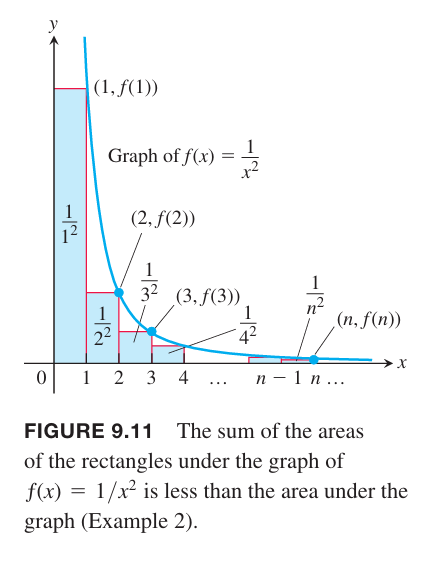
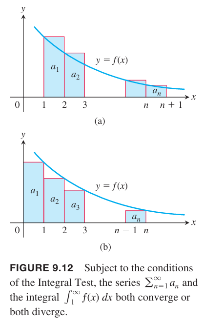
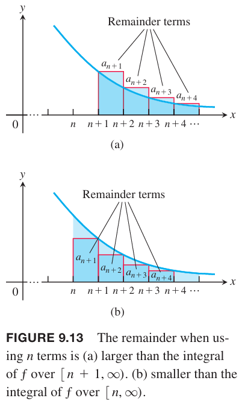

### 非递减部分和
假设 $\sum_{n=1}^\infty a_n$ 是无穷级数，且对于所有 $n$ 都有 $a_n\geq 0$。由于 $s_{n+1}=s_n+a_{n+1}$，那么部分和数列的每一项大于等于前一个
$$s_1\leq s_2\leq s_3\leq\cdots\leq s_n\leq s_{n+1}\leq\cdots$$
根据 9.1 节定理 6 单调数列定理，部分和非递减，那么有以下推论。

**定理6 的推论**
> 非负级数 $\sum_{n=1}^\infty a_n$ 收敛等价于它的部分和有上界。

例1 考虑调和级数
$$\sum_{n=1}^\infty\frac{1}{n}=1+\frac{1}{2}+\frac{1}{3}+\cdots+\frac{1}{n}+\cdots$$
尽管第 $n$ 项 $\frac{1}{n}$ 趋于零，但是由于部分和无上界，所以级数发散。下面证明部分和没有上界。按照下面对各项进行分组
$$\sum_{n=1}^\infty\frac{1}{n}=1+\frac{1}{2}+(\frac{1}{3}+\frac{1}{4})+(\frac{1}{5}+\cdots+\frac{1}{8})+(\frac{1}{9}+\cdots+\frac{1}{16})+\cdots$$
每个分组的和都大于 $1/2$。一般地，以 $2^{n+1}$ 的分组，有 $2^n$ 个值，和大于 $1/2$。如果 $n=2^k$，那么 $s_n>k/2$，无上界。

### 积分测试
下面通过计算类似调和级数的 $1/n^2$ 数列阐述如何使用积分测试判定收敛性。

例2 下面的级数是否收敛？
$$\sum_{n=1}^\infty\frac{1}{n^2}=1+\frac{1}{4}+\frac{1}{9}+\cdots+\frac{1}{n^2}+\cdots$$
解：我们可以通过计算积分 $\int_1^\infty (1/x^2)dx$ 来判定 $\sum_{n=1}^\infty 1/n^2$ 是否收敛。函数 $f(x)=1/x^2$ 对应整数的值可以看作是数列的每一项，而每一项的值可以看作是曲线 $y=1/x^2$ 下矩形的面积。如下图所示。

$$\begin{aligned}
s_n&=\frac{1}{1^2}+\frac{1}{2^2}+\frac{1}{3^2}+\cdots+\frac{1}{n^2}\\
&=f(1)+f(2)+f(3)+\cdots+f(n)\\
&<f(1)+\int_1^n\frac{1}{x^2}dx\\
&<f(1)+\int_1^\infty\frac{1}{x^2}dx\\
&=1+1\\
&=2
\end{aligned}$$
因此 $\sum_{n=1}^\infty 1/n^2$ 的部分和有上界，2，所以级数收敛。

**定理9 积分测试**
> 令 $\{a_n\}$ 是正数项的数列。假设 $a_n=f(n)$，$f$ 是在 $x\geq N>0$ 上连续的、正数、非递减函数。那么级数 $\sum_{n=N}^\infty a_n$ 和积分 $\int_N^\infty f(x)dx$ 收敛性相同。

证明：下面证明 $N=1$，一般情况类似。

观察上图（a），从 $x=1$ 到 $x=n+1$，$y=f(x)$ 曲线下的面积小于 $a_1,a_2,\cdots,a_n$ 对应的矩形面积和，即
$$\int_1^{n+1}f(x)dx\leq a_1+a_2+\cdots+a_n$$
用左边界代替有边界，得到图（b），排除第一个矩阵 $a_1$，有
$$a_2+a_3+\cdots+a_n\leq\int_1^n f(x)dx$$
两边加上 $a_1$
$$a_1+a_2+a_3+\cdots+a_n\leq a_1+\int_1^n f(x)dx$$
那么
$$\int_1^{n+1}f(x)dx\leq a_1+a_2+\cdots+a_n\leq a_1+\int_1^n f(x)dx$$
如果 $\int_1^\infty f(x)dx$ 有限，即收敛，那么根据右边的不等式，$\sum a_n$ 也是有限的，收敛。反之 $\int_1^\infty f(x)dx$ 无限，那么级数也无限。

例3 证明当 $p>1$ 时，$p$ 级数
$$\sum_{n=1}^\infty\frac{1}{n^p}=\frac{1}{1^p}+\frac{1}{2^p}+\frac{1}{3^p}+\cdots$$
收敛，当 $p<1$ 时，级数发散。

证明：如果 $p>1$，那么 $f(x)=1/x^p$ 是 $x$ 的正的递减函数，那么
$$\begin{aligned}
\int_1^\infty\frac{1}{x^p}dx&=\int_1^\infty x^{-p}dx\\
&=\lim_{b\to\infty}\bigg[\frac{x^{-p+1}}{-p+1}\bigg]_1^b\\
&=\frac{1}{1-p}\lim_{b\to\infty}(\frac{1}{b^{p-1}}-1)\\
&=\frac{1}{1-p}(0-1)\\
&=\frac{1}{p-1}
\end{aligned}$$
根据积分测试级数收敛。但是，这不意味着 $p$ 级数收敛于 $1/(p-1)$，也就是说，级数收敛，但是不知道收敛值。

如果 $p\leq 0$，第 $n$ 项不会收敛到 0，所以级数发散。

如果 $0<p<1$，那么 $1-p>0$，所以
$$\int_1^\infty\frac{1}{x^p}dx=\frac{1}{1-p}\lim_{b\to\infty}(b^{1-p}-1)=\infty$$
所以极限发散。

当 $p=1$ 时，$p$ 级数就是调和级数，发散。

$$\tag*{$\blacksquare$}$$

根据上述结论，调和级数刚刚开始发散，但凡 $p$ 大一点，比如 $1.000000001$，级数就开始收敛了。

调和级数发散的速度相当慢，超过 178 百万项之和，调和级数的部分和才刚超过 20。

例4 级数 $\sum_{n=1}^\infty(1/(n^2+1))$ 不是 $p$ 级数，但是可以通过积分测试得知其收敛。函数 $f(x)=1/x^2+1$ 在 $x\geq 1$ 上时正的、连续、递减函数，并且
$$\begin{aligned}
\int_1^\infty\frac{1}{x^2+1}dx&=\lim_{b\to\infty}(\arctan x\big|_1^b)\\
&=\lim_{b\to\infty}(\arctan b-\arctan 1)\\
&=\frac{\pi}{2}-\frac{\pi}{4}\\
&=\frac{\pi}{4}
\end{aligned}$$
但是，这个积分式子并没有告诉我们级数收敛到 $\pi/4$ 或者其他值。

例5 判定下面级数的收敛性。

（a）
$$\sum_{n=1}^\infty ne^{-n^2}$$
（b）
$$\sum_{n=1}^\infty\frac{1}{2^{\ln n}}$$
解：
（a）
$$\begin{aligned}
\int_1^\infty\frac{x}{e^{x^2}}dx&=\frac{1}{2}\int_1^\infty\frac{du}{e^u}&&u=x^2\\
&=\frac{1}{2}\lim_{b\to\infty}\bigg[-e^{-u}\bigg]_1^b\\
&=\frac{1}{2}\lim_{b\to\infty}(-\frac{1}{e^b}+\frac{1}{e})\\
&=\frac{1}{2e}
\end{aligned}$$
所以级数收敛。

（b）
$$\begin{aligned}
\int_1^\infty\frac{dx}{2^{\ln x}}&=\int_0^\infty\frac{e^udu}{2^u}&&u=\ln x\\
&=\int_0^\infty(\frac{e}{2})^udu\\
&=\lim_{b\to\infty}\frac{1}{\ln(\frac{e}{2})}((\frac{e}{2})^b-1)\\
&=\infty
\end{aligned}$$
所以级数发散。

### 误差估计
有些级数，比如包括等比级数在内的很多例子，可以找到级数和的值。但是更多的级数无法求出值。这时，如果能知道前 $n$ 项和 $s_n$ 与级数和 $S$ 之间的误差也是极好的。假定这个误差是
$$R_n=S-s_n=a_{n+1}+a_{n+2}+a_{n+3}+\cdots$$

根据上图的（a），我们能够确定误差下界
$$R_n\geq\int_{n+1}^\infty f(x)dx$$
根据上图的（b），我们能够确定误差上界
$$R_n\leq\int_n^\infty f(x)dx$$

由于 $s_n+R_n=S$，所以可以得到
$$s_n+\int_{n+1}^\infty f(x)dx\leq S\leq s_n+\int_n^\infty f(x)dx$$
这样，我们知道估算的值与 $S$ 的误差不超过上述闭区间的长度。

例6 使用 $n=10$ 估算级数 $\sum(1/n^2)$ 的和。

解：
$$\int_n^\infty\frac{1}{x^2}dx=\lim_{b\to\infty}-\frac{1}{x}\bigg|_n^b=\lim_{b\to\infty}(-\frac{1}{b}+\frac{1}{n})=\frac{1}{n}$$
所以
$$s_{10}+\frac{1}{11}\leq S\leq s_{10}+\frac{1}{10}$$
很容易计算
$$s_{10}=1+\frac{1}{4}+\frac{1}{9}+\frac{1}{16}+\cdots+\frac{1}{100}\approx 1.54977$$
那么
$$1.64068\leq S\leq 1.64977$$
取中间值，得到估计值
$$\sum_{n=1}^\infty\frac{1}{n^2}\approx 1.64523$$
误差小于区间长度的一半，即误差小于 0.005。高等微积分中使用三角傅里叶级数可以得到 $S=\pi^2/6\approx 1.64493$

### 欧拉常数定理（`Euler's constant`）
根据定理 9 的证明，有
$$\int_1^{n+1}f(x)dx\leq a_1+a_2+\cdots+a_n\leq a_1+\int_1^n f(x)dx$$
令 $f(x)=1/x$，所以
$$\ln(1+n)\leq 1+\frac{1}{2}+\cdots+\frac{1}{n}\leq 1+\ln n$$
所以
$$0<\ln(1+n)-\ln n\leq 1+\frac{1}{2}+\cdots+\frac{1}{n}-\ln n\leq 1$$
因此调和级数
$$1+\frac{1}{2}+\cdots+\frac{1}{n}$$
与积分
$$\ln n=\int_1^\infty\frac{1}{x}dx$$
的差值
$$a_n=1+\frac{1}{2}+\cdots+\frac{1}{n}-\ln n$$
有上界，也有下界。

因为 $1/x$ 在 $[n,n+1]$ 上单调递减，因此
$$1\cdot (\frac{1}{n+1})<\int_n^{n+1}\frac{1}{x}dx<1\cdot(\frac{1}{n})$$
那么
$$\frac{1}{n+1}<\ln(n+1)-\ln n$$
由此可以得到 $a_n$ 是递减的，这是因为
$$\begin{aligned}
a_{n+1}-a_n&=(1+\frac{1}{2}+\cdots+\frac{1}{n}+\frac{1}{n+1}-\ln (n+1))-(leq 1+\frac{1}{2}+\cdots+\frac{1}{n}-\ln n)\\
&=\frac{1}{n+1}-\ln (n+1)+\ln n-\frac{1}{n}\\
&<-\frac{1}{n}\\
&<0
\end{aligned}$$
一个数列有下界且递减，一定收敛。所以当 $n\to\infty$ 时，值趋于某个值，即
$$leq 1+\frac{1}{2}+\cdots+\frac{1}{n}-\ln n\to\gamma$$
其中 $\gamma$ 称为欧拉常数，大约是 $0.5772\ldots$。
