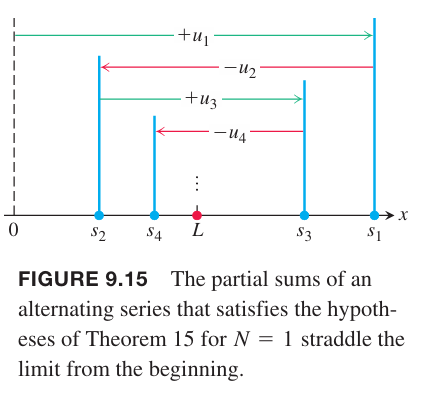

如果一个级数的项是正数和负数交错的，那么这个级数称为交错级数（`alternating series`）。下面是几个交错级数的例子：
$$1-\frac{1}{2}+\frac{1}{3}-\frac{1}{4}+\frac{1}{5}-\cdots+\frac{(-1)^{n+1}}{n}+\cdots$$
$$-2+1-\frac{1}{2}+\frac{1}{4}-\frac{1}{8}+\cdots+\frac{(-1)^n4}{2^n}+\cdots$$
$$1-2+3-4+5-6+\cdots+(-1)^{n+1}n+\cdots$$
交错级数的项形式如下
$$a_n=(-1)^{n+1}u_n,a_n=(-1)^n u_n$$
其中 $u_n=|a_n|$ 是正数。

上面第一个级数是交错调和级数，很快将会证明其是收敛的。第二个级数是公比 $r=-1/2$ 的等比级数，收敛于 $-2/(1-(-1/2))=-4/3$。第三个级数发散，因为第 $n$ 项不趋于零。

可以使用下面给出的交错级数测试来判定一个交错级数是否收敛。这个测试仅能判定级数收敛而不能得到级数发散的结论。如果将级数 $u_1-u_2+u_3-u_4+\cdots$ 乘以 -1，可以得到级数 $-u_1+u_2-u_3+u_4-\cdots$。所以只讨论形如前者的级数的收敛性即可。

**定理 15 交错级数测试**
> 级数
> $$\sum_{n=1}^\infty(-1)^{n+1}u_n=u_1-u_2+u_3-u_4+\cdots$$
> 满足如下三个条件，那么是收敛的。
> 1. $u_n$ 都是正数
> 2. $u_n$ 最终是非递增的，即 $u_n\geq u_{n+1},n\geq N$
> 3. $u_n\to 0$

证明：这里证明 $N=1$ 的情况，$u_1,u_2,u_3,\cdots$ 是非递增的。如果 $n$ 是偶数，$n=2m$，前 $n$ 项和是
$$\begin{aligned}
s_{2m}&=(u_1-u_2)+(u_3-u_4)+\cdots+(u_{2m-1}-u_{2m})\\
&=u_1-(u_2-u_3)-(u_4-u_5)-\cdots-(u_{2m-2}-u_{2m-1})-u_{2m}
\end{aligned}$$
由于第一个等式的每一项大于等于零，所以 $s_{2m}$ 是 $m$ 个非负数之和，进而有 $s_{2m+2}\geq s_{2m}$，所以数列 $\{s_{2m}\}$ 是非递增数列。第二个等式证明了 $s_{2m}\leq u_1$。所以 $\{s_{2m}\}$ 非递增且有上界，那么它存在极限
$$\lim_{m\to\infty}s_{2m}=L$$
如果 $n$ 是级数，$n=2m+1$，那么前 $n$ 项和 $s_{2m+1}=s_{2m}+u_{2m+1}$。因为 $u_n\to 0$，所以
$$\lim_{m\to\infty}u_{2m+1}=0$$
因此 $m\to\infty$ 时有
$$s_{2m+1}=s_{2m}+u_{2m+1}\to L+0=L$$
综上，$\lim_{m\to\infty}s_{n}=L$。

例1 交错调和级数
$$\sum_{n=1}^\infty(-1)^{n+1}\frac{1}{n}=1-\frac{1}{2}+\frac{1}{3}-\frac{1}{4}+\frac{1}{5}-\cdots+\frac{(-1)^{n+1}}{n}+\cdots$$
满足定理 15 的三个条件，所以是收敛的。不过，这个测试并没有给出级数的和是多少。下图展示了调和级数和交错调和级数的部分和。观察可知交错调和级数收敛于 $\ln 2$。

除了直接验证 $u_n\geq u_{n+1}$ 之外，可以构造一个可微函数 $f(x)$ 满足 $f(n)=u_n$ 来证明 $\{u_n\}$ 最终是非递增的。如果，对于 $x\geq N$ 都有 $f'(x)<0$，那么 $f(n)\geq f(n+1),u_n\geq u_{n+1},n\geq N$。

例2 通过上述方法证明 $u_n=10n/(n^2+16)$ 最终是非递增的。令 $f(x)=10x/(x^2+16)$。根据导数的商法则，
$$f'(x)=\frac{10(16-x^2)}{(x^2+16)^2}\leq 0,x\geq 4$$
那么有 $u_n\geq u_{n+1},n\geq 4$，所以 $\{u_n\}$ 最终是非递增的。

图 9.15 展示了如果一个级数满足定理 15 的三个条件时，是如何收敛到极限 $L$ 的。从 $x$ 轴原点开始，$s_1=u_1$。$s_2=u_1-u_2$，即向后回溯了 $u_2$ 的长度。接着，和对应的点来回跳转。当 $n\geq N$ 时，不管是前进或者后退的长度都比上一步要小，这是因为 $u_n\geq u_{n+1}$。由于 $u_n$ 趋于零，那么前进或者后退的长度越来越小。和仅在 $L$ 附近震动，振幅越来越小，趋于零。极限 $L$ 位于两个连续部分和 $s_n,s_{n+1}$ 之间，因此 $L$ 与 $s_n$ 的差小于 $u_{n+1}$。同时，由于在连续两个部分和之间，$L-s_n$ 与 $s_{n+1}-s_n$ 同号，即 $L-s_n$ 与 $u_{n+1}$ 同号。

因为
$$|L-s_n|\leq u_{n+1},n\geq N$$
所以我们可以估算交错级数的和。

**定理 16 交错级数估值定理**
> 如果交错级数 $\sum_{n=1}^\infty(-1)^{n+1}u_n$ 满足定理 15（交错级数测试）的三个条件，对于 $n\geq N$，有
> $$s_n=u_1-u_2+u_3-\cdots+(-1)^{n+1}u_n$$
> 可以用于估算级数的和 $L$，误差的绝对值小于 $u_{n+1}$。并且 $L$ 位于连续部分和 $s_n,s_{n+1}$ 之间，$L-s_n$ 与项 $u_{n+1}$ 前的符号相同。

例3 使用定理 16 估算下面级数
$$\sum_{n=0}^\infty(-1)^n\frac{1}{2^n}=1-\frac{1}{2}+\frac{1}{4}-\frac{1}{8}+\frac{1}{16}-\frac{1}{32}+\frac{1}{64}-\frac{1}{128}+\frac{1}{256}-\cdots$$
如果我们去掉级数的前八项，新的级数和是正数，且小于 $1/256$。前八项和是 $s_8=0.6640625$，前九项和是 $s_9=0.66796875$。等比级数的和是
$$\frac{1}{1-(-1/2)}=\frac{2}{3}$$
显然，$0.6640625<2/3<0.66796875$。差值 $2/3-0.6640625=0.00260416666...$ 是正数，且小于 $1/256=0.00390625$。

### 条件收敛
如果把例 3 中的级数的父项都改为正项，新的级数是 $\sum 1/2^n$，仍旧收敛。绝对收敛的级数，改变无穷多的负项也不影响其收敛性。不过，对于交错调和级数，如果把负项改为正向，就不再收敛了，无数个负项的存在才使得级数收敛而不是发散。

**定义**
> 一个级数收敛，但不是绝对收敛，称为条件收敛（`conditionally convergent`）。

例4 如果 $p$ 是正常量，数列 $\{1/n^p\}$ 是极限为零的递减数列，因此，交错 $p$ 级数
$$\sum_{n=1}^\infty\frac{(-1)^{n-1}}{n^p}=1-\frac{1}{2^p}+\frac{1}{3^p}-\frac{1}{4^p}+\cdots,p>0$$
收敛。

如果 $p>1$，级数绝对收敛，这和普通的 $p$ 级数一样。如果 $0<p\leq 1$，根据交错级数测试，级数条件收敛。比如
绝对收敛（$p=3/2$）
$$1-\frac{1}{2^{3/2}}+\frac{1}{3^{3/2}}-\frac{1}{4^{3/2}}+\cdots$$
条件收敛（$p=1/2$）
$$1-\frac{1}{\sqrt{2}}+\frac{1}{\sqrt{3}}-\frac{1}{\sqrt{4}}+\cdots$$

处理条件收敛的级数要格外小心。前面的例子告诉我们，改变无穷多项负项会改变其收敛性。下面要分析即使改变无穷多项的顺序，也会改变其收敛性。

### 级数重排
**定理17 绝对收敛级数的重排定理**
> 如果 $\sum_{n=1}^\infty a_n$ 绝对收敛，$b_1,b_2,\cdots,b_n,\cdots$ 是数列 $\{a_n\}$ 的某个重排结果，那么 $\sum b_n$ 也绝对收敛，且
> $$\sum_{n=1}^\infty a_n=\sum_{n=1}^\infty b_n$$

另一方面，如果对条件收敛的级数重排，会得到不同的结果。对于任意实数 $r$，重排条件收敛级数都可以使之和是 $r$（忽略证明）。

例5 我们知道交错调和级数 $\sum_{n=1}^\infty(-1)^{n+1}/n$ 收敛到某数 $L$。根据定理 16，$L$ 介于 $s_2=1/2,s_3=5/6$ 之间，所以 $L\neq 0$。将级数乘以 2 得到
$$\begin{aligned}
2L&=2\sum_{n=1}^\infty\frac{(-1)^{n+1}}{n}\\
&=2(1-\frac{1}{2}+\frac{1}{3}-\frac{1}{4}+\frac{1}{5}-\frac{1}{6}+\frac{1}{7}-\frac{1}{8}+\frac{1}{9}-\frac{1}{10}+\frac{1}{11}-\cdots)\\
&=2-1+\frac{2}{3}-\frac{1}{2}+\frac{2}{5}-\frac{1}{3}+\frac{2}{7}-\frac{1}{4}+\frac{2}{9}-\frac{1}{5}+\frac{2}{11}-\cdots
\end{aligned}$$
现在将分母为奇数的分数组成一组，分母为偶数的分数不动，即整个数列按照分母从小到大的顺序排列，那么重排级数如下：
$$\begin{aligned}
(2-1)-\frac{1}{2}&+(\frac{2}{3}-\frac{1}{3})-\frac{1}{4}+(\frac{2}{5}-\frac{1}{5})-\frac{1}{6}+(\frac{2}{7}-\frac{1}{7})-\frac{1}{8}+\cdots\\
&=(1-\frac{1}{2}+\frac{1}{3}-\frac{1}{4}+\frac{1}{5}-\frac{1}{6}+\frac{1}{7}-\frac{1}{8}+\cdots)\\
&=\sum_{n=1}^\infty\frac{(-1)^{n+1}}{n}\\
&=L
\end{aligned}$$
如果两个级数一样，那么 $2L=L$，所以 $L=0$，与前面的结论矛盾。所以两个级数不是同一个级数，和不同。

例5 证明我们不能重排一个条件级数还期望新级数和原始级数一样。所以对条件收敛级数求和，必须按照原始顺序做加法。不过对于绝对收敛的级数可以任意调整求和顺序。

### 总结
* 第 $n$ 项测试：除非 $a_n\to 0$，级数发散。
* 等比级数：如果 $|r|<1$，$\sum ar^n$ 收敛，否则发散。
* $p$ 级数：如果 $p>1$，$\sum 1/n^p$ 收敛，否则发散。
* 无负数项的级数：可以用积分测试方法。和已知收敛性的级数做直接比较测试、极限比较测试。还可以尝试比值测试和根测试。
* 有负数项的级数：利用上述方法证明 $\sum |a_n|$ 是收敛的。绝对收敛意味着原始级数也收敛。
* 交错级数：如果满足交错级数的三个条件，那么交错级数 $\sum a_n$ 收敛。
