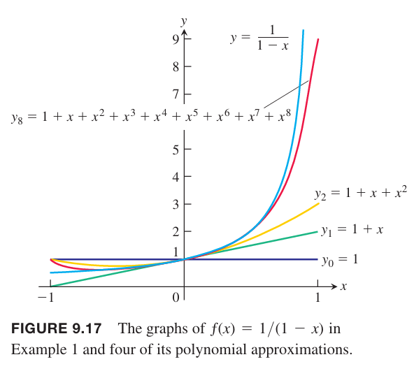
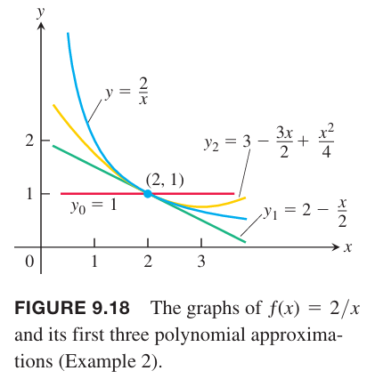
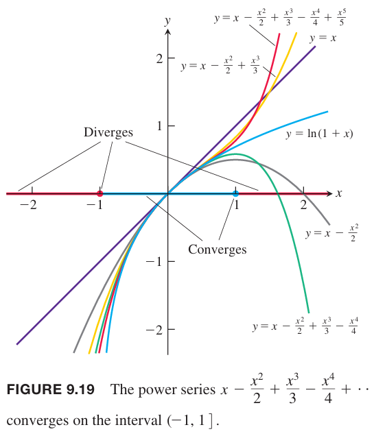
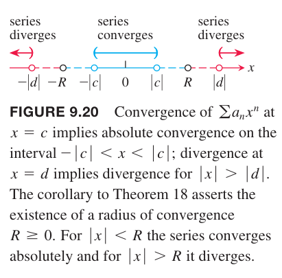
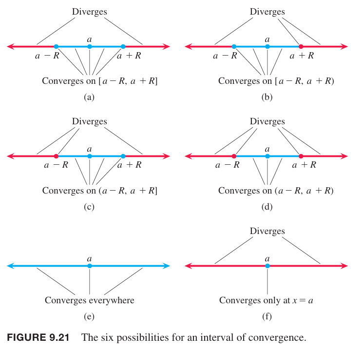

### 幂级数和收敛
**定义**
> $x=0$ 附近的幂级数是形式如下的幂级数
> $$\sum_{n=0}^\infty c_nx^n=c_0+c_1x^1+c_2x^2+\cdots+c_nx^n+\cdots\tag{1}$$
> $x=a$ 附近的幂级数是形式如下的幂级数
> $$\sum_{n=0}^\infty c_n(x-a)^n=c_0+c_1(x-a)^1+c_2(x-a)^2+\cdots+c_n(x-a)^n+\cdots\tag{2}$$
> 其中 $a$ 是中心，$c_0,c_1,c_2,\cdots,c_n,\cdots$ 是常数，称为系数（`coefficient`）。

例1 方程 $(1)$ 的系数如果全为 1，那么得到如下等比级数
$$\sum_{n=1}^\infty x_n=1+x+x^2+\cdots+x^n+\cdots$$
这是一个初始项为 1 公比为 $x$ 的等比数列。如果 $|x|<1$，那么收敛到 $1/(1-x)$。写作
$$\frac{1}{1-x}=1+x+x^2+\cdots+x^n+\cdots,-1<x<1\tag{3}$$

我们从另一个角度审视 $(3)$：等式右边，级数的部分和是多项式 $P_n(x)$ 是左边函数的近似。在 $x=0$ 附近，很少的项之和就是很好的近似，如果我们观察 $x=1,-1$ 的附近，需要更多的项来近似。如下图所示。函数 $f(x)=1/(1-x)$ 在 $x=1$ 处不连续，这里有垂直渐近线。当 $x\geq 1$ 时，近似就不再适用了。

例2 幂级数
$$1-\frac{1}{2}(x-2)+\frac{1}{4}(x-2)^2+\cdots+(-\frac{1}{2})^n(x-2)^n+\cdots$$
和 $(2)$ 形式一样，$a=2,c_0=1,c_1=-1/2,c_2=1/4,\cdots,c_n=(-1/2)^n,\cdots$。这是一个初始项为 1 公比 $r=-\frac{x-2}{2}$ 的等比级数。当 $|\frac{x-2}{2}|<1$，即 $0<x<4$ 时，级数收敛。和为
$$\frac{1}{1-r}=\frac{1}{1+\frac{x-2}{2}}=\frac{2}{x}$$
那么，这个多项式是在 $x=2$ 附近函数 $f(x)=2/x$ 的近似。
$$\begin{aligned}
P_0(x)&=1\\
P_1(x)&=1-\frac{1}{2}(x-2)=2-\frac{x}{2}\\
P_2(x)&=1-\frac{1}{2}(x-2)+\frac{1}{4}(x-2)^2=3-\frac{3x}{2}+\frac{x^2}{4}
\end{aligned}$$

下面的例子使用比值测试法来判定幂级数的收敛性。

例3 当 $x$ 值为多少时，下面级数收敛。

（a）
$$\sum_{n=1}^\infty(-1)^{n-1}\frac{x^n}{n}=x-\frac{x^2}{2}+\frac{x^3}{3}-\cdots$$
（b）
$$\sum_{n=1}^\infty(-1)^{n-1}\frac{x^{2n-1}}{2n-1}=x-\frac{x^3}{3}+\frac{x^5}{5}-\cdots$$
（c）
$$\sum_{n=0}^\infty\frac{x^n}{n!}=1+x+\frac{x^2}{2!}+\frac{x^3}{3!}+\cdots$$
（d）
$$\sum_{n=0}^\infty n!x^n=1+x+2!x^2+3!x^3+\cdots$$
解：对级数 $\sum|u_n|$ 使用比值测试，其中 $u_n$ 是幂级数的第 $n$ 项。

（a）
$$\bigg|\frac{u_{n+1}}{u_n}\bigg|=\bigg|\frac{x^{n+1}}{n+1}\frac{n}{x^n}\bigg|=\frac{n}{n+1}|x|\to|x|$$
根据比值测试，$|x|<1$ 时级数收敛，$|x|>1$ 时发散。当 $x=1$ 时，级数是交错调和级数，收敛。$x=-1$ 时，级数是负的调和级数，发散。所以级数收敛的条件是 $-1< x\leq 1$。

例6 中我们会得到这个级数在区间 $(-1,1]$ 收敛到函数 $\ln (1+x)$。如下图所示。

（b）
$$\bigg|\frac{u_{n+1}}{u_n}\bigg|=\bigg|\frac{x^{2n+1}}{2n+1}\frac{2n-1}{x^{2n-1}}\bigg|=\frac{2n-1}{2n+1}x^2\to x^2$$
那么 $x^2<1$ 时，收敛；$x^2>1$ 时，发散。$x=1$ 时，级数是 $1-\frac{1}{3}+\frac{1}{5}-\frac{1}{7}+\cdots$，满足交错级数测试的三个条件，所以收敛。$x=-1$ 时，级数是 $-1+\frac{1}{3}-\frac{1}{5}+\frac{1}{7}-\cdots$ 也满足交错级数测试的三个条件，也收敛。所以级数在 $-1\leq x\leq 1$ 区间上收敛。

（c）
$$\bigg|\frac{u_{n+1}}{u_n}\bigg|=\bigg|\frac{x^{n+1}}{(n+1)!}\frac{n!}{x^n}\bigg|=\frac{1}{n+1}x\to 0$$
所以 $x$ 为任意值时都收敛。

（d）
$$\bigg|\frac{u_{n+1}}{u_n}\bigg|=\bigg|\frac{x^{n+1}(n+1)!}{n!x^n}\bigg|=(n+1)|x|\to\infty,x\neq 0$$
所以级数只在 $x=0$ 是收敛。

上面的例子说明幂级数可能收敛也可能发散。下面的定理是说如果级数在两个以上的点上收敛，那么在这个区间上都收敛。区间可以有限，也可以无限，可以不包含两个端点，或者包含其中一个或者包含两个端点。在端点处，我们需要单独分析。

**定理 18 幂级数收敛定理**
> 如果一个级数
> $$\sum_{n=0}^\infty a_nx^n=a_0+a_1x+a_2x^2+\cdots$$
> 在 $x=c\neq 0$ 处收敛，那么当 $|x|<|c|$ 时级数绝对收敛。如果级数在 $x=d$ 处发散，那么当 $|x|>|d|$ 时，级数发散。

证明：使用直接比较法测试。

假设级数 $\sum_{n=0}^\infty a_nc^n$ 收敛。根据第 $n$ 项测试，$\lim_{n\to\infty}a_nc^n\to 0$。因此，存在一个 $N$，使得 $|a_nc^n|<1,n>N$，所以
$$|a_n|<\frac{1}{|c^n|},n>N$$
取满足 $|x|<|c|$ 的 $x$，所以 $|x|/|c|<1$。对上面的式子两边同时乘以 $|x|^n$
$$|a_n||x|^n<\frac{|x|^n}{|c|^n},n>N$$
因为 $|x/c|<1$，那么等比级数 $\sum_{n=0}^\infty|x/c|^n$ 收敛，那么 $\sum_{n=1}^\infty |a_n||x^n|$ 收敛。那么原始级数收敛，条件是 $|x|<|c|$。

如下图所示。

如果 $x$ 满足 $|x|>|d|$，且此时级数收敛，根据上面的证明，$x=d$ 处也收敛，与定理前提矛盾。所以当 $|x|>|d|$ 时级数发散。

为了简化定理 18，我们使用的是形如 $\sum a_nx^n$ 的幂级数。对于 $\sum a_n(x-a)^n$ 这样的幂级数，用 $x'$ 替代 $x-a$ 即可。

### 幂级数的收敛半径
根据上面的定理和之前例子，可知幂级数 $\sum a_n(x-a)^n$ 收敛性可分为如下三类：只在 $x=a$ 处收敛，对于所有 $x$ 都收敛，或者是在以 $x=a$ 为中心，$R$ 为半径的区间上收敛。下面会证明这一点。如果我们考虑端点处的收敛情况，总共有六种情况，如下图所示。

**定理 18 的推论**
> 级数 $\sum c_n(x-a)^n$ 收敛性可以描述为下面三种情况之一：
> 1. 存在一个正整数 $R$，使得级数对满足 $|x-a|>R$ 的 $x$ 发散，对满足 $|x-a|<R$ 的 $x$ 收敛。在端点处 $x=a-R,x=a+R$ 处可以收敛也可以不收敛。
> 2. 级数对所有 $x$ 都收敛。
> 3. 级数只在 $x=a$ 处收敛。

证明：和之前定理一样，我们证明 $a=0$ 的情况。如果级数处处收敛，那么就是情况 2。如果只在 $x=0$ 时收敛，那么是情况 3。否则存在 $d$ 使 $\sum_{n=0}^\infty c_nd^n$ 发散。令 $S$ 是使 $\sum_{n=0}^\infty c_nx^n$ 收敛的 $x$ 的集合。根据定理 18，$S$ 不包含满足 $|x|>|d|$ 的 $x$。根据实数完备性，$S$ 有上界 $R$。由于不是情况 3，那么存在一个 $b\neq 0$，级数收敛，那么级数在 $x\in (-|b|,|b|)$ 上收敛，所以 $R>0$。

如果 $|x|<R$，存在一个数 $c\in S$ 有 $|x|<c<R$，如果不存在这样的 $c$ 说明 $R$ 不是上界。由于 $c\in S$，所以收敛。

现在假设 $|x|>R$。如果级数在 $x$ 处收敛，那么在开区间 $(-|x|,|x|)$ 上绝对收敛，所以 $S$ 包含这个区间。由于 $R$ 是 $S$ 的上界，那么就要求 $|x|\leq R$，矛盾。所以如果 $|x|>R$，级数发散。

对于中心位于 $x=a$ 的级数，令 $x'=x-a$ 重复上述的证明即可。

$$\tag*{$\blacksquare$}$$

$R$ 称为收敛半径，以 $x=a$ 为中心 $R$ 为半径的区间称为收敛区间。收敛区间可以是开区间、闭区间或者是半开半闭，依赖于级数本身。在 $|x-a|<R$ 上的 $x$ 处，级数绝对收敛。如果级数对所有 $x$ 都收敛，那么收敛半径是无穷大。如果只在 $x=a$ 处收敛，那么称收敛半径为零。

### 幂级数的操作
在收敛的区间的交际上，两个幂级数可以对应项相加或者相减。也可以做乘法，不过通常我们只对前几项（最重要的）做乘法。下面给出了乘积的系数公式（忽略证明）。

**定理 19 幂级数的级数的乘法**
> 如果当 $|x|<R$ 时，$A(x)=\sum_{n=0}^\infty a_nx^n,B(x)=\sum_{n=0}^\infty b_nx^n$ 绝对收敛
> $$c_n=a_0b_n+a_1b_{n-1}+a_nb_{n-2}+\cdots+a_{n-1}b_1+a_nb_0=\sum_{k=0}^na_kb_{n-k}$$
> 那么当 $|x|<R$ 时 $\sum_{n=0}^\infty c_nx^n$ 绝对收敛到 $A(x)B(x)$：
> $$(A(x)=\sum_{n=0}^\infty a_nx^n)(B(x)=\sum_{n=0}^\infty b_nx^n)=\sum_{n=0}^\infty c_nx^n$$

寻找两个幂级数的乘积的系数 $c_n$ 非常乏味且有的项很难处理。下面的计算展示了求前一些项的方式
$$\begin{aligned}
&(\sum_{n=0}^\infty x^n)\cdot(\sum_{n=0}^\infty (-1)^n\frac{x^{n+1}}{n+1})\\
=&(1+x+x^2+\cdots)(x-\frac{x^2}{2}+\frac{x^3}{3}-\cdots)\\
=&(x-\frac{x^2}{2}+\frac{x^3}{3})+(x^2-\frac{x^3}{2}+\frac{x^4}{3}-\cdots)+(x^3-\frac{x^4}{2}+\frac{x^5}{3})+\cdots\\
=&x+\frac{x^2}{2}+\frac{5x^3}{6}+\cdots
\end{aligned}$$

**定理 20**
> 当 $|x|<R$ 时 $\sum_{n=0}^\infty a_nx^n$ 绝对收敛，函数 $f$ 是连续函数，那么在集合 $|f(x)|<R$ 的 $x$ 处，$\sum_{n=0}^\infty a_n(f(x))^n$ 绝对收敛。

由于 $\sum_{n=0}^\infty x^n=\frac{1}{1-x}$ 对 $|x|<1$ 收敛，根据定理 20，那么当 $x$ 满足 $|4x^2|<1$，即 $|x|<1/2$ 时，$\sum_{n=0}^\infty(4x^2)^n=\frac{1}{1-4x^2}$ 绝对收敛。

**定理 21 逐项微分**
> 如果 $\sum c_n(x-a)^n$ 收敛半径 $R>0$，由此得到函数
> $$f(x)=\sum_{n=0}^\infty c_n(x-a)^n,a-R<x<a+R$$
> 在这个区间内，$f$ 有任意阶导数，可以通过对原始级数逐项微分得到函数的导数
> $$f'(x)=\sum_{n=1}^\infty nc_n(x-a)^{n-1}$$
> $$f''(x)=\sum_{n=2}^\infty n(n-1)c_n(x-a)^{n-2}$$
> 等等。每个微分函数在区间 $a-R<x<a+R$ 上都收敛。

证明：简单起见，令 $a=0$。一下证明按照习题 64 的步骤，但是其中第二步又出现了 $c_n$，所以定理 21 的系数使用 $a_n$。

$f(x)$ 收敛半径是 $R$，所以当 $n\to\infty$ 时
$$\bigg|\frac{a_nx^n}{a_{n-1}x^{n-1}}\bigg|=\bigg|\frac{a_n}{a_{n-1}}x\bigg|<1$$
令 $g(x)=\sum_{n=1}^\infty na_nx^{n-1}$，比值测试，当 $n\to\infty$ 时
$$\bigg|\frac{na_nx^{n-1}}{(n-1)a_{n-1}x^{n-2}}\bigg|=\bigg|\frac{a_n}{a_{n-1}}x\bigg|<1$$
所以 $g(x)$ 在收敛半径是 $R$。下面需要证明 $f'(x)=g(x)$。

对函数 $x^n$ 应用中值定理，选择的两个横坐标是 $x+h,x$，可以得到
$$\frac{(x+h)^n-x^n}{h}=nc_n^{n-1}$$
其中 $c_n$ 介于 $x,x+h$ 之间，$n=1,2,3,\cdots$。

对于 $n\geq 2$，$\frac{f(x+h)-f(x)}{h},g(x)$ 的对应项之差是
$$na_nx^{n-1}-na_nc_n^{n-1}=na_n(x^{n-1}-c_n^{n-1})$$
而 $n=1$ 时，$\frac{f(x+h)-f(x)}{h},g(x)$ 的项分别是 $a_1\cdot 1\cdot c_1^0=a_1,1\cdot a_1x^0=a_1$，之差是零。$n=0$ 时，$f(x)$ 的第零项与 $x$ 无关，那么 $f(x+h)-f(x)=0$。所以
$$\bigg|g(x)-\frac{f(x+h)-f(x)}{h}\bigg|=\bigg|\sum_{n=2}na_n(x^{n-1}-c_n^{n-1})\bigg|$$
对函数 $x^{n-1}$ 应用中值定理，选择的两个横坐标是 $x,c_n$，可以得到
$$\frac{x^{n-1}-c_n^{n-1}}{x-c_n}=(n-1)d_{n-1}^{n-2}$$
其中，$d_{n-1}$ 介于 $x,c_n$ 之间，$n=2,3,4,\cdots$。间接地 $d_{n-1}$ 也介于 $x,x+h$ 之间。

$c_n$ 介于 $x,x+h$ 之间，所以 $|x-c_n|<h$。考虑到 $d_{n-1}$ 可能是正数也可能是负数，所有 $d_{n-1}\leq\max{|x|,|x+h|}=\alpha$。
$$\begin{aligned}
\bigg|g(x)-\frac{f(x+h)-f(x)}{h}\bigg|&=\bigg|\sum_{n=2}na_n(x^{n-1}-c_n^{n-1})\bigg|\\
&=\bigg|\sum_{n=2}na_n(n-1)(x-c_n)d_{n-1}^{n-2}\bigg|\\
&\leq\bigg|\sum_{n=2}na_n(n-1)|h|d_{n-1}^{n-2}\bigg|\\
&\leq|h|\sum_{n=2}|na_n(n-1)\alpha^{n-2}|\\
\end{aligned}$$
现在看下级数 $\sum_{n=2}na_n(n-1)\alpha^{n-2}$ 的收敛性。应用比值测试，$n\to\infty$ 时
$$\bigg|\frac{n(n-1)a_n\alpha^{n-2}}{(n-1)(n-2)a_{n-1}\alpha^{n-3}}\bigg|=\bigg|\frac{na_n}{(n-2)a_{n-1}}\alpha\bigg|=\bigg|\frac{a_n}{a_{n-1}}\alpha\bigg|<1$$
所以级数收敛，那么其和是有限的。

当 $h\to 0$ 时，上面式子右边的极限就是零，所以左边的极限值是零，去掉绝对值，极限也是零，所以
$$\lim_{h\to 0}\frac{f(x+h)-f(x)}{h}=g(x)$$
这个式子就是导数的定义，所以 $f'(x)=g(x)$。

例4 有如下函数
$$\begin{aligned}
f(x)&=\frac{1}{1-x}\\
&=1+x+x^2+x^3+x^4+\cdots\\
&=\sum_{n=0}^\infty x^n,&-1<x<-1
\end{aligned}$$
求 $f'(x),f''(x)$。

解：逐项微分
$$\begin{aligned}
f'(x)&=\frac{1}{(1-x)^2}\\
&=1+2x+3x^2+4x^3+\cdots+\cdots nx^{n-1}+\cdots\\
&=\sum_{n=1}^\infty nx^{n-1},&-1<x<1
\end{aligned}$$
$$\begin{aligned}
f''(x)&=\frac{2}{(1-x)^3}\\
&=2+6x+12x^2+\cdots+n(n-1)x^{n-2}+\cdots\\
&=\sum_{n=2}^\infty n(n-1)x^{n-2},&-1<x<1
\end{aligned}$$

逐项微分对其他级数不总是正确的。比如等比级数
$$\sum_{n=1}^\infty\frac{\sin(n!x)}{n^2}$$
对任意 $x$ 都收敛。但是逐项微分之和
$$\sum_{n=1}^\infty\frac{n!\cos(n!x)}{n^2}$$
对任意 $x$ 都发散。

**定理 22 逐项积分**
> 如果
> $$f(x)=\sum_{n=0}^\infty c_n(x-a)^n$$
> 在 $a-R<x<a+R,R>0$ 上收敛，那么
> $$\sum_{n=0}^\infty c_n\frac{(x-a)^{n+1}}{n+1}$$
> 在这个区间上也收敛，同时在这个区间上有
> $$\int f(x)dx=\sum_{n=0}^\infty c_n\frac{(x-a)^{n+1}}{n+1}+C$$

证明：简单起见，不妨令 $a=0$，那么 $f(x)=\sum_{n=0}^\infty c_nx^n$ 在区间 $-R<x<R$ 上收敛。

令 $g(x)=\sum_{n=0}^\infty\frac{c_n}{n+1}x^{n+1}$。使用比值测试
$$\lim_{n\to\infty}\frac{c_nx^{n+1}}{n+1}\cdot\frac{1}{c_nx^n}=\lim_{n\to\infty}\frac{x}{n+1}\to 0$$
所以 $g(x)$ 在区间 $-R<x<R$ 上也收敛。

应用定理 21，对 $g(x)$ 逐项微分，得到 $f(x)$ 且收敛区间一致，所以 $g'(x)=f(x)$，因此
$$\int f(x)dx=g(x)+C$$

例5 求函数
$$f(x)=\sum_{n=0}^\infty\frac{(-1)^nx^{2n+1}}{2n+1}=x-\frac{x^3}{3}+\frac{x^5}{5}-\cdots,-1\leq x\leq 1$$
解：对原始级数逐项微分
$$f'(x)=1-x^2+x^4-x^6+\cdots,-1<x<1$$
这是一个首项是 1 公比为 $-x^2$ 的等比数列，所以
$$f'(x)=\frac{1}{1-(-x^2)}=\frac{1}{1+x^2}$$
积分
$$\int f'(x)dx=\int\frac{1}{1+x^2}dx=\tan^{-1}x+C$$
当 $x=0$ 时，$f(x)=0$，所以 $C=0$。因此
$$f(x)=\tan^{-1}x,-1<x<1$$
对于端点处 $x\pm 1$，级数也收敛。
$$\sum_{n=0}^\infty\frac{(-1)^n}{2n+1}=\tan^{-1}1=\frac{\pi}{4}$$
这里忽略证明。

例6 级数
$$\frac{1}{1+t}=1-t+t^2-t^3+\cdots$$
在区间 $-1<t<1$ 上收敛。因此
$$\begin{aligned}
\ln(1+x)&=\int_0^x\frac{1}{1+t}dt\\
&=t-\frac{t^2}{2}+\frac{t^3}{3}-\frac{t^4}{4}+\cdots\bigg|_0^x\\
&=x-\frac{x^2}{2}+\frac{x^3}{3}-\frac{x^4}{4}+\cdots
\end{aligned}$$
即
$$\ln(1+x)=\sum_{n=1}^\infty\frac{(-1)^{n-1}x^n}{n},-1<x<1$$
下面证明当 $x=1$ 时，级数收敛到 $\ln 2$，即
$$\ln 2=\sum_{n=1}^\infty\frac{(-1)^{n-1}}{n}$$
但是这并不是由定理 22 保证的，定理 21 和 定理 22 都是对开区间成立。

令 $h_n$ 是调和级数前 $n$ 项和，$s_n$ 是交错调和级数的前 $n$ 项和。d
当 $n=1$ 时，
$$s_2=1-\frac{1}{2}=1+\frac{1}{2}-1=h_{2}-h_1$$
假设对所有 $n$ 都有
$$s_{2n}=h_{2n}-h_n$$
当 $n+1$ 时
$$\begin{aligned}
s_{2n+2}&=s_{2n}+\frac{1}{2n+1}-\frac{1}{2n+2}\\
&=h_{2n}-h_n+\frac{1}{2n+1}+\frac{1}{2n+2}-\frac{2}{2n+2}\\
&=(h_{2n}+\frac{1}{2n+1}+\frac{1}{2n+2})-(h_n+\frac{1}{n+1})\\
&=h_{2n+2}-h_{n+1}
\end{aligned}$$
根据归纳法，对于任意 $n$ 有
$$s_{2n}=h_{2n}-h_n$$
欧拉常数定理（见 9.3 小节）是说当 $n\to\infty$ 时
$$1+\frac{1}{2}+\frac{1}{3}+\cdots+\frac{1}{n}-\ln n\to\gamma$$
所以
$$\lim_{n\to\infty}(h_n-\ln n)=\gamma$$
$$\lim_{n\to\infty}(h_{2n}-\ln 2n)=\gamma$$
那么
$$\lim_{n\to\infty}(h_{2n}-\ln 2n-h_n+\ln n)=0=\lim_{n\to\infty}(s_{2n}-\ln 2)$$
所以
$$\lim_{n\to\infty}s_{2n}=\ln 2=\sum_{n=1}^\infty\frac{(-1)^{n+1}}{n}$$
