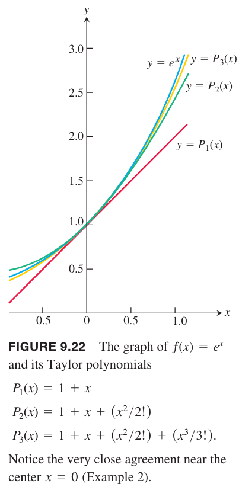
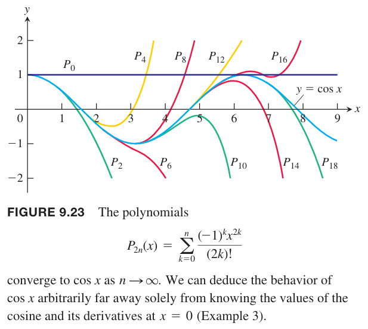
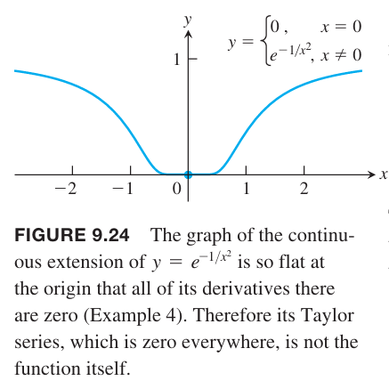

### 级数表示
上一小节中定理 21 告诉是说在收敛区间 $I$ 上幂级数的和是一个连续函数且有任意阶导数。反过来，如果一个函数在某个区间上有任意阶段，能写成幂级数的形式吗？如果能，系数是多少？

假定 $f(x)$ 在 $x=a$ 处能写作幂级数形式
$$\begin{aligned}
f(x)&=\sum_{n=0}^\infty a_n(x-a)^n\\
&=a_0+a_1(x-a)+a_2(x-a)^2+\cdots+a_n(x-a)^n+\cdots
\end{aligned}$$
且收敛半径是正数。在收敛区间 $I$ 上逐项微分
$$\begin{aligned}
f'(x)&=a_1+2a_2(x-a)+3a_3(x-a)^2+\cdots+na_n(x-a)^{n-1}+\cdots\\
f''(x)&=2a_2+3\cdot 2a_3(x-a)+4\cdot 3a_4(x-a)^2+\cdots\\
f'''(x)&=3\cdot 2\cdot 1a_3+4\cdot 3\cdot 2a_4(x-a)+5\cdot 4\cdot 3a_5(x-2)^2+\cdots
\end{aligned}$$
$n$ 阶导数是
$$f^{(n)}(x)=n!a_n+\cdots(x-a)+\cdots$$
这些方程对 $x=a$ 都成立，所以
$$f'(a)=a_1,f''(a)=2\cdot 1a_2,f'''(a)=3\cdot 2\cdot 1a_3$$
一般地
$$f^{(n)}(a)=n!a_n$$
所以幂级数 $\sum_{n=0}^\infty a_n(x-a)^n$ 的系数是
$$a_n=\frac{f^{(n)}(a)}{n!}$$
所以如果 $f$ 能表示成幂级数，那么幂级数必定是
$$f(x)=f(a)+f'(a)(x-a)+\frac{f''(a)}{2!}(x-a)^2+\cdots+\frac{f^{(n)}(a)}{n!}(x-a)^n+\cdots$$
对任意一个在包含 $x=a$ 的收敛区间上有任意阶导数的函数 $f$，写成如上形式，在这个区间一定收敛到函数 $f$ 吗？对于有些函数而言，答案是肯定的，但是对有些函数而言就未必了（比如例 4）。

### 泰勒级数和麦克劳林级数
**定义**
> 令 $f$ 在包含 $a$ 点的区间上有任意阶导数，那么在 $x=a$ 处函数 $f$ 的泰勒级数是
> $$\sum_{k=0}^\infty\frac{f^{(k)(a)}}{k!}=f(a)+f'(a)(x-a)+\frac{f''(a)}{2!}(x-a)^2+\cdots+\frac{f^{(n)}(a)}{n!}(x-a)^n+\cdots$$
> 麦克劳林级数是 $f$ 在 $x=0$ 处的泰勒级数
> $$\sum_{k=0}^\infty\frac{f^{(k)(0)}}{k!}=f(0)+f'(0)x+\frac{f''(0)}{2!}x^2+\cdots+\frac{f^{(n)}(0)}{n!}x^n+\cdots$$

例1 求 $f(x)=1/x$ 在 $a=2$ 处的泰勒级数。在哪些地方收敛到 $1/x$？

解：为了求 $f(2),f'(2),f''(2),\cdots$，先求 $n$ 阶导数
$$\begin{aligned}
f(x)&=x^{-1}\\
f'(x)&=-x^{-2}\\
f''(x)&=2!x^{-3}\\
\vdots\\
f^{(n)}(x)&=(-1)^nn!x^{-(n+1)}
\end{aligned}$$
所以
$$\begin{aligned}
f(2)&=2x^{-1}=\frac{1}{2}\\
f'(2)&=-2^{-2}=-\frac{1}{2^2}\\
\frac{f''(2)}{2!}&=2^{-3}=\frac{1}{2^3}\\
\vdots\\
\frac{f^{(n)}(2)}{n!}&=\frac{(-1)^n}{2^{n+1}}
\end{aligned}$$
所以泰勒级数是
$$\frac{1}{2}-\frac{(x-2)}{2^2}+\frac{(x-2)^2}{2^3}-\cdots+(-1)^n\frac{(x-2)^n}{2^{n+1}}+\cdots$$
这个一个首项是 $1/2$ 公比 $r=-(x-2)/2$ 的等比级数，收敛区间是 $|x-2|<2$，收敛到
$$\frac{1/2}{1-r}=\frac{1/2}{1+\frac{x-2}{2}}=\frac{1}{x}$$
所以在区间 $|x-2|<2$，即 $0<x<4$ 上，$f(x)=1/x$ 在 $a=2$ 处的泰勒级数收敛到 $1/x$。

### 泰勒多项式
可微函数 $f$ 在点 $a$ 的线性近似是度为 1 的多项式
$$P_1(x)=f(a)+f'(a)(x-a)$$
如果函数在 $a$ 点有更高阶导数，那么有高阶的多项式近似 $f$。

**定义**
> 令 $f$ 在包含 $a$ 的某个区间上有 $N$ 阶导。对任意从 0 到 $N$ 的 $n$，$f$ 在 $x=a$ 处生成的 $n$ 阶泰勒多项式是
> $$P_n(x)=f(a)+f'(a)(x-a)+\frac{f''(a)}{2!}(x-a)^2+\cdots+\frac{f^{(n)}(a)}{n!}(x-a)^n$$

这里使用的 $n$ 阶而不是度为 $n$，因为 $f^{(n)}(a)$ 可能为零。$f(x)=\cos x$ 在 $x=0$ 处的前两个多项式是 $P_0(0)=1,P_1(0)=1$，一阶泰勒多项式的度是 0。

就像 $x=a$ 处 $f$ 的线性化是 $f$ 在 $x=a$ 处最好的线性近似一样，泰勒多项式是对应度上最好的多项式近似。

例2 求 $f(x)=e^x$ 在 $x=0$ 处的泰勒级数和泰勒多项式。

解：对任意 $n=1,2,\cdots$，$f^{(n)}(x)=e^x,f^{(n)}(0)=1$。所以 $x=0$ 的 $f$ 的泰勒级数是
$$\begin{aligned}
f(0)+f'(0)x&+\frac{f''(0)}{2!}x^2+\cdots+\frac{f^{(n)}(0)}{n!}+\cdots\\
&=1+x+\frac{x^2}{2}+\cdots+\frac{x^n}{n!}+\cdots\\
&=\sum_{k=0}^\infty\frac{x^k}{k!}
\end{aligned}$$
这也是 $e^x$ 的麦克劳林级数。下一节会证明对于所有 $x$ 这个级数都收敛到 $e^x$。

$x=0$ 处 $n$ 阶泰勒多项式是
$$P_n(x)=1+x+\frac{x^2}{2}+\cdots+\frac{x^n}{n!}$$

例3 求 $f(x)=\cos x$ 在 $x=0$ 处的泰勒级数和泰勒多项式。

解：求余弦函数的导数
$$\begin{aligned}
f(x)&=\cos x&&&f'(x)&=-\sin x\\
f''(x)&=-\cos x&&&f^{(3)}(x)&=\sin x\\
&\vdots&&&&\vdots\\
f^{(2n)}(x)&=(-1)^n\cos x&&&f^{(2n+1)}(x)&=(-1)^{n+1}\sin x
\end{aligned}$$
因为
$$\cos 0=1,\sin 0=0$$
代入
$$f^{(2n)}(0)=(-1)^n,f^{(2n+1)}(0)=(-1)^{n+1}=0$$
那么 $f$ 在 $x=0$ 的泰勒级数是
$$\begin{aligned}
f(0)+f'(0)x&+\frac{f''(0)}{2!}x^2+\cdots+\frac{f^{(n)}(0)}{n!}+\cdots\\
&=1+0\cdots x-\frac{x^2}{2}+0\cdot x^3+\frac{x^4}{4!}+\cdots+(-1)^n\frac{x^{2n}}{(2n)!}+\cdots\\
&=\sum_{k=0}^\infty\frac{(-1)^kx^{2k}}{(2k)!}
\end{aligned}$$
这也是 $\cos x$ 的麦克劳林级数。只有 $x$ 的偶数次幂出现在了级数中，这和余弦函数是偶函数一致。下一节会证明对于所有 $x$ 这个级数都收敛到 $\cos x$。

因为 $f^{(2n+1)}(0)=0$，所以 $2n$ 阶和 $2n+1$ 阶的泰勒多项式是一样的
$$P_{2n}(x)=P_{2n+1}(x)=1-\frac{x^2}{2!}+\frac{x^4}{4!}-\cdots+(-1)^n\frac{x^{2n}}{(2n)!}$$

下图只展示了函数的右半部分，左半部分对称。

例4 可以证明（不容易）
$$f(x)=\begin{cases}
0,&&x=0\\
e^{-1/x^2},&&x\neq 0
\end{cases}$$
在 $x=0$ 处有任意阶导数且对于所有的 $n$ 都有 $f^{(n)}(0)=0$。所以 $f$ 在 $x=0$ 处的泰勒级数是
$$\begin{aligned}
f(0)+f'(0)x&+\frac{f''(0)}{2!}x^2+\cdots+\frac{f^{(n)}(0)}{n!}+\cdots\\
&=0+0\cdot x+0\cdot x^2+\cdots+0\cdot x^n+\cdots\\
&=0
\end{aligned}$$
也即是说，只在 $x=0$ 处收敛到 $f(x)=0$。这是一个泰勒级数在收敛区间上不收敛到 $f(x)$ 的例子。

