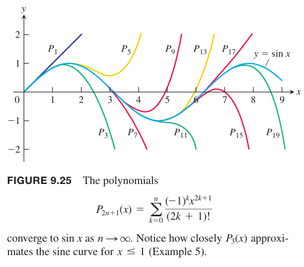

**定理 23 泰勒定理**
> 如果函数 $f$ 和其 $n$ 阶导 $f',f'',\cdots,f^{(n)}$ 在 $[a, b]$ 闭区间上连续，且 $f^{(n)}$ 在 $(a,b)$ 开区间上可导，那么存一个 $c\in(a,b)$ 使得
> $$f(b)=f(a)+f'(a)(b-a)+\frac{f''(a)}{2!}(b-a)^2\cdots+\frac{f^{(n)}(a)}{n!}(b-a)^n+\frac{f^{(n+1)}(c)}{(n+1)!}(b-a)^{n+1}$$

泰勒定理是中值定理的泛化形式。$n=0$ 就是 4.2 节定理 4 中值定理了。

当使用泰勒定理的时候，我们往往固定 $a$，视 $b$ 为变量。那么我们将 $b$ 改写称 $x$，下面是新版本。

**泰勒公式**
> 如果 $f$ 在包含 $a$ 的开区间 $I$ 上有任意阶导数，那么对每一个 $x\in I$ 和正整数 $n$ 都有
> $$f(x)=f(a)+f'(a)(x-a)+\frac{f''(a)}{2!}(x-a)^2\cdots+\frac{f^{(n)}(a)}{n!}(x-a)^n+R_n(x)$$
> 其中
> $$R_n(x)=\frac{f^{(n+1)}(c)}{(n+1)!}(x-a)^{n+1}$$
> 其中 $c$ 介于 $a,x$ 之间。

也就是说，对于任意 $x\in I$，都有
$$f(x)=P_n(x)+R_n(x)$$
这个公式给出了近似函数 $f$ 的多项式公式，并且除了误差。$R_n(x)$ 是 $n$ 阶剩余或者是误差项。

> 对于 $I$ 中的任意 $x$，当 $n\to\infty$ 时，$R_n(x)\to 0$，那么我们称 $f$ 在 $x=a$ 处生成的泰勒级数收敛
> $$f(x)=\sum_{k=0}^\infty\frac{f^{(k)}(a)}{k!}(x-a)^k$$

通常我们在不知道 $c$ 的情况下估计 $R_n(x)$，比如下面这个例子。

例1 证明对于所有实数 $x$，$f(x)=e^x$ 在 $x=0$ 处的泰勒级数收敛到 $f(x)$。

证明：函数在区间 $I=(-\infty,\infty)$ 上有任意阶导数，应用泰勒公式
$$e^x=1+x+\frac{x^2}{2}+\cdots+\frac{x^n}{n!}+R_n(x)$$
$$R_n(x)=\frac{e^c}{(n+1)!}x^{n+1},c\in(0,x)$$
因为 $e^x$ 是增函数，所以 $e^c$ 介于 $e^0=1,e^x$ 之间。当 $x$ 是负数，$c$ 也是，且 $e^c<1$。当 $x=0$，$e^x=1$，所以 $R_n(x)=0$。当 $x$ 是正数，$c$ 也是正数，那么 $e^c<e^x$。因此 $R_n(x)$
$$|R_n(x)|\leq\frac{|x|^{n+1}}{(n+1)!},x\leq 0$$
$$|R_n(x)|<e^x\frac{x^{n+1}}{(n+1)!},x>0$$
因为
$$\lim_{n\to\infty}\frac{x^{n+1}}{(n+1)!}=0$$
所以
$$\lim_{n\to\infty}R_n(x)=0$$
因此对于任意 $x$，级数收敛到 $e^x$。
$$e^x=\sum_{k=0}^\infty\frac{x^k}{k!}=1+x+\frac{x^2}{2!}+\cdots+\frac{x^k}{k!}+\cdots$$

将 $x=1$ 代入例 1 的结论有
$$e=\sum_{n=0}^\infty\frac{1}{n!}=1+1+\frac{1}{2!}+\cdots+\frac{1}{n!}+R_n(1)$$
其中
$$R_n(1)=e^c\frac{1}{(n+1)!}<\frac{3}{(n+1)!},c\in(0,1)$$

### 估算余数
**定理 24 剩余估计定理**
> 如果存在一个正整数 $M$ 使得对所有 $t\in [x,a]$ 都有 $|f^{(n+1)}(t)|<M$，那么泰勒定理中剩余 $R_n(x)$ 满足不等式
> $$|R_n(x)|\leq M\frac{|x-a|^{n+1}}{(n+1)!}$$
> 如果不等式对所有 $n$ 都成立且满足泰勒定理其他条件，那么级数收敛到 $f(x)$。

例2 证明 $\sin x$ 在 $x=0$ 处的泰勒级数对所有 $x$ 都收敛。

证明：函数及其导数是
$$\begin{aligned}
f(x)&=\sin x&&&f'(x)&=\cos x\\
f''(x)&=-\sin x&&&f'''(x)&=-\cos x\\
&\vdots&&&&\vdots\\
f^{(2k)}(x)&=(-1)^k\sin x&&&f^{(2k+1)}(x)&=(-1)^k\cos x
\end{aligned}$$
所以
$$f^{(2n)}(0)=0,f^{(2k+1)}(0)=(-1)^k$$
因此泰勒级数是
$$\sin x=x-\frac{x^3}{3!}+\frac{x^5}{5!}-\cdots+\frac{(-1)^kx^{2k+1}}{(2k+1)!}+R_{2k+1}(x)$$
函数 $\sin x$ 任意阶导数的绝对值都小于等于 1，令剩余估计定理中 $M=1$，得到
$$|R_{2k+1}(x)|\leq\frac{|x|^{2k+2}}{(2k+2)!}$$
不管 $x$ 值是多少，当 $k\to\infty$ 时，$(|x|^{2k+2}/(2k+2)!)\to 0$，所以 $R_{2k+1}\to 0$。对于任意 $x$，$\sin x$ 的麦克劳林级数都收敛到 $\sin x$。
$$\sin x=\sum_{k=0}^\infty \frac{(-1)^kx^{2k+1}}{(2k+1)!}=x-\frac{x^3}{3!}+\frac{x^5}{5!}-\frac{x^7}{7!}+\cdots$$

例3 证明 $\cos x$ 在 $x=0$ 处的泰勒级数对所有 $x$ 都收敛。

证明：借助 9.8 小节例 3 的推理过程，最后补上一个剩余项。
$$\cos x=1-\frac{x^2}{2!}+\frac{x^4}{4!}-\cdots+(-1)^k\frac{x^{2k}}{(2k)!}+R_{2k}(x)$$
$\cos x$ 任意阶导数的绝对值都小于等于 1，令剩余估计定理中 $M=1$，得到
$$|R_{2k}(x)|\leq\frac{|x|^{2k+1}}{(2k+1)!}$$
不管 $x$ 值是多少，当 $k\to\infty$ 时，$R_{2k}(x)\to 0$。因此，对于任意 $x$，$\cos x$ 在 $x=0$ 处的泰勒级数都收敛到 $\cos x$。
$$\cos x=\sum_{k=0}^\infty\frac{(-1)^kx^{2k}}{(2k)!}=1-\frac{x^2}{2!}+\frac{x^4}{4!}-\frac{x^6}{6!}+\cdots$$

### 泰勒级数的应用
由于泰勒级数是幂级数，那么在收敛区间的交集上，泰勒级数的加、减、乘操作都是有效的。

例4 使用已知级数，求下面函数的泰勒级数。

（a）$\frac{1}{3}(2x+x\cos x)$

（b）$e^x\cos x$

解：

（a）
$$\begin{aligned}
\frac{1}{3}(2x+x\cos x)&=\frac{2}{3}x+\frac{1}{3}x(1-\frac{x^2}{2!}+\frac{x^4}{4!}-\frac{x^6}{6!}+\cdots)\\
&=\frac{2}{3}x+\frac{1}{3}x-\frac{x^3}{3!}+\frac{x^5}{3\cdots 4!}-\cdots\\
&=x-\frac{x^3}{6}+\frac{x^5}{72}-\cdots
\end{aligned}$$
（b）
$$\begin{aligned}
e^x\cos x&=(1+x+\frac{x^2}{2!}+\frac{x^3}{3!}+\frac{x^4}{4!}+\cdots)(1-\frac{x^2}{2!}+\frac{x^4}{4!}-\frac{x^6}{6!}+\cdots)\\
&=(1+x+\frac{x^2}{2!}+\frac{x^3}{3!}+\frac{x^4}{4!}+\cdots)-(\frac{x^2}{2!}+\frac{x^3}{2!}+\frac{x^4}{2!2!}+\frac{x^5}{2!3!}+\cdots)+(\frac{x^4}{4!}+\frac{x^5}{4!}+\cdots)+\cdots\\
&=1+x-\frac{x^3}{3}-\frac{x^4}{6}+\cdots
\end{aligned}$$
通过定理 20，可以用函数 $f$ 的泰勒级数来求 $f(u(x))$ 的泰勒级数，其中国 $u(x)$ 是任意连续函数。这个泰勒级数收敛区间是所有使得 $u(x)$ 在 $f$ 的泰勒级数的收敛区间的 $x$ 值。比如，我们使用 $2x$ 替代 $x$ 得到 $\cos 2x$ 的泰勒级数。
$$\begin{aligned}
\cos 2x&=\sum_{k=0}^\infty\frac{(-1)^k(2x)^{2k}}{(2k)!}\\
&=1-\frac{(2x)^2}{2!}+\frac{(2x)^4}{4!}-\frac{(2x)^6}{6!}+\cdots\\
&=1-\frac{2^2x^2}{2!}+\frac{2^4x^4}{4!}-\frac{2^6x^6}{6!}+\cdots\\
&=\sum_{k=0}^\infty(-1)^k\frac{2^{2k}x^{2k}}{(2k)!}
\end{aligned}$$

例5 当 $x$ 为何值时，使用 $x-\frac{x^3}{3!}$ 代替 $\sin x$，且误差不大于 $3\times 10^{-4}$？

解：根据交错级数估计定理，下面式子
$$\sin x=x-\frac{x^3}{3!}+\frac{x^5}{5!}-\frac{x^7}{7!}+\cdots$$
的截断误差小于
$$\bigg|\frac{x^5}{5!}\bigg|=\frac{|x|^5}{120}$$
如果
$$\frac{|x|^5}{120}<3\times 10^{-4}$$
那么估计误差就会不大于 $3\times 10^{-4}$，
此时
$$|x|<\sqrt[5]{360\times 10^4}\approx 0.514$$
因为 $x^5/120$ 是正数，所以估计值 $x-\frac{x^3}{3!}$ 小于 $\sin x$。

从下图可以看出。在区间 $0\leq x\leq 1$ 上，$P_3(x)=x-\frac{x^3}{3!}$ 与 $\sin x$ 的曲线几乎无法分辨（误差小于 1%）。

### 泰勒定理的证明
下面证明 $a<b$ 的情况，$a>b$ 的情况类似。

泰勒多项式
$$P_n(x)=f(a)+f'(a)(x-a)+\frac{f''(a)}{2!}(x-a)^2+\cdots+\frac{f^{(n)}(a)}{n!}(x-a)^n$$
及其前 $n$ 阶导数在 $x=a$ 处的值与 $f$ 及其前 $n$ 阶导数的值相同。我们添加上一项 $K(x-a)^{n+1}$，$K$ 为任意常数，不影响上述结论，因为这一项及其前 $n$ 阶导数在 $x=a$ 处都是 0。可以构造一个新函数
$$\phi_n(x)=P_n(x)+K(x-a)^{n+1}$$
这个函数及其前 $n$ 阶导数在 $x=a$ 处的值与 $f$ 及其前 $n$ 阶导数的值相同。

选择一个特殊的 $K$ 使得 $\phi_n(x)$ 在 $x=b$ 处的值与 $f(x)$ 相同，即
$$f(b)=P_n(b)+K(b-a)^{n+1}$$
$$K=\frac{f(b)-f(a)}{(b-a)^{n+1}}$$
函数
$$F(x)=f(x)-\phi_n(x)$$
定义了两者之间在 $[a,b]$ 上的差值。

应用 4.2 节的罗尔中值定理，由于 $F(a)=F(b)=0$，且 $F,F'$ 在 $[a,b]$ 上连续，那么
$$F'(c_1)=0,c_1\in(a,b)$$
又因为 $F'(a)=F'(c_1)=0$，且 $F',F''$ 在$[a,c_1]$ 上连续，那么
$$F''(c_2)=0,c_2\in(b,c_1)$$
依次下去
$$\begin{aligned}
F'''(c_3)=0&&&c_3\in(a,c_2)\\
F^{(4)}(c_4)=0&&&c_4\in(a,c_3)\\
\vdots\\
F^{(n)}(c_n)=0&&&c_n\in(a,c_{n-1})
\end{aligned}$$
因为 $F^{(n)}$ 在 $[a,b]$ 上连续且在 $(a,c_n)$ 上可导，又因为 $F^{(n)}(a)=F^{(n)}(c_n)=0$，再次使用罗尔中值定理，存在 $c_{n+1}\in(a,c_n)$ 使得
$$F^{(n+1)}(c_{n+1})=0$$
将 $F(x)=f(x)-P_n(x)-K(x-a)^{n+1}$ 求 $n+1$ 次导，有
$$F^{(n+1)}(x)=f^{(n+1)}(x)-0-K(n+1)!$$
那么
$$K=\frac{f^{(n+1)}(c)}{(n+1)!},c=c_{n+1}\in(a,b)$$
因此
$$f(b)=P_n(b)+\frac{f^{(n+1)}(c)}{(n+1)!}(b-a)^{n+1},c\in(a,b)$$
