### 参数方程
如下图所示是一个粒子在 $xy$ 平面上运动的轨迹。注意这个曲线无法用 $x$ 的函数表示。不过，我们有时可以用一组方程 $x=f(t),y=g(t)$ 描述轨迹，其中 $f,g$ 都是连续函数。当研究运动时，$t$ 表示时间。

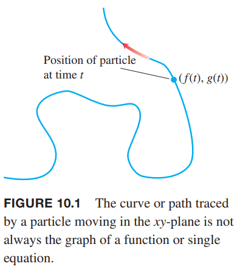

**定义**
> 如果 $x,y$ 是关于 $t$ 在区间 $I$ 上的函数
> $$x=f(t),y=g(t)$$
> 点集 $(x,y)=(f(t),g(t))$ 是参数曲线（`parametric curve`），这组方程是曲线的参数方程（`parametric equations`）。

变量 $t$ 是曲线的参数（`parameter`），定义域 $I$ 是参数区间（`parameter interval`）。如果 $I$ 是闭区间，即 $a\leq t\leq b$，那么点 $(f(a),g(a))$ 是曲线的起点（`initial point`），$(f(b),g(b))$ 是曲线的终点（`terminal point`）。当我们定义参数方程和参数区间时，我们有一条参数化（`parametrized`）的曲线。方程和区间共同构成了曲线的参数化（`parametrization`）。给定的曲线可以表示成不同的参数方程的集合。

例1 画出由下面参数方程定义的曲线的轮廓。
$$x=\sin \pi t/2,y=t,0\leq t\leq 6$$
解：如下图所示。

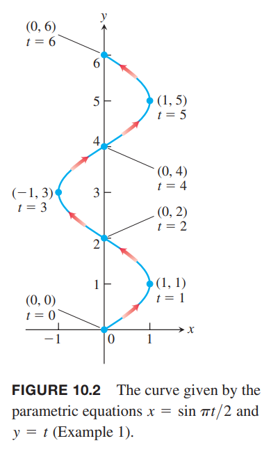

我们把这个曲线想象成一个运动粒子的路径，当 $t=0$ 时，粒子处于 $(0,0)$ 处，然后蜿蜒向上运动，直到 $t=0$ 时在点 $(0,6)$ 处终值。运动方向如箭头所示。

例2 画出由下面参数方程定义的曲线的轮廓。
$$x=t^2,y=t+1,-\infty<t<\infty$$
解：如下图所示。

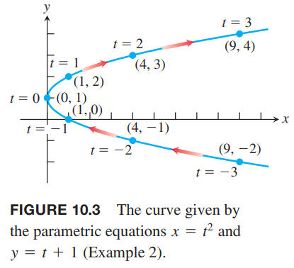

各个点之间的时间间隔是相同的，但是曲线的长度却差距很大。当粒子接近 $y$ 轴的时候，随着 $t$ 的增加，粒子运动的越来越慢，反之，当粒子远离 $y$ 轴的时候，粒子运动的越来越快。由于 $t$ 的区间是所有实数，所以这个曲线没有起点也没有终点。

对于这个例子，我们可以使用代数的方法消除 $t$，得到仅有 $x,y$ 的方程。
$$x=t^2=(y-1)^2=y^2-2y-1$$
这是一个抛物线。有时，消除参数是很困难的，甚至是不可能的。

例3 给出下面参数曲线的图像。

（1）
$$x=\cos t,y=\sin t,0\leq t\leq 2\pi$$
（2）
$$x=a\cos t,y=a\sin t,0\leq t\leq 2\pi$$
解：由于
$$x^2+y^2=\cos^2t+\sin^2t=1$$
那么这个曲线位于单位圆上。$t$ 从 $0$ 增长到 $2\pi$，点 $(x,y)=(\cos t,\sin t)$ 从 $(1,0)$ 点开始，逆时针绕单位圆一周。如下图所示。

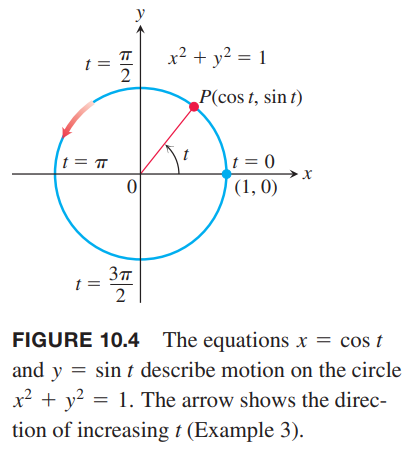

（2）和（1）基本一样，不过是半径为 $a$ 的圆而不是单位圆。

例4 粒子运动的位置 $P(x,y)$ 由以下参数方程和参数区间确定
$$x=\sqrt{t},y=t,t\geq 0$$
求路径。

解：消除参数 $t$
$$y=t=(\sqrt{t})^2=x^2$$
粒子运动的曲线是抛物线。不过不是整个抛物线而只是右半边。当 $t=0$ 时，粒子从点 $(0,0)$ 开始向上运动。如下图所示。参数区间是 $[0,\infty)$ 意味着没有终点。

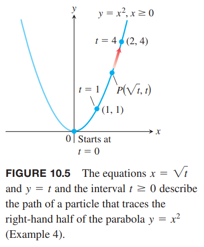

任意函数 $y=f(x)$ 的图像总是能被自然参数化（`natural parametrization`）为 $x=t,y=f(t)$。参数的定义域和函数的定义域相同。

例5 函数 $f(x)=x^2$ 的图像的参数化可以表示为
$$x=t,y=f(t)=t^2,-\infty<t<\infty$$
当 $t\geq 0$ 时，参数方程给出的路径和例 4 相同。不过这里参数 $t$ 可以是负数，所以抛物线的左边也在其表示范围内。对于这个参数曲线，没有起点也没有终点。

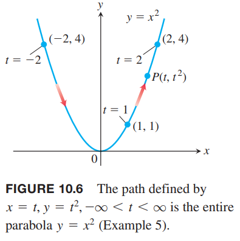

注意，参数化也表示移动的粒子何时位于指定位置。例 4 中，$t=4$ 时到达点 $(2,4)$，在例 5 中，稍早一些，$t=2$ 时到达该点。这隐含着两个运动物体可能相撞，12 章将从这个视角阐述。

例6 求经过点 $(a,b)$ 斜率为 $m$ 的参数方程。

解：这条线在笛卡尔坐标系可以表示为 $y-b=m(x-a)$。通过 $t=x-a$ 定义参数 $t$，那么
$$x=a+t,y=b+mt,-\infty<t<\infty$$
这个参数化方程与例 5 中从 $t=x$ 开始求解的参数方程不同，不过描述的是同一条直线。

例7 画出下面参数方程的草图并找到其路径。
$$x=t+\frac{1}{t},y=t-\frac{1}{t},t>0$$
解：可以和之前的例子一样，先计算几个时刻的值，画图。这里通过消除 $t$ 找到方程。这里的过程明显要比例 2 复杂。首先求 $x,y$ 的差
$$x-y=(t+\frac{1}{t})-(t-\frac{1}{t})=\frac{2}{t}$$
将两个参数相加
$$x+y=(t+\frac{1}{t})+(t-\frac{1}{t})=2t$$
两边相乘即可以消除 $t$
$$(x-y)(x+y)=4$$
我们得到了双曲线
$$x^2-y^2=4$$
不过，由于 $t>0$，所以 $x$ 不能为负。当 $t$ 很小时，路径位于第四象限，并向第一象限运动，当 $t=1$ 时达到 $x$ 轴。参数区间是 $(0,\infty)$，所以没有起点也没有终点。

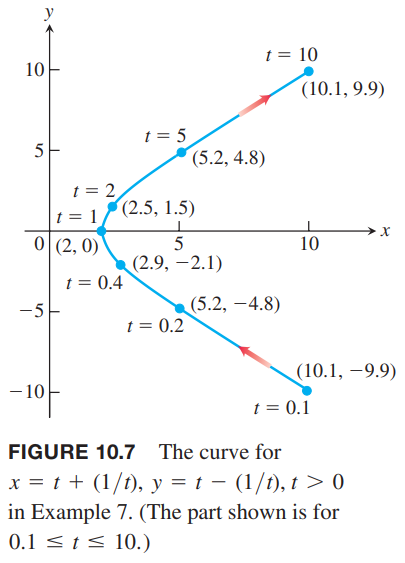

例 4 5 6 解释了给定曲线或者是曲线的一部分，可以用不同的参数方程表示。例 7 的例子，我们也可以用如下参数方程表示
$$x=\sqrt{4+t^2},y=t,-\infty<t<\infty$$
或者是
$$x=2\sec t,y=2\tan t,-\frac{\pi}{2}<t<\frac{\pi}{2}$$
这个可以由三角恒等式 $\sec^2t -\tan^2t=1$ 推导得到
$$x^2-y^2=4\sec^2t-4\tan^2t=4$$
$t$ 介于 $(-\pi/2,\pi/2)$ 之间，$x=\sec t$ 始终是正数 $y=\tan t\in(-\infty,\infty)$，因此 $P$ 只在双曲线的右边运动。当 $t=0$ 时到达点 $(2,0)$ 处。

### 摆线
例8 半径为 $a$ 的轮子沿着水平直线滚动。求轮子边缘固定点 $P$ 的轨迹。这个轨迹叫摆线（`cycloid`）。

解：点 $P$ 在轮子边缘，沿着 $x$ 轴向右滚动。假定滚动角度是 $t$。如下图所示。此时，圆心坐标是 $(at,a)$，那么点 $P$ 的坐标是
$$x=at+a\cos\theta,y=a+a\sin\theta$$

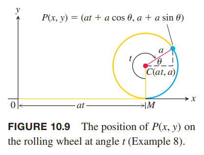

我们使用 $t$ 来表示 $\theta$
$$\theta=\frac{3\pi}{2}-t$$
那么
$$\cos\theta=\cos(\frac{3\pi}{2}-t)=-\sin t,\sin\theta=\sin(\frac{3\pi}{2}-t)=-\cos t$$
所以
$$x=at-a\sin t,y=a-a\cos t$$
一般写作
$$x=a(t-\sin t),y=a(1-\cos t)$$
下图显示了点 $P$ 运动第一圈划过的轨迹。

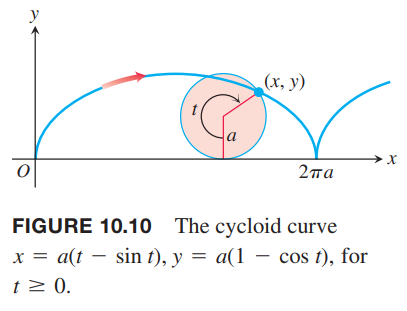

### 最速降线和等时曲线
将上图曲线上下翻转，之前推导的公式仍旧成立。如下图所示。这条曲线有两个有趣的物理性质。

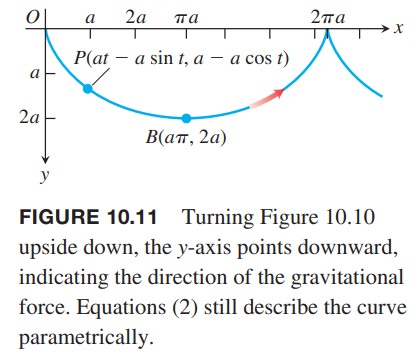

第一个关于点 $O$ 到点 $B$ 的弧。如果在点 $O$ 处放一个无摩擦的圆球，在所有连接这两点的光滑曲线中，经过上述曲线圆球最快到达点 $B$。这称为最速降线（`brachistochrone`）。第二个性质是说在曲线上的任意一点放一个小球，到达点 $B$ 的耗时不变，和点 $O$ 出发耗时一样。所以摆线是等时曲线（`tautochrone`）。

摆线 $OB$ 是唯一的最速降曲线吗？开始时，小球的速度为零，因此动能为零，在重力的作用下，小球从 $(0,0)$ 到任一点 $(x,y)$ 做功 $mgy$，都转化成了动能。因此
$$mgy=\frac{1}{2}mv^2-\frac{1}{2}m(0)^2$$
因此此时速度为 $v=\sqrt{2gy}$，那么
$$\frac{ds}{dT}=\sqrt{2gy}$$
即
$$dT=\frac{ds}{\sqrt{2gy}}=\frac{\sqrt{1+(dy/dx)^2}dx}{\sqrt{2gy}}\tag{3}$$
小球沿某条曲线 $y=f(x)$ 从 $O$ 到 $B(a\pi,2a)$ 所花费的时间 $T_f$ 是
$$T_f=\int_{x=0}^{x=a\pi}\sqrt{\frac{1+(dy/dx)^2}{2gy}}dx$$
所以问题就是积分最小时曲线 $y=f(x)$ 是怎样的？

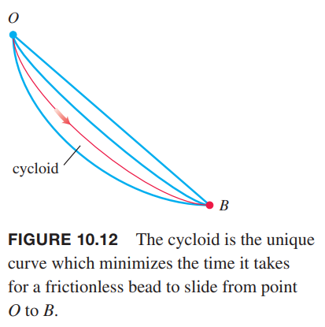

下一节会阐述如何求参数化曲线的弧长 $ds$。一旦知道了 $ds$，然后就可以求积分了，结果就是小球从 $O$ 运动到 $B$ 的时间，结果是 $\pi\sqrt{a/g}$，其中 $a$ 是形成摆线的轮子的半径。进一步，从更低的点释放小球，相应的参数 $t_0>0$，我们仍旧可以求积分，不过区间变成了 $[t_0,\pi]$，这样得到从较低点开始运动到底部的时间。积分结果还是 $T=\pi\sqrt{a/g}$。这个结果证明了摆线是等时曲线。如下图所示，从点 $O,A,C$ 三个点释放小球，会同时到达 $B$ 点。

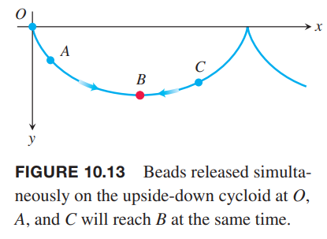
