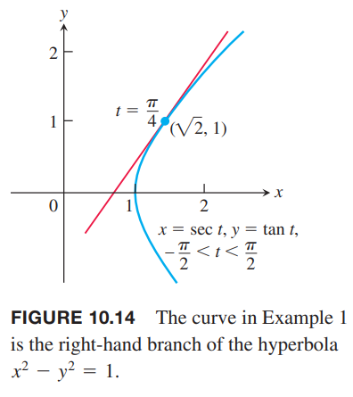
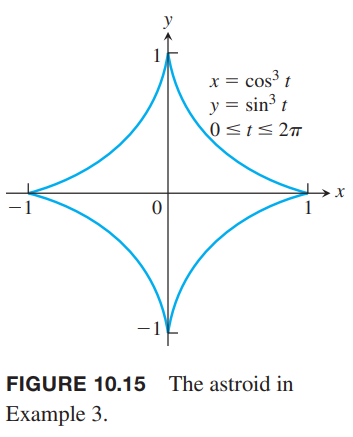
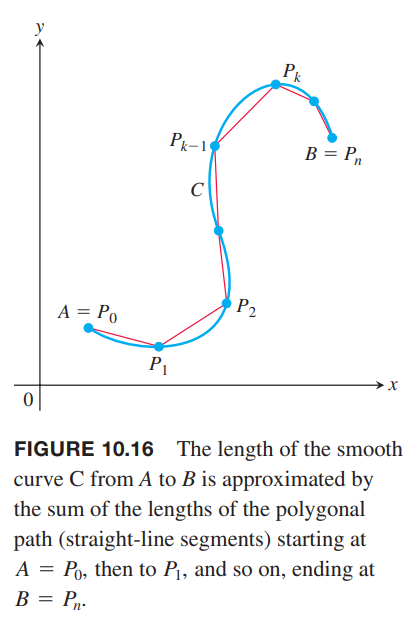
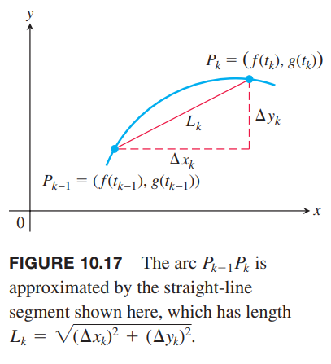
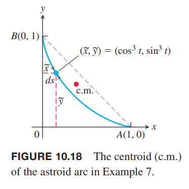
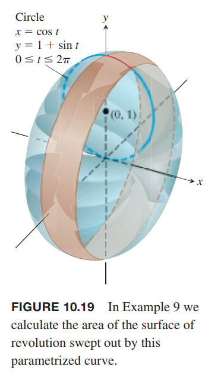

### 切线和面积
如果函数 $f,g$ 在 $t$ 可微，那么参数化曲线 $f(t),g(t)$ 在 $t$ 处是可微的。在可微曲线上，$y$ 是 $x$ 的可微函数，根据链式法则 $dy/dt,dx/dt,dy/dx$ 的关系如下
$$\frac{dy}{dt}=\frac{dy}{dx}\frac{dx}{dt}$$
如果 $dx/dt\neq 0$，两边除以 $dx/dt$ 可以 $dy/dx$。

> $dy/dx$ 的参数公式
> 如果三个导数都存在，且 $dx/dt\neq 0$，那么
> $$\frac{dy}{dx}=\frac{dy/dt}{dx/dt}\tag{1}$$

如果参数方程定义 $y$ 是 $x$ 二阶可微函数，令 $dy/dx=y'$，可以计算 $d^2y/dx^2$
$$\frac{d^2y}{dx^2}=\frac{d}{dx}(y')=\frac{dy'/dt}{dx/dt}$$

> $d^2y/dx^2$ 的参数公式
> 如果方程 $x=f(t),y=g(t)$ 定义 $y$ 是 $x$ 二阶可微函数，在任意点处有 $dx/dt\neq 0$，且 $y'=dy/dx$，那么
> $$\frac{d^2y}{dx^2}=\frac{dy'/dt}{dx/dt}\tag{2}$$

例1 求曲线
$$x=\sec t,y=\tan t,-\frac{\pi}{2}<t<\frac{\pi}{2}$$
在点 $(\sqrt{2},1)$ 处的切线，此时 $t=\pi/4$。如下图所示。

解：曲线在 $t$ 点的斜率是
$$\frac{dy}{dx}=\frac{dy/dt}{dx/dt}=\frac{\sec^2 t}{\sec t\tan t}=\frac{\sec t}{\tan t}=\frac{1}{\sin t}$$
当 $t=\pi/4$ 时
$$\frac{dy}{dx}\bigg|_{t=\pi/4}=\frac{1}{\sin(\pi/4)}=\frac{1}{1/\sqrt{2}}=\sqrt{2}$$
那么切线是
$$\begin{aligned}
y-1&\sqrt{2}(x-\sqrt{2})\\
y&=\sqrt{2}x-1
\end{aligned}$$

例2 如果 $x=t-t^2,y=t-t^3$，求 $d^2y/dx^2$。

解：用 $t$ 表示 $y'=dy/dx$
$$y'=\frac{dy}{dx}=\frac{dy/dt}{dx/dt}=\frac{1-3t^2}{1-2t}$$
对 $y'$ 求导
$$\frac{dy'}{dt}=\frac{d}{dt}(\frac{1-3t^2}{1-2t})=\frac{2-6t+6t^2}{(1-2t)^2}$$
$dy'/dt$ 除以 $dx/dt$
$$\frac{d^2y}{dx^2}=\frac{dy'/dt}{dx/dt}=\frac{\frac{2-6t+6t^2}{(1-2t)^2}}{1-2t}=\frac{2-6t+6t^2}{(1-2t)^3}$$

例3 求下面参数方程表示的星形线围城的面积。
$$x=\cos^3 t,y=\sin^3 t,0\leq t\leq 2\pi$$

解：根据定义，我们只需要计算第一象限的面积，即 $0\leq t\leq \pi/2$，然后乘以 4 即可。
$$\begin{aligned}
A&=4\int_0^1ydx\\
&=4\int_0^{\pi/2}(\sin^3 t)(3\cos^2 t\sin t)dt\\
&=12\int_0^{\pi/2}(\frac{1-\cos 2t}{2})^2(\frac{1+\cos 2t}{2})dt&&\sin^4 t=(\frac{1-\cos 2t}{2})^2\\
&=\frac{3}{2}\int_0^{\pi/2}(1-2\cos 2t+\cos^2 2t)(1+\cos 2t)dt\\
&=\frac{3}{2}\int_0^{\pi/2}(1-\cos 2t-cos^2 2t+\cos^3 2t)dt\\
&=\frac{3}{2}[\int_0^{\pi/2}(1-\cos 2t)dt-\int_0^{\pi/2}cos^2 2tdt+\int_0^{\pi/2}\cos^3 2tdt]\\
&=\frac{3}{2}[(t-\frac{1}{2}\sin 2t)-\frac{1}{2}(t+\frac{1}{4}\sin 2t)+\frac{1}{2}(\sin 2t-\frac{1}{3}\sin^3 2t)]_0^{\pi/2}\\
&=\frac{3}{2}[(\frac{\pi}{2}-0-0-0)-\frac{1}{2}(\frac{\pi}{2}+0-0-0)+\frac{1}{2}(0-0-0+0)]\\
&=\frac{3\pi}{8}
\end{aligned}$$

### 参数化曲线的长度
令 $C$ 是由下面参数方程定义的曲线
$$x=f(t),y=g(t),a\leq t\leq b$$
假定 $f,g$ 在区间 $[a,b]$ 上连续可导。还假设 $f'(t),g'(t)$ 不同时为零，这使得曲线 $C$ 没有拐点或者尖点。这样的曲线称为光滑曲线（`smooth curve`）。用点 $A=P_0,P_1,P_2,\cdots,P_n=B$ 曲线 $AB$ 分割成 $n$ 个弧线。如下图所示。这些点定义是 $P_k(f(t_k),g(t_k))$，其中 $t_k$ 是区间 $[a,b]$ 上的值，有 $a=t_0<t_1<t_2\cdots<t_n=b$。用线段连接这些点。

线段的长度是
$$L_k=\sqrt{(\Delta x_k)^2+(\Delta y_k)^2}=\sqrt{[f(t_k)-f(t_{k-1})]^2+[g(t_k)-g(t_{k-1})]^2}$$

如果 $\Delta t_k$ 很小，$L_k$ 就近似弧 $P_{k-1}P_k$ 的长度。根据中值定理，区间 $[t_{k-1},t_k]$ 存在 $t_k^*,t_k^{**}$ 使得
$$\Delta x_k=f(t_k)-f(t_{k-1})=f'(t_k^*)\Delta t_k$$
$$\Delta y_k=g(t_k)-g(t_{k-1})=g'(t_k^{**})\Delta t_k$$

假定随着 $t$ 从 $a$ 到 $b$，曲线恰好从 $A$ 到 $B$ 一次，没有原路返回，那么曲线 $AB$ 的长度就近似于 $L_k$ 的和。
$$\begin{aligned}
\sum_{k=1}^nL_k&=\sum_{k=1}^n\sqrt{(\Delta x_k)^2+(\Delta y_k)^2}\\
&=\sum_{k=1}^n\sqrt{[f'(t_k^*)]^2+[g'(t_k^{**})]^2}\Delta t_k
\end{aligned}$$
尽管右边不是黎曼和（因为 $f',g'$ 在不同点求值），仍然能够证明当分区的模趋于零，$n$ 趋于无穷时，求和的极限是定积分
$$\lim_{||p||\to 0}\sum_{k=1}^n\sqrt{[f'(t_k^*)]^2+[g'(t_k^{**})]^2}\Delta t_k=\int_a^b\sqrt{[f'(t)]^2+[g'(t)]^2}dt$$

**定义**
> 曲线 $C$ 由参数方程 $x=f(t),y=g(t),a\leq t\leq b$ 所定义，其中 $f',g'$ 连续且不同时为零，当 $t$ 从 $a$ 增加到 $b$ 时，$C$ 只遍历了一次，那么 $C$ 的长度是定积分
> $$L=\int_a^b\sqrt{[f'(t)]^2+[g'(t)]^2}dt$$

如果 $x=f(t),y=g(t)$，使用莱布尼茨记号表示
$$L=\int_a^b\sqrt{[\frac{dx}{dt}]^2+[\frac{dy}{dt}]^2}dt\tag{3}$$

由于在整个区间上都有 $(f')^2+(g')^2>0$，所以 $C$ 没有原路折返的点。如果存在这样的点，该点处不可导或者两个函数的导致都为零。第十二章将阐述这一点。

对于 $C$，如果存在两个不同的参数方程，使用哪一个是无关紧要的。不过，选取的参数方程需要满足 $C$ 的长度的定义。

例 4 根据定义，求半径为 $r$ 的圆的长度，参数方程如下
$$x=r\cos t,y=r\sin t,0\leq t\leq 2\pi$$
解：$t$ 从 $0$ 到 $2\pi$，圆只遍历一遍，那么
$$L=\int_0^{2\pi}\sqrt{[\frac{dx}{dt}]^2+[\frac{dy}{dt}]^2}dt$$
对 $x,y$ 求导
$$\frac{dx}{dt}=-r\sin t,\frac{dy}{dt}=r\cos t$$
那么
$$\sqrt{[\frac{dx}{dt}]^2+[\frac{dy}{dt}]^2}=r^2(\sin^2 t+\cos^2 t)=r^2$$
长度是
$$L=\int_0^{2\pi}\sqrt{r^2}dt=r[t]_0^{2\pi}=2\pi r$$

例5 求星形线的长度
$$x=\cos^3 t,y=\sin^3 t,0\leq t\leq 2\pi$$
解：由于曲线是对称的，那么长度是第一象限弧线长度的四倍。
$$\begin{aligned}
(\frac{dx}{dt})^2&=[3\cos^2 t(-\sin t)]^2=9\cos^4 t\sin^2 t\\
(\frac{dy}{dt})^2&=[3\sin^2 t(\cos t)]^2=9\sin^4 t\cos^2 t\\
\sqrt{(\frac{dx}{dt})^2+(\frac{dy}{dt})^2}&=\sqrt{9\cos^2 t\sin^2 t(\cos^2 t+\sin^2 t)}\\
&=\sqrt{9\cos^2 t\sin^2 t}\\
&=3|\cos t\sin t|\\
&=3\cos t\sin t
\end{aligned}$$
那么
$$\begin{aligned}
L&=4\int_0^{\pi/2}3\cos t\sin tdt\\
&=6\int_0^{\pi/2}\sin 2tdt\\
&=-3\cos 2t\bigg|_0^{\pi/2}\\
&=6
\end{aligned}$$

例6 求椭圆 $\frac{x^2}{a^2}+\frac{y^2}{b^2}=1$ 的周长。

解：首先参数化。参数方程如下
$$x=a\sin t,y=b\cos t,a>b,0\leq t\leq 2\pi$$
那么
$$\begin{aligned}
(\frac{dx}{dt})^2+(\frac{dy}{dt})^2&=a^2\cos^2 t+b^2\sin^2 t\\
&=a^2-(a^2-b^2)\sin^2 t\\
&=a^2[1-e^2\sin^2 t]
\end{aligned}$$
其中 $e=\sqrt{1-\frac{b^2}{a^2}}$，并不是自然常数，10.7 会解释离心率 $e$ 的含义。

因此，周长
$$P=4a\int_0^{\pi/2}\sqrt{1-e^2\sin^2 t}dt$$
这个积分是非初等积分，被称为第二类完全椭圆积分（`complete elliptic integral of the second kind`）。不过我们可以通过无穷级数来计算这个值。对 $\sqrt{1-x^2}$ 二项式展开
$$\sqrt{1-e^2\sin^2 t}=1-\frac{1}{2}e^2\sin^2 t-\frac{1}{2\cdot 4}e^4\sin^4 t-\cdots$$
使用 [积分表](../../Formula/A-Brief-Table-of-Integrals.md) 的公式 157 计算 $\int_0^{\pi/2}\sin^n tdt$，那么
$$\begin{aligned}
P&=4a\int_0^{\pi/2}\sqrt{1-e^2\sin^2 t}dt\\
&=4a[\frac{\pi}{2}-(\frac{1}{2}e^2)(\frac{1}{2}\frac{\pi}{2})-(\frac{1}{2\cdot 4}e^4)(\frac{1\cdot 3}{2\cdot 4}\frac{\pi}{2})-\cdots]\\
&=2\pi a[1-(\frac{1}{2})^2e^2-(\frac{1\cdot 3}{2\cdot 4})^2\frac{e^4}{3}-\cdots]
\end{aligned}$$
由于 $e<1$，那么上面的无穷级数小于几何无穷级数 $\sum_{n=1}^\infty(e^2)^n$，所以上式是收敛的。我们不能直接得到 $P$，但是可以通过无穷级数的有限和任意精度逼近这个值。

### 曲线 $y=f(x)$ 的长度
下面证明 6.3 节的弧长公式是方程 $(3)$ 的特例。给定一个连续可导函数 $y=f(x),a\leq x\leq b$，令 $x=t,y=f(t),a\leq t\leq b$ 是参数方程。那么
$$\frac{dx}{dt}=1,\frac{dy}{dt}=f'(t)$$
由公式 $(1)$ 可以得到
$$\frac{dy}{dx}=\frac{dy/dt}{dx/dt}=f'(t)$$
那么
$$(\frac{dx}{dt})^2+(\frac{dy}{dt})^2=1+[f'(t)]^2=1+[f'(x)]^2$$
代入公式 $(3)$ 就得到了 6.3 节的弧长公式。

### 弧长微分
和 6.3 节一样，我们可以定义参数化曲线 $x=f(t),y=g(t),a\leq t\leq b$ 的长度是
$$s(t)=\int_a^t\sqrt{[f'(z)]^2+[g'(z)]^2}dz$$
由微积分基本定理可得
$$\frac{ds}{dt}=\sqrt{[f'(t)]^2+[g'(t)]^2}=\sqrt{(\frac{dx}{dt})^2+(\frac{dy}{dt})^2}$$
弧长的微分是
$$ds=\sqrt{(\frac{dx}{dt})^2+(\frac{dy}{dt})^2}dt\tag{4}$$
方程 $(4)$ 往往简写为
$$ds=\sqrt{dx^2+dy^2}$$

例7 求例 5 中星形线在第一项的弧线的质心。

解：令曲线的密度是 $\delta=1$ 并根据 6.6 节的方式计算质心。

由于曲线关于 $y=x$ 对称，所以 $\bar{x}=\bar{y}$。如下图所示。

根据例 5 我们可以得到
$$dm=1\cdot ds=\sqrt{(\frac{dx}{dt})^2+(\frac{dy}{dt})^2}=3\cos t\sin tdt$$
$$M=\int_0^{\pi/2}dm=\int_0^{\pi/2}3\cos t\sin tdt=\frac{3}{2}$$
那么
$$\begin{aligned}
M_x&=\int\tilde{y}dm\\
&=\int_0^{\pi/2}\sin^3t\cdot 3\cos t\sin tdt\\
&=3\int_0^{\pi/2}\sin^4 t\cos tdt\\
&=3\frac{\sin^5 t}{5}\bigg|_0^{\pi/2}\\
&=\frac{3}{5}
\end{aligned}$$
所以
$$\bar{y}=\frac{M_x}{M}=\frac{2}{5}$$
那么质心是 $(2/5,2/5)$。

例8 求无摩擦小球从顶部沿最速降线 $x=a(t-\sin t),y=a(1-\cos t),0\leq t\leq \pi$ 降到底部的时间 $T_c$。

解：由 10.1 节的方程 $(3)$，这里要求的时间是
$$T_c=\int_{t=0}^{t=\pi}\frac{ds}{\sqrt{2gy}}$$
现在使用参数 $t$ 表示 $ds$。对最速降线
$$dx/dt=a(1-\cos t),dy/dt=a\sin t$$
那么
$$\begin{aligned}
ds&=\sqrt{(\frac{dx}{dt})^2+(\frac{dy}{dt})^2}dt\\
&=\sqrt{a^2(1-2\cos t+\cos^2 t+\sin^2 t)}dt\\
&=\sqrt{a^2(2-2\cos t)}
\end{aligned}$$
将 $ds,y$ 代入要求的积分式子
$$\begin{aligned}
T_c&=\int_0^\pi\sqrt{\frac{a^2(2-\cos t)}{2ga(1-\cos t)}}dt\\
&=\int_0^\pi\sqrt{\frac{a}{g}}dt\\
&=\pi\sqrt{\frac{a}{g}}
\end{aligned}$$

### 旋转的曲面表面积
6.4 节我们分析一个曲线沿着坐标轴旋转得到的曲面表面积。如果绕着 $x$ 轴旋转，$S=\int 2\pi yds$，绕着 $y$ 轴旋转，$S=\int 2\pi xds$。这些对于参数化曲线也是成立的。

**参数曲线旋转曲面的表面积**
> 如果 $t$ 从 $a$ 到 $b$，光滑曲线 $x=f(t),y=g(t),a\leq t\leq b,f'(t)^2+g'(t)^2>0$ 只遍历一次，那么关于坐标轴旋转的表面积如下。
> * 关于 $x$ 轴旋转（$y\geq 0$）
> $$S=\int_a^b 2\pi y\sqrt{(\frac{dx}{dt})^2+(\frac{dy}{dt})^2}dt$$
> * 关于 $y$ 轴旋转（$x\geq 0$）
> $$S=\int_a^b 2\pi x\sqrt{(\frac{dx}{dt})^2+(\frac{dy}{dt})^2}dt$$

和曲线的长度一样，选择参数方程对结果没有影响，所以一般选择方便计算的。

例8 圆心位于 $(0,1)$ 点半径为 1 的圆的标准参数方程是
$$x=\cos t,y=1+\sin t,0\leq t\leq 2\pi$$
求圆绕 $x$ 轴旋转形成的曲面的面积。如下图所示。

解：直接使用公式。
$$\begin{aligned}
S&=\int_a^b 2\pi y\sqrt{(\frac{dx}{dt})^2+(\frac{dy}{dt})^2}dt\\
&=\int_0^{2\pi} 2\pi(1+\sin t)\sqrt{(-\sin t)^2+(\cos t)^2}dt\\
&=2\pi\int_0^{2\pi}(1+\sin t)dt\\
&=2\pi\bigg[t-\cos t\bigg]_0^{2\pi}\\
&=4\pi^2
\end{aligned}$$
