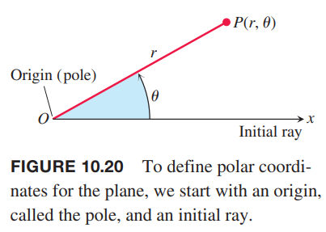
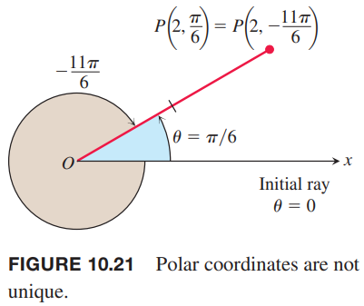
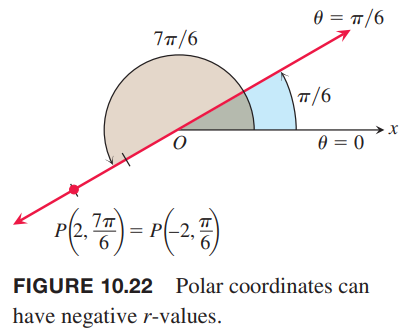
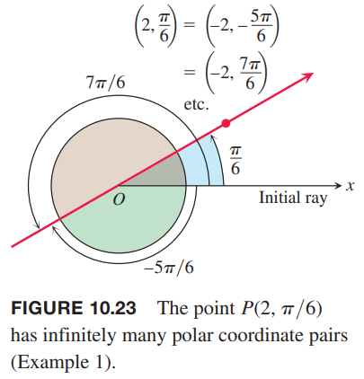
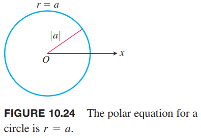
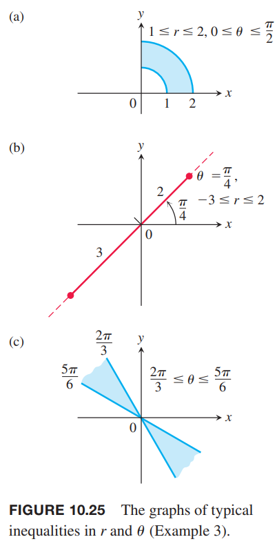
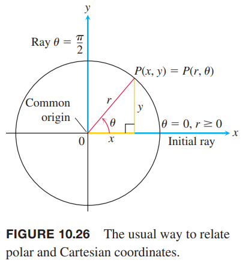
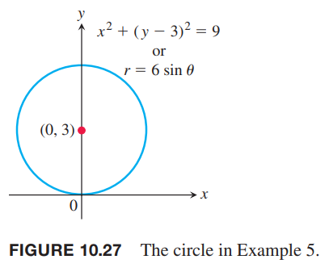

### 极坐标定义
为了定义极坐标，首先要固定原点（`origin`）$O$（也称为极点（`pole`））和一个极轴（`initial ray`）。如下图所示。通常将 $x$ 的正半轴选为极轴。极坐标上的点 $P$ 的位置由极坐标对（`polar coordinate pair`）$(r,\theta)$ 确定，其中 $r$ 是点 $P$ 到 $O$ 的距离，$\theta$ 是从极轴开始转动到 $OP$ 的有方向的角度。点 $P$ 记作
$$P(r,\theta)$$

逆时针时 $\theta$ 为正，顺时针时为负。笛卡尔坐标系中，每个点只有一个坐标对，但是极坐标中，有无数对极坐标可以表示同一个点。比如点 $(r=2,\theta=\pi/6)$ 还可以表示为 $(r=2,\theta=-11\pi/6)$。如下图所示。

在一些场景下，我们允许 $r$ 是负数。这就是为什么要使用有方向的距离表示 $P(r,\theta)$。点 $P(2,7\pi/6)$ 可以看作是沿着极轴前进单位 2 然后逆时针旋转 $7\pi/6$，也可以看作是沿着极轴反向前面单位 2 后逆时针旋转 $\pi/6$，这样点可以表示为 $(-2,\pi/6)$。如下图所示。

例1 求点 $(2,\pi/6)$ 所有的极坐标对。

解：首先画出草图如下。

然后找到对应 $r=2$ 和 $r=-2$ 的所有的角度。

对于 $r=2$，角度可以是
$$\frac{\pi}{6},\frac{\pi}{6}\pm 2\pi,\frac{\pi}{6}\pm 4\pi,\frac{\pi}{6}\pm 6\pi,\cdots$$
对于 $r=-2$，角度可以是
$$-\frac{5\pi}{6},-\frac{5\pi}{6}\pm 2\pi,-\frac{5\pi}{6}\pm 4\pi,-\frac{5\pi}{6}\pm 6\pi,\cdots$$
相应的 $P$ 的极坐标对是
$$(2,\frac{\pi}{6}+2n\pi),n=0,\pm 1,\pm 2,\cdots$$
和
$$(-2,-\frac{5\pi}{6}+2n\pi),n=0,\pm 1,\pm 2,\cdots$$

### 极坐标和图
如果 $r$ 固定为常量 $r=a\neq 0$，点 $P(r,\theta)$ 位于圆心为 $O$ 半径是 $|a|$ 的圆上。$\theta$ 是任意长度为 $2\pi$ 的区间，$P$ 的轨迹恰好是圆。如下图所示。

如果 $\theta$ 固定为常量 $\theta=\theta_0$，$r$ 在区间 $(-\infty,\infty)$ 上变化，点 $P(r,\theta)$ 是一条直线，与极轴的夹角是 $\theta_0$，如上面的图 10.22 所示。

例2 圆或者直线不止有一个极坐标方程。

（a）$r=1,r=-1$ 都表示圆心在 $O$ 的单位圆。

（b）$\theta=\pi/6,\theta=7\pi/6,\theta=-5\pi/6$ 都表示上面图 10.23 是直线。

$r=a,\theta=\theta_0$ 组合起来可以表示一个区域、线段和射线。

例3 给出下面极坐标方程的图像。

（a）
$$1\leq r\leq 2,0\leq\theta\leq\frac{\pi}{2}$$
（b）
$$-3\leq r\leq 2,\theta=\frac{\pi}{4}$$
（c）
$$\frac{2\pi}{3}\leq\theta\leq\frac{5\pi}{6}$$
解：如下图所示。

### 极坐标和笛卡尔坐标的关系
当我们在一个平面使用极坐标系和笛卡尔坐标系，将原点重合，极轴和 $x$ 正半轴重合，那么 $\theta=\pi/2,r>0$ 就是 $y$ 的正半轴。如下图所示。

**极坐标和笛卡尔坐标关系方程**
> $$x=r\cos\theta,y=r\sin\theta,r^2=x^2+y^2,\tan\theta=\frac{y}{x}$$

给定极坐标的 $r,\theta$，由前面两个公式，唯一的确定了笛卡尔坐标 $x,y$。反之如果给定笛卡尔坐标 $x,y$，根据第三个式子，$r$ 有两种情况。对于 $(x,y)\neq (0,0)$，存在唯一的 $\theta\in[0,2\pi)$ 满足前两个式子。这两种情况都可以表示笛卡尔坐标系坐标 $(x,y)$。由这两种情况可以推导出其他的极坐标对，正如例 1 所示。

例4 下面是一些曲线在极坐标系和迪卡坐标系的表示方法。

| 极坐标方程 | 笛卡尔方程 |
|--|--|
| $r\cos\theta=2$ | $x=2$ |
| $r^2\cos\theta\sin\theta=4$ | $xy=4$ |
| $r^2\cos^2\theta-r^2\sin^2\theta=1$ | $x^2-y^2=1$ |
| $r=1+2r\cos\theta$ | $y^2-3x^2-4x-1=0$ |
| $r=1-\cos\theta$ | $x^4+y^4+2x^2y^2+2x^3+2xy^2-y^2=0$ |

一些方程使用极坐标系表示更简单，而有些不是。

例5 求圆 $x^2+(y-3)^2=9$ 的极坐标方程。如下图所示。

解：使用上面极坐标和笛卡尔坐标的关系求解。
$$\begin{aligned}
x^2+(y-3)^2&=9\\
x^2+y^2-6y+9&=9\\
x^2+y^2-6y&=0\\
r^2-6r\sin\theta&=0\\
r=0 \text{ or } r-\sin\theta&=0\\
r&=6\sin\theta
\end{aligned}$$

例6 将下面的极坐标方程替换为笛卡尔坐标方程，并描述其图像。

（a）
$$r\cos\theta=-4$$
（b）
$$r^2=4r\cos\theta$$
（c）
$$r=\frac{4}{2\cos\theta-\sin\theta}$$
解：

（a）
$$\begin{aligned}
r\cos\theta&=-4\\
x&=-4
\end{aligned}$$
通过 $x=-4$ 垂直于 $x$ 轴的直线。

（b）
$$\begin{aligned}
r^2&=4r\cos\theta\\
x^2+y^2&=4x\\
x^2-4x+y^2&=0\\
(x-2)^2+y^2&=4
\end{aligned}$$
圆心位于 $(2,0)$ 半径为 2 的圆。

（c）
$$\begin{aligned}
r&=\frac{4}{2\cos\theta-\sin\theta}\\
r(2\cos\theta-\sin\theta)&=4\\
2r\cos\theta-r\sin\theta&=4\\
2x-y&=4\\
y&=2x-4
\end{aligned}$$
斜率为 2 $y$ 轴截距为 -4 的直线。
