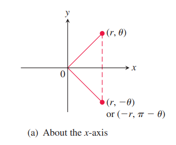
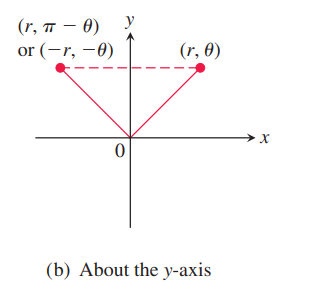
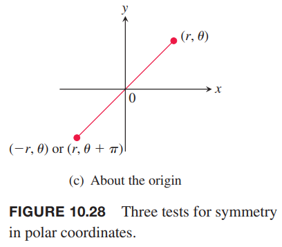
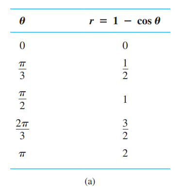
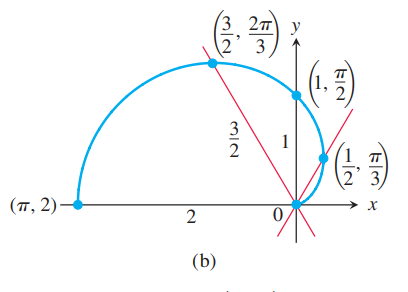
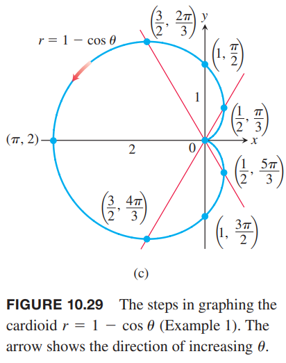
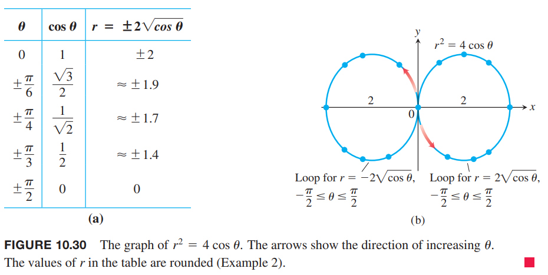
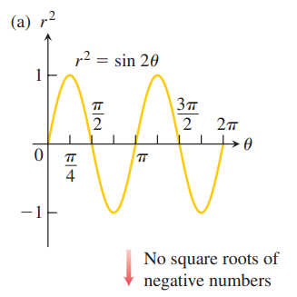
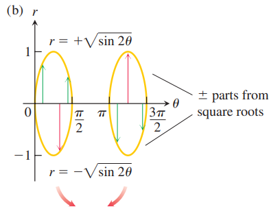
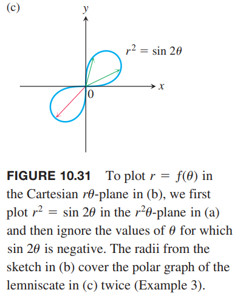

很多时候，在笛卡尔坐标系上画出极坐标方程的图像会很有用。下面介绍如何使用对称性和图像的切线等方法作图。

### 对称性
当使用极坐标时，对称的三种形式的测试如下。

**极坐标图像在笛卡尔平面的对称测试**
> * 关于 $x$ 轴对称。如果点 $(r,\theta)$ 在图像上，那么点 $(r,-\theta)$ 或 $(-r,\pi-\theta)$ 也在图像上。
>   * 
> * 关于 $y$ 轴对称。如果点 $(r,\theta)$ 在图像上，那么点 $(r,\pi-\theta)$ 或 $(-r,-\theta)$ 也在图像上。
>   * 
> * 关于原点对称。如果点 $(r,\theta)$ 在图像上，那么点 $(-r,\theta)$ 或 $(r,\pi+\theta)$ 也在图像上。
>   * 

### 斜率
极坐标曲线 $r=f(\theta)$ 在 $xy$ 平面上的斜率是 $dy/dx$，但是并不是 $r'=df/d\theta$。图像 $f$ 可以表示为如下的参数方程
$$x=r\cos\theta=f(\theta)\cos\theta,y=r\sin\theta=f(\theta)\sin\theta$$
如果是 $f,x,y$ 是 $\theta$ 的可微函数，当 $dx/d\theta\neq 0$ 时，通过参数公式可以得到 $dy/dx$
$$\begin{aligned}
\frac{dy}{dx}&=\frac{dy/d\theta}{dx/d\theta}\\
&=\frac{\frac{d}{d\theta}(f(\theta)\sin\theta)}{\frac{d}{d\theta}(f(\theta)\cos\theta)}\\
&=\frac{\frac{df}{d\theta}\sin\theta+f(\theta)\cos\theta}{\frac{df}{d\theta}\cos\theta-f(\theta)\sin\theta}
\end{aligned}$$
因此 $dy/dx$ 不是 $df/d\theta$。

**曲线 $r=f(\theta)$ 在 $xy$ 平面的斜率**
> $$\frac{dy}{dx}\bigg|_{(r,\theta)}=\frac{f'(\theta)\sin\theta+f(\theta)\cos\theta}{f'(\theta)\cos\theta-f(\theta)\sin\theta}\tag{1}$$
> 前提是在 $(r,\theta)$ 处 $dx/d\theta\neq 0$。

曲线 $r=f(\theta)$ 通过原点时 $\theta=\theta_0$，那么 $f(\theta_0)=0$，且斜率是
$$\frac{dy}{dx}\bigg|_{(0,\theta_0)}=\frac{f'(\theta_0)\sin\theta_0}{f'(\theta_0)\cos\theta_0}=\tan\theta_0$$
在 $(0,\theta_0)$ 的斜率是 $\tan\theta_0$。我们说是在点 $(0,\theta_0)$ 的斜率而不是在原点的斜率，原因是极坐标曲线可能会通过原点若干次，不同的斜率由不同的角度 $\theta$ 确定。

例1 给出极坐标方程 $r=1-\cos\theta$ 在笛卡尔平面上的图像。

解：这个图像关于 $x$ 轴对称。
$$\begin{aligned}
(r,\theta) 在图像上 &\Rightarrow r=1-\cos\theta\\
&\Rightarrow r=1-\cos\theta(-\theta)\\
&\Rightarrow (r,-\theta) 在图像上
\end{aligned}$$
当 $\theta$ 从 0 到 $\pi$ 时，$\cos\theta$ 从 1 到 -1，那么 $r=1-\cos\theta$ 从最小值 0 增加到最大值 2。当 $\theta$ 从 $\pi$ 到 $2\pi$ 时，$\cos\theta$ 从 -1 到 1，那么 $r$ 从 2 减小到 0。由于余弦的周期是 $2\pi$，所以当 $\theta=2\pi$ 时，曲线开始重复。

曲线开始在原点的斜率是 $\tan(0)=0$，当回到原点时斜率 $\tan(2\pi)=0$。

首先我们计算 $\theta$ 从 0 到 $\pi$ 对应的 $r$。

接着，描出这些点，光滑的曲线连接这些点，注意，原点处的斜率是 0。

最后，图像关于 $x$ 轴对称，画出下半部分，完成。这个图像称为心脏线（`cardioid`）。

例2 给出曲线 $r^2=4\cos\theta$ 在笛卡尔平面上的图像。

解：方程 $r^2=4\cos\theta$ 要求 $\cos\theta\geq 0$，所以整个曲线的 $\theta$ 取值是从 $-\pi/2$ 到 $\pi/2$。这个图像关于 $x$ 轴对称。
$$\begin{aligned}
(r,\theta) 在图像上&\Rightarrow r^2=4\cos\theta\\
&\Rightarrow r^2=4\cos(-\theta)\\
&\Rightarrow (r,-\theta) 在图像上
\end{aligned}$$
这个图像也关于原点对称。
$$\begin{aligned}
(r,\theta) 在图像上&\Rightarrow r^2=4\cos\theta\\
&\Rightarrow (-r)^2=4\cos\theta\\
&\Rightarrow (-r,\theta) 在图像上
\end{aligned}$$
这两个结合起来得到图像关于 $y$ 轴对称。

当 $\theta=-\pi/2,\theta=\pi/2$ 时，图像穿过原点，此时 $\tan\theta$ 无穷大，所以是垂直的切线。

对于区间 $[-\pi/2,\pi/2]$ 内的每个 $\theta$，有两个 $r$ 与之对应
$$r=\pm2\sqrt{\cos\theta}$$
下面是一些 $\theta$ 及其对应的 $r$ 值，描点，连线，得到下面的图像。

### $r\theta$ 平面的图像转化为 $xy$ 平面的图像
上面介绍了一种作极坐标曲线 $r=f(\theta)$ 的方式。另外一种画图方式是
* 在笛卡尔 $r\theta$ 平面上画出函数 $r=f(\theta)$ 的图像
* 将上面的图像当作一个“表”，指导在 $xy$ 平面上画出极坐标图像。

这种方式有一个好处，是因为第一个 $r\theta$ 图像给出了 $r$ 何时为正值、负值和零，哪里递增或者递减。

例3 在 $xy$ 平面上给出双纽线（`lemniscate`）$r^2=\sin2\theta$ 的图像。

解：对于这个例子，首先给出 $r^2$ 和 $\theta$ 的关系图像。

然后给出 $r=\pm\sqrt{\sin 2\theta}$ 的图像。

最后给出极坐标曲线。

从（b）到（c）作图时，可以只处理两个环的一个，也可以只处理 $\theta$ 轴的上面两个部分或者下面的两个部分。图（a）和（b）显示了两个周期，图（c）画两次也没有问题。
