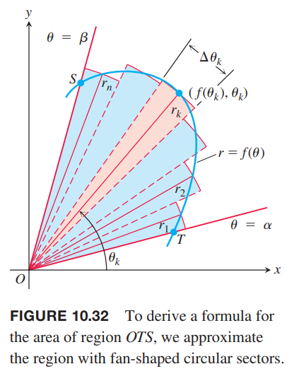
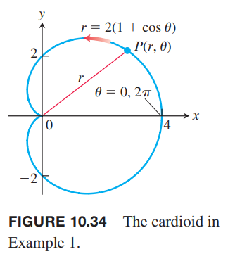
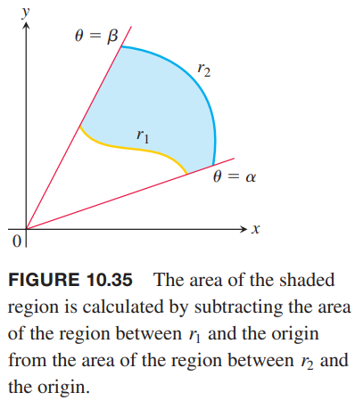
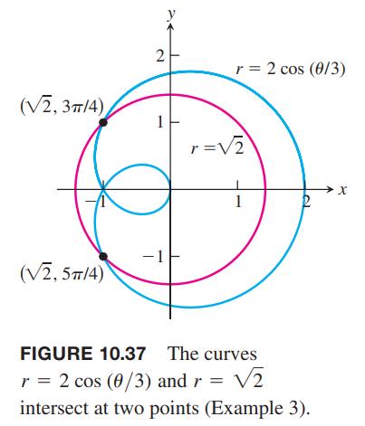
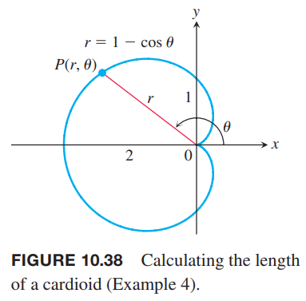

### 面积
如下图所示，区域 OTS 由射线 $\theta=\alpha,\theta=\beta$ 和曲线 $r=f(\theta)$ 包围起来的。我们使用 $n$ 个不重叠的扇形来近似这个区域。第 $k$ 个分区的弧度是 $\Delta\theta_k$ 半径是 $r_k=f(\theta_k)$。面积是半径为 $r_k$ 的圆的面积乘以 $\Delta\theta_k/2\pi$
$$A_k=\frac{1}{2}r_k^2\Delta\theta_k=\frac{1}{2}(f(\theta_k))^2\Delta\theta_k$$

那么整个 OTS 的面积是
$$\sum_{k=1}^nA_k=\sum_{k=1}^n\frac{1}{2}(f(\theta_k))^2\Delta\theta_k$$
随着分区 $P$ 的模趋于零，这个近似值会无限趋于实际值，其中 $P$ 的模是 $\Delta\theta_k$ 的最大值。因此可以得到公式
$$A=\lim_{||P||\to 0}\sum_{k=1}^n\frac{1}{2}(f(\theta_k))^2\Delta\theta_k=\int_\alpha^\beta\frac{1}{2}(f(\theta))^2d\theta$$

**原点和曲线间扇形的面积**
> $r=f(\theta),\alpha\leq\theta\leq\beta,r\geq 0,\beta-\alpha\leq 2\pi$
> $$A=\int_\alpha^\beta\frac{1}{2}r^2d\theta$$
> 这是面积微分的积分
> $$dA=\frac{1}{2}r^2d\theta=\frac{1}{2}(f(\theta))^2d\theta$$
> 

上面的面积公式要求 $r\geq 0$ 且扫过的角度不超过 $2\pi$。这就避免了面积的符号是负的，且出现了重叠。如果需要，可以把一个区域分解成若干个上述要求的区域，然后求解。

例1 求心脏线 $r=2(1+\cos\theta)$ 包围的区域的面积。

解：如下图所示。

随着 $\theta$ 从 0 到 $2\pi$，半径 OP 恰好只扫过一次。因此面积是
$$\begin{aligned}
\int_{\theta=0}^{\theta=2\pi}\frac{1}{2}r^2d\theta&=\int_0^{2\pi}\frac{1}{2}\cdot 4(1+\cos\theta)^2d\theta\\
&=\int_0^{2\pi}2(1+2\cos\theta+\cos^2\theta)d\theta\\
&=\int_0^{2\pi}(2+4\cos\theta+2\cdot\frac{1+\cos 2\theta}{2})d\theta\\
&=\int_0^{2\pi}(3+4\cos\theta+\cos 2\theta)d\theta\\
&=\bigg[3\theta+4\sin\theta+\frac{\sin 2\theta}{2}\bigg]_0^{2\pi}\\
&=6\pi
\end{aligned}$$

求解下图这样区域的面积时，我们可以用 $(1/2)r_1^2d\theta$ 减去 $(1/2)r_2^2d\theta$。

**环形面积**
> $0\leq r_1(\theta)\leq r\leq r_2(\theta),\alpha\leq\theta\leq\beta,\beta-\alpha\leq 2\pi$
> $$A=\int_\alpha^\beta\frac{1}{2}r_2^2d\theta-\int_\alpha^\beta\frac{1}{2}r_1^2d\theta=\int_\alpha^\beta\frac{1}{2}(r_2^2-r_1^2)d\theta\tag{1}$$

例2 求圆 $r=1$ 以内，心脏线 $r=1-\cos\theta$ 以外区域的面积。

解：画出草图以确定要求的区域的面积，如下如所示。

外面的曲线是 $r=1$，里面的曲线是 $r=1-\cos\theta$，$\theta$ 的范围是从 $-\pi/2$ 到 $\pi/2$，那么根据公式 $(1)$
$$\begin{aligned}
A&=\int_{-\pi/2}^{\pi/2}\frac{1}{2}(r_2^2-r_1^2)d\theta\\
&=2\int_{-\pi/2}^{0}\frac{1}{2}(r_2^2-r_1^2)d\theta\\
&=\int_{-\pi/2}^{0}(1-(1-\cos\theta)^2)d\theta\\
&=\int_{-\pi/2}^{0}(1-(1-2\cos\theta+\cos^2\theta))d\theta\\
&=\int_{-\pi/2}^{0}(2\cos\theta-\cos^2\theta)d\theta\\
&=\int_{-\pi/2}^{0}(2\cos\theta-\frac{1+\cos 2\theta}{2}\theta)d\theta\\
&=\bigg[2\sin\theta-\frac{\theta}{2}-\frac{\sin 2\theta}{4}\bigg]_0^{2\pi}\\
&=2-\frac{\pi}{4}
\end{aligned}$$

使用极坐标时，可以用不同的方式表示同一个点，所以要特别注意什么时候一个点在图像上，哪些点在极坐标图像的交点处。在笛卡尔坐标系，我们联立两个方程就能解出交点。但是对极坐标而言，一切都变了。联立方程能够发现一些交点，但不是全部，有时，找到所有交点是比较困难的。一种方式是画出图像辅助分析。

例3 求曲线 $r=2\cos(\theta/3)$ 和圆心在原点半径为 $\sqrt{2}$ 的圆的所有交点。

解：注意到，$r=2\cos(\theta/3)$ 可以取正值，也可以取负值。因此在寻找与圆的交点时，我们需要考虑到圆的方程可以表示为 $r=\sqrt{2},r=-\sqrt{2}$ 两种形式。

联立方程 $2\cos(\theta/3)=\sqrt{2}$ 可以得到
$$\begin{aligned}
2\cos(\theta/3)&=\sqrt{2}\\
\cos(\theta/3)&=\sqrt{2}/2\\
\theta/3&=\pi/4\\
\theta=3\pi/4
\end{aligned}$$
这样，得到了交点 $(\sqrt{2},3\pi/4)$。不过，正如下图所示，两条曲线有两个交点。

我们联立方程 $2\cos(\theta/3)=-\sqrt{2}$
$$\begin{aligned}
2\cos(\theta/3)&=-\sqrt{2}\\
\cos(\theta/3)&=-\sqrt{2}/2\\
\theta/3&=3\pi/4\\
\theta=9\pi/4
\end{aligned}$$
因此，得到另一个交点 $(-\sqrt{2},9\pi/4)$。一般情况下，我们简化一个点的表示方法，使得 $r$ 是正数 $\theta$ 在 $0$ 和 $2\pi$ 之间。在极坐标系中，将 $\theta$ 加上 $2\pi$ 的任意多倍表示的还是同一个点。如果将 $r$ 的符号反转，那么 $\theta$ 需要加上或者减去 $\pi$。那么点 $(-\sqrt{2},9\pi/4)$ 可以表示为 $(-\sqrt{2},\pi/4)$，也可以表示为 $(\sqrt{2},5\pi/4)$。

### 曲线的长度
我们通过参数化方式表示极坐标曲线 $r=f(\theta),\alpha\leq\theta\leq\beta$ 来得到其长度的公式
$$x=r\cos\theta=f(\theta)\cos\theta,y=r\sin\theta=f(\theta)\sin\theta,\alpha\leq\theta\leq\beta\tag{2}$$
从 10.2 的公式 $(3)$ 可以得到长度是
$$L=\int_\alpha^\beta\sqrt{(\frac{dx}{d\theta})^2+(\frac{dy}{d\theta})^2}d\theta$$
我们先将公式 $(2)$ 进行微分然后平方
$$(\frac{dx}{d\theta})^2=(f'(\theta)\cos\theta-f(\theta)\sin\theta)^2=[f'(\theta)]^2\cos^2\theta+[f(\theta)]^2\sin^2\theta-2\sin\theta\cos\theta f'(\theta)f(\theta)$$
$$(\frac{dy}{d\theta})^2=(f'(\theta)\sin\theta+f(\theta)\cos\theta)^2=[f'(\theta)]^2\sin^2\theta+[f(\theta)]^2\cos^2\theta+2\sin\theta\cos\theta f'(\theta)f(\theta)$$
相加
$$(\frac{dx}{d\theta})^2+(\frac{dy}{d\theta})^2=[f'(\theta)]^2+[f(\theta)]^2=(\frac{dr}{d\theta})^2+r^2$$
因此
$$L=\int_\alpha^\beta\sqrt{r^2+(\frac{dr}{d\theta})^2}d\theta$$

**极坐标曲线长度**
> 如果 $r=f(\theta)$ 一阶导在 $[\alpha,\beta]$ 区间上连续，当 $\theta$ 从 $\alpha$ 到 $\beta$，点 $P(r,\theta)$ 沿着 $r=f(\theta)$ 只遍历一次，那么曲线的长度是
> $$L=\int_\alpha^\beta\sqrt{r^2+(\frac{dr}{d\theta})^2}d\theta\tag{3}$$

例4 求心脏线 $r=1-\cos\theta$ 的长度。

解：画出图像如下。

$\theta$ 逆时针从 0 到 $2\pi$，$P(r,\theta)$ 只遍历曲线一次。

由
$$r=1-\cos\theta$$
得到
$$\frac{dr}{d\theta}=\sin\theta$$
因此
$$\begin{aligned}
r^2+(\frac{dr}{d\theta})^2&=(1-\cos\theta)^2+(\sin\theta)^2\\
&=1-2\cos\theta+\cos^2\theta+\sin^2\theta\\
&=2-2\cos\theta
\end{aligned}$$
那么
$$\begin{aligned}
L&=\int_\alpha^\beta\sqrt{r^2+(\frac{dr}{d\theta})^2}d\theta\\
&=\int_0^{2\pi}\sqrt{2-\cos\theta}d\theta\\
&=\int_0^{2\pi}\sqrt{4\sin^2\frac{\theta}{2}}d\theta\\
&=\int_0^{2\pi}2|\sin\frac{\theta}{2}|d\theta\\
&=\int_0^{2\pi}2\sin\frac{\theta}{2}d\theta\\
&=\bigg[-4\cos\frac{\theta}{2}\bigg]_0^{2\pi}\\
&=4+4\\
&=8
\end{aligned}$$
