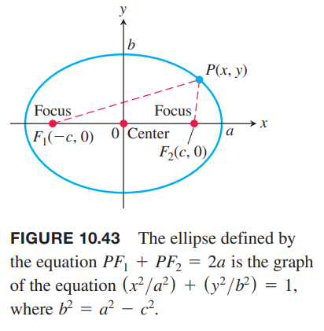

这一节我们会从几何角度定义并研究抛物线、椭圆和双曲线，并且推导它们的笛卡尔坐标系下的方程。这些曲线都称为圆锥曲线（`conic sections` `conics`），因为它们可以由一个平截截一个双锥体得到。如下图所示。

### 抛物线
**定义**
> 在一个平面上，抛物线（`parabola`）是到定点距离等于到定直线距离相等的点的集合。这个定点是抛物线的焦点（`focus`）。这个定直线是抛物线的准线（`directrix`）。

如果焦点 $F$ 在准线 $L$ 上，那么抛物线是通过点 $F$ 且垂直于 $L$ 的直线。这是一种退化情况，因此这里假定 $F$ 不在 $L$ 上。

最简单的抛物线方程是焦点和准线在坐标轴两边。假定焦点 $F(0,p)$ 在 $y$ 轴上，准线是直线 $y=-p$。如下图所示。

点 $P(x,y)$ 在抛物线上等价于 $PF=PQ$。由距离公式有
$$PF=\sqrt{(x-0)^2+(y-p)^2}=\sqrt{x^2+(y-p)^2}$$
$$PQ=\sqrt{(x-x)^2+(y-(-p))^2}=\sqrt{(y+p)^2}$$
联立方程，平方，化简得到
$$y=\frac{x^2}{4p},x^2=4py\tag{1}$$
这个方程揭示了抛物线关于 $y$ 轴对称。称 $y$ 轴为抛物线的轴（抛物线对称轴的简称）。

抛物线和坐标轴的交点称为顶点（`vertex`）。抛物线 $x^2=4py$ 的顶点是原点（如上图）。正数 $p$ 是抛物线的焦距（`focal length`）。

如果抛物线开口向下，那么焦点是 $(0,-p)$，准线是 $y=p$，那么方程 $(1)$ 变成了
$$y=-\frac{x^2}{4p},x^2=-4py$$

将 $x,y$ 互换，得到开口向左或向右的类似抛物线的方程。

例1 求抛物线 $y^2=10x$ 的焦点和准线。

解：从标准方程 $y^2=4px$ 求 $p$。
$$4p=10,p=\frac{5}{2}$$
因此焦点是
$$(p,0)=(\frac{5}{2},0)$$
准线是
$$x=-p,x=-\frac{5}{2}$$

### 椭圆
**定义**
> 在一个平面内，椭圆（`ellipse`）是到两个顶点的距离之和是常数的点的集合。这两个定点称为椭圆的焦点。
>
> 椭圆的焦点确定的直线称为焦轴（`focal axis`）。两个焦点的中点称为中心（`center`）。椭圆和焦轴的交点称为顶点（`vertices`）。
>
> 

如下图所示，如果焦点是 $F_1(-c,0),F_2(c,0)$，将 $PF_1+PF_2$ 表示为 $2a$，那么椭圆上的点 $P$ 满足方程
$$\sqrt{(x+c)^2+y^2}+\sqrt{(x-c)^2+y^2}=2a$$

为了简化方程，可以把第二项根式移到等式右边，然后平方，将根式分离到等式一遍，再平方，化简，得到
$$\frac{x^2}{a^2}+\frac{y^2}{a^2-c^2}=1\tag{2}$$
三角形 $PF_1F_2$ 两个之和大于第三边，那么 $PF_1+PF_2>F_1F_2$，即 $2a>2c$，那么方程 $(2)$ 中的 $a^2-c^2>0$。

推导方程 $(2)$ 的步骤可逆，那么就证明了一个点 $P$ 满足这样 $0<c<a$ 的方程，那么就满足椭圆的条件 $PF_1+PF_2=2a$。因此，一个点在椭圆上等价于它的坐标满足方程 $(2)$。

令 $b$ 表示 $a^2-c^2$ 的正根
$$b=\sqrt{a^2-c^2}\tag{3}$$
将 $b^2=a^2-c^2$ 代入方程 $(2)$
$$\frac{x^2}{a^2}+\frac{y^2}{b^2}=1\tag{4}$$
方程 $(4)$ 说明椭圆关于两个坐标轴、原点对称。它位于由 $x=\pm a,y=\pm b$ 的矩形内，和坐标轴的交点是 $(\pm a,0),(0,\pm b)$。这些点处的切线垂直于坐标轴，因为从 方程 $(4)$ 作隐式求导可以得到
$$\frac{dy}{dx}=-\frac{b^2x}{a^2y}$$
当 $x=0$ 时，斜率为 0。当 $y=0$ 时，斜率无穷大。

方程 $(4)$ 的椭圆的长轴（`major axis`）是连接点 $(\pm a,0)$ 的长为 $2a$ 线段。短轴（`minor axis`）是连接点 $(0,\pm b)$ 的长为 $2b$ 的线段。$a$ 是半长轴（`semimajor axis`），$b$ 是半短轴（`semiminor axis`）。$c$ 是
$$c=\sqrt{a^2-b^2}$$
是中心到焦点的距离（`center-to-focus distance`）。如果 $a=b$，那么这个椭圆就是圆。

例2 椭圆
$$\frac{x^2}{16}+\frac{y^2}{9}=1\tag{5}$$
如下图所示。

半长轴
$$a=\sqrt{16}=4$$
半短轴
$$b=\sqrt{9}=3$$
中心到焦点的距离
$$c=\sqrt{a^2-b^2}=\sqrt{7}$$
焦点坐标
$$(\pm c,0)=(\pm\sqrt{7},0)$$
顶点
$$(\pm a,0)=(\pm 4,0)$$
中心
$$(0,0)$$
如果交换方程 $(5)$ 的 $x,y$，得到
$$\frac{y^2}{16}+\frac{x^2}{9}=1\tag{6}$$
长半轴现在是垂直的了，焦点和顶点位于 $y$ 轴。椭圆两个轴中较长的是长半轴。

**中心在原点的椭圆标准形式**
> 焦点在 $x$ 轴：
> $$\frac{x^2}{a^2}+\frac{y^2}{b^2}=1(a>b)$$
> 中心到焦点距离：$c=\sqrt{a^2-b^2}$
> 
> 焦点：$(\pm c,0)$
> 
> 顶点：$(\pm a,0)$
> 
> 焦点在 $y$ 轴：
> $$\frac{x^2}{b^2}+\frac{y^2}{a^2}=1(a>b)$$
> 中心到焦点距离：$c=\sqrt{a^2-b^2}$
> 
> 焦点：$(0,\pm c)$
> 
> 顶点：$(0,\pm a)$
>
> 每种情况下，$a$ 都是半长轴，$b$ 都是半短轴。

### 双曲线
**定义**
> 在一个平面上，双曲线（`hyperbola`）是距离两个定点距离的差是常数的点的集合。两个定点是双曲线的焦点。
>
> 双曲线的焦点确定的直线称为焦轴（`focal axis`）。两个焦点的中点称为中心（`center`）。椭圆和焦轴的交点称为顶点（`vertices`）。
> 
> 

如果焦点是 $F_1(-c,0),F_2(c,0)$，差的常数是 $2a$，那么点 $(x,y)$ 在双曲线上等价于
$$\sqrt{(x+c)^2+y^2}-\sqrt{(x-c)^2+y^2}=\pm 2a\tag{7}$$

与化简椭圆公式类似，可以把第二项根式移到等式右边，然后平方，将根式分离到等式一遍，再平方，化简，得到
$$\frac{x^2}{a^2}+\frac{y^2}{a^2-c^2}\tag{8}$$
这个和椭圆公式类似，但是三角形 $PF_1F_2$ 的两边之差，$2a$，小于第三边，$2c$，所以 $a^2-c^2$ 小于零。

推导公式 $(8)$ 的过程可逆，那么就证明了一个点 $P$ 满足这样 $0<a<c$ 的方程，那么就满足双曲线的条件，即公式 $(7)$。那么点在双曲线上等价于其坐标满足方程 $(8)$。

令 $b$ 是 $c^2-a^2$ 的正跟
$$b=\sqrt{c^2-a^2}\tag{9}$$
代入方程 $(8)$
$$\frac{x^2}{a^2}-\frac{y^2}{b^2}=1\tag{10}$$
方程 $(10)$ 和椭圆公式方程 $(4)$ 的差异就在于第二项的正负号，以及如下等式
$$c^2=a^2+b^2$$
与椭圆类似，双曲线关于原点、两个坐标轴对称。它与 $x$ 轴交点是 $\pm a,0$，由于对方程式作隐式求导得到
$$\frac{dy}{dx}=\frac{b^2x}{a^2y}$$
当 $y=0$ 时，导数无穷大，所以交点处的切线垂直于 $x$ 轴。$y$ 轴上没有交点。事实上，在 $x=-a,x=a$ 之间，没有任何点满足条件。

直线
$$y=\pm\frac{b}{a}x$$
是双曲线的渐近线（`asymptote`）。与椭圆类似，求渐近线最方便快捷的方式是令方程 $(10)$ 右边为零，求解。
$$\frac{x^2}{a^2}-\frac{y^2}{b^2}=1\to\frac{x^2}{a^2}-\frac{y^2}{b^2}=0\to y=\pm\frac{b}{a}x$$

例3 方程
$$\frac{x^2}{4}-\frac{y^2}{5}=1\tag{11}$$
如下图所示

中心到焦点的距离
$$c=\sqrt{a^2+b^2}=\sqrt{4+5}=3$$
焦点
$$(\pm c,0)=(\pm 3,0)$$
顶点
$$(\pm a,0)=(\pm 2,0)$$
中心
$$(0,0)$$
渐近线
$$\frac{x^2}{4}-\frac{y^2}{5}=0,y=\pm\frac{5}{2}x$$

如果交换方程 $(11)$ 的 $x,y$，那么焦点和顶点会在 $y$ 上。求渐近线的方式一样，不过结果变成了 $y=\pm 2x/\sqrt{5}$。

**中心在原点的双曲线标准形式**
> 焦点在 $x$ 轴：
> $$\frac{x^2}{a^2}-\frac{y^2}{b^2}=1$$
> 中心到焦点距离：$c=\sqrt{a^2+b^2}$
> 
> 焦点：$(\pm c,0)$
> 
> 顶点：$(\pm a,0)$
>
> 渐近线：$\frac{x^2}{a^2}-\frac{y^2}{b^2}=0,y=\pm\frac{b}{a}x$
> 
> 焦点在 $y$ 轴：
> $$\frac{y^2}{a^2}-\frac{x^2}{b^2}=1$$
> 中心到焦点距离：$c=\sqrt{a^2+b^2}$
> 
> 焦点：$(\pm c,0)$
> 
> 顶点：$(\pm a,0)$
>
> 渐近线：$\frac{y^2}{a^2}-\frac{x^2}{b^2}=0,y=\pm\frac{a}{b}x$
>
> 注意，两种双曲线的渐近线系数不同。

我们可以使用 1.2 节的变换原则，使用 $x+h$ 替代 $x$，用 $y+k$ 替代 $y$。

例4 证明方程 $x^2-4y^2+2x+8y-7=0$ 表示双曲线，并求其焦点、中心和渐近线。

解：转化成标准形式
$$\begin{aligned}
(x^2+2x)-4(y^2-2y)=7\\
(x^2+2x+1)-4(y^2-2y+1)=4\\
\frac{(x+1)^2}{4}-(y-1)^2=1
\end{aligned}$$
用 $x+1$ 代替 $x$，$y-1$ 代替 $y$ 就能得到方程 $(10)$ 标准形式。这个双曲线向左向上移动了单位距离，那么中心点在 $(-1,1)$。
$$a^2=4,b^2=1,c^2=a^2+b^2=\sqrt{5}$$
那么渐近线是
$$y-1=\pm\frac{1}{2}(x+1)$$
移动后的焦点坐标是 $(-1\pm\sqrt{5},1)$。

### 抛物线的反射属性
这个性质来自本小节课后习题 81，证明过程比较简单，但是结论比较重要。

如下图所示，点 $P(x_0,y_0)$ 在抛物线 $y^2=4px$。直线 $L$ 是经过点 $P$ 的切线。抛物线的焦点是 $F(p,0)$。直线 $L'$ 经过点 $P$ 且平行于 $x$ 轴。

对抛物线隐式求导
$$2ydy=4pdx$$
所以
$$\frac{dy}{dx}=\frac{4p}{2y}=\frac{2p}{y}$$
那么点 $P$ 处的斜率
$$\tan\beta=\frac{2p}{y_0}$$
由正切定义
$$\tan\phi=\frac{y_0}{x_0-p}$$
由于 $L'$ 与 $x$ 轴平行，那么
$$\phi=\alpha+\beta$$
所以
$$\begin{aligned}
\tan\alpha&=\tan(\phi-\beta)\\
&=\frac{\tan\phi-\tan\beta}{1+\tan\phi\tan\beta}\\
&=\frac{\frac{y_0}{x_0-p}-\frac{2p}{y_0}}{1+\frac{2py_0}{y_0(x_0-p)}}\\
&=\frac{y_0^2-2p(x_0-p)}{y_0x_0-y_0p+2py_0}\\
&=\frac{4px_0-2px_0+2p^2}{x_0y_0+py_0}\\
&=\frac{2p(x_0+p)}{y_0(x_0+p)}\\
&=\frac{2p}{y_0}
&=\tan\beta
\end{aligned}$$
因为 $\alpha,\beta$ 都是锐角且正切值相等，那么
$$\alpha=\beta$$
也就说，从 $F$ 到 $P$ 的光线会沿着 $L'$ 反射，反射出去的射线恰好平行于抛物线的轴。
