### 离心率
尽管标准笛卡尔坐标系的椭圆方程并没有中心到焦点的距离 $c$
$$\frac{x^2}{a^2}+\frac{y^2}{b^2}=1,a>b$$
不过我们可以通过 $c=\sqrt{a^2-b^2}$ 确定。如果固定 $a$，$c$ 在区间 $0\leq c\leq a$ 上变化，椭圆的形状也会随之变化。当 $c=0$，即 $a=b$ 时，椭圆变成了圆，随着 $c$ 的增加，椭圆会越来越扁。如果 $c=a$，那么焦点和顶点重合，椭圆退化成了线段。用 $c=\sqrt{a^2+b^2}$ 替换上述分析的 $c=\sqrt{a^2-b^2}$，这些分析也适用于双曲线。我们将两者的比例称为离心率（`eccentricity`）。

**定义**
> 椭圆 $(x^2/a^2)+(y^2/b^2)=1(a>b)$ 的离心率是
> $$e=\frac{c}{a}=\frac{\sqrt{a^2-b^2}}{a}$$
> 双曲线 $(x^2/a^2)-(y^2/b^2)=1$ 的离心率是
> $$e=\frac{c}{a}=\frac{\sqrt{a^2+b^2}}{a}$$
> 抛物线的离心率
> $$e=1$$

抛物线有一个焦点和准线，椭圆有两个焦点和准线。准线距离中心的距离是 $\pm a/e$。从下图我们可以得到抛物线有如下性质
$$PF=1\cdot PD\tag{1}$$
其中，$D$ 是准线上距离任意点 $P$ 最近的点。

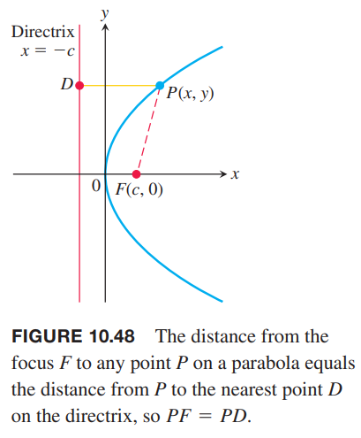

对椭圆而言，可以证明，替代方程 $(1)$ 的式子如下
$$PF_1=e\cdot PD_1,PF_2=e\cdot PD_2\tag{2}$$
其中，$D_1,D_2$ 是相应准线上距离任意点 $P$ 最近的点。如下图所示。

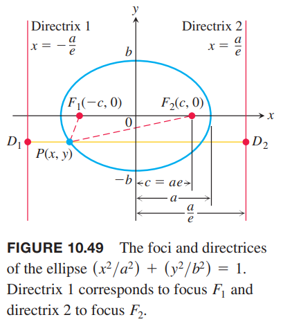

方程 $(2)$ 的焦点和准线要对应。与 $PF_1$ 对应的是 $P$ 到 $F_1$ 这一端的准线的距离。准线 $x=-a/e$ 对应焦点 $F_1(-c,0)$，准线 $x=a/e$ 对应焦点 $F_2(c,0)$。

与椭圆一样，可以证明对双曲线而言，准线是 $x=\pm a/e$，且有如下性质
$$PF_1=e\cdot PD_1,PF_2=e\cdot PD_2\tag{3}$$

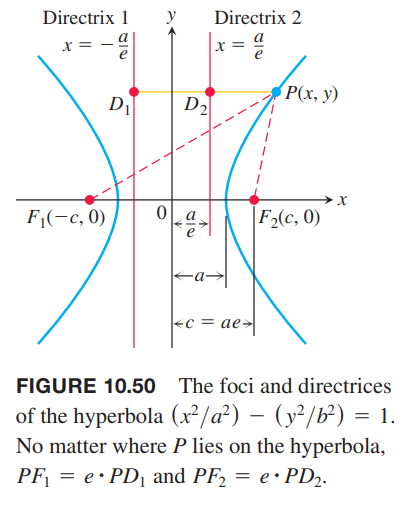

对于椭圆和双曲线，离心率也是焦点之间的距离与顶点之间的距离之比，因为 $c/a=2c/2a$。

在椭圆中，焦点距离小于顶点距离，所以 $e<1$，而双曲线中焦点距离大于顶点距离，所以 $e>1$。

焦点准线方程
$$PF=e\cdot PD\tag{4}$$
将抛物线、椭圆和双曲线有机的联系在了一起。点 $P$ 是
1. 抛物线，当 $e=1$ 时；
2. 椭圆，当 $e<1$ 时；
3. 双曲线，当 $e>1$ 时。

当 $e$ 增加时，$e\to 1^-$，椭圆变成了很扁的长椭圆，$e\to\infty$ 时，双曲线向着两条准线方向变得越来越平坦。当我们将方程 $(4)$ 转化成笛卡尔坐标系的方程时，根据 $e$ 的不同，形式不同。不过，很看我们会看到，转化为极坐标系的方程时，形式一样的，无关乎 $e$ 的值。

如上图所示，给定中心在原点、焦点在 $x$ 轴上的双曲线的焦点和相应的准线，可以找到 $e$。知道了 $e$，从 $PF=e\cdot PD$ 可以推导出双曲线方程。对于椭圆而言也是类似的。

例1 双曲线的中心在原点，焦点在 $(3,0)$ 处，对应准线是 $x=1$，求笛卡尔坐标系下的方程。

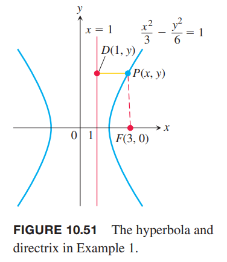

解：焦点 $(c,0)=(3,0)$，所以 $c=3$。

准线 $x=1=\frac{a}{e}$，所以 $a=e$。

根据 $e=c/a$ 得到
$$e=\frac{c}{a}=\frac{3}{e},e^2=3,e=\sqrt{3}$$

知道了 $e$，我们可以从 $PF=e\cdot PD$ 推导
$$\begin{aligned}
PF&=e\cdot PF\\
\sqrt{(x-3)^2+y^2}&=\sqrt{3}|x-1|\\
x^2-6x+9+y^3&=3(x^2-2x+1)\\
2x^2-y^2&=6\\
\frac{x^2}{3}-\frac{y^2}{6}&=1
\end{aligned}$$

### 极坐标方程
为了求解椭圆、双曲线和抛物线的极坐标方程，我们把焦点放到原点，相应的准线 $x=k$ 放到原点右侧，垂直于极轴。如下图所示。

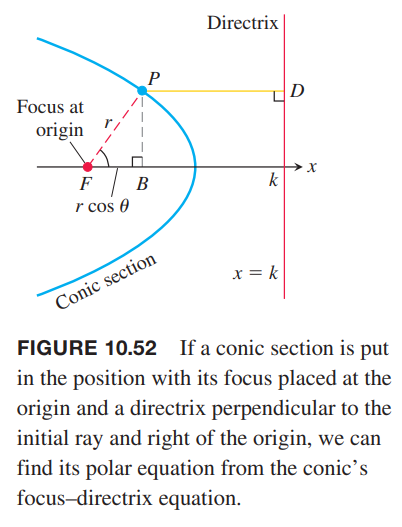

在极坐标系中，
$$PF=r,PD=k-FB=k-r\cos\theta$$
代入双曲线焦点准线方程 $PF=e\cdot PD$
$$r=e(k-\cos\theta)$$
解 $r$ 得到如下方程。

**离心率 $e$ 的圆锥曲线极坐标方程**
> $$r=\frac{ke}{1+e\cos\theta}\tag{5}$$
> 其中 $x=k>0$ 是准线。

例2 下面是三个圆锥曲线的极坐标方程。不管是极坐标系还是笛卡尔坐标系，离心率都确定了圆锥曲线的形状。
$$\begin{aligned}
e=\frac{1}{2}&&\text{ellipse}&&r=\frac{k}{2+\cos\theta}\\
e=1&&\text{parabola}&&r=\frac{k}{1+\cos\theta}\\
e=2&&\text{hyperbola}&&r=\frac{2k}{1+\cos\theta}
\end{aligned}$$
准线的位置不同会使得方程 $(5)$ 有变化。如果准线在原点的左侧，$x=-k$，那么公式 $(5)$ 变成了
$$r=\frac{ke}{1-e\cos\theta}$$
分母的正号变成了符号。如果准线垂直于 $y$ 轴，即 $y=k,y=-k$，那么用正弦替代公式中的余弦。如下图所示。

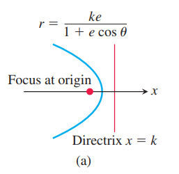
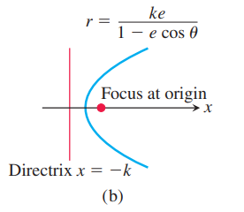
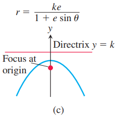
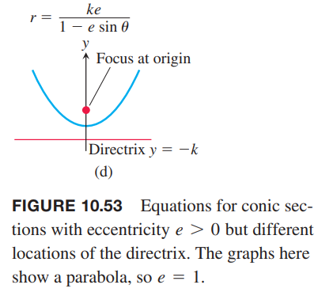

例3 求离心率为 3/2 准线是 $x=2$ 的双曲线方程。

解：将 $k=2,e=3/2$ 代入方程 $(5)$
$$r=\frac{2(3/2)}{1+(3/2)\cos\theta}$$
$$r=\frac{6}{2+3\cos\theta}$$

例4 求抛物线 $r=\frac{25}{10+10\cos\theta}$ 的准线。

解：分子分母同时除以 10 得到标准极坐标形式
$$r=\frac{5/2}{1+\cos\theta}$$
对比标准形式
$$r=\frac{ke}{1+e\cos\theta}$$
那么 $e=1,k=5/2$，所以准线是 $x=5/2$。

如下图所示。椭圆的离心率 $e$、半长轴 $a$ 和极坐标方程中的 $k$ 有如下关系
$$k=\frac{a}{e}-ea$$

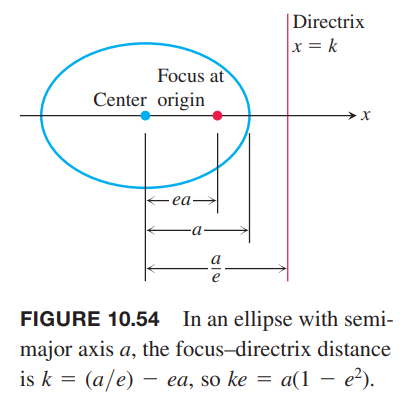

使用 $ke=a(1-e^2)$ 替代公式 $(5)$，得到椭圆的极坐标标准方程。

**使用离心率 $e$ 和半长轴 $a$ 的椭圆极坐标标准方程**
> $$r=\frac{a(1-e^2)}{1+e\cos\theta}\tag{6}$$

当 $e=0$ 时，方程 $(6)$ 变成了 $r=a$，表示一个圆。

### 直线
假定原点到直线 $L$ 的垂线与 $L$ 的交点是 $P_0(r_0,\theta_0),r_0\geq 0$。如下图所示。

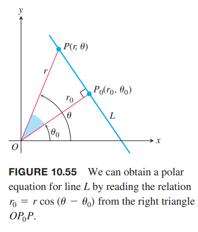

$L$ 上另外一点 $P(r,\theta)$，点 $P,P_0,O$ 构成了直角三角形，有如下关系
$$r_0=r\cos(\theta-\theta_0)$$

**直线极坐标标准方程**
> 如果点 $P_0(r_0,\theta_0)$ 是原点到直线 $L$ 的垂线的垂足，且 $r_0\geq 0$，那么直线 $L$ 的方程是
> $$r\cos(\theta-\theta_0)=r_0\tag{7}$$

比如如果 $\theta_0=\pi/3,r_0=2$，那么
$$\begin{aligned}
r\cos(\theta-\frac{\pi}{3})&=2\\
r(\cos\theta\cos\frac{\pi}{3}+\sin\theta\sin\frac{\pi}{3})&=2\\
\frac{1}{2}r\cos\theta+\frac{3}{2}r\sin\theta&=2\\
x+\sqrt{3}y&=4
\end{aligned}$$

### 圆
下面求圆心位于 $P(r_0,\theta_0)$ 半径为 $a$ 的圆的极坐标方程，令 $P(r,\theta)$ 是圆上一点。

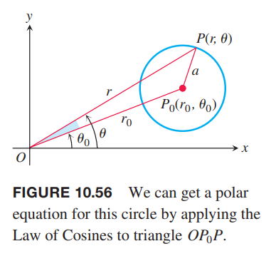

三角形 $OP_0P$ 使用余弦定理得到
$$a^2=r_0^2+r^2-2r_0r\cos(\theta-\theta_0)$$
如果圆穿过原点，那么 $r_0=a$，上面的式子简化为
$$\begin{aligned}
a^2&=a^2+r^2-2ar\cos(\theta-\theta_0)\\
r^2&=2ar\cos(\theta-\theta_0)\\
r&=2a\cos(\theta-\theta_0)
\end{aligned}$$
如果圆心位于 $x$ 轴，那么 $\theta_0=0$，进一步简化为
$$r=2a\cos\theta$$
如果圆心位于 $y$ 轴，那么 $\theta_0=\frac{\pi}{2},\cos(\theta-\theta_0)=\cos(\theta-\frac{\pi}{2})=\sin\theta$，那么可以简化为
$$r=2a\sin\theta$$
如果圆心位于 $x$ 轴或者 $y$ 轴的负半轴，使用 $-r$ 替代上面方程中的 $r$ 即可。

例5 下面是一些圆心位于 $x$ 轴或者 $y$ 轴的圆的极坐标方程。

| 半径 | 圆心 | 极坐标方程 |
|--|--|--|
| $3$ | $(3,0)$ | $r=6\cos\theta$ |
| $2$ | $(2,\pi/2)$ | $r=4\sin\theta$ |
| $1/2$ | $(-1/2,0)$ | $r=-\cos\theta$ |
| $1$ | $(-1,\pi/2)$ | $r=-2\sin\theta$ |
