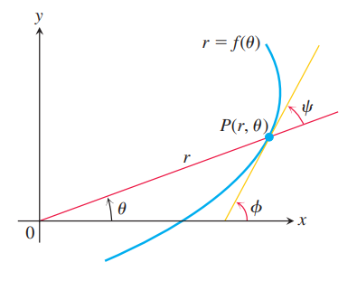

### 矢径与切线的夹角
在笛卡尔坐标系下，使用 $x$ 轴到切线逆时针转动的角 $\phi$ 表示曲线上某点的方向。在极坐标系下，方向是矢径（`radius vector`）和切线的夹角 $\psi$ 表示某点的方向，计算更简便。如下图所示。

由三角形外角定理可知
$$\phi=\theta+\psi\tag{1}$$
假定曲线方程是 $r=f(\theta)$，其中 $f(\theta)$ 是 $\theta$ 的可微函数。那么
$$x=r\cos\theta,y=r\sin\theta\tag{2}$$
微分
$$\begin{aligned}
\frac{dx}{d\theta}&=-r\sin\theta+\cos\theta\frac{dr}{d\theta}\\
\frac{dy}{d\theta}&=r\cos\theta+\sin\theta\frac{dr}{d\theta}
\end{aligned}\tag{3}$$
由 $(1)$ 得到 $\psi=\phi-\theta$，那么
$$\tan\psi=\tan(\phi-\theta)=\frac{\tan\phi-\tan\theta}{1+\tan\phi\tan\theta}$$
由于 $\tan\phi$ 是点 $P$ 处的斜率，所以
$$\tan\phi=\frac{dy}{dx}=\frac{dy/d\theta}{dx/d\theta}$$
联合
$$\tan\theta=\frac{y}{x}$$
得到
$$\tan\psi=\frac{\frac{dy/d\theta}{dx/d\theta}-\frac{y}{x}}{1+\frac{y}{x}\frac{dy/d\theta}{dx/d\theta}}=\frac{x\frac{dy}{d\theta}-y\frac{dx}{d\theta}}{x\frac{dx}{d\theta}+y\frac{dy}{d\theta}}\tag{4}$$
由 $(2),(3)$ 代入上式，分子可以化简为
$$x\frac{dy}{d\theta}-y\frac{dx}{d\theta}=r^2$$
分母可以化简为
$$x\frac{dx}{d\theta}+y\frac{dy}{d\theta}=r\frac{dr}{d\theta}$$
所以
$$\tan\psi=\frac{r}{dr/d\theta}\tag{5}$$
如果两个曲线相交，交点处有两条切线，矢径和切线的夹角分别是 $\psi_1,\psi_2$。不难看出（将上图补一条切线即可），两条切线的夹角 $\beta=\psi_2-\psi_1$，所以
$$\tan\beta=\frac{\tan\psi_2-\tan\psi_1}{1+\tan\psi_2\tan\psi_1}\tag{6}$$
当两条曲线在交点处相互垂直，那么两条切线也垂直，那么夹角是直角。
