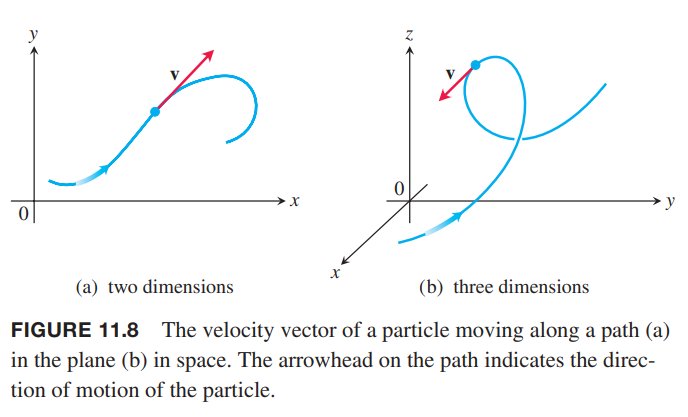
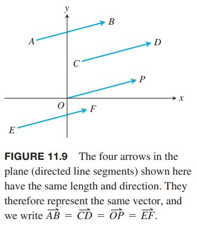
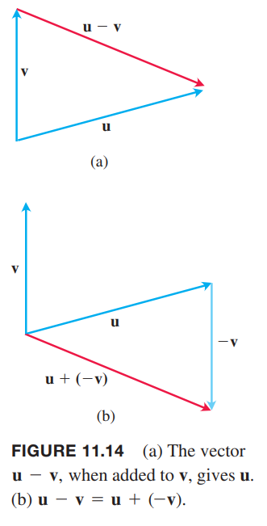

对于一些量，比如力、位移、速度，我们不仅需要知道其大小，还需要知道它的方向。这一节主要讲解在平面或空间中如何表示这些既有大小又有方向的量。

### 分量形式
我们将像力、位移、速度这样的量称为矢量（`vector`），使用有向线段表示。如下图所示。

箭头的方向表示矢量的方向，在单位长度选定的情况下长度表示大小。下图表示在平面或者空间中，一个粒子在沿着给定路径运动时，在指定点处速度矢量 $\boldsymbol{v}$。

**定义**
> 使用有向线段 $\overrightarrow{AB}$ 来表示，其中 $A$ 是起点（`initial point`），$B$ 是终点（`terminal point`），长度（`length`）用 $|\overrightarrow{AB}|$ 表示。如果两个矢量的方向和长度一样，那么这两个矢量相等（`equal`）。

不管起点在哪里，有相同的方向和长度的矢量就都是相等的。如下图中的矢量都是相等的。

书本中使用去小写粗体表示矢量，比如 $\boldsymbol{u},\boldsymbol{v},\boldsymbol{w}$，有时也使用大写粗体，比如 $\boldsymbol{F}$。书写时，在字母上方加一个箭头，比如 $\overrightarrow{u},\overrightarrow{v},\overrightarrow{w},\overrightarrow{F}$。

我们需要使用代数的方式精确地表示矢量的方向。令 $\boldsymbol{v}=\overrightarrow{PQ}$。那么存在一个有向线段等于 $\overrightarrow{PQ}$ 且起点位于原点处。如下图所示。这就是矢量 $\boldsymbol{v}$ 在标准位置（`standard position`）的表示，也是通常表示矢量 $\boldsymbol{v}$ 的方式。

当 $\boldsymbol{v}$ 在标准位置时，使用终点 $(v_1,v_2,v_3)$ 表示矢量 $\boldsymbol{v}$。如果是二维平面，那么使用终点 $(v_1,v_2)$ 表示矢量 $\boldsymbol{v}$。

**定义**
> 如果二维（`two-dimensional`）矢量 $\boldsymbol{v}$ 等于一个起点位于原点终点位于 $(v_1,v_2)$ 的矢量，那么 $\boldsymbol{v}$ 的分量形式（`component form`）是
> $$\boldsymbol{v}=\langle v_1,v_2\rangle$$
> 如果三维（`three-dimensional`）矢量 $\boldsymbol{v}$ 等于一个起点位于原点终点位于 $(v_1,v_2,v_3)$ 的矢量，那么 $\boldsymbol{v}$ 的分量形式（`component form`）是
> $$\boldsymbol{v}=\langle v_1,v_2,v_3\rangle$$

所以二维矢量是有序实数对 $\boldsymbol{v}=\langle v_1,v_2\rangle$，三位矢量是有序三元组 $\boldsymbol{v}=\langle v_1,v_2,v_3\rangle$。数 $v_1,v_2,v_3$ 是矢量 $\boldsymbol{v}$ 的分量。

如果矢量 $\boldsymbol{v}=\langle v_1,v_2,v_3\rangle$ 用有向线段 $\overrightarrow{PQ}$ 表示，其起点是 $P(x_1,y_1,z_1)$，终点是 $Q(x_2,y_2,z_2)$，那么 $x_1+v_1=x_2,y_1+v_1=y_2,z_1+v_1=z_2$，因此 $\overrightarrow{PQ}$ 的分量是 $v_1=x_2-x_1,v_2=y_2-y_1,v_3=z_2-z_1$。

简而言之，给定点 $P(x_1,y_1,z_1)$ 和点 $Q(x_2,y_2,z_2)$，那么与 $\overrightarrow{PQ}$ 相等的标准位置矢量是
$$\boldsymbol{v}=\langle x_2-x_1,y_2-y_1,z_2-z_1\rangle$$

二维矢量和三维矢量类似，只需要去掉第三个分量即可。

两个矢量相等等价于它们的标准位置矢量是一样的。因此 $\langle u_1,u_2,u_3\rangle$ 和 $\langle v_1,v_2,v_3\rangle$ 相等等价于 $u_1=v_1,u_2=v_2,u_3=v_3$。

矢量 $\overrightarrow{PT}$ 的长度或大小（`magnitude`）是有向线段的长度。如果 $\boldsymbol{v}=\langle x_2-x_1,y_2-y_1,z_2-z_1\rangle$ 是矢量 $\overrightarrow{PQ}$ 的标准位置矢量，那么距离公式就给出了 $\boldsymbol{v}$ 的长度，用符号 $|\boldsymbol{v}|$ 或 $||\boldsymbol{v}||$ 表示。

> 矢量 $\boldsymbol{v}=\overrightarrow{PQ}$ 的长度或大小是
> $$|\boldsymbol{v}|=\sqrt{v_1^2+v_2^2+v_3^2}=\sqrt{(x_2-x_1)^2+(y_2-y_1)^2+(z_2-z_1)^2}$$

只有一个矢量的长度是零，即零矢量（`zero vector`）$\boldsymbol{0}=\langle0,0\rangle$ 或 $\boldsymbol{0}=\langle0,0,0\rangle$。这个矢量也是唯一一个没有指定方向的矢量。

例1 求起点是 $P(-3,4,1)$ 终点是 $Q(-5,2,2)$ 的矢量的分量形式和长度。

解：表示 $\overrightarrow{PQ}$ 的标准位置矢量 $\boldsymbol{v}$ 的分量是
$$v_1=x_2-x_1=-2,v_2=y_2-y_1=-2,v_3=z_2-z_1=1$$
所以 $\overrightarrow{PQ}$ 的分量形式是
$$\boldsymbol{v}=\langle-2,-2,1\rangle$$
长度是
$$|\boldsymbol{v}|=\sqrt{(-2)^2+(-2)^2+1^2}=\sqrt{9}=3$$

例2 一辆小车沿着水平方向运动，有一个力 $\boldsymbol{F}$ 与地面夹角是 $45^\circ$，大小是 $20N$，如下图所示。求向前的有效力的大小是多少？

解：有效力是矢量 $\boldsymbol{F}=\langle a,b\rangle$ 的水平分量，因此
$$a=|\boldsymbol{F}|\cos 45^\circ=20\frac{\sqrt{2}}{2}\approx 14.14N$$

### 矢量代数操作
这里涉及两个操作：矢量加法（`vector addition`）和标量乘法（`scalar multiplication`）。标量（`scalar`）就是一个实数，这里这么称呼的原因是与矢量区别开来。标量可以是正数、负数或零，与矢量相乘可以对其进行缩放。

**定义**
> 令 $\boldsymbol{u}=\langle u_1,u_2,u_3\rangle,\boldsymbol{v}=\langle v_1,v_2,v_3\rangle$ 是矢量，$k$ 是标量
> $$\boldsymbol{u+v}=\langle u_1+v_1,u_2+v_2,u_3+v_3\rangle$$
> $$k\boldsymbol{u}=\langle ku_1,ku_2,ku_3\rangle$$

矢量的加法就是对应分量相加。矢量乘以标量，就是标量乘以矢量的每一个分量。上述定义对二维矢量也成立。

矢量加法的几何解释如下图所示，其中一个矢量的起点放到另外一个矢量的终点。

另外一种几何解释如下图所示，称为加法的平行四边形法则（`parallelogram law`），和称为合矢量（`resultant vector`），是平行四边形的对角线。物理学中，力、速度、加速度的加法都遵循平行四边形法则。

下图是标量 $k$ 乘以矢量 $\boldsymbol{u}$ 的几何解释。如果 $k>0$，那么 $k\boldsymbol{u}$ 与矢量 $\boldsymbol{u}$ 同方向，如果 $k<0$，那么 $k\boldsymbol{u}$ 与矢量 \boldsymbol{u} 反方向。

两者的长度关系如下
$$\begin{aligned}
|k\boldsymbol{u}|&=\sqrt{(ku_1)^2+(ku_2)^2+(ku_3)^2}\\
&=\sqrt{k^2(u_1^2+u_2^2+u_3^2)}\\
&=\sqrt{k^2}\sqrt{u_1^2+u_2^2+u_3^2}\\
&=|k||\boldsymbol{u}|
\end{aligned}$$

$k\boldsymbol{u}$ 的长度是标量 $k$ 的绝对值乘以矢量 $\boldsymbol{u}$ 的长度。矢量 $(-1)\boldsymbol{u}=\boldsymbol{u}$ 的长度和矢量 $\boldsymbol{u}$ 相同，但是方向相反。

两个矢量的差（`difference`）$\boldsymbol{u}-\boldsymbol{v}$ 的定义是
$$\boldsymbol{u}-\boldsymbol{v}=\boldsymbol{u}+(-\boldsymbol{v})$$
如果 $\boldsymbol{u}=\langle u_1,u_2,u_3\rangle,\boldsymbol{v}=\langle v_1,v_2,v_3\rangle$，那么
$$\boldsymbol{u}-\boldsymbol{v}=\langle u_1-v_1,u_2-v_2,u_3-v_3\rangle$$

注意 $(\boldsymbol{u}-\boldsymbol{v})+\boldsymbol{v}=\boldsymbol{u}$，所以矢量 $\boldsymbol{u}-\boldsymbol{v}$ 和 $\boldsymbol{v}$ 的加法如下图（a）所示，矢量差 $\boldsymbol{u}-\boldsymbol{v}$ 是矢量和 $\boldsymbol{u}+(-\boldsymbol{v})$，如下图（b）所示。

例3 令 $\boldsymbol{u}=\langle -1,3,1\rangle,\boldsymbol{v}=\langle 4,7,0\rangle$。求下面矢量分量
（a）$2\boldsymbol{u}+3\boldsymbol{v}$

（b）$\boldsymbol{u}-\boldsymbol{v}$

（c）$|\frac{1}{2}\boldsymbol{u}|$

解：

（a）
$$2\boldsymbol{u}+3\boldsymbol{v}=2\langle -1,3,1\rangle+3\langle 4,7,0\rangle=\langle 10,27,2\rangle$$
（b）
$$\boldsymbol{u}-\boldsymbol{v}=\langle -1,3,1\rangle-\langle 4,7,0\rangle=\langle -5,-4,1\rangle$$
（c）
$$\bigg|\frac{1}{2}\boldsymbol{u}\bigg|=\bigg|\langle -1,3,1\rangle\bigg|=\sqrt{(\frac{-1}{2})^2+(\frac{3}{2})^2+(\frac{1}{2})^2}=\frac{\sqrt{11}}{2}$$

**矢量操作属性**
> 令 $\boldsymbol{u},\boldsymbol{v},\boldsymbol{w}$ 是矢量，$a,b$ 是标量，那么
> $$\boldsymbol{u}+\boldsymbol{v}=\boldsymbol{v}+\boldsymbol{u}$$
> $$(\boldsymbol{u}+\boldsymbol{v})+\boldsymbol{w}=\boldsymbol{u}+(\boldsymbol{v}+\boldsymbol{w})$$
> $$\boldsymbol{u}+\boldsymbol{0}=\boldsymbol{u}$$
> $$\boldsymbol{u}+(-\boldsymbol{u})=\boldsymbol{0}$$
> $$0\boldsymbol{u}=\boldsymbol{0}$$
> $$1\boldsymbol{u}=\boldsymbol{u}$$
> $$a(b\boldsymbol{u})=(ab)\boldsymbol{u}$$
> $$a(\boldsymbol{u}+\boldsymbol{v})=a\boldsymbol{u}+a\boldsymbol{v}$$
> $$(a+b)\boldsymbol{u}=a\boldsymbol{u}+b\boldsymbol{u}$$

这些属性都能从矢量加法和矢量与标量的乘法推导出来。比如第一个属性
$$\begin{aligned}
\boldsymbol{u}+\boldsymbol{v}&=\langle u_1,u_2,u_3\rangle+\langle v_1,v_2,v_3\rangle\\
&=\langle u_1+v_1,u_2+v_2,u_3+v_3\rangle\\
&=\langle v_1+u_1,v_2+u_2,v_3+u_3\rangle\\
&=\langle v_1,v_2,v_3\rangle+\langle u_1,u_2,u_3\rangle\\
&=\boldsymbol{v}+\boldsymbol{u}
\end{aligned}$$
如果三个或者更多矢量在同一个平面，称为共面矢量（`coplanar`）。比如矢量 $\boldsymbol{u},\boldsymbol{v},\boldsymbol{u}+\boldsymbol{v}$ 总是共面。

### 单位矢量
长度为 1 的矢量 $\boldsymbol{v}$ 称为单位矢量（`unit vector`）。标准单位矢量（`standard unit vectors`）是
$$\boldsymbol{i}=\langle 1,0,0\rangle,\boldsymbol{j}=\langle 0,1,0\rangle,\boldsymbol{k}=\langle 0,0,1\rangle$$
任意矢量 $\boldsymbol{v}=\langle v_1,v_2,v_3\rangle$ 总是可以写成标准单位矢量的线性组合（`linear combination`）。
$$\begin{aligned}
\boldsymbol{v}&=\langle v_1,v_2,v_3\rangle\\
&=\langle v_1,0,0\rangle+\langle 0,v_2,0\rangle+\langle 0,0,v_3\rangle\\
&=v_1\langle 1,0,0\rangle+v_2\langle 0,1,0\rangle+v_3\langle 0,0,1\rangle\\
&=v_1\boldsymbol{i}+v_2\boldsymbol{j}+v_3\boldsymbol{k}
\end{aligned}$$
那么标量 $v_1$ 是矢量 $\boldsymbol{v}$ 的 $\boldsymbol{i}$ 分量，$v_2$ 是矢量 $\boldsymbol{v}$ 的 $\boldsymbol{j}$ 分量，$v_3$ 是矢量 $\boldsymbol{v}$ 的 $\boldsymbol{k}$ 分量。如下图所示，从点 $P_1(x_1,y_1,z_1)$ 到点 $P_2(x_2,y_2,z_2)$ 的矢量的分量形式
$$\overrightarrow{P_1P_2}=(x_2-x_1)\boldsymbol{i}+(y_2-y_1)\boldsymbol{j}+(z_2-z_1)\boldsymbol{k}$$

如果 $\boldsymbol{v}\neq\boldsymbol{0}$，那么其长度 $|\boldsymbol{i}|$ 不是零，于是有
$$\bigg|\frac{1}{|\boldsymbol{v}|}\boldsymbol{v}\bigg|=\frac{1}{|\boldsymbol{v}|}|\boldsymbol{v}|=1$$
那么 $\boldsymbol{v}/|\boldsymbol{v}|$ 是矢量 $\boldsymbol{v}$ 方向上的单位矢量，称为非零矢量 $\boldsymbol{v}$ 的方向（`the direction`）。

例4 求 $P_1(1,0,1)$ 到 $P_2(3,2,0)$ 的矢量方向上的单位矢量 $\boldsymbol{u}$。

解：
$$\overrightarrow{P_1P_2}=(3-1)\boldsymbol{i}+(2-0)\boldsymbol{j}+(0-1)\boldsymbol{k}=2\boldsymbol{i}+2\boldsymbol{j}-\boldsymbol{k}$$
$$|\overrightarrow{P_1P_2}|=\sqrt{2^2+2^2+1^2}=3$$
$$\boldsymbol{u}=\frac{2\boldsymbol{i}+2\boldsymbol{j}-\boldsymbol{k}}{3}=\frac{2}{3}\boldsymbol{i}+\frac{2}{3}\boldsymbol{j}-\frac{1}{3}\boldsymbol{k}$$
$\boldsymbol{u}$ 是 $\overrightarrow{P_1P_2}$ 的方向。

例5 如果 $\boldsymbol{v}=3\boldsymbol{i}-4\boldsymbol{j}$ 是速度矢量，用其速度和运动方向的乘积表示 $\boldsymbol{v}$。

解：速度是 $\boldsymbol{v}$ 的大小（长度）
$$|\boldsymbol{v}|=\sqrt{3^2+(-4)^2}=5$$
$\boldsymbol{v}$ 的方向是单位矢量 $\boldsymbol{v}/|\boldsymbol{v}|$
$$\frac{\boldsymbol{v}}{|\boldsymbol{v}|}=\frac{3\boldsymbol{i}-4\boldsymbol{j}}{5}=\frac{3}{5}\boldsymbol{i}-\frac{4}{5}\boldsymbol{j}$$
所以
$$\boldsymbol{v}=5(\frac{3}{5}\boldsymbol{i}-\frac{4}{5}\boldsymbol{j})$$

> 如果 $\boldsymbol{v}\neq \boldsymbol{0}$，那么
> 1. $\frac{\boldsymbol{v}}{|\boldsymbol{v}|}$ 是单位矢量，称为 $\boldsymbol{v}$ 的方向
> 2. 总是将 $\boldsymbol{v}$ 表示为长度乘以其方向，即 $\boldsymbol{v}=|\boldsymbol{v}|\frac{\boldsymbol{v}}{|\boldsymbol{v}|}$

例6 一个大小 6 牛顿的力作用在矢量 $\boldsymbol{v}=2\boldsymbol{i}+2\boldsymbol{j}-\boldsymbol{k}$ 的方向上。用力的大小乘以方向的形式表示力 $\boldsymbol{F}$。

解：力等于大小 6 乘以方向 $\frac{\boldsymbol{v}}{|\boldsymbol{v}|}$，所以
$$\begin{aligned}
\boldsymbol{F}&=6\frac{\boldsymbol{v}}{|\boldsymbol{v}|}\\
&=6\frac{2\boldsymbol{i}+2\boldsymbol{j}-\boldsymbol{k}}{\sqrt{2^2+2^2+(-1)^2}}\\
&=6\frac{2\boldsymbol{i}+2\boldsymbol{j}-\boldsymbol{k}}{3}\\
&=4\boldsymbol{i}+4\boldsymbol{j}-2\boldsymbol{k}
\end{aligned}$$

### 线段终点
矢量在几何中应用很广，比如求线段的中点。

> 连接点 $P_1(x_1,y_1,z_1)$ 和点 $P_2(x_2,y_2,z_2)$ 的线段的中点（`midpoint`）$M$ 是点
> $$\bigg(\frac{x_1+x_2}{2},\frac{y_1+y_2}{2},\frac{z_1+z_2}{2}\bigg)$$

如下图所示。

$$\begin{aligned}
\overrightarrow{M}&=\overrightarrow{OP_1}+\frac{1}{2}\overrightarrow{P_1P_2}\\
&=\overrightarrow{OP_1}+\frac{1}{2}(\overrightarrow{OP_2}-\overrightarrow{OP_1})\\
&=\frac{1}{2}(\overrightarrow{OP_1}+\overrightarrow{OP_2})\\
&=\frac{x_1+x_2}{2}\boldsymbol{i}+\frac{y_1+y_2}{2}\boldsymbol{j}+\frac{z_1+z_2}{2}\boldsymbol{k}
\end{aligned}$$

例7 连接点 $P_1(3,-2,0)$ 和点 $P_2(7,4,4)$ 的线段的中点是
$$\bigg(\frac{3+7}{2},\frac{-2+4}{2},\frac{0+4}{2}\bigg)=(5,1,2)$$

### 应用
例8 一个喷气式飞机自西向东飞，相对于空气速度是 800 km/h，东偏北 $60^\circ$ 顺风 110 km/h。求飞机对地速度和方向。

解：用矢量 $\boldsymbol{u}$ 表示飞机的速度，矢量 $\boldsymbol{v}$ 表示风的速度，那么 $|\boldsymbol{u}|=800,|\boldsymbol{v}|=600$，如下图所示。

相对地面的速度就是 $\boldsymbol{u}+\boldsymbol{v}$。如果 $x$ 轴表示正东，那么
$$\boldsymbol{u}=\langle 800,0\rangle,\boldsymbol{v}=\langle 110\cos 60^\circ,100\sin 60^\circ\rangle=\langle 55,55\sqrt{3}\rangle$$
因此
$$\boldsymbol{u}+\boldsymbol{v}=\langle 855,55\sqrt{3}\rangle=855\boldsymbol{i}+55\sqrt{3}\boldsymbol{j}$$
$$|\boldsymbol{u}+\boldsymbol{v}|=\sqrt{855^2+(55\sqrt{3})^2}\approx 860.3$$
$$\theta=\tan^{-1}\frac{55\sqrt{3}}{855}\approx 6.4^\circ$$
因此，飞机的对地速度是 860.3 km/h，方向是东偏北 $6.4^\circ$。

例9 两根绳子吊着一个 75 N 重的物体，如下图所示。求 $\boldsymbol{F_1},\boldsymbol{F_2}$。

解：力 $\boldsymbol{F_1},\boldsymbol{F_2}$ 的大小是 $|\boldsymbol{F_1}|,|\boldsymbol{F_2}|$，分量满足牛顿定律。合力 $\boldsymbol{F_1}+\boldsymbol{F_2}$ 大小等于力 $\boldsymbol{w}$，方向相反。如下图所示。

由图可以得到
$$\boldsymbol{F_1}=\langle-|\boldsymbol{F_1}|\cos 55^\circ,|\boldsymbol{F_1}|\sin 55^\circ\rangle,\boldsymbol{F_2}=\langle|\boldsymbol{F_2}|\cos 40^\circ,|\boldsymbol{F_2}|\sin 40^\circ\rangle$$
由 $\boldsymbol{F_1}+\boldsymbol{F_2}=\langle 0,75\rangle$ 得到
$$\begin{aligned}
-|\boldsymbol{F_1}|\cos 55^\circ+|\boldsymbol{F_2}|\cos 40^\circ&=0\\
|\boldsymbol{F_1}|\sin 55^\circ+|\boldsymbol{F_2}|\sin 40^\circ&=75
\end{aligned}$$
由第一个式子得到
$$|\boldsymbol{F_2}|=\frac{|\boldsymbol{F_1}|\cos 55^\circ}{\cos 40^\circ}$$
代入第二个式子得到
$$|\boldsymbol{F_1}|\sin 55^\circ+|\boldsymbol{F_1}|\tan 40^\circ\cos 55^\circ=75$$
那么
$$|\boldsymbol{F_1}|=\frac{75}{\sin 55^\circ+\cos 55^\circ\tan 40^\circ}\approx 57.67 N$$
并且
$$|\boldsymbol{F_2}|=\frac{|\boldsymbol{F_1}|\cos 55^\circ}{\sin 55^\circ\cos 40^\circ+\cos 55^\circ\sin 40^\circ}=\frac{|\boldsymbol{F_1}|\cos 55^\circ}{\sin(55^\circ+40^\circ)}\approx 43.18N$$
代回矢量
$$\boldsymbol{F_1}=\langle-|\boldsymbol{F_1}|\cos 55^\circ,|\boldsymbol{F_1}|\sin 55^\circ\rangle\approx\langle-33.08,47.24\rangle$$
$$\boldsymbol{F_2}=\langle|\boldsymbol{F_2}|\cos 40^\circ,|\boldsymbol{F_2}|\sin 40^\circ\rangle\approx\langle33.08,27.76\rangle$$
